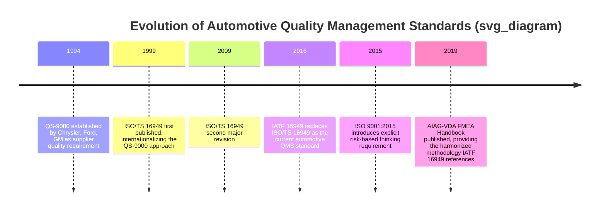
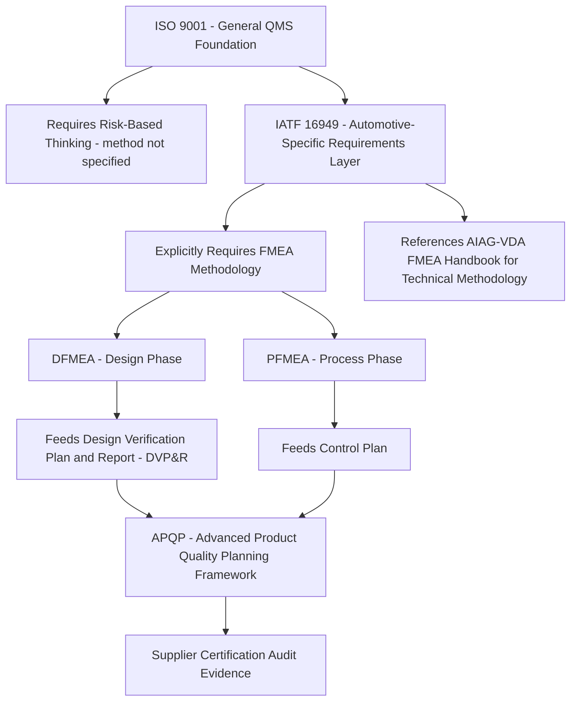

## ISO 9001 and IATF 16949 Context

### Overview

**ISO 9001** and **IATF 16949** are quality management system (QMS) standards that provide the organizational and procedural context within which automotive FMEA is required, referenced, and audited. Neither standard defines the technical content of FMEA itself — that role belongs to methodology documents like the AIAG-VDA Handbook or SAE J1739 — but both establish *when* FMEA must be performed, how it fits into broader quality processes, and how it is assessed during certification audits. Understanding this QMS context clarifies why FMEA in the automotive sector is not merely a recommended engineering best practice but a certification-relevant compliance requirement.

### ISO 9001: The General Foundation

**ISO 9001** is the internationally recognized general-purpose quality management system standard, applicable across virtually any industry, not automotive-specific. It establishes requirements for a QMS built around process approach, risk-based thinking, customer focus, and continual improvement.

**Key Points**

- ISO 9001 introduced **risk-based thinking** as an explicit requirement in its 2015 revision, requiring organizations to determine risks and opportunities that need to be addressed to ensure the QMS can achieve its intended results
- ISO 9001 does **not** mandate FMEA by name or prescribe any specific risk analysis technique — it requires that risk-based thinking be applied, leaving the specific method (FMEA, HAZOP, or another technique) to the organization's discretion
- This means an organization certified only to ISO 9001, without any automotive-specific requirement layered on top, is not strictly obligated to perform FMEA at all, even though FMEA is a common and well-regarded way to satisfy the risk-based thinking requirement

### IATF 16949: The Automotive-Specific Layer

**IATF 16949** (International Automotive Task Force 16949) is a sector-specific quality management standard built directly on top of ISO 9001's foundational structure, adding automotive industry-specific requirements. It succeeded the earlier **ISO/TS 16949** standard (itself building on the even earlier **QS-9000** standard used by the "Big Three" U.S. automakers).

**Key Points**

- IATF 16949 is not a standalone standard — it must be implemented in conjunction with ISO 9001, adding automotive-specific requirements on top of the general ISO 9001 QMS structure
- Unlike ISO 9001, IATF 16949 **does** explicitly reference and require FMEA methodology as part of its product design and process development requirements, making FMEA a certification-relevant compliance obligation for automotive suppliers rather than merely a discretionary risk-analysis choice
- IATF 16949 certification is typically a contractual requirement imposed by automotive OEMs on their suppliers, meaning failure to maintain proper FMEA documentation can jeopardize a supplier's ability to do business with major automotive manufacturers, not merely represent a quality-process shortfall

### Historical Lineage of Automotive Quality Standards

### FMEA's Place Within Advanced Product Quality Planning (APQP)

Within the IATF 16949 framework, FMEA does not stand alone as an isolated deliverable — it is embedded within the broader **Advanced Product Quality Planning (APQP)** process, a structured product development framework that automotive suppliers use to plan and execute new product introductions.

**Key Points**

- DFMEA is typically developed during the product design and development phase of APQP, informing the Design Verification Plan and Report (DVP&R)
- PFMEA is typically developed during the process design and development phase, directly informing the Control Plan that governs ongoing production
- IATF 16949 auditors reviewing a supplier's APQP documentation expect to see FMEA outputs properly linked to these downstream artifacts, not treated as a standalone document disconnected from the rest of the product development record

### Relationship Diagram: ISO 9001, IATF 16949, and FMEA

### Audit Implications

**Key Points**

- Under IATF 16949, FMEA documentation is subject to formal certification body audits, meaning gaps such as missing failure modes, outdated occurrence/detection ratings, or FMEAs that have not been updated following a design or process change can result in audit nonconformances
- Auditors typically expect to see evidence that FMEA is treated as a **living document**, consistent with the broader FMEA methodology principle discussed elsewhere in this curriculum — an FMEA that has clearly not been revisited since initial creation, despite subsequent design changes or field issues, is a common audit finding
- IATF 16949's requirement for documented rationale when deviating from standard FMEA practice mirrors the same deviation-justification language found in SAE J1739, reinforcing that automotive FMEA practice across these interlocking standards is expected to be both rigorous and auditable, not merely performed as an internal engineering exercise

### Why This Layered Structure Matters

**Key Points**

- The layered relationship — ISO 9001 (general QMS foundation) → IATF 16949 (automotive-specific requirements layer) → AIAG-VDA/SAE J1739 (technical FMEA methodology) — reflects a common pattern in quality and safety standards more broadly: a general management-system standard establishes the overarching requirement for risk management, a sector-specific standard mandates a particular technique and specifies when it applies, and a dedicated technical standard defines exactly how that technique is to be performed
- This layered structure explains why an organization cannot simply "do FMEA well" in isolation and expect to pass an IATF 16949 audit — the FMEA must also be properly integrated into the APQP structure, linked to DVP&R and Control Plan documentation, and demonstrably maintained as a living document, since these are the elements the certification standard itself is actually assessing

### Conclusion

ISO 9001 and IATF 16949 provide the organizational and regulatory scaffolding within which automotive FMEA operates as a certification-relevant requirement rather than a purely voluntary engineering best practice. ISO 9001 establishes the general risk-based thinking foundation without mandating any specific technique, while IATF 16949 builds directly on top of it to explicitly require FMEA methodology, embed it within the APQP product development framework, and subject it to formal audit scrutiny. Understanding this context clarifies why automotive FMEA documentation must satisfy not only sound engineering principles but also specific certification, traceability, and living-document maintenance expectations that stem directly from the QMS standards governing the industry.

**Related Topics**

- Advanced Product Quality Planning (APQP) framework in detail
- Design Verification Plan and Report (DVP&R) and its link to DFMEA
- Control Plans and their link to PFMEA
- IATF 16949 audit practices and common FMEA-related nonconformances
- Risk-based thinking under ISO 9001:2015 versus prescriptive FMEA requirements
- Historical evolution from QS-9000 to ISO/TS 16949 to IATF 16949