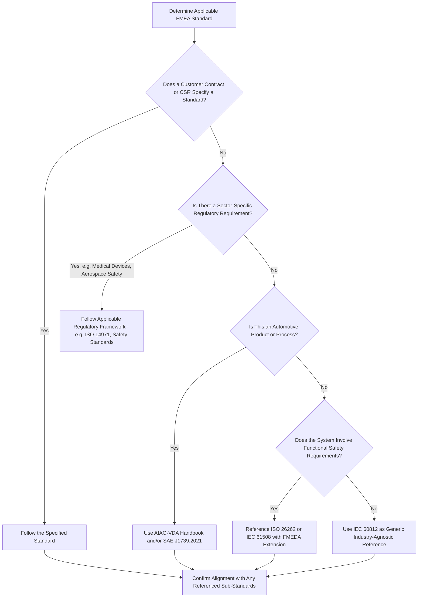

## Choosing the Right Standard for an Industry

### Overview

With multiple FMEA-related standards now in active use — MIL-STD-1629A, SAE J1739, the AIAG Fourth Edition manual, the AIAG-VDA Handbook, IEC 60812, and various sector-specific overlays such as ISO 26262 or ISO 14971 — practitioners and organizations frequently face a genuine decision problem: which standard should govern a given FMEA effort? This decision is rarely arbitrary; it is typically shaped by industry sector, customer contractual requirements, regulatory obligations, and the specific type of system or process under analysis. This topic synthesizes the standards covered elsewhere in this curriculum into a practical decision framework.

### Key Decision Factors

**Key Points**

- **Customer or contractual mandate**: In many industries, particularly automotive and aerospace/defense, the customer or prime contractor specifies which standard must be followed as a condition of the contract, often referenced in Customer Specific Requirements (CSRs) — this is frequently the single deciding factor, overriding an organization's own preference
- **Regulatory requirement**: Certain industries (medical devices, nuclear, aviation) have regulatory bodies that reference or require specific risk analysis frameworks, sometimes as part of a broader safety case submission
- **Industry convention**: Even absent an explicit mandate, certain standards have become the de facto convention within specific sectors, and deviating from convention can create friction with auditors, customers, or industry peers
- **System type**: Whether the analysis concerns hardware, software, a manufacturing process, or a combination shapes which standard's scope and annexed guidance is most directly applicable
- **Whether a harmonized framework already governs the relationship**: For automotive suppliers serving both US and European OEMs, the AIAG-VDA harmonization has effectively resolved what was previously a genuine standard-selection dilemma

### Standard Selection by Industry Sector

| Industry Sector | Primary Standard(s) | Rationale |
| --- | --- | --- |
| Automotive (OEM and Tier suppliers) | AIAG-VDA FMEA Handbook (2019), SAE J1739:2021 | Industry-mandated via IATF 16949 and customer-specific requirements; the two are now substantively aligned |
| Aerospace and Defense | MIL-STD-1629A (historical/legacy reference), sector-specific aerospace standards | Legacy programs and long-lifecycle systems often still reference MIL-STD-1629A terminology even where it is no longer a mandatory procurement document |
| General/cross-industry, no sector-specific standard applicable | IEC 60812 | Deliberately generic, industry-agnostic normative text applicable to hardware, software, and process combinations |
| Automotive functional safety (electrical/electronic systems) | ISO 26262, referencing FMEDA (an FMEA extension) | Required for hazard analysis and risk assessment within the automotive functional safety lifecycle |
| General functional safety (non-automotive electrical/electronic/programmable systems) | IEC 61508 | Broader functional safety standard referencing FMEA/FMEDA-style analysis as an acceptable hardware safety verification method |
| Medical devices | ISO 14971 (risk management), often incorporating FMEA as a supporting technique | Regulatory risk management framework for medical devices, which may reference or incorporate FMEA/FMECA methodology |
| Process industries (chemical, oil and gas) | Often HAZOP as primary, sometimes FMEA as a complementary technique; IEC 60812 as generic reference where FMEA is used | HAZOP's deviation-based approach is often better suited to continuous process hazard identification, though FMEA remains relevant for equipment-level analysis |

[Inference: this table represents a synthesis of commonly observed industry practice patterns drawn from the standards documentation covered throughout this curriculum, rather than a single authoritative source that itself prescribes this exact mapping; actual standard selection in any specific case should be confirmed against the applicable contractual, regulatory, and customer-specific requirements.]

### Decision Flow for Standard Selection

### Special Considerations: Legacy Systems and Long Lifecycles

**Key Points**

- Aerospace, defense, and other long-lifecycle industries frequently maintain systems and their supporting FMECA documentation across many decades, meaning an organization may need to continue supporting an FMECA originally developed under MIL-STD-1629A even though that standard is no longer actively mandated for new procurement
- In such cases, organizations often face a practical choice between maintaining the original standard's format for continuity and traceability, versus migrating the analysis to a currently active standard (such as IEC 60812) to align with modern internal practices — a decision that typically depends on the cost and risk of disrupting an established, audited analysis versus the long-term benefit of standardization
- This consideration does not typically arise in automotive contexts, where the relatively faster standard revision cycle (Third Edition to Fourth Edition to AIAG-VDA within a few decades) has been actively managed through formal transition timelines communicated by customers

### Special Considerations: Multi-Standard Environments

**Key Points**

- Some organizations must satisfy multiple standards simultaneously — for example, an automotive electronics supplier may need to satisfy AIAG-VDA/SAE J1739 for general product quality FMEA while also satisfying ISO 26262's FMEDA requirements for functional safety-relevant hardware, since these serve genuinely different analytical purposes (general risk prioritization versus quantified hardware safety metrics)
- In these situations, the organization typically maintains the base FMEA/DFMEA under the primary quality standard and layers a supplemental FMEDA analysis specifically for safety-relevant elements, rather than attempting to force a single document to satisfy both purposes
- Aerospace and defense programs may similarly need to satisfy both a legacy MIL-STD-1629A-derived contractual requirement and an internal or customer-driven IEC 60812-aligned quality process, requiring careful mapping between the two documents' terminology and structure

### Practical Guidance for Standard Selection

**Key Points**

- Always check contractual and customer-specific requirements first — these override general industry convention or organizational preference in the vast majority of cases
- When no explicit mandate exists, default to the standard most specifically tailored to the system type and industry sector, since sector-specific standards typically provide more directly applicable rating scales, terminology, and worked examples than a generic standard
- When functional safety is a genuine concern (not merely general reliability or quality), confirm whether a safety-specific extension (FMEDA under ISO 26262 or IEC 61508) is required in addition to, rather than instead of, the base FMEA/DFMEA
- Document the rationale for standard selection explicitly, particularly in audited or regulated environments, since auditors and regulators generally expect to see a clear basis for why a particular standard or combination of standards was chosen for a given analysis

### Conclusion

Choosing the right FMEA standard for a given industry context is rarely a matter of selecting the "best" standard in the abstract — it is a decision shaped primarily by contractual mandate, regulatory requirement, industry convention, and the specific technical nature of the system under analysis. Automotive practice has been substantially simplified by the AIAG-VDA harmonization, aerospace and defense contexts often carry forward legacy MIL-STD-1629A conventions for long-lifecycle systems, safety-critical electronic systems frequently require a supplemental FMEDA analysis layered atop a base FMEA, and organizations without a clear sector-specific mandate can reasonably default to the generic, internationally recognized IEC 60812 framework. Recognizing which of these considerations applies to a given situation — and documenting that reasoning explicitly — is itself a core professional competency for anyone responsible for establishing or auditing an organization's FMEA practice.

**Related Topics**

- Customer Specific Requirements (CSRs) and their role in mandating FMEA standards
- Transitioning legacy MIL-STD-1629A documentation to modern standards
- Combining base DFMEA with supplemental FMEDA for functional safety compliance
- Multi-standard FMEA program management in complex organizations
- Regulatory risk management frameworks in medical device development (ISO 14971)
- Documenting standard-selection rationale for audit and certification purposes