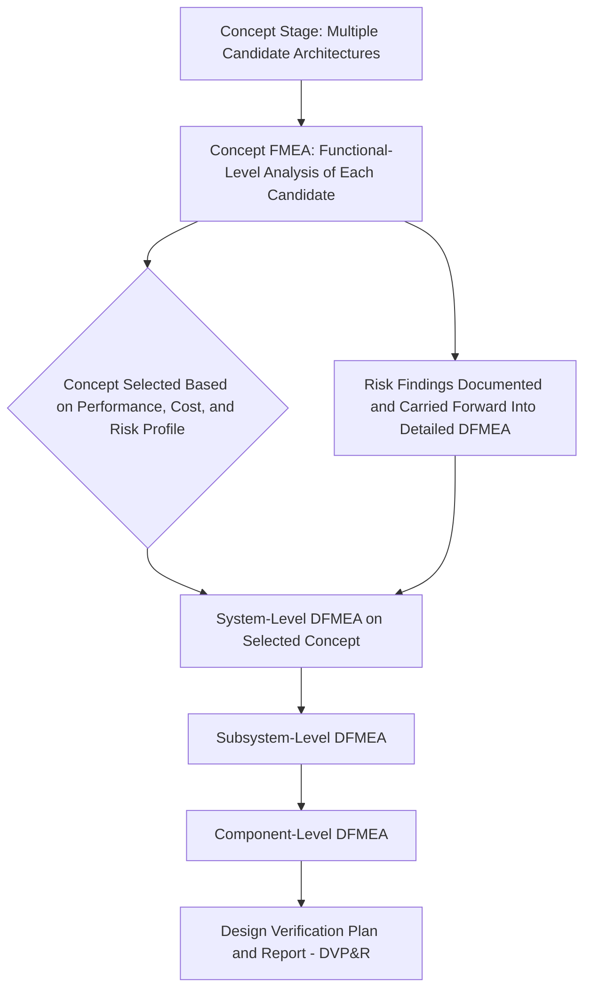

## Concept FMEA

### Definition

**Concept FMEA (CFMEA)** is a variant of Design FMEA performed at the earliest stage of product or system development — during the conceptual design phase, before detailed design decisions, specific components, or manufacturing processes have been finalized. It is used to analyze potential failure modes and effects associated with alternative design concepts, functional architectures, or technology choices, allowing risk considerations to influence the selection between competing concepts before significant engineering investment has been committed to any single approach.

### Purpose and Positioning Within the Design Lifecycle

**Key Points**

- Concept FMEA is applied when a design exists only at the level of functional descriptions, block diagrams, or competing architectural approaches — not yet at the level of specific parts, dimensions, or materials
- Its primary purpose is to support **concept selection**, comparing the relative risk profiles of different candidate approaches to a design problem, rather than refining a single, already-chosen design
- Because it occurs so early, Concept FMEA generally analyzes failure modes at a **functional level** rather than a component level — directly applying the Functional Approach discussed earlier in this curriculum's coverage of MIL-STD-1629A, since detailed hardware breakdowns are not yet available
- Concept FMEA typically precedes and feeds into the more detailed **System-level, Subsystem-level, and Component-level DFMEA** that follows once a specific concept has been selected and design work proceeds toward greater detail

### Why Concept-Stage Analysis Matters

**Key Points**

- Design changes are dramatically cheaper to make at the concept stage than after detailed design, tooling, or production has begun — this is a foundational principle across reliability engineering, and Concept FMEA is the mechanism specifically intended to capture this cost advantage for risk-related design decisions
- Competing concepts often carry fundamentally different risk profiles that are not obvious from a purely functional or performance-based comparison alone; Concept FMEA makes these risk differences explicit and comparable
- Failing to perform risk analysis until after a concept has already been selected risks "locking in" an architecture whose inherent failure modes are more severe, more likely, or harder to detect than an alternative that was never seriously evaluated on this basis

### Example: Comparing Competing Concepts

**Example**

Consider a design team evaluating two candidate architectures for an automotive electric parking brake system:

- **Concept A**: A single central electric actuator connected to both rear wheels via a mechanical cable linkage
- **Concept B**: Two independent electric actuators, one integrated directly into each rear brake caliper

A Concept FMEA performed at this stage might identify:

- Concept A's failure mode "central actuator fails" has a severe end effect (complete loss of parking brake function on both wheels), while Concept B's equivalent failure mode "one caliper actuator fails" has a less severe end effect (partial parking brake function retained on the unaffected wheel)
- Concept A's failure mode "cable linkage seizes or corrodes" introduces an additional failure path not present in Concept B's more integrated design
- Concept B introduces a different failure mode not present in Concept A: "communication fault between the two independent actuator control units," which did not exist as a comparable risk in the single-actuator concept

This comparison, performed before either concept has been developed into detailed hardware, allows the design team to weigh these differing risk profiles explicitly alongside cost, packaging, and performance considerations — rather than discovering Concept A's central-point-of-failure vulnerability only after tooling has already been committed.

### Relationship to Later-Stage DFMEA

**Key Points**

- Rather than being discarded once a concept is chosen, the failure modes, causes, and effects identified during Concept FMEA are typically carried forward and refined as the design matures into the detailed system, subsystem, and component-level DFMEAs — providing continuity of risk documentation across the design lifecycle
- This carry-forward relationship reflects the "living document" principle discussed elsewhere in this curriculum: Concept FMEA is not a disposable early-stage exercise, but the first iteration of an analysis that continues to be refined and elaborated as the design progresses

### Distinguishing Concept FMEA from Later DFMEA Stages

| Dimension | Concept FMEA | System/Component DFMEA |
| --- | --- | --- |
| Design maturity | Conceptual, functional-level only | Detailed hardware/design specifics available |
| Primary purpose | Compare and select among candidate concepts | Refine and mitigate risk within a chosen design |
| Level of analysis | Functional Approach (per MIL-STD-1629A terminology) | Hardware Approach, increasingly granular |
| Typical output use | Informs concept selection decision | Informs detailed design changes, DVP&R, test planning |
| Failure mode specificity | Broad, architecture-level failure modes | Specific component or interface-level failure modes |

### Common Pitfalls in Concept FMEA Application

**Key Points**

- **Skipping concept-stage analysis entirely**: Many organizations move directly to detailed DFMEA once a concept has already been informally selected based on cost or performance alone, missing the opportunity to influence concept selection itself based on risk
- **Treating Concept FMEA with the same granularity as detailed DFMEA**: Attempting overly specific, component-level failure mode analysis at the concept stage is often premature, since the specific components and their detailed characteristics have not yet been determined — this can waste effort or produce speculative, low-value analysis
- **Failing to carry findings forward**: Concept FMEA findings that are not explicitly linked to and refined within the subsequent detailed DFMEA lose much of their value, since the whole point of early analysis is to inform decisions throughout the design's maturation, not merely at a single early gate

### Conclusion

Concept FMEA represents the earliest application of failure mode analysis within the product design lifecycle, deliberately operating at the functional rather than hardware level to support genuine concept selection decisions while design changes remain cheap and architectural flexibility remains high. Its value lies specifically in making the differing risk profiles of competing design approaches explicit and comparable before significant engineering investment narrows the field to a single concept — and in establishing the foundational risk documentation that subsequent system, subsystem, and component-level DFMEAs then refine as the design matures toward production.

**Related Topics**

- Functional Approach versus Hardware Approach in FMEA analysis
- System-level, subsystem-level, and component-level DFMEA progression
- Concept selection methodologies and their integration with risk analysis (e.g., Pugh matrices)
- Carrying forward Concept FMEA findings into detailed Design FMEA
- Early design-stage cost-of-change principles in reliability engineering
- Parameter Diagrams (P-Diagrams) as a concept-stage function analysis tool