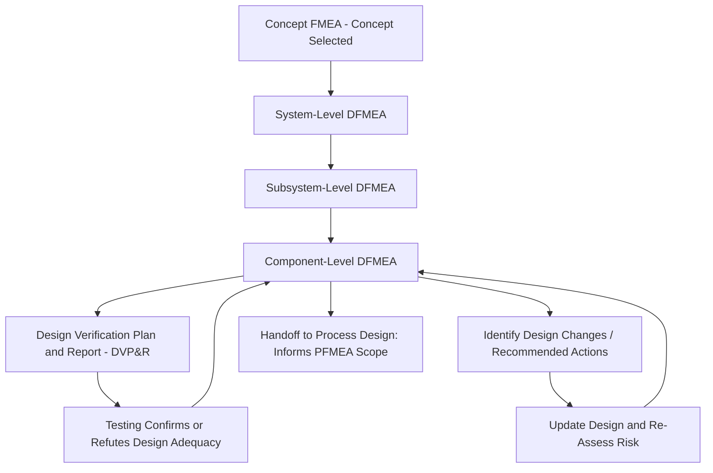

## Design FMEA

### Definition

**Design FMEA (DFMEA)** is a structured, systematic technique used to analyze potential failure modes in a *product's design* — evaluating how a component, subsystem, or system might fail to meet its intended function due to weaknesses inherent in the design itself, before the design is finalized for production. DFMEA is fundamentally concerned with the question: *"Could this design, as conceived, fail to do what it's supposed to do — and if so, how, why, and with what consequence?"* It is distinguished from Process FMEA (PFMEA), which instead analyzes how the manufacturing or assembly process might introduce defects into an otherwise sound design.

### Scope and Purpose

**Key Points**

- DFMEA assumes the design will be manufactured and assembled exactly as specified — its focus is on whether the *design itself*, if built correctly, is capable of failing due to inadequate design margin, poor material selection, unaccounted-for operating conditions, or design-level interface problems
- DFMEA applies at multiple levels of design hierarchy: system level, subsystem level, interface level, and component level — with analysis typically becoming more granular as the design matures from concept through detailed engineering
- The primary objective of DFMEA is to identify design weaknesses early enough that they can be corrected through design changes, before tooling, production processes, or field deployment make correction significantly more costly

### DFMEA Within the Product Development Lifecycle

DFMEA does not occur in isolation; it typically follows Concept FMEA (once a specific design concept has been selected) and proceeds in parallel with, and directly informs, several other engineering activities.

**Key Points**

- DFMEA output directly informs the **Design Verification Plan and Report (DVP&R)**, ensuring that test plans specifically target the highest-risk failure modes identified in the analysis rather than relying on generic test coverage alone
- DFMEA is explicitly iterative: as testing reveals new information, as the design changes in response to identified risks, or as field data becomes available from similar prior designs, the DFMEA is revisited and updated — consistent with the "living document" principle established throughout FMEA methodology generally
- A completed or maturing DFMEA also informs the scope of the subsequent PFMEA, since design decisions (tolerances, material choices, assembly features) directly shape which manufacturing process risks become relevant

### The DFMEA Worksheet Structure

A DFMEA worksheet, whether following AIAG-VDA, SAE J1739, or another aligned standard, typically captures the following elements for each analyzed item:

| Column | Content |
| --- | --- |
| Item/Function | The component or system element and its stated function |
| Requirement | The specific performance criterion the function must satisfy |
| Failure Mode | The specific manner in which the function fails to meet its requirement |
| Failure Effects (Local, Next-Level, End) | The consequences of the failure mode at each level of the system hierarchy |
| Severity (S) | Rating of the end effect's seriousness |
| Failure Cause/Mechanism | The underlying reason and physical/logical process driving the failure mode |
| Occurrence (O) | Rating of the likelihood the cause arises, given current prevention controls |
| Current Prevention Controls | Design features or standards already in place to reduce occurrence |
| Current Detection Controls | Design verification methods (testing, analysis, review) already in place |
| Detection (D) | Rating of the likelihood the cause or mode is caught before reaching the customer |
| Risk Priority Number / Action Priority | Combined risk prioritization score or category |
| Recommended Actions | Proposed design changes, additional testing, or other risk-reducing measures |
| Responsibility and Target Date | Ownership and timeline for implementing recommended actions |
| Actions Taken and Resulting Ratings | Confirmation of implementation and re-assessed risk following action |

### Worked Example

**Example**

Consider a DFMEA entry for an electric vehicle battery pack's coolant manifold:

- **Function**: Distribute coolant flow evenly across battery cell modules to maintain thermal uniformity
- **Requirement**: Temperature variation across modules must not exceed 5°C under specified operating conditions
- **Failure Mode**: Manifold restricts flow unevenly across outlet ports
- **Cause**: Internal manifold geometry creates uneven pressure drop across parallel flow paths (a design-level geometric issue, not a manufacturing defect)
- **Local Effect**: Some battery modules receive reduced coolant flow
- **Next-Level Effect**: Uneven module temperatures develop under sustained high-load operation
- **End Effect**: Accelerated degradation of the hottest modules, reduced overall battery pack life, potential safety margin reduction under worst-case conditions
- **Severity**: High, given the safety and performance implications of thermal management failure in a battery system
- **Current Prevention Control**: Computational fluid dynamics (CFD) simulation performed during design to verify flow distribution — if this control was not yet performed or was performed with limited fidelity, this becomes a design gap
- **Current Detection Control**: Physical flow-bench testing on prototype manifolds prior to design freeze
- **Recommended Action**: Redesign manifold internal geometry to equalize pressure drop across flow paths, or add flow-balancing orifices at each outlet

This example illustrates the DFMEA's core characteristic: the failure mode and cause are rooted entirely in the design's geometry and physics — no manufacturing defect is implicated — distinguishing it clearly from a PFMEA analysis of the same component, which would instead ask questions like "could the manifold be manufactured with a casting defect that blocks a flow path?"

### DFMEA and Design Interfaces

**Key Points**

- A particularly important and sometimes overlooked scope of DFMEA is the analysis of **interfaces** between components or subsystems designed by different teams or suppliers — failures often occur not within a single component's design, but at the boundary where two separately designed elements interact
- Interface-related failure modes might include incompatible tolerances between mating parts, unanticipated thermal expansion mismatches, or electromagnetic interference between adjacent electronic assemblies
- The AIAG-VDA Structure Analysis step, discussed elsewhere in this curriculum, explicitly supports interface identification through its structured system/focus-element/component breakdown, helping ensure interface-level failure modes are not overlooked simply because no single team "owns" the interface itself

### Relationship to Severity, Occurrence, and Detection in a Design Context

**Key Points**

- In DFMEA specifically, Occurrence ratings should reflect the likelihood a design-level cause (such as inadequate design margin) will actually manifest as a failure in the field, informed by design analysis, simulation results, or historical data from similar prior designs — not manufacturing process capability data, which belongs instead to PFMEA
- Detection ratings in DFMEA specifically assess the effectiveness of *design verification* activities — simulation, analysis, prototype testing — at catching a design weakness before the design is released for production, distinct from PFMEA's detection ratings, which assess manufacturing inspection and process monitoring effectiveness

### Conclusion

Design FMEA provides the structured mechanism by which engineering teams systematically evaluate whether a product's design, as conceived, is capable of meeting its functional requirements reliably across its intended operating conditions and service life. By analyzing failure modes rooted specifically in design decisions — geometry, material selection, design margin, and interfaces — rather than manufacturing variation, DFMEA directs corrective effort toward the design itself, feeding directly into design verification planning and, ultimately, into the process-level analysis (PFMEA) that governs how that finalized design is actually built.

**Related Topics**

- Process FMEA (PFMEA) and its distinction from Design FMEA
- Design Verification Plan and Report (DVP&R) development from DFMEA output
- Interface failure modes and Structure Analysis in the AIAG-VDA framework
- System, subsystem, and component-level DFMEA progression
- Severity, Occurrence, and Detection rating application specific to design-stage analysis
- FMEA-MSR as a supplemental DFMEA extension for monitored/mitigated systems