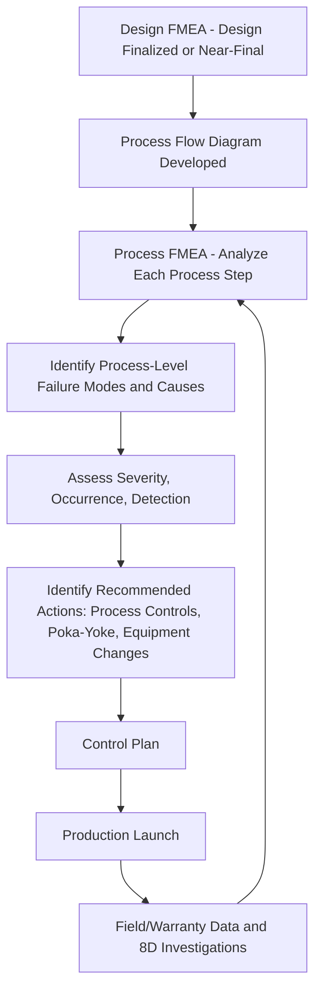

## Process FMEA

### Definition

**Process FMEA (PFMEA)** is a structured, systematic technique used to analyze potential failure modes in a *manufacturing or assembly process* — evaluating how a specific process step could produce a nonconforming, defective, or otherwise unacceptable part or product, even when the underlying design itself is sound. PFMEA is fundamentally concerned with the question: *"Could this process step, as executed, fail to produce a conforming result — and if so, how, why, and with what consequence?"* It is the direct process-focused counterpart to Design FMEA (DFMEA), and the two are deliberately structured as complementary rather than overlapping analyses.

### Scope and Purpose

**Key Points**

- PFMEA assumes the design itself is adequate — its focus is specifically on whether the *manufacturing or assembly process* used to produce that design is capable of consistently and correctly executing it, or whether process variation, equipment limitations, or human factors could introduce a defect
- PFMEA typically applies to each process step in a manufacturing sequence: machining, forming, joining (welding, fastening, bonding), surface treatment, assembly, testing, packaging, and material handling, among others
- The primary objective of PFMEA is to identify process-level weaknesses early enough — ideally before the process is finalized and tooling/equipment is committed — that they can be corrected through process design changes, added controls, or equipment modifications

### PFMEA Within the Product Development Lifecycle

PFMEA typically follows DFMEA temporally (since a stable design is generally needed before detailed process planning can proceed) and runs in close coordination with the broader Advanced Product Quality Planning (APQP) process.

**Key Points**

- PFMEA output directly informs the **Control Plan**, ensuring that ongoing production monitoring, inspection frequency, and process controls specifically target the highest-risk failure modes identified in the analysis, rather than applying generic, uniform inspection across all process steps
- Like DFMEA, PFMEA is explicitly iterative and treated as a living document: it is revisited when a process change occurs, when new equipment is introduced, or when field/warranty data (often via 8D investigations) reveals a failure mode that the original PFMEA did not anticipate

### The PFMEA Worksheet Structure

A PFMEA worksheet closely parallels the DFMEA structure, but every column is reframed around the process rather than the design:

| Column | Content |
| --- | --- |
| Process Step/Function | The specific manufacturing or assembly operation and its intended purpose |
| Requirement | The specific process output criterion that must be satisfied (e.g., a dimensional tolerance, a torque specification, a weld penetration depth) |
| Failure Mode | The specific manner in which the process step fails to meet its requirement (e.g., "torque below specification," "weld penetration insufficient," "part installed in wrong orientation") |
| Failure Effects (Local, Next-Level, End) | The consequences on the immediate part, subsequent process steps, and ultimately on the finished product or customer |
| Severity (S) | Rating of the end effect's seriousness |
| Failure Cause/Mechanism | The underlying process-level reason the failure mode occurs (e.g., "worn tooling," "incorrect fixture alignment," "operator skips step under time pressure") |
| Occurrence (O) | Rating of the likelihood the cause arises, given current process-based prevention controls |
| Current Prevention Controls | Process controls already in place to reduce occurrence (e.g., torque-limiting tools, fixture design, poka-yoke features) |
| Current Detection Controls | Process controls already in place to catch the defect if it occurs (e.g., in-line inspection, statistical process control, end-of-line test) |
| Detection (D) | Rating of the likelihood the cause or defect is caught before the part moves to the next process step or ships |
| Risk Priority Number / Action Priority | Combined risk prioritization score or category |
| Recommended Actions | Proposed process changes, additional controls, or equipment modifications |
| Responsibility and Target Date | Ownership and timeline for implementing recommended actions |

### Worked Example

**Example**

Consider a PFMEA entry for an automated fastener-torquing station on an assembly line:

- **Process Step/Function**: Apply specified torque to secure a mounting bracket bolt
- **Requirement**: Torque applied must be $25 \, \text{N·m} \pm 2 \, \text{N·m}$
- **Failure Mode**: Bolt torque applied below the minimum specification (under-torque)
- **Cause**: Pneumatic torque tool calibration drifts out of specification between scheduled calibration checks
- **Local Effect**: Bolt clamping force is insufficient at the joint
- **Next-Level Effect**: Bracket connection loosens under normal vibration during vehicle operation
- **End Effect**: Bracket detaches in service, potentially causing a rattling component or, in a severe case, interference with a moving part
- **Severity**: Moderate to high, depending on the bracket's function and proximity to safety-relevant systems
- **Current Prevention Control**: Scheduled weekly torque tool calibration checks per a maintenance procedure
- **Current Detection Control**: In-line torque transducer on the tool itself, logging torque values for every fastening cycle with automatic reject of out-of-spec cycles
- **Recommended Action**: Increase calibration check frequency, or add a secondary in-line audit torque check at a downstream station as an independent verification layer

Note how this failure mode's cause is entirely process-related (tool calibration drift) rather than design-related — the mounting bracket's design itself, including its specified torque value, is assumed correct; the question PFMEA asks is whether the *process* reliably achieves that specified value in actual production.

### Distinguishing PFMEA from DFMEA

| Dimension | Design FMEA (DFMEA) | Process FMEA (PFMEA) |
| --- | --- | --- |
| Subject of analysis | The product design itself | The manufacturing/assembly process |
| Assumed correct | The manufacturing process (assumes design is built exactly as specified) | The design (assumes the design itself is adequate) |
| Typical failure causes | Inadequate design margin, poor material selection, geometry issues, interface incompatibilities | Tooling wear, fixture misalignment, operator error, process parameter drift |
| Typical prevention controls | Design rules, design margin, simulation-verified design choices | Poka-yoke fixtures, process parameter control, preventive maintenance |
| Typical detection controls | Design verification testing, simulation, design reviews | In-process inspection, statistical process control, end-of-line functional test |
| Feeds into | Design Verification Plan and Report (DVP&R) | Control Plan |

### PFMEA's Relationship to the Process Flow Diagram

**Key Points**

- PFMEA is typically preceded by (and structured around) a **Process Flow Diagram**, which maps out each sequential step in the manufacturing and assembly process — the PFMEA then systematically analyzes each of these mapped steps individually, ensuring comprehensive coverage rather than relying on ad hoc identification of "problem areas"
- This process-flow-driven structure mirrors the same Structure Analysis principle used in DFMEA (breaking the design into system/subsystem/component elements), but applied instead to the sequential and often parallel structure of a manufacturing line
- Process steps that appear early in the flow diagram (e.g., incoming material inspection, initial machining) often have PFMEA entries whose failure modes become the *cause* of failure modes identified at later process steps — creating the same kind of chained causal structure discussed in the general failure effects content earlier in this curriculum, but expressed across sequential process stages rather than system hierarchy levels

### Special Consideration: Human Factors in PFMEA

**Key Points**

- Because PFMEA explicitly covers manual and semi-automated process steps, human/operator error is a legitimate and frequently significant failure cause category, distinct from the more purely mechanical or material-based causes typical of DFMEA
- Prevention controls addressing human-factor causes often rely on poka-yoke (mistake-proofing) design — such as fixtures that physically prevent incorrect part orientation — since procedural or training-based controls alone are generally considered less robust against human error than design-based or mechanical safeguards
- This human-factor consideration is one reason PFMEA severity, occurrence, and detection rating tables, while structurally parallel to DFMEA tables, often include process-specific anchor language addressing operator-detectable versus operator-undetectable defect conditions

### Conclusion

Process FMEA provides the structured mechanism by which manufacturing and quality engineering teams systematically evaluate whether a production process, executed as planned, is capable of consistently producing a conforming part or assembly — addressing failure causes rooted in tooling, equipment, process parameters, and human factors rather than in the underlying product design. By analyzing each process step methodically, informed by the process flow diagram and closely paired with its DFMEA counterpart, PFMEA directs corrective effort toward manufacturing controls and process design, feeding directly into the Control Plan that governs how the finalized product design is actually built and inspected in ongoing production.

**Related Topics**

- Design FMEA (DFMEA) and its distinction from Process FMEA
- Process Flow Diagrams as the structural foundation for PFMEA analysis
- Control Plans and their direct link to PFMEA output
- Poka-yoke (mistake-proofing) design for process-level prevention controls
- Statistical Process Control (SPC) as a PFMEA detection mechanism
- 8D problem solving and its feedback loop into PFMEA updates