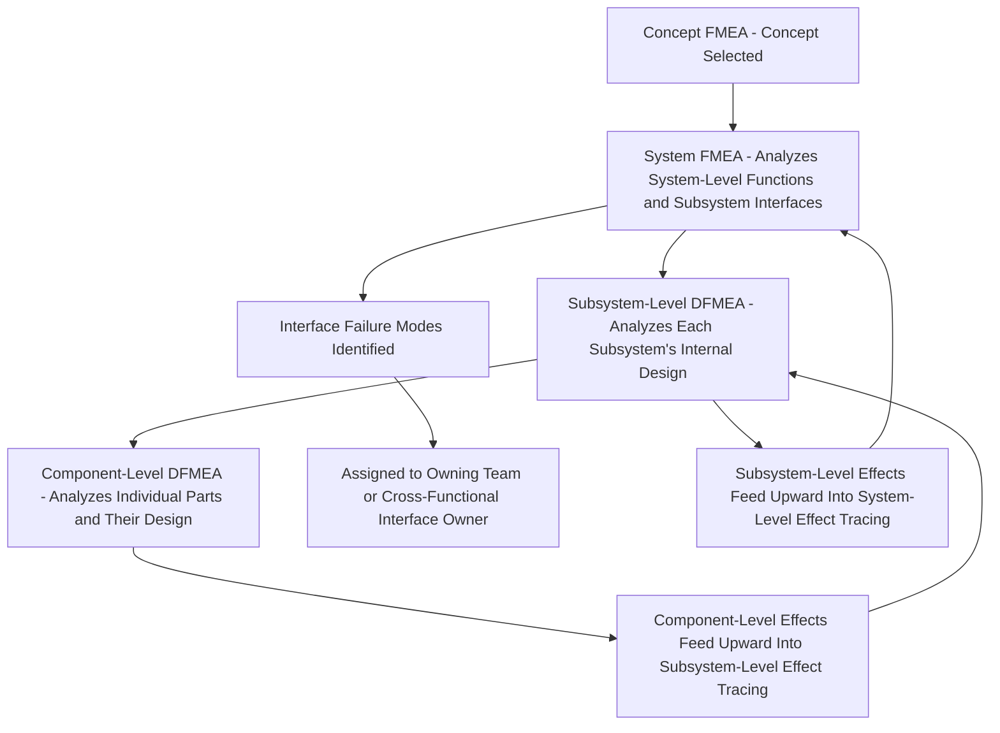

## System FMEA

### Definition

**System FMEA (SFMEA)** is a variant of Design FMEA performed at the highest level of design hierarchy — analyzing potential failure modes arising from the interactions, interfaces, and integration among multiple subsystems that together compose a complete system, rather than focusing on any single subsystem or component in isolation. System FMEA specifically targets the risks that emerge *from the way subsystems work together*, including interface incompatibilities, unintended interactions, and system-level functions that no single subsystem alone is responsible for delivering.

### Scope and Purpose

**Key Points**

- System FMEA sits at the top of the DFMEA hierarchy — above subsystem-level and component-level DFMEA — and is typically the first detailed-design-stage FMEA performed once a specific concept (informed by Concept FMEA) has been selected
- Its primary focus is **system integration risk**: failure modes that arise specifically because multiple subsystems must work together correctly, rather than failure modes internal to any single subsystem's own design (which are instead addressed by subsystem-level or component-level DFMEA)
- System FMEA is particularly concerned with **interfaces** — the boundaries where subsystems designed by different teams, or even different suppliers, must interact correctly — since integration risk frequently originates precisely at these boundaries rather than within any individual subsystem's internal design

### System-Level Functions vs. Subsystem-Level Functions

A key conceptual distinction underlying System FMEA is that a complete system often has functions that exist only at the system level — functions no single subsystem could deliver on its own, and which only emerge from correct subsystem interaction.

**Example**

Consider a vehicle's Advanced Driver Assistance System (ADAS) for automatic emergency braking:

- **System-level function**: Detect an imminent forward collision and apply braking force sufficient to avoid or mitigate the collision, within the required response time
- This system-level function depends on the correct interaction of several subsystems: a forward-facing radar/camera sensor subsystem, a perception/decision-making software subsystem, and a braking actuation subsystem
- No single subsystem alone performs the complete function — the sensor subsystem alone cannot brake the vehicle; the braking subsystem alone cannot detect a collision risk; correct system-level performance depends entirely on these subsystems interacting correctly across their interfaces

A System FMEA on this system would specifically examine failure modes such as "sensor subsystem correctly detects the hazard, but the resulting signal is misinterpreted or delayed at the interface to the decision-making subsystem" — a failure mode that exists specifically *because of* the interaction between subsystems, and would not be identified by a subsystem-level DFMEA examining the sensor subsystem or the braking subsystem independently.

### Position Within the DFMEA Hierarchy

**Key Points**

- System FMEA both feeds into and receives information from lower-level DFMEAs: system-level failure modes may be caused by, or trace down into, subsystem-level failure modes, while subsystem-level effects trace upward to inform the system-level end effect
- This bidirectional relationship mirrors the general local/next-level/end-effect chaining structure discussed earlier in this curriculum, applied specifically across the system-subsystem-component hierarchy

### Interface Analysis as a Core System FMEA Activity

**Key Points**

- Because interfaces frequently fall at organizational boundaries — between design teams, between engineering disciplines (mechanical, electrical, software), or between a prime contractor and a supplier — they are especially prone to being overlooked in analysis that focuses purely on individual subsystem ownership
- System FMEA explicitly assigns responsibility for identifying and analyzing interface-level failure modes, often supported by an **Interface Control Document (ICD)** or **boundary/block diagram** that makes every subsystem-to-subsystem connection explicit
- Common interface failure mode categories include: incompatible physical/mechanical tolerances between mating parts, incompatible electrical signal levels or timing between connected electronic subsystems, incompatible data formats or protocol assumptions between software subsystems, and incompatible thermal or environmental exposure assumptions across a physical boundary

### System FMEA and Emergent Behavior

**Key Points**

- A particularly important category of failure mode unique to the system level is **emergent behavior** — a failure that arises not from any individual subsystem malfunctioning, but from the *correct* individual behavior of multiple subsystems combining in an unintended or harmful way
- This category is structurally significant because it cannot, by definition, be identified through subsystem-level DFMEA alone, since each subsystem may be performing entirely within its own specification; only a system-level analysis considering how subsystems interact can surface this type of failure mode

**Example**

Consider a system where a vehicle's engine control subsystem correctly reduces power output when a specific sensor reading exceeds a threshold (a properly functioning, intended design behavior), while a separate stability control subsystem — also functioning correctly according to its own specification — independently interprets the resulting deceleration as a loss-of-traction event and applies corrective braking. Individually, both subsystems behaved exactly as designed; the resulting emergent behavior (unexpected and undesired vehicle deceleration from the combination of both correctly functioning subsystems) is a system-level failure mode that only a System FMEA, examining the interaction between these two subsystems, would be positioned to identify.

### Distinguishing System FMEA from Subsystem and Component DFMEA

| Dimension | System FMEA | Subsystem/Component DFMEA |
| --- | --- | --- |
| Level of analysis | Whole-system functions and subsystem interactions | Individual subsystem or component internal design |
| Typical failure mode origin | Interface incompatibility, emergent behavior, integration risk | Internal design margin, material, geometry issues |
| Ownership | Often a cross-functional systems engineering role | Typically owned by the specific subsystem/component design team |
| Typical tools | Block/interface diagrams, Interface Control Documents | Detailed component drawings, tolerance stacks, material specifications |
| Relationship to lower levels | Receives subsystem-level effects as inputs; assigns interface findings downward | Feeds effects upward into system-level analysis |

### Common Pitfalls in System FMEA Application

**Key Points**

- **Treating System FMEA as merely a summary of subsystem DFMEAs**: If System FMEA is performed simply by compiling the highest-severity findings from each subsystem's own DFMEA, it will systematically miss interface and emergent-behavior failure modes, which by definition do not appear within any single subsystem's own analysis
- **Unclear interface ownership**: When no specific team or role is assigned responsibility for a given interface, interface-level failure modes are prone to falling through organizational gaps — each subsystem team may reasonably assume the interface is "someone else's problem"
- **Performing System FMEA too late**: Because System FMEA is meant to catch integration-level risk before subsystems are independently finalized, performing it only after all subsystem designs are already locked reduces its ability to influence subsystem-level design decisions that could otherwise have eliminated an interface risk more cheaply

### Conclusion

System FMEA occupies the top tier of the Design FMEA hierarchy, deliberately focused on the risks that emerge specifically from subsystem interaction, interface design, and system-level function delivery — risks that, by their very nature, cannot be identified through subsystem-level or component-level analysis performed in isolation. Its emphasis on interfaces and emergent behavior makes it an essential complement to, rather than a mere aggregation of, the more granular subsystem and component DFMEAs that sit beneath it, and its findings frequently drive both system-level architectural decisions and targeted refinements passed down into the lower-level analyses it both informs and is informed by.

**Related Topics**

- Subsystem-level and component-level DFMEA in the design hierarchy
- Interface Control Documents (ICDs) and boundary diagram development
- Emergent behavior and system-level failure modes in complex systems
- Structure Analysis in the AIAG-VDA framework as applied to system-level scoping
- Cross-functional interface ownership and responsibility assignment
- System-level effect tracing and its relationship to subsystem-level effects