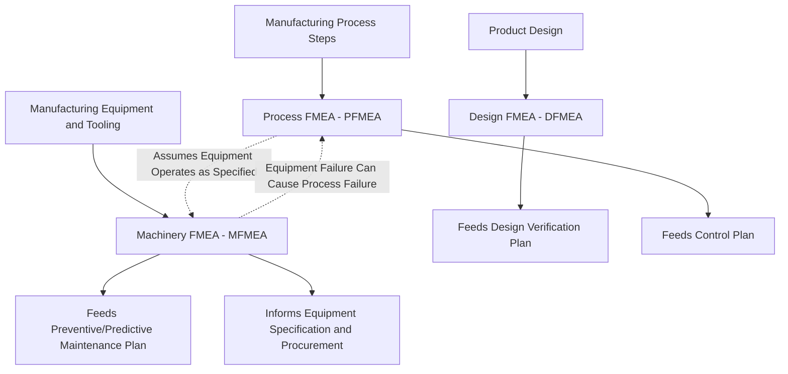

## Machinery and Equipment FMEA

### Definition

**Machinery and Equipment FMEA (MFMEA)** is a variant of FMEA applied specifically to the manufacturing equipment, machinery, tooling, and fixtures used to produce a product — as distinct from Design FMEA (which analyzes the product design) or Process FMEA (which analyzes the manufacturing process steps and their conforming/nonconforming outcomes). MFMEA asks a structurally different question from either: *"Could the machine or equipment itself fail in a way that prevents the process from being executed at all, degrades equipment performance, or creates a safety hazard to operators — independent of whether the resulting part would be conforming or nonconforming?"*

### Distinguishing MFMEA from DFMEA and PFMEA

**Key Points**

- **DFMEA** asks whether the *product design* is capable of meeting its requirements if manufactured correctly
- **PFMEA** asks whether the *manufacturing process*, as executed on functioning equipment, is capable of consistently producing a conforming part
- **MFMEA** asks whether the *equipment itself* — the machine, tool, or fixture performing the process — is capable of reliably operating, independent of the specific part being produced, addressing equipment reliability, availability, maintainability, and safety rather than product conformance directly

This distinction matters because a piece of equipment can fail in ways that have nothing to do with part quality at all — for example, a machine's hydraulic system failing and causing unplanned downtime, or a safety interlock failing in a way that creates an operator hazard, neither of which is captured by asking "did this process step produce a conforming part?"

### Scope and Typical Application

**Key Points**

- MFMEA is typically applied to capital equipment, dedicated tooling, fixtures, robots, conveyance systems, and other production assets, particularly where equipment represents a significant capital investment or where equipment downtime has substantial cost or safety implications
- It is especially emphasized in high-volume, highly automated manufacturing environments (such as automotive assembly and stamping operations) where unplanned equipment failure can halt an entire production line, and where equipment safety systems (guarding, interlocks, emergency stops) carry direct operator safety implications
- MFMEA is typically performed during equipment design and specification (analogous to how DFMEA is performed during product design) and is then maintained throughout the equipment's operational life, updated as maintenance history, wear patterns, and modifications accumulate

### The MFMEA Worksheet Structure

An MFMEA worksheet parallels the DFMEA/PFMEA structure but reframes every column around the equipment's own functions rather than the product or process:

| Column | Content |
| --- | --- |
| Equipment Function | The specific function the machine, subsystem, or component is intended to perform (e.g., "clamp workpiece with specified force," "index tooling to next station position") |
| Requirement | The specific performance criterion the equipment function must satisfy (e.g., cycle time, positioning accuracy, force tolerance) |
| Failure Mode | The specific manner in which the equipment fails to perform its function (e.g., "hydraulic cylinder fails to reach full extension," "index mechanism jams") |
| Failure Effects (Local, Next-Level, End) | Consequences on the immediate equipment subsystem, on production (downtime, scrap, rework), and potentially on operator safety |
| Severity (S) | Rating incorporating safety impact, production impact (downtime duration, scrap generated), and maintenance cost |
| Failure Cause/Mechanism | The underlying reason and mechanism (e.g., seal wear, bearing fatigue, sensor drift, electrical component degradation) |
| Occurrence (O) | Rating of likelihood given current preventive maintenance practices |
| Current Prevention Controls | Preventive maintenance schedules, component derating, redundant systems |
| Current Detection Controls | Condition monitoring, predictive maintenance sensors, operator pre-shift checks |
| Detection (D) | Rating of the likelihood the equipment degradation is caught before it causes unplanned failure or produces defective output |
| Risk Priority Number / Action Priority | Combined risk prioritization score or category |
| Recommended Actions | Design changes to equipment, revised maintenance intervals, added monitoring or redundancy |

### Worked Example

**Example**

Consider an MFMEA entry for a robotic welding cell's positioning fixture:

- **Equipment Function**: Clamp and hold workpiece in fixed position during automated welding cycle
- **Requirement**: Workpiece position must remain within $\pm 0.2 \, \text{mm}$ throughout the welding cycle
- **Failure Mode**: Clamping mechanism fails to maintain full clamping force during the cycle
- **Cause**: Pneumatic clamp cylinder seal degrades over accumulated cycle count, causing gradual pressure loss
- **Local Effect**: Clamping force drops below specification partway through the cycle
- **Next-Level Effect**: Workpiece shifts slightly during welding
- **End Effect**: Weld placed in incorrect location, producing a scrapped or reworked part; if undetected, potential downstream structural weld quality issue in the finished product
- **Severity**: Moderate to high depending on downstream detectability and the structural significance of the weld
- **Current Prevention Control**: Scheduled seal replacement based on a fixed cycle-count interval
- **Current Detection Control**: In-cycle clamp pressure sensor with automatic cycle abort if pressure falls below threshold
- **Recommended Action**: Transition from fixed-interval seal replacement to condition-based replacement using pressure-decay trend monitoring, enabling earlier intervention before pressure drops enough to affect a weld cycle

Note that this failure mode exists at the level of the equipment's own mechanical health — a fixture clamp seal — and would not appear in a PFMEA analysis of "weld placement accuracy" unless that PFMEA specifically traced the cause back to equipment condition, which is precisely the analytical territory MFMEA is designed to cover in a dedicated, equipment-focused way.

### MFMEA's Relationship to Reliability-Centered Maintenance

**Key Points**

- MFMEA shares significant conceptual overlap with **Reliability-Centered Maintenance (RCM)**, a broader maintenance strategy framework that similarly identifies functions, functional failures, failure modes, and effects of equipment — but RCM extends further into deriving specific maintenance task selection logic (time-based, condition-based, or run-to-failure) from that analysis
- Organizations sometimes use MFMEA findings as a direct input to RCM-based maintenance planning, effectively using the MFMEA's occurrence and detection ratings to determine which equipment failure modes warrant proactive scheduled maintenance versus condition monitoring versus acceptance of run-to-failure risk

### Position Within the Broader FMEA Family

**Key Points**

- The dotted relationship between PFMEA and MFMEA reflects an important interdependency: PFMEA's occurrence ratings for certain process-related failure modes may implicitly assume the equipment performing that process is operating within its own specification — an assumption that MFMEA is specifically responsible for validating and maintaining over the equipment's operational life
- This interdependency means that a PFMEA finding of "low occurrence" for a given process failure mode may become invalid over time if the underlying equipment degrades in a way that MFMEA, but not PFMEA directly, is tracking

### Safety Considerations Specific to MFMEA

**Key Points**

- Because MFMEA directly addresses equipment failure modes, it frequently intersects with machine safety analysis, particularly regarding safety interlocks, guarding systems, emergency stop functionality, and other safety-critical equipment functions
- Failure modes affecting safety systems (e.g., "safety light curtain fails to detect operator presence," "emergency stop circuit fails to de-energize equipment") are typically assigned the highest severity ratings within an MFMEA, reflecting direct operator injury risk rather than purely production or quality impact
- In many organizations, safety-related equipment failure modes identified through MFMEA are cross-referenced with formal machine safety risk assessments conducted under applicable safety standards, ensuring consistency between the FMEA-based risk view and any separate, regulation-driven machine safety documentation

### Conclusion

Machinery and Equipment FMEA fills an analytical gap that neither Design FMEA nor Process FMEA is structured to address: the reliability, availability, maintainability, and safety of the equipment itself, independent of product design adequacy or process capability to produce conforming parts. By systematically analyzing equipment functions, failure modes, and their consequences on production continuity and operator safety, MFMEA directly informs preventive and predictive maintenance planning, equipment specification decisions, and — critically — helps validate the equipment-reliability assumptions that PFMEA's own occurrence and detection ratings often implicitly depend on.

**Related Topics**

- Reliability-Centered Maintenance (RCM) and its relationship to MFMEA findings
- Preventive versus predictive (condition-based) maintenance strategy selection
- Machine safety systems and their integration with MFMEA severity ratings
- The interdependency between PFMEA occurrence ratings and equipment health
- Equipment specification and procurement informed by early-stage MFMEA
- Condition monitoring and sensor-based detection controls in equipment reliability