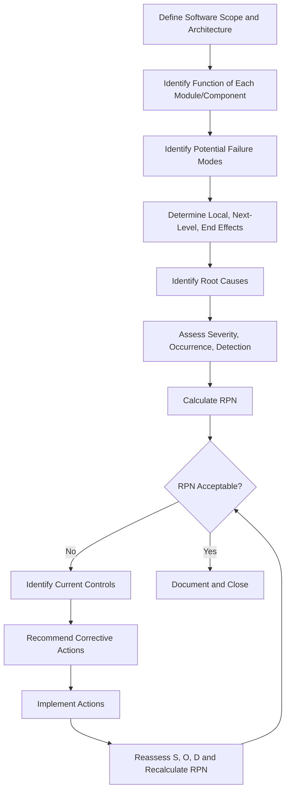

## Software FMEA

### Overview

Software FMEA (SFMEA) is a structured, bottom-up analytical technique used to identify potential failure modes within software design, code, and architecture before they manifest in the field. Unlike hardware FMEA, which focuses on physical component degradation or wear-out mechanisms, SFMEA addresses logic errors, data handling faults, interface mismatches, timing issues, and unintended software behaviors. It is typically applied at the design and code level to systematically evaluate how software elements can fail, what triggers those failures, and what downstream effects they produce on the system.

### Purpose and Scope

**Key Points**

- Identifies failure modes originating from software logic, algorithms, data structures, and interfaces rather than physical wear
- Complements System FMEA and Hardware FMEA by covering the software-controlled portions of a system
- Applied iteratively across the software development lifecycle (requirements, design, coding, integration, testing)
- Particularly critical in safety-critical domains: automotive (ISO 26262), aerospace (DO-178C), medical devices (IEC 62304), and industrial control systems

### Distinguishing SFMEA from Hardware FMEA

| Aspect | Hardware FMEA | Software FMEA |
| --- | --- | --- |
| Failure origin | Physical degradation, wear, environmental stress | Logic errors, coding defects, data corruption, timing faults |
| Failure predictability | Often modeled via reliability data, MTBF | Deterministic given inputs; failures are design/coding flaws, not random wear-out |
| Detection method | Sensors, inspection, physical testing | Code review, static analysis, unit/integration testing, runtime monitoring |
| Occurrence rating basis | Historical failure rates, stress analysis | Complexity, code maturity, change frequency, defect density |

### Levels of Analysis

Software FMEA is typically performed at three nested levels:

**System-Level SFMEA**

- Examines interactions between software modules and the overall system, including interfaces to hardware, sensors, and actuators
- Focuses on how a software failure propagates to system-level effects (e.g., loss of function, unintended actuation)

**Module/Component-Level SFMEA**

- Examines individual software components, classes, or functions
- Focuses on internal logic failures: incorrect calculations, boundary condition mishandling, exception mishandling

**Code-Level SFMEA (Detailed SFMEA)**

- Line-by-line or block-by-block analysis of critical code segments
- Focuses on specific constructs: pointer dereferencing, array indexing, type conversions, concurrency primitives

### Process Steps

**Step 1: Define Scope and Boundaries**

Identify the software architecture, modules, interfaces, and functions under review. Establish which requirements or use cases are being traced.

**Step 2: Identify Functions**

For each software element, document its intended function(s) — what it is supposed to do, including inputs, outputs, and preconditions.

**Step 3: Identify Potential Failure Modes**

For each function, brainstorm ways the software could fail to perform as intended. Common categories include:

- Incorrect output (wrong value, wrong format, wrong units)
- No output / function does not execute
- Untimely output (too early, too late, out of sequence)
- Partial or incomplete output
- Unintended additional output or side effect
- Data corruption or loss
- Exception/error not handled
- Race condition or deadlock
- Memory leak or resource exhaustion
- Buffer overflow/underflow
- Null/undefined reference

**Step 4: Identify Effects of Failure**

Determine the local effect (immediate consequence within the module), the next-level effect (impact on the subsystem), and the end effect (impact on the overall system or user).

**Step 5: Identify Causes**

Trace each failure mode back to root causes such as:

- Requirements ambiguity or omission
- Incorrect algorithm implementation
- Improper error/exception handling
- Incorrect boundary or edge-case handling
- Faulty interface assumptions (data type, units, timing)
- Concurrency/synchronization defects
- Inadequate input validation

**Step 6: Assess Risk (Severity, Occurrence, Detection)**

$$RPN = S \times O \times D$$

- **Severity (S):** Consequence of the failure effect on the system or user (1–10)
- **Occurrence (O):** Likelihood the failure mode occurs, often estimated from code complexity, change history, or defect density rather than physical stress data (1–10)
- **Detection (D):** Likelihood existing verification methods (code review, static analysis, testing) catch the defect before release (1–10)

**Step 7: Identify Current Controls**

Document existing preventive controls (defensive coding standards, design patterns, input validation) and detective controls (unit tests, static analysis tools, code reviews, runtime assertions).

**Step 8: Recommend Actions**

Propose mitigations: additional test cases, defensive code changes, design refactoring, added assertions, improved exception handling, or architectural changes (e.g., watchdog timers, redundancy).

**Step 9: Recalculate Risk and Track Closure**

After actions are implemented, reassess S, O, D and recalculate RPN to confirm risk reduction.

### Common SFMEA Failure Mode Taxonomy

**Data-Related**

- Data type mismatch or truncation
- Uninitialized variable use
- Stale or cached data used incorrectly
- Incorrect unit conversion

**Control Flow-Related**

- Missing or incorrect conditional branch
- Infinite loop
- Incorrect loop boundary (off-by-one)
- Unreachable code masking a required behavior

**Interface-Related**

- API contract violation (wrong parameter order, type, or count)
- Timing mismatch between producer and consumer
- Protocol version mismatch

**Concurrency-Related**

- Race condition on shared resource
- Deadlock from lock ordering
- Priority inversion in real-time scheduling

**Resource-Related**

- Memory leak
- Stack overflow from unbounded recursion
- File handle or socket exhaustion

### Example

**Function:** Software module calculates and outputs a braking force command based on sensor input in an automotive braking control system.

| Failure Mode | Potential Cause | Local Effect | End Effect | S | O | D | RPN |
| --- | --- | --- | --- | --- | --- | --- | --- |
| Output value frozen at last valid reading | Sensor read timeout not handled; no fallback logic | Braking command does not update | Delayed or absent braking response | 9 | 3 | 4 | 108 |
| Divide-by-zero in force calculation | Missing input validation on denominator variable | Runtime exception / task crash | Loss of braking control | 10 | 2 | 5 | 100 |
| Integer overflow in force value | Undersized data type for computed range | Incorrect (wrapped) force value sent | Unintended full or zero braking force | 9 | 2 | 6 | 108 |

**Recommended Actions:**

- Add explicit sensor timeout detection with defined fail-safe output
- Add input validation guarding against zero/near-zero denominators
- Widen data type or add saturation logic to prevent overflow wraparound
- Add unit test cases covering boundary and fault-injection scenarios

### Process Flow Diagram

### Failure Propagation Diagram (svg_diagram)

<svg xmlns="http://www.w3.org/2000/svg" viewBox="0 0 760 260">
<text x="10" y="20" font-size="14" font-weight="bold" fill="#1a1a1a">Software Failure Propagation (svg_diagram)</text>
<rect x="10" y="50" width="180" height="60" rx="6" fill="#ffe0e0" stroke="#cc0000" stroke-width="1.5" />
<text x="100" y="75" font-size="12" text-anchor="middle" fill="#1a1a1a">Failure Mode</text>
<text x="100" y="93" font-size="11" text-anchor="middle" fill="#333">(e.g., overflow)</text>
<rect x="230" y="50" width="180" height="60" rx="6" fill="#fff3cd" stroke="#cc9900" stroke-width="1.5" />
<text x="320" y="75" font-size="12" text-anchor="middle" fill="#1a1a1a">Local Effect</text>
<text x="320" y="93" font-size="11" text-anchor="middle" fill="#333">Incorrect variable value</text>
<rect x="450" y="50" width="180" height="60" rx="6" fill="#fff3cd" stroke="#cc9900" stroke-width="1.5" />
<text x="540" y="75" font-size="12" text-anchor="middle" fill="#1a1a1a">Next-Level Effect</text>
<text x="540" y="93" font-size="11" text-anchor="middle" fill="#333">Module outputs wrong command</text>
<rect x="230" y="160" width="400" height="60" rx="6" fill="#f8d7da" stroke="#cc0000" stroke-width="1.5" />
<text x="430" y="185" font-size="12" text-anchor="middle" fill="#1a1a1a">End Effect</text>
<text x="430" y="203" font-size="11" text-anchor="middle" fill="#333">System-level malfunction (e.g., unintended actuation)</text>
<line x1="190" y1="80" x2="230" y2="80" stroke="#333" stroke-width="1.5" marker-end="url(#arrow)" />
<line x1="410" y1="80" x2="450" y2="80" stroke="#333" stroke-width="1.5" marker-end="url(#arrow)" />
<line x1="540" y1="110" x2="430" y2="160" stroke="#333" stroke-width="1.5" marker-end="url(#arrow)" />
</svg>

### Tools Commonly Used to Support SFMEA

- **Static analysis tools:** Detect potential null dereferences, buffer overflows, unreachable code, type mismatches (e.g., Coverity, Polyspace, SonarQube)
- **Model-based design tools:** For systems using Simulink/Stateflow, automated failure injection can validate model-level fault handling
- **Requirements traceability tools:** Link failure modes back to requirements to ensure coverage
- **Fault injection frameworks:** Simulate failure modes at runtime to validate detection/mitigation controls

### Conclusion

Software FMEA extends the systematic risk-identification discipline of traditional FMEA into the domain of software logic, data handling, and timing. Because software failures are deterministic rather than wear-driven, SFMEA occurrence and detection estimates rely on code complexity, defect history, and verification coverage rather than physical stress models. When integrated early into the software development lifecycle and iterated as code matures, SFMEA helps surface latent defects — such as unhandled exceptions, boundary errors, and concurrency faults — before they propagate into system-level failures.

**Next Steps**

- Interface FMEA (hardware-software boundary failure modes)
- Fault Tree Analysis (FTA) for software safety cases
- Requirements-based testing and traceability
- Static vs. dynamic code analysis techniques
- Concurrency and real-time scheduling failure analysis
- ISO 26262 Part 6 software safety requirements
- IEC 62304 software lifecycle risk management