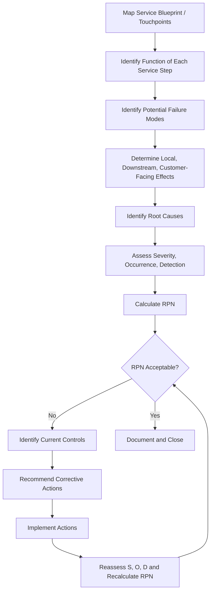

## Service FMEA

### Overview

Service FMEA (SvcFMEA) is a structured risk-analysis technique applied to service processes — sequences of customer-facing or internal activities where the "product" is an experience, transaction, or outcome rather than a physical or software artifact. It identifies potential failure modes in service delivery steps, their effects on the customer or downstream process, and their root causes, enabling proactive mitigation before failures reach the end user.

### Purpose and Scope

**Key Points**

- Applies FMEA methodology to process steps performed by people, systems, or a combination of both in delivering a service
- Common in healthcare, hospitality, banking, retail, call centers, logistics, and administrative/back-office processes
- Focuses on process failures: missed steps, incorrect information, delays, miscommunication, and procedural deviations
- Often conducted alongside Process FMEA (PFMEA) methodology but adapted for intangible, human-centric service outputs

### Distinguishing SvcFMEA from Process and Hardware FMEA

| Aspect | Hardware/Process FMEA | Service FMEA |
| --- | --- | --- |
| Failure origin | Manufacturing variation, equipment malfunction | Human error, procedural gaps, communication breakdown, system downtime |
| Output type | Physical part or assembled product | Customer experience, information, transaction outcome |
| Variability source | Machine tolerances, material properties | Employee training, discretion, customer interaction variability |
| Detection method | Gauges, inspection, automated testing | Customer feedback, audits, mystery shopping, call monitoring, complaint logs |

### Process Steps

**Step 1: Define the Service Process Scope**

Map the end-to-end service delivery process using a flowchart or service blueprint, identifying every touchpoint between the service provider and the customer, as well as backstage (non-customer-facing) support activities.

**Step 2: Identify Process Functions**

For each step in the service blueprint, define its intended purpose (e.g., "verify customer identity," "process payment," "dispatch technician").

**Step 3: Identify Potential Failure Modes**

For each step, identify ways the service action could fail to meet intent. Common categories include:

- Incorrect information provided to customer
- Missed or skipped process step
- Delay beyond acceptable time window
- Wrong service delivered (mismatched to customer request)
- Incomplete service delivery
- Miscommunication between departments or handoff points
- System/technology failure during service delivery
- Inconsistent service quality across providers/locations

**Step 4: Identify Effects of Failure**

Determine effects at three levels: immediate (within the step), downstream (on subsequent process steps or departments), and customer-facing (satisfaction, trust, safety, financial impact).

**Step 5: Identify Root Causes**

Common causes include:

- Inadequate employee training or unclear procedures
- Ambiguous or outdated standard operating procedures (SOPs)
- System/software downtime or integration failure
- Poor handoff communication between teams or shifts
- Inadequate staffing levels during peak demand
- Language or cultural communication barriers
- Lack of standardized scripts or checklists

**Step 6: Assess Risk (Severity, Occurrence, Detection)**

$$RPN = S \times O \times D$$

- **Severity (S):** Impact of the failure on customer satisfaction, safety, cost, or reputation (1–10)
- **Occurrence (O):** Likelihood the failure happens, often estimated from historical complaint data, error logs, or audit findings (1–10)
- **Detection (D):** Likelihood the failure is caught before it reaches or seriously affects the customer (1–10)

**Step 7: Identify Current Controls**

Document existing preventive controls (training programs, checklists, standardized scripts, automated system validations) and detective controls (supervisor audits, customer satisfaction surveys, call recording review, mystery shopping).

**Step 8: Recommend Actions**

Propose mitigations: revised SOPs, additional training, checklist enforcement, system redundancy, escalation protocols, or real-time quality monitoring dashboards.

**Step 9: Recalculate Risk and Track Closure**

After implementing actions, reassess S, O, D and recalculate RPN to confirm risk reduction; track action ownership and completion dates.

### Common Service Failure Mode Taxonomy

**Communication-Related**

- Incomplete or inaccurate information relay
- Failure to confirm customer understanding
- Jargon or unclear language used with customer

**Process/Procedural**

- Step skipped due to time pressure
- Incorrect sequence of steps performed
- Non-standardized execution across staff or locations

**System/Technology-Related**

- Point-of-sale, booking, or CRM system outage
- Data entry error at capture point
- Integration failure between front-end and back-end systems

**Human Factors**

- Employee fatigue or distraction
- Insufficient training on edge cases
- Inconsistent judgment in ambiguous situations

**Resource/Capacity-Related**

- Understaffing during peak demand
- Equipment or facility unavailability
- Supply shortage affecting service fulfillment

### Example

**Process:** Hospital patient discharge process.

| Failure Mode | Potential Cause | Local Effect | End Effect | S | O | D | RPN |
| --- | --- | --- | --- | --- | --- | --- | --- |
| Discharge instructions not given to patient | Nurse handoff communication gap during shift change | Patient leaves without care guidance | Medication error or readmission | 9 | 4 | 5 | 180 |
| Incorrect medication list transferred | Manual transcription error between EHR systems | Pharmacy dispenses wrong prescription | Adverse drug event | 10 | 3 | 4 | 120 |
| Delay in discharge paperwork processing | Understaffed administrative desk during peak hours | Patient bed unavailable for next admission | Reduced hospital throughput, patient dissatisfaction | 5 | 6 | 3 | 90 |

**Recommended Actions:**

- Implement standardized discharge checklist with mandatory nurse-to-patient verbal confirmation
- Automate medication list transfer via EHR integration, eliminating manual transcription
- Add real-time staffing dashboard to trigger discharge desk support during peak periods

### Process Flow Diagram

### Service Blueprint Failure Point Diagram (svg_diagram)

<svg xmlns="http://www.w3.org/2000/svg" viewBox="0 0 780 280">
<text x="10" y="20" font-size="14" font-weight="bold" fill="#1a1a1a">Service Blueprint with Failure Points (svg_diagram)</text>

<text x="10" y="50" font-size="11" fill="#555">Customer Actions</text>

<rect x="10" y="60" width="150" height="45" rx="5" fill="`#e0f0ff`" stroke="`#0066cc`" />

<text x="85" y="87" font-size="11" text-anchor="middle">Requests Service</text>

<rect x="200" y="60" width="150" height="45" rx="5" fill="#e0f0ff" stroke="#0066cc" />
<text x="275" y="87" font-size="11" text-anchor="middle">Receives Service</text>

<text x="10" y="130" font-size="11" fill="#555">Frontline (Onstage)</text>

<rect x="10" y="140" width="150" height="45" rx="5" fill="`#e0ffe0`" stroke="`#009933`" />

<text x="85" y="167" font-size="11" text-anchor="middle">Agent Intake</text>

<rect x="200" y="140" width="150" height="45" rx="5" fill="#ffe0e0" stroke="#cc0000" stroke-width="2" />
<text x="275" y="162" font-size="11" text-anchor="middle">Agent Delivery</text>
<text x="275" y="177" font-size="10" text-anchor="middle" fill="#cc0000">[Failure Point]</text>

<text x="10" y="210" font-size="11" fill="#555">Backstage / Support</text>

<rect x="10" y="220" width="150" height="45" rx="5" fill="`#fff3cd`" stroke="`#cc9900`" />

<text x="85" y="247" font-size="11" text-anchor="middle">System Record Update</text>

<rect x="200" y="220" width="150" height="45" rx="5" fill="#ffe0e0" stroke="#cc0000" stroke-width="2" />
<text x="275" y="242" font-size="11" text-anchor="middle">Handoff to Next Team</text>
<text x="275" y="257" font-size="10" text-anchor="middle" fill="#cc0000">[Failure Point]</text>
<line x1="160" y1="82" x2="200" y2="82" stroke="#333" marker-end="url(#arrow2)" />
<line x1="85" y1="105" x2="85" y2="140" stroke="#333" stroke-dasharray="3,3" marker-end="url(#arrow2)" />
<line x1="275" y1="105" x2="275" y2="140" stroke="#333" stroke-dasharray="3,3" marker-end="url(#arrow2)" />
<line x1="160" y1="162" x2="200" y2="162" stroke="#333" marker-end="url(#arrow2)" />
<line x1="85" y1="185" x2="85" y2="220" stroke="#333" stroke-dasharray="3,3" marker-end="url(#arrow2)" />
<line x1="160" y1="242" x2="200" y2="242" stroke="#333" marker-end="url(#arrow2)" />
</svg>

### Tools Commonly Used to Support SvcFMEA

- **Service blueprinting:** Visual mapping of customer actions, frontline actions, backstage actions, and support processes with identified failure points
- **Customer feedback analytics:** Survey scores, Net Promoter Score (NPS) drivers, and complaint categorization to inform Occurrence ratings
- **Call/interaction monitoring:** Quality assurance scorecards and recorded interaction review for Detection assessment
- **Root cause analysis tools:** Fishbone (Ishikawa) diagrams and 5-Whys to trace failure modes to underlying causes

### Conclusion

Service FMEA applies the core FMEA risk-prioritization framework to the human- and process-centric nature of service delivery, where failure modes stem primarily from communication breakdowns, procedural inconsistency, and system reliability rather than material degradation. By mapping the full service blueprint and systematically evaluating each touchpoint for potential failure, organizations can proactively strengthen training, standardize procedures, and add detective controls before failures erode customer trust or safety.

**Next Steps**

- Process FMEA (PFMEA) for manufacturing and transactional process failures
- Service blueprinting techniques in depth
- Root cause analysis methods (5-Whys, Fishbone/Ishikawa)
- Customer journey mapping and touchpoint risk assessment
- Statistical Process Control (SPC) for service quality metrics
- Complaint and incident management systems as SvcFMEA data sources