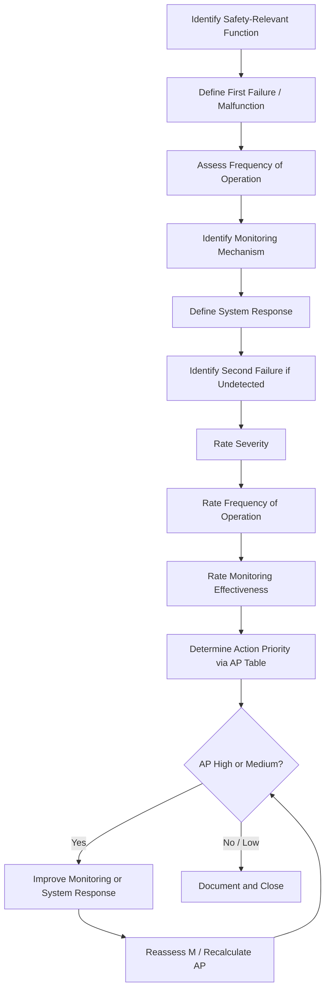

## FMEA MSR for Monitoring and System Response

### Overview

FMEA-MSR (Monitoring and System Response) is a supplemental FMEA methodology introduced in the AIAG-VDA FMEA Handbook (2019) that specifically analyzes failures which occur *after* a product has been released to the customer and are detected during vehicle/system operation by onboard diagnostic monitors, sensors, or driver perception. It evaluates the system's capability to detect an emerging or occurred failure during operation and respond in a way that maintains safety or acceptable functionality, distinct from Design FMEA which addresses prevention and detection during design/manufacturing verification.

### Purpose and Scope

**Key Points**

- Introduced as part of the harmonized AIAG-VDA FMEA methodology, primarily applied in automotive functional safety contexts (ISO 26262)
- Addresses runtime/operational-phase failure detection and mitigation, not design-verification-phase detection
- Answers the question: "If this failure occurs while the customer is using the product, will the system detect it and respond safely before an unacceptable consequence occurs?"
- Closely tied to diagnostic coverage, fault detection time, and fail-safe/degraded-operation strategies
- Complements Design FMEA (DFMEA) rather than replacing it — DFMEA covers design-time failure prevention; FMEA-MSR covers in-use failure detection and response

### Distinguishing FMEA-MSR from DFMEA

| Aspect | Design FMEA (DFMEA) | FMEA-MSR |
| --- | --- | --- |
| Failure timing focus | Failures introduced during design; verified before release | Failures occurring during actual customer operation |
| Detection context | Design reviews, simulation, verification/validation testing | Onboard monitors, diagnostic trouble codes, sensor thresholds, driver perception |
| Detection column meaning | Likelihood design verification catches the failure cause/mode before production | Likelihood the *system* detects the failure during operation before the end effect occurs |
| Response element | Not explicitly modeled | Explicitly models the system's response action (e.g., limp-home mode, warning light, shutdown) |
| Typical rating scale | Standard AIAG-VDA S/O/D 1–10 tables | Separate FMEA-MSR-specific Frequency of Operation (FO), Monitoring (M), and Severity of the second failure (S) rating tables |

### Core Concept: The Two-Failure Model

FMEA-MSR is built around a **first failure / second failure** structure:

- **First Failure (Malfunction):** The initial failure that occurs during operation (analogous to the failure mode in DFMEA)
- **Monitoring:** The system-level mechanism (sensor, diagnostic, algorithm) that detects the first failure has occurred or is occurring
- **System Response:** The action taken once the first failure is detected (e.g., alert the driver, switch to a redundant path, enter a safe state, limit performance)
- **Second Failure (Potential Effect if Undetected):** The consequence that results if the first failure is *not* detected or the system response fails to prevent it — this is what FMEA-MSR is ultimately trying to prevent

### AIAG-VDA FMEA-MSR Rating Scales

FMEA-MSR uses three distinct rating parameters rather than the standard S-O-D triad:

**Severity (S)**

- Same severity scale as DFMEA (1–10), applied to the effect of the *second* (undetected/unmitigated) failure

**Frequency of Operation (FO)**

- Rates how often the vehicle/system is operated in the state where the failure could occur (1–10)
- Reflects exposure — how frequently the operating condition that could trigger the first failure is encountered

**Monitoring (M)**

- Rates the effectiveness of the monitoring mechanism in detecting the first failure and enabling the system response to prevent or mitigate the second failure (1–10)
- Lower M values indicate highly effective, validated monitoring/diagnostic coverage

$$AP = f(S, FO, M)$$

Where **AP (Action Priority)** is determined using the AIAG-VDA Action Priority tables (High/Medium/Low), analogous to the DFMEA Action Priority approach — FMEA-MSR does **not** use a multiplicative RPN in the harmonized AIAG-VDA methodology; it uses the AP lookup table combining S, FO, and M.

### Process Steps

**Step 1: Identify Safety-Relevant Functions Requiring Monitoring**

Review DFMEA outputs and safety goals (from ISO 26262 HARA) to identify functions where undetected failure during operation could cause a hazardous event.

**Step 2: Identify the First Failure (Malfunction)**

Define the specific malfunction that could occur during customer operation (e.g., "sensor signal drifts out of valid range").

**Step 3: Identify Frequency of Operation (FO)**

Assess how often the system operates in the condition where the first failure could occur.

**Step 4: Identify the Monitoring Mechanism**

Document the specific diagnostic, sensor plausibility check, or algorithm that monitors for the first failure.

**Step 5: Identify the System Response**

Define the action the system takes once the monitor detects the first failure (e.g., illuminate a warning lamp, transition to a fail-safe state, disable a function, request driver takeover).

**Step 6: Identify the Second Failure (Effect if Undetected)**

Determine the consequence if monitoring fails to detect the first failure or the system response does not adequately mitigate it.

**Step 7: Rate Severity, Frequency of Operation, and Monitoring**

Assign S, FO, and M ratings per AIAG-VDA tables.

**Step 8: Determine Action Priority (AP)**

Use the AIAG-VDA AP lookup table (based on S, FO, M combinations) to classify risk as High, Medium, or Low.

**Step 9: Recommend Actions**

Propose improved monitoring strategies (additional sensors, plausibility checks, redundancy), faster fault detection time, or improved system response (more conservative fail-safe state).

**Step 10: Reassess and Close**

After implementing actions, reassess M (and FO/S if applicable) and recalculate AP to confirm risk reduction.

### Common Monitoring Mechanisms

**Sensor-Based Monitoring**

- Signal range/plausibility checks
- Redundant sensor comparison (voting logic)
- Rate-of-change limits

**Diagnostic/Software-Based Monitoring**

- Watchdog timers for task execution monitoring
- Checksum/CRC validation on communication buses (CAN, LIN, Ethernet)
- Model-based plausibility checks (comparing actual vs. expected system behavior)

**System Response Strategies**

- Driver warning (telltale, chime, message)
- Graceful degradation (reduced performance/limp-home mode)
- Safe state transition (function disable, actuator de-energize)
- Redundant path activation

### Example

**Function:** Electric power steering (EPS) torque sensor provides steering assist input.

| Element | Description |
| --- | --- |
| First Failure | Torque sensor signal drifts within valid electrical range but does not reflect true applied torque |
| Frequency of Operation (FO) | Vehicle in normal driving operation — high frequency (FO = 8) |
| Monitoring | Plausibility check comparing torque sensor signal against redundant sensor and steering angle rate model |
| System Response | If mismatch exceeds threshold for defined time, EPS transitions to reduced-assist mode and illuminates steering warning lamp |
| Second Failure (if undetected) | Incorrect steering assist applied without driver awareness, leading to unintended vehicle path deviation |
| Severity (S) | 9 (potential loss of vehicle control) |
| Monitoring (M) | 3 (redundant plausibility check with fast detection time, well-validated) |
| Action Priority (AP) | Medium (per AIAG-VDA S=9, FO=8, M=3 lookup) |

**Recommended Actions:**

- Reduce diagnostic fault detection time via faster sampling of redundant sensor comparison
- Validate plausibility check threshold through fault-injection testing across operating temperature range
- Confirm warning lamp activation latency meets safety goal timing requirement

### Process Flow Diagram

### First Failure / Monitoring / System Response Model (svg_diagram)

<svg xmlns="http://www.w3.org/2000/svg" viewBox="0 0 800 260">
<text x="10" y="20" font-size="14" font-weight="bold" fill="#1a1a1a">FMEA-MSR Two-Failure Model (svg_diagram)</text>
<rect x="10" y="50" width="170" height="60" rx="6" fill="#ffe0e0" stroke="#cc0000" stroke-width="1.5" />
<text x="95" y="75" font-size="12" text-anchor="middle">First Failure</text>
<text x="95" y="93" font-size="10" text-anchor="middle" fill="#333">(e.g., sensor drift)</text>
<rect x="230" y="50" width="170" height="60" rx="6" fill="#e0f0ff" stroke="#0066cc" stroke-width="1.5" />
<text x="315" y="75" font-size="12" text-anchor="middle">Monitoring (M)</text>
<text x="315" y="93" font-size="10" text-anchor="middle" fill="#333">Plausibility / diagnostic check</text>
<rect x="450" y="50" width="170" height="60" rx="6" fill="#e0ffe0" stroke="#009933" stroke-width="1.5" />
<text x="535" y="75" font-size="12" text-anchor="middle">System Response</text>
<text x="535" y="93" font-size="10" text-anchor="middle" fill="#333">Warning / degrade / safe state</text>
<rect x="670" y="50" width="120" height="60" rx="6" fill="#d4edda" stroke="#009933" stroke-width="1.5" />
<text x="730" y="75" font-size="12" text-anchor="middle">Mitigated</text>
<text x="730" y="93" font-size="10" text-anchor="middle" fill="#333">Outcome</text>
<rect x="315" y="170" width="220" height="60" rx="6" fill="#f8d7da" stroke="#cc0000" stroke-width="2" />
<text x="425" y="195" font-size="12" text-anchor="middle">Second Failure</text>
<text x="425" y="213" font-size="10" text-anchor="middle" fill="#333">(if monitoring/response fails)</text>
<line x1="180" y1="80" x2="230" y2="80" stroke="#333" stroke-width="1.5" marker-end="url(#arrow3)" />
<line x1="400" y1="80" x2="450" y2="80" stroke="#333" stroke-width="1.5" marker-end="url(#arrow3)" />
<line x1="620" y1="80" x2="670" y2="80" stroke="#333" stroke-width="1.5" marker-end="url(#arrow3)" />
<line x1="315" y1="110" x2="425" y2="170" stroke="#cc0000" stroke-width="1.5" stroke-dasharray="4,3" marker-end="url(#arrow3)" />
<text x="360" y="145" font-size="10" fill="#cc0000">if undetected</text>
</svg>

### Relationship to ISO 26262 and Functional Safety

FMEA-MSR is closely aligned with ISO 26262 concepts of **fault detection time interval**, **fault tolerant time interval**, and **safe states**. The Monitoring mechanism in FMEA-MSR often corresponds directly to a Safety Mechanism defined in the technical safety concept, and the fault detection time must be validated as shorter than the fault tolerant time interval to ensure the system response occurs before the hazardous event manifests. [Inference] Organizations pursuing ASIL-rated safety goals typically map FMEA-MSR monitoring entries directly to safety mechanism specifications to maintain bidirectional traceability with the safety case.

### Conclusion

FMEA-MSR fills a methodological gap left by traditional DFMEA by explicitly analyzing whether failures occurring during actual customer operation can be detected by onboard monitoring and mitigated through a defined system response before escalating into a more severe second failure. By formalizing the Frequency of Operation and Monitoring ratings alongside Severity, and using the AIAG-VDA Action Priority framework, FMEA-MSR provides a structured link between design-time failure analysis and runtime functional safety mechanisms, particularly critical for systems governed by ISO 26262.

**Next Steps**

- Design FMEA (DFMEA) and its relationship to FMEA-MSR
- ISO 26262 Hazard Analysis and Risk Assessment (HARA)
- Fault detection time vs. fault tolerant time interval concepts
- AIAG-VDA Action Priority (AP) tables in depth
- Diagnostic coverage and safety mechanism design
- Fail-operational vs. fail-safe system architectures