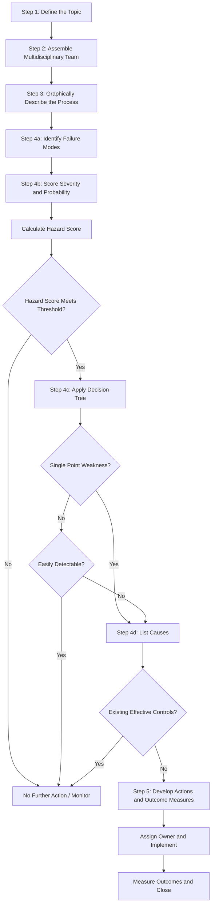

## Healthcare Failure Mode Effect Analysis

### Overview

Healthcare Failure Mode and Effect Analysis (HFMEA) is a prospective, structured risk-assessment methodology adapted specifically for clinical and healthcare delivery processes. Developed by the U.S. Department of Veterans Affairs National Center for Patient Safety in collaboration with the Tenet HealthSystem, HFMEA modifies traditional industrial FMEA to fit the unique operational, ethical, and regulatory environment of healthcare, replacing the numeric Risk Priority Number (RPN) with a Hazard Score matrix and a Decision Tree to determine which failure modes require action.

### Purpose and Scope

**Key Points**

- A proactive, team-based method to identify and prioritize process vulnerabilities *before* patient harm occurs, distinct from root cause analysis (RCA), which is reactive/retrospective
- Widely mandated or recommended by accreditation bodies (e.g., The Joint Commission in the U.S. requires at least one proactive risk assessment of a high-risk process annually)
- Applied to clinical processes such as medication administration, surgical procedures, patient identification, blood transfusion, equipment sterilization, and care transitions/handoffs
- Emphasizes multidisciplinary team involvement (physicians, nurses, pharmacists, technicians, administrators) reflecting the cross-functional nature of care delivery

### Distinguishing HFMEA from Industrial FMEA

| Aspect | Industrial FMEA | HFMEA |
| --- | --- | --- |
| Risk scoring | Severity × Occurrence × Detection = RPN | Severity × Probability = Hazard Score (Detection often assessed separately via Decision Tree) |
| Prioritization tool | RPN threshold or ranking | 4×4 Hazard Score matrix plus a Decision Tree with single-point-weakness and control-question logic |
| Team composition | Engineers, quality, manufacturing | Multidisciplinary clinical team (physicians, nurses, pharmacy, risk management) |
| Process mapping | Process flow diagram | Detailed process flow diagram broken into sub-processes, often required before failure mode identification |
| Regulatory driver | Automotive/aerospace/industry standards | Joint Commission, patient safety regulatory bodies |

### The Five-Step HFMEA Process

**Step 1: Define the Topic**

Select a high-risk process for review, typically prioritized based on: processes with a history of sentinel events or near-misses, high-volume/high-risk procedures, processes identified in accreditation standards, or newly implemented processes/technology.

**Step 2: Assemble the Team**

Form a multidisciplinary team including frontline staff who actually perform the process, subject matter experts, and a facilitator trained in HFMEA methodology. Team size typically 4–8 members to remain manageable.

**Step 3: Graphically Describe the Process**

Create a detailed process flow diagram breaking the overall process into sequential sub-processes (typically numbered, e.g., 1, 2, 3...). Each sub-process is further broken into individual steps. The team must reach consensus that the diagram accurately reflects actual practice (not idealized policy).

**Step 4: Conduct a Hazard Analysis**

For each step in the process:

- **4a. Identify Failure Modes:** Brainstorm ways each step could fail (using "what could go wrong" prompts)
- **4b. Score Each Failure Mode:** Assign Severity and Probability ratings and calculate the Hazard Score
- **4c. Apply the Decision Tree:** For failure modes meeting the Hazard Score threshold, apply the Decision Tree to determine if further action is required
- **4d. List Causes:** For failure modes proceeding past the Decision Tree, identify all plausible causes

**Step 5: Develop Actions and Outcome Measures**

For each failure mode requiring action, determine: whether to eliminate, control, or accept the failure mode; identify a single accountable owner; define outcome measures to verify the action's effectiveness; and obtain leadership sign-off on the action plan.

### HFMEA Severity Rating Scale

| Score | Category | Description |
| --- | --- | --- |
| 1 | Minor | No injury or increased length of stay/care |
| 2 | Moderate | Increased length of stay or level of care for ≥2 patients; permanent minor injury |
| 3 | Major | Permanent loss of function; requires major intervention |
| 4 | Catastrophic | Death or major permanent loss of function not related to the natural course of illness |

### HFMEA Probability Rating Scale

| Score | Category | Description |
| --- | --- | --- |
| 1 | Remote | Unlikely to occur (may happen in 2–5 years) |
| 2 | Uncommon | Possible to occur (may happen once a year) |
| 3 | Occasional | Probably will occur (may happen several times a year) |
| 4 | Frequent | Likely to occur immediately or within a few months |

### Hazard Score Matrix

$$\text{Hazard Score} = \text{Severity} \times \text{Probability}$$

|  | Probability 1 | Probability 2 | Probability 3 | Probability 4 |
| --- | --- | --- | --- | --- |
| **Severity 4** | 4 | 8 | 12 | 16 |
| **Severity 3** | 3 | 6 | 9 | 12 |
| **Severity 2** | 2 | 4 | 6 | 8 |
| **Severity 1** | 1 | 2 | 3 | 4 |

Hazard Scores of **8 or greater** (and certain scores of 4 involving severity 4 or specific single-point weaknesses) typically proceed to the Decision Tree for further evaluation, per VA National Center for Patient Safety guidance.

### The HFMEA Decision Tree

After a failure mode reaches the Hazard Score threshold, the team applies a sequence of yes/no questions to determine whether to proceed to action planning:

**Question 1: Is this a single point weakness?**

A single point weakness is a step in the process so critical that its failure results in system failure with no compensating provision (no redundancy or backup).

- If **yes** → proceed to Question 3
- If **no** → proceed to Question 2

**Question 2: Is the failure mode easily detectable?**

Would the failure be obvious to staff/patient before causing harm?

- If **no** (not detectable) → proceed to Question 3
- If **yes** (detectable) → **Stop** — no further action required through this pathway (monitor only)

**Question 3: Existing Control Measures**

Are there existing effective control measures for this failure mode/cause?

- If **no** → proceed to action planning (Step 5)
- If **yes**, but severity/probability still warrants → proceed to action planning
- If controls are adequate → **Stop**

**Note:** [Inference] Different published versions of the HFMEA Decision Tree vary slightly in question wording and order; the underlying VA National Center for Patient Safety tool generally uses this three-question structure (single-point weakness, detectability, existing controls) to filter which failure modes proceed to full action planning, conserving team resources for the highest-priority vulnerabilities.

### Example

**Process:** High-alert medication (insulin) administration in an inpatient unit.

**Sub-process:** Verification of insulin dose before administration.

| Failure Mode | Cause | Severity | Probability | Hazard Score | Single-Point Weakness? | Detectable? | Action Required? |
| --- | --- | --- | --- | --- | --- | --- | --- |
| Wrong insulin type administered (rapid-acting vs. long-acting look-alike vials) | Similar vial packaging stored adjacently | 4 | 3 | 12 | Yes | No (not easily detected before administration) | Yes |
| Dose transcription error from order to MAR | Manual transcription without independent verification | 4 | 2 | 8 | No | No | Yes |
| Delayed administration relative to meal timing | Nursing workflow/staffing bottleneck | 2 | 3 | 6 | No | Yes (monitored via timing alerts) | No (existing control adequate) |

**Recommended Actions:**

- Implement barcode medication administration (BCMA) scanning as an independent verification control for insulin type and dose
- Physically separate look-alike/sound-alike insulin vials in storage with distinct labeling (Tall Man lettering)
- Require independent double-check by a second licensed nurse for all high-alert insulin doses prior to administration
- Define outcome measure: monthly audit of BCMA scan compliance rate and insulin-related medication error reports

### Process Flow Diagram

### HFMEA Decision Tree Diagram (svg_diagram)

<svg xmlns="http://www.w3.org/2000/svg" viewBox="0 0 780 320">
<text x="10" y="20" font-size="14" font-weight="bold" fill="#1a1a1a">HFMEA Decision Tree (svg_diagram)</text>
<rect x="300" y="40" width="200" height="50" rx="6" fill="#e0f0ff" stroke="#0066cc" stroke-width="1.5" />
<text x="400" y="70" font-size="11" text-anchor="middle">Failure Mode Meets Hazard Score Threshold</text>
<polygon points="400,110 500,150 400,190 300,150" fill="#fff3cd" stroke="#cc9900" stroke-width="1.5" />
<text x="400" y="145" font-size="10" text-anchor="middle">Single Point</text>
<text x="400" y="158" font-size="10" text-anchor="middle">Weakness?</text>
<polygon points="150,220 260,260 150,300 40,260" fill="#fff3cd" stroke="#cc9900" stroke-width="1.5" />
<text x="150" y="255" font-size="10" text-anchor="middle">Easily</text>
<text x="150" y="268" font-size="10" text-anchor="middle">Detectable?</text>
<rect x="10" y="60" width="140" height="40" rx="6" fill="#d4edda" stroke="#009933" />
<text x="80" y="85" font-size="10" text-anchor="middle">Stop / Monitor</text>
<polygon points="600,220 710,260 600,300 490,260" fill="#fff3cd" stroke="#cc9900" stroke-width="1.5" />
<text x="600" y="255" font-size="10" text-anchor="middle">Existing</text>
<text x="600" y="268" font-size="10" text-anchor="middle">Controls OK?</text>
<rect x="330" y="290" width="200" height="30" rx="6" fill="#ffe0e0" stroke="#cc0000" stroke-width="1.5" />
<text x="430" y="310" font-size="10" text-anchor="middle">Proceed to Action Planning (Step 5)</text>
<line x1="400" y1="90" x2="400" y2="110" stroke="#333" marker-end="url(#arrow4)" />
<line x1="300" y1="150" x2="150" y2="220" stroke="#333" marker-end="url(#arrow4)" />
<text x="210" y="185" font-size="9" fill="#333">No</text>
<line x1="400" y1="190" x2="430" y2="290" stroke="#333" marker-end="url(#arrow4)" />
<text x="430" y="220" font-size="9" fill="#333">Yes</text>
<line x1="150" y1="220" x2="80" y2="100" stroke="#333" marker-end="url(#arrow4)" />
<text x="90" y="160" font-size="9" fill="#333">Yes</text>
<line x1="150" y1="300" x2="430" y2="320" stroke="#333" marker-end="url(#arrow4)" />
<text x="290" y="320" font-size="9" fill="#333">No</text>
</svg>

### Relationship to Regulatory and Accreditation Frameworks

HFMEA is closely tied to patient safety accreditation requirements. In the United States, The Joint Commission's National Patient Safety Goals and accreditation standards require organizations to conduct proactive risk assessments of at least one high-risk process annually, and HFMEA is one of the most widely adopted methodologies for meeting this requirement. [Inference] Organizations often select the annual HFMEA topic based on findings from sentinel event root cause analyses, patient safety indicator trends, or newly introduced high-risk technology or procedures, creating a feedback loop between reactive (RCA) and proactive (HFMEA) risk management activities.

### Conclusion

Healthcare FMEA adapts the prospective risk-analysis discipline of industrial FMEA to the multidisciplinary, patient-safety-driven environment of clinical care delivery. By replacing the numeric RPN with a Hazard Score matrix and structured Decision Tree, HFMEA focuses team effort on failure modes representing genuine single-point weaknesses or undetectable risks, ensuring limited clinical resources are directed toward the process vulnerabilities most likely to result in patient harm.

**Next Steps**

- Root Cause Analysis (RCA) and Sentinel Event review as the reactive counterpart to HFMEA
- The Joint Commission proactive risk assessment requirements
- Failure mode identification techniques for clinical workflows
- High-alert medication safety and look-alike/sound-alike (LASA) risk reduction
- Human factors engineering in healthcare process design
- Just Culture and systems-based approaches to patient safety events