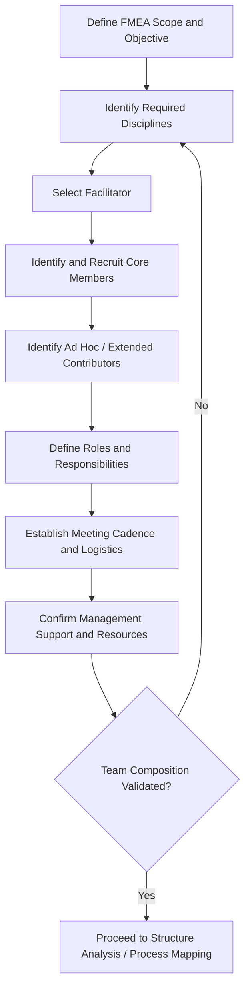

## Assembling a Cross Functional Team

### Overview

Assembling a cross-functional team is the foundational preparatory step in the FMEA process, directly preceding structural and functional analysis. The quality, completeness, and validity of an FMEA are fundamentally constrained by the composition and expertise of the team conducting it — a team lacking critical perspectives will systematically miss failure modes, misjudge severity, or overlook effective controls. The AIAG-VDA FMEA Handbook explicitly identifies team formation as one of the core "Planning and Preparation" activities (the first of the seven FMEA steps).

### Purpose and Scope

**Key Points**

- Ensures the FMEA draws on the full breadth of knowledge needed to identify failure modes, causes, and effects across design, manufacturing, service, and field-use domains
- Prevents "single-perspective bias," where an FMEA conducted by one discipline (e.g., design engineering alone) systematically underestimates manufacturing, assembly, or field-use failure modes
- Establishes clear roles, responsibilities, and facilitation structure before analysis begins, improving both efficiency and analytical rigor
- Applies across all FMEA types (Design, Process, System, Software, Service, HFMEA, FMEA-MSR) — team composition differs by type but the principle of cross-functional representation is constant

### Core Team Roles

**Facilitator/Moderator**

- Trained in FMEA methodology and group facilitation techniques
- Guides the team through the structured process, manages scope and timeboxing, prevents groupthink or dominant-voice bias, and ensures consistent rating criteria application
- Ideally independent of direct ownership of the design/process being analyzed to maintain objectivity

**Team Leader/Owner (Responsible Engineer)**

- Owns the design or process under analysis (e.g., design engineer for DFMEA, process engineer for PFMEA)
- Accountable for ensuring action items are tracked to closure after the FMEA session

**Recorder/Scribe**

- Documents the FMEA worksheet in real time during sessions (may be combined with facilitator role in smaller teams)

**Core Subject Matter Experts (varies by FMEA type)**

- Design engineering
- Manufacturing/process engineering
- Quality engineering
- Reliability engineering
- Service/field support
- Purchasing/supplier quality (when supplier-controlled processes are involved)
- Safety engineering (for safety-critical systems)
- Software engineering (for systems with embedded software content)

### Recommended Team Size and Composition

| Factor | Guidance |
| --- | --- |
| Optimal team size | Typically 4–8 core members; larger teams risk reduced engagement and slower consensus-building |
| Minimum disciplines represented | Design, manufacturing/process, and quality at minimum for DFMEA/PFMEA |
| Cross-functional breadth | Include downstream stakeholders (service, field, customer-facing) who observe real-world failure effects |
| Continuity | Core team should remain consistent across sessions for a given FMEA to preserve context; subject matter experts can be brought in for specific sub-topics |

### Process Steps

**Step 1: Define the Scope and Objective of the FMEA**

Before selecting members, clearly define what system, subsystem, component, or process the FMEA will cover — team composition should be scoped to match analysis boundaries.

**Step 2: Identify Required Disciplines**

Map the scope to the functional disciplines whose expertise is needed to identify failure modes, causes, and effects across the full lifecycle (design through field use).

**Step 3: Select a Facilitator**

Choose a facilitator trained in FMEA methodology, ideally certified or experienced, who can remain neutral regarding design/process ownership decisions.

**Step 4: Identify and Recruit Core Members**

Select representatives from each required discipline — prioritizing individuals with direct working knowledge of the design or process (not only managerial oversight).

**Step 5: Identify Extended/Ad Hoc Contributors**

Identify specialists (e.g., a specific supplier's engineer, a regulatory/compliance expert, a field service technician) who may be brought in for specific sessions rather than the full duration.

**Step 6: Define Roles and Responsibilities**

Clarify who facilitates, who records, who owns follow-up actions, and how decisions/disagreements will be resolved.

**Step 7: Establish Team Logistics**

Set meeting cadence, duration, format (in-person/virtual), and required pre-work (e.g., reviewing process flow diagrams or block diagrams in advance).

**Step 8: Confirm Management Support and Resource Commitment**

Ensure team members have leadership authorization to dedicate the necessary time, and that action item owners will have resources to implement recommended actions.

### Common Team Composition by FMEA Type

**Design FMEA (DFMEA) Team**

- Design/development engineer (owner), reliability engineer, manufacturing engineer, quality engineer, test engineer, service engineer, applicable safety engineer

**Process FMEA (PFMEA) Team**

- Process/manufacturing engineer (owner), quality engineer, production operator/supervisor, tooling engineer, maintenance representative, design engineer (for design intent clarification), materials/supplier quality

**System FMEA Team**

- Systems engineer (owner), design engineers for constituent subsystems, integration engineer, safety engineer, reliability engineer

**Service FMEA Team**

- Process owner for the service (owner), frontline service staff, quality/risk management, IT/systems representative (for technology-dependent steps), customer experience representative

**Healthcare FMEA (HFMEA) Team**

- Clinical process owner (physician/nurse leader), frontline clinical staff performing the process, pharmacy (if medication-related), risk management/patient safety officer, facilitator trained in HFMEA

### Common Pitfalls in Team Assembly

**Key Points**

- **Homogeneous expertise:** Team composed entirely of one discipline (e.g., all design engineers) misses manufacturing/field failure modes
- **Excessive team size:** Teams larger than ~10 often suffer reduced individual engagement and slower consensus, diluting analytical rigor
- **Missing frontline perspective:** Excluding operators, technicians, or service staff who directly observe real-world failure modes and workarounds
- **Facilitator conflict of interest:** Facilitator who also owns the design/process may unconsciously steer ratings to minimize perceived risk
- **Inconsistent attendance:** Rotating membership across sessions disrupts continuity and forces repeated context-setting
- **Lack of management sponsorship:** Team lacks authority or resources to implement recommended actions, undermining the FMEA's practical value

### Example

**Scenario:** Assembling a PFMEA team for a new automotive seatbelt buckle assembly process.

| Role | Representative | Contribution |
| --- | --- | --- |
| Facilitator | Quality systems specialist (FMEA-certified) | Guides process, ensures rating consistency, manages scope |
| Team Leader/Owner | Manufacturing process engineer | Owns process flow, accountable for action closure |
| Core Member | Design engineer | Clarifies design intent and critical characteristics |
| Core Member | Production line supervisor | Provides frontline knowledge of actual operator behavior and workstation constraints |
| Core Member | Quality engineer | Provides historical defect data, measurement system capability |
| Core Member | Tooling/equipment engineer | Identifies equipment-related failure modes (fixture wear, calibration drift) |
| Ad Hoc Contributor | Supplier quality engineer | Consulted for incoming component variation risk (webbing material, buckle housing) |
| Recorder | Assigned by facilitator or process engineer | Documents worksheet entries in real time |

**Recommended Practices Applied:**

- Pre-session: process flow diagram circulated to all members for review before the first meeting
- Session cadence: 2-hour sessions, twice weekly, to maintain momentum without fatigue
- Management sponsorship confirmed via plant quality manager sign-off on team charter

### Team Assembly Flow Diagram

### Cross-Functional Team Composition Map (svg_diagram)

<svg xmlns="http://www.w3.org/2000/svg" viewBox="0 0 700 420">
<text x="10" y="20" font-size="14" font-weight="bold" fill="#1a1a1a">Cross-Functional FMEA Team Structure (svg_diagram)</text>
<circle cx="350" cy="210" r="55" fill="#e0f0ff" stroke="#0066cc" stroke-width="2" />
<text x="350" y="205" font-size="12" text-anchor="middle">FMEA</text>
<text x="350" y="220" font-size="12" text-anchor="middle">Team</text>
<circle cx="350" cy="70" r="45" fill="#e0ffe0" stroke="#009933" stroke-width="1.5" />
<text x="350" y="65" font-size="10" text-anchor="middle">Facilitator</text>
<text x="350" y="78" font-size="10" text-anchor="middle">(neutral)</text>
<circle cx="190" cy="130" r="45" fill="#fff3cd" stroke="#cc9900" stroke-width="1.5" />
<text x="190" y="125" font-size="10" text-anchor="middle">Design</text>
<text x="190" y="138" font-size="10" text-anchor="middle">Engineering</text>
<circle cx="120" cy="270" r="45" fill="#fff3cd" stroke="#cc9900" stroke-width="1.5" />
<text x="120" y="265" font-size="10" text-anchor="middle">Manufacturing/</text>
<text x="120" y="278" font-size="10" text-anchor="middle">Process</text>
<circle cx="220" cy="380" r="45" fill="#fff3cd" stroke="#cc9900" stroke-width="1.5" />
<text x="220" y="375" font-size="10" text-anchor="middle">Quality</text>
<text x="220" y="388" font-size="10" text-anchor="middle">Engineering</text>
<circle cx="480" cy="380" r="45" fill="#fff3cd" stroke="#cc9900" stroke-width="1.5" />
<text x="480" y="375" font-size="10" text-anchor="middle">Service /</text>
<text x="480" y="388" font-size="10" text-anchor="middle">Field Support</text>
<circle cx="580" cy="270" r="45" fill="#fff3cd" stroke="#cc9900" stroke-width="1.5" />
<text x="580" y="265" font-size="10" text-anchor="middle">Reliability</text>
<text x="580" y="278" font-size="10" text-anchor="middle">Engineering</text>
<circle cx="510" cy="130" r="45" fill="#fff3cd" stroke="#cc9900" stroke-width="1.5" />
<text x="510" y="125" font-size="10" text-anchor="middle">Safety /</text>
<text x="510" y="138" font-size="10" text-anchor="middle">Software Eng.</text>
<line x1="350" y1="115" x2="350" y2="155" stroke="#333" />
<line x1="300" y1="180" x2="225" y2="150" stroke="#333" />
<line x1="270" y1="245" x2="155" y2="260" stroke="#333" />
<line x1="300" y1="260" x2="245" y2="345" stroke="#333" />
<line x1="400" y1="260" x2="450" y2="345" stroke="#333" />
<line x1="400" y1="250" x2="545" y2="265" stroke="#333" />
<line x1="400" y1="180" x2="475" y2="150" stroke="#333" />
</svg>

### Conclusion

Assembling a cross-functional team is not an administrative formality but the structural foundation that determines whether an FMEA will surface the full range of realistic failure modes and produce actionable, well-prioritized risk mitigation. Effective team assembly requires deliberate mapping of required disciplines to the FMEA's scope, selection of an objective facilitator, inclusion of frontline personnel who observe real-world process or product behavior, and confirmed management sponsorship to ensure recommended actions are resourced and implemented.

**Next Steps**

- Defining FMEA scope and boundaries (Planning and Preparation)
- Facilitator training and certification in FMEA methodology
- Process flow diagramming and structure analysis
- Function analysis and requirements gathering
- Team charter development and meeting cadence planning
- Change management and lessons-learned integration into future FMEAs