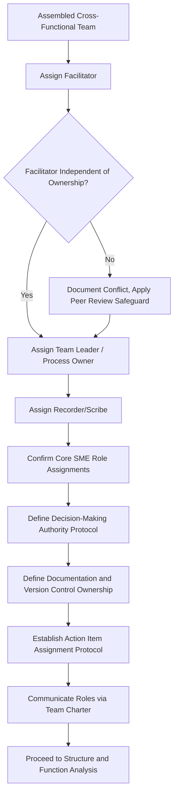

## Defining Facilitator and Team Member Roles

### Overview

Defining facilitator and team member roles is a discrete preparatory activity that follows team assembly and precedes the start of technical analysis. While team assembly determines *who* participates, role definition determines *what each person is accountable for* during the FMEA process — session facilitation, technical input, documentation, decision-making authority, and post-session action ownership. Ambiguous or undefined roles are a leading cause of stalled or low-quality FMEAs, as teams default to unstructured discussion without clear accountability for rating consistency, documentation accuracy, or follow-through.

### Purpose and Scope

**Key Points**

- Establishes clear accountability structures before analysis begins, preventing role confusion during time-constrained sessions
- Separates process facilitation (how the team works) from technical content ownership (what the team decides)
- Ensures documentation, decision authority, and action tracking are each explicitly assigned rather than assumed
- Applies uniformly across FMEA types (DFMEA, PFMEA, System FMEA, Software FMEA, Service FMEA, HFMEA, FMEA-MSR); role titles may vary slightly but the underlying functions are consistent

### Core Roles and Responsibilities

**Facilitator**

*Primary Responsibilities:*

- Guides the team through the structured FMEA methodology (function analysis → failure analysis → risk analysis → optimization)
- Maintains session focus and timeboxing to prevent scope creep or excessive tangents
- Ensures consistent, calibrated application of Severity, Occurrence, and Detection (or FO/M for FMEA-MSR, or Severity/Probability for HFMEA) rating scales across the team
- Manages group dynamics: prevents dominant voices from suppressing input, draws out quieter subject matter experts, de-escalates disagreements
- Remains neutral on technical content decisions — does not impose personal judgment on ratings or failure mode identification
- Trained in FMEA methodology (AIAG-VDA, HFMEA, or organization-specific standard) and general facilitation technique

*Key Distinction:* The facilitator should ideally be **independent of direct ownership** of the design or process under review. A facilitator who also owns the design may unconsciously (or consciously) steer the team toward lower severity/occurrence ratings to minimize perceived personal risk exposure — a well-documented bias in industrial FMEA practice.

**Team Leader / Process or Design Owner**

*Primary Responsibilities:*

- Holds technical ownership and ultimate accountability for the design or process being analyzed
- Provides authoritative input on design intent, functional requirements, and process parameters
- Makes final calls on ambiguous technical questions when team consensus is not reached
- Accountable for ensuring recommended actions are assigned, resourced, and tracked to closure after the FMEA session concludes
- Signs off on the completed FMEA document

**Recorder / Scribe**

*Primary Responsibilities:*

- Documents the FMEA worksheet in real time during the session (functions, failure modes, effects, causes, controls, ratings, actions)
- Ensures terminology is captured precisely and consistently (e.g., distinguishing failure mode from failure effect from failure cause)
- May use FMEA software or a shared worksheet template to enable real-time visibility for the team
- In smaller teams, this role may be combined with the facilitator role, though this increases facilitator cognitive load and is generally discouraged for complex FMEAs

**Core Subject Matter Experts (Technical Contributors)**

*Primary Responsibilities:*

- Provide domain-specific technical input relevant to their discipline (design, manufacturing, quality, reliability, service, software, safety)
- Identify failure modes, causes, and effects within their area of expertise
- Provide informed ratings for Occurrence (based on historical data, process capability) and Detection (based on knowledge of existing controls)
- Challenge assumptions and surface failure modes other disciplines might not anticipate

**Action Item Owner(s)**

*Primary Responsibilities:*

- Individual(s) assigned specific recommended actions arising from the FMEA (may or may not be a core team member)
- Accountable for implementing the action within an agreed timeline and reporting status back to the team leader or facilitator
- Distinct from the team leader's overall accountability — action owners handle specific, delegated tasks

**Executive Sponsor / Management Champion (often not a session participant)**

*Primary Responsibilities:*

- Provides organizational authority and resourcing for the FMEA effort
- Removes cross-functional barriers (e.g., authorizing another department's staff time)
- Reviews high-severity findings and ensures follow-through at an organizational level
- Typically briefed on outcomes rather than present in working sessions

### Role Definition Process Steps

**Step 1: Map Roles to the Assembled Team**

Using the team roster established during team assembly, assign each core role (facilitator, team leader, recorder, SME contributors) to a specific named individual.

**Step 2: Clarify Facilitator Independence**

Confirm the facilitator does not hold direct ownership accountability for the design/process being analyzed; if unavoidable, document the conflict and apply additional peer-review safeguards on ratings.

**Step 3: Document Decision-Making Authority**

Define how disagreements on ratings or failure mode inclusion will be resolved (e.g., team leader has final authority; facilitator escalates to executive sponsor for unresolved high-severity disputes).

**Step 4: Define Documentation Standards and Ownership**

Specify the worksheet format/tool, who maintains it between sessions, and version control practices.

**Step 5: Establish Action Item Assignment Protocol**

Define how action owners are assigned (may not be present in the room), what "acceptance" of an action item requires, and how status is tracked and reported.

**Step 6: Communicate Roles to the Full Team**

Distribute a written role/responsibility summary (often part of a team charter) before the first working session so expectations are explicit from the outset.

**Step 7: Review and Adjust as Needed**

For multi-session FMEAs, periodically confirm role assignments remain appropriate, particularly if team composition changes or an ad hoc specialist is brought in for a specific sub-topic.

### Common Role-Definition Pitfalls

**Key Points**

- **Facilitator-owner conflict of interest:** Combining facilitation and design/process ownership in one person, risking biased ratings
- **Undefined decision authority:** No clear resolution mechanism when the team cannot reach consensus on a rating or failure mode, leading to stalled sessions
- **Recorder overload:** Facilitator also acting as recorder in complex, fast-moving sessions, resulting in incomplete or inaccurate documentation
- **Orphaned action items:** Actions recommended during the session but never formally assigned to a named, accountable owner
- **Absent action owners:** Assigning action items to individuals not present in the session without a defined acceptance/handoff process
- **Role ambiguity across sessions:** Rotating facilitators or recorders between sessions without a handoff protocol, causing inconsistency in rating calibration

### Example

**Scenario:** Role definition for a PFMEA team analyzing a new plastic injection molding process.

| Role | Assigned To | Specific Accountability |
| --- | --- | --- |
| Facilitator | Corporate quality systems specialist (not plant-based, no process ownership) | Runs sessions, enforces AIAG-VDA rating calibration, manages 90-minute timebox per session |
| Team Leader/Process Owner | Plant process engineer | Final authority on process parameter questions; signs off on completed FMEA |
| Recorder | Quality technician (dedicated, non-facilitator) | Maintains live worksheet in shared FMEA software; distributes updated version after each session |
| SME – Design | Product design engineer | Clarifies critical-to-function dimensions and design tolerances |
| SME – Manufacturing | Molding technician (frontline operator) | Identifies real-world machine setup variation and operator-dependent failure modes |
| SME – Quality | Quality engineer | Provides historical defect/scrap data to inform Occurrence ratings |
| Action Owner (specific item) | Tooling engineer (not a core session member) | Accepts assignment for mold cooling channel redesign; reports status biweekly to team leader |
| Executive Sponsor | Plant quality manager | Briefed on Hazard Score results ≥ action threshold; authorizes capital request for tooling modification |

**Decision Authority Protocol Applied:** Disagreements on Occurrence ratings between design and manufacturing SMEs are resolved by requesting quality engineer's historical defect data as tiebreaker evidence; unresolved disputes escalate to the team leader for final determination within the session.

### Role Definition Flow Diagram

### Facilitator vs. Team Leader Accountability Split (svg_diagram)

<svg xmlns="http://www.w3.org/2000/svg" viewBox="0 0 760 300">
<text x="10" y="20" font-size="14" font-weight="bold" fill="#1a1a1a">Facilitator vs. Team Leader Accountability (svg_diagram)</text>
<rect x="30" y="50" width="320" height="220" rx="8" fill="#e0f0ff" stroke="#0066cc" stroke-width="1.5" />
<text x="190" y="75" font-size="13" text-anchor="middle" font-weight="bold">Facilitator</text>
<text x="190" y="75" font-size="13" text-anchor="middle" font-weight="bold" dy="0" />
<text x="50" y="100" font-size="10">• Guides process structure</text>
<text x="50" y="120" font-size="10">• Manages timeboxing</text>
<text x="50" y="140" font-size="10">• Calibrates rating consistency</text>
<text x="50" y="160" font-size="10">• Manages group dynamics</text>
<text x="50" y="180" font-size="10">• Neutral on technical content</text>
<text x="50" y="200" font-size="10">• Independent of ownership</text>
<text x="50" y="230" font-size="10" font-style="italic">Owns: HOW the team works</text>
<rect x="410" y="50" width="320" height="220" rx="8" fill="#e0ffe0" stroke="#009933" stroke-width="1.5" />
<text x="570" y="75" font-size="13" text-anchor="middle" font-weight="bold">Team Leader / Owner</text>
<text x="430" y="100" font-size="10">• Owns design/process intent</text>
<text x="430" y="120" font-size="10">• Authoritative technical input</text>
<text x="430" y="140" font-size="10">• Final call on unresolved disputes</text>
<text x="430" y="160" font-size="10">• Accountable for action closure</text>
<text x="430" y="180" font-size="10">• Signs off on completed FMEA</text>
<text x="430" y="230" font-size="10" font-style="italic">Owns: WHAT the team decides</text>
<line x1="350" y1="160" x2="410" y2="160" stroke="#333" stroke-width="1.5" marker-end="url(#arrow5)" />
<line x1="410" y1="180" x2="350" y2="180" stroke="#333" stroke-width="1.5" marker-end="url(#arrow5)" />
</svg>

### Conclusion

Defining facilitator and team member roles converts an assembled cross-functional group into a functioning analytical team by explicitly separating process facilitation from technical ownership, assigning documentation responsibility, and establishing clear protocols for decision-making and action tracking. The most consequential distinction — facilitator independence from design/process ownership — directly protects the objectivity of severity, occurrence, and detection ratings, while explicit action-owner assignment ensures the FMEA's findings translate into implemented risk mitigation rather than an unexecuted document.

**Next Steps**

- Team charter development and session logistics planning
- FMEA facilitator training and certification pathways
- Rating scale calibration techniques (Severity, Occurrence, Detection)
- Structure analysis and process flow diagramming
- Action item tracking systems and closure verification
- Managing team disagreement and consensus-building techniques