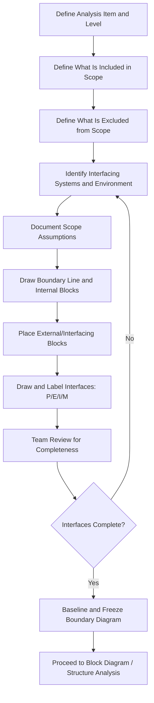

## Scoping the Analysis and Boundary Diagrams

### Overview

Scoping the analysis and constructing boundary diagrams constitute the technical definition phase of FMEA preparation and planning, following team assembly and role definition. Scoping establishes precisely what system, subsystem, component, interface, or process is included in — and explicitly excluded from — the analysis. The boundary diagram is the primary visual tool used to formalize this scope, depicting the item under analysis, its constituent components, and its interfaces with adjacent systems, the environment, and the end user. The AIAG-VDA FMEA Handbook identifies boundary (and interface) diagrams as a core deliverable of Step 2 (Structure Analysis).

### Purpose and Scope

**Key Points**

- Prevents scope creep and scope gaps by explicitly defining analysis boundaries before failure mode identification begins
- Provides a shared visual reference so the cross-functional team has common understanding of what is "inside" vs. "outside" the system under analysis
- Surfaces interfaces (physical, energy, information, material) between the item and adjacent systems — a primary source of failure modes often missed when analysis focuses only on internal components
- Establishes the foundation for the subsequent Structure Analysis and Function Analysis steps in the AIAG-VDA 7-step methodology
- Applies across FMEA types, though the boundary's nature differs: physical/functional boundaries for DFMEA, process-step boundaries for PFMEA, process-flow boundaries for Service FMEA/HFMEA

### Scoping the Analysis

**Step 1: Define the Analysis Item**

Clearly name the system, subsystem, component, or process that is the subject of the FMEA (e.g., "power window regulator assembly," "patient medication reconciliation process").

**Step 2: Establish the Level of Analysis**

Determine whether the FMEA is being conducted at system, subsystem, or component level — this determines the granularity of failure modes identified and must align with the team's technical depth and available time.

**Step 3: Define What Is Included**

Explicitly list all components, sub-assemblies, process steps, or software modules that fall within scope.

**Step 4: Define What Is Excluded**

Explicitly list adjacent systems, components, or process steps that are *not* part of this analysis but interact with it — these become boundary interfaces rather than internal analysis items. Common exclusions: systems covered by a separate, already-existing FMEA; components sourced complete from a supplier with their own DFMEA; process steps owned by a different department with a separate PFMEA.

**Step 5: Identify Interfacing Systems and Environments**

Identify everything the in-scope item physically, energetically, or informationally connects to — adjacent components, the operator/user, the ambient environment, upstream/downstream process steps, and connected software/control systems.

**Step 6: Document Scope Assumptions and Constraints**

Record any assumptions about operating conditions, usage profile, duty cycle, or environmental conditions that bound the analysis (e.g., "analysis assumes standard climate operation; extreme environment variants covered separately").

**Step 7: Obtain Team Consensus on Scope**

Present the defined scope to the full cross-functional team for review and agreement before proceeding — scope disagreements are far cheaper to resolve here than after failure mode identification has begun.

### Boundary Diagram Construction

A boundary diagram (also called a system boundary diagram or block boundary diagram) is a simplified block diagram showing:

**Core Elements**

- **System/Item boundary:** A clearly drawn boundary line (often a dashed rectangle) separating "inside scope" from "outside scope"
- **Subsystems/Components:** Blocks representing major constituent elements within the boundary
- **Interfacing systems:** Blocks representing adjacent systems, components, or entities outside the boundary that interact with the in-scope item
- **Interfaces/connections:** Lines or arrows connecting blocks, labeled with the type of interaction (physical connection, energy transfer, information/signal flow, material flow)
- **Environment:** Represented as an interfacing element when environmental conditions (temperature, vibration, humidity, EMI) affect the system

**Interface Types Commonly Labeled**

- **P (Physical):** Mechanical connection, fastening, contact
- **E (Energy):** Power transfer, heat transfer, force transmission
- **I (Information):** Signal, data, communication
- **M (Material):** Fluid flow, gas flow, substance transfer

[Inference] This P-E-I-M interface classification is a commonly used convention for labeling boundary diagram connections in DFMEA practice, though organizations may adapt or simplify the labeling scheme to fit their specific product domain.

### Boundary Diagram vs. Block Diagram vs. Interface Matrix

| Tool | Purpose | Level of Detail |
| --- | --- | --- |
| Boundary Diagram | Defines the scope boundary and high-level interfaces with adjacent systems/environment | Coarse — system/subsystem level |
| Block Diagram | Shows internal structure and relationships between components within the boundary | Medium — subsystem/component level |
| Interface Matrix (N²/N-squared diagram) | Systematically documents every pairwise interface between components in a grid format | Fine — exhaustive pairwise interface capture |

[Inference] These three tools are often used in sequence during Structure Analysis: the boundary diagram establishes overall scope, the block diagram details internal composition, and the interface matrix ensures no pairwise interface is overlooked — though smaller-scope FMEAs may use only the boundary diagram if internal structure is simple enough to capture directly on the worksheet.

### Process Steps for Building the Boundary Diagram

**Step 1: Draw the Boundary Line**

Represent the scoped item with a rectangle or defined region; label it clearly with the system/process name and scope level.

**Step 2: Place Internal Blocks**

Add blocks for each major subsystem, component, or process step included within scope, positioned inside the boundary line.

**Step 3: Place External/Interfacing Blocks**

Add blocks outside the boundary for every adjacent system, component, operator/user, or environmental factor the in-scope item interacts with.

**Step 4: Draw and Label Interfaces**

Connect internal and external blocks with lines representing each interface, labeling the interface type (physical, energy, information, material) and, where useful, direction of flow (arrows).

**Step 5: Validate Completeness with the Team**

Review the diagram with the full cross-functional team to confirm no interface has been omitted — a common source of missed failure modes is an interface present in reality but absent from the diagram.

**Step 6: Freeze and Baseline the Diagram**

Once validated, treat the boundary diagram as a controlled reference document for the remainder of the FMEA; revise formally (with team notification) if scope changes during analysis.

### Common Scoping Pitfalls

**Key Points**

- **Scope too broad:** Attempting to analyze an entire vehicle or entire hospital process in one FMEA session, making the analysis unmanageable and superficial
- **Scope too narrow:** Excluding critical interfaces (e.g., excluding the wiring harness connector from an electrical component's boundary) that are themselves significant failure sources
- **Undocumented assumptions:** Operating environment or usage profile assumptions left implicit, causing later disagreement about whether a failure mode is "in scope"
- **Boundary diagram skipped for "simple" systems:** Omitting the boundary diagram for seemingly simple items, only to discover mid-analysis that an overlooked interface was actually a major failure source
- **Static boundary diagram:** Diagram created once and never updated as design changes occur during the product development cycle, becoming stale and misleading

### Example

**Scenario:** Boundary diagram scoping for a DFMEA on an automotive power window regulator assembly.

**In Scope:** Window regulator mechanism, drive motor, mounting bracket, cable/guide system, switch interface connector.

**Explicitly Excluded (separate FMEAs exist):** Window glass itself (separate DFMEA), door module electronic control unit software logic (separate Software FMEA), body control module (separate System FMEA).

| Interface | Type | Connected To | Notes |
| --- | --- | --- | --- |
| Electrical power/signal connector | Information/Energy (I/E) | Door wiring harness | Motor control signal and power supply |
| Mounting fasteners | Physical (P) | Door inner panel | Structural mounting of regulator assembly |
| Cable-to-glass carrier attachment | Physical (P) | Window glass (separate DFMEA) | Mechanical linkage transmitting motion to glass |
| Ambient environment | Energy/Material (E/M) | Door cavity environment | Temperature range, humidity, road spray exposure |
| User input | Information (I) | Window switch (operator-actuated) | Direct/indirect actuation commands |

**Team Validation Note:** During boundary review, the manufacturing representative identified that the cable guide's interface with the door panel's drainage path (water management) had been omitted from the initial diagram — added as a Material (M) interface after team review, subsequently surfacing a corrosion-related failure mode during hazard analysis that would otherwise have been missed.

### Boundary Diagram Construction Flow

### Boundary Diagram Example (svg_diagram)

<svg xmlns="http://www.w3.org/2000/svg" viewBox="0 0 780 380">
<text x="10" y="20" font-size="14" font-weight="bold" fill="#1a1a1a">System Boundary Diagram (svg_diagram)</text>
<rect x="180" y="60" width="380" height="240" rx="4" fill="none" stroke="#333" stroke-width="2" stroke-dasharray="6,4" />
<text x="370" y="80" font-size="11" text-anchor="middle" fill="#333" font-weight="bold">Scope Boundary: Window Regulator Assembly</text>
<rect x="220" y="110" width="130" height="50" rx="5" fill="#e0f0ff" stroke="#0066cc" />
<text x="285" y="140" font-size="10" text-anchor="middle">Drive Motor</text>
<rect x="400" y="110" width="130" height="50" rx="5" fill="#e0f0ff" stroke="#0066cc" />
<text x="465" y="140" font-size="10" text-anchor="middle">Cable/Guide System</text>
<rect x="220" y="200" width="130" height="50" rx="5" fill="#e0f0ff" stroke="#0066cc" />
<text x="285" y="230" font-size="10" text-anchor="middle">Mounting Bracket</text>
<rect x="400" y="200" width="130" height="50" rx="5" fill="#e0f0ff" stroke="#0066cc" />
<text x="465" y="230" font-size="10" text-anchor="middle">Switch Connector</text>
<rect x="10" y="110" width="130" height="50" rx="5" fill="#f8d7da" stroke="#cc0000" />
<text x="75" y="130" font-size="10" text-anchor="middle">Door Wiring</text>
<text x="75" y="145" font-size="10" text-anchor="middle">Harness</text>
<rect x="620" y="110" width="140" height="50" rx="5" fill="#f8d7da" stroke="#cc0000" />
<text x="690" y="130" font-size="10" text-anchor="middle">Window Glass</text>
<text x="690" y="145" font-size="10" text-anchor="middle">(separate DFMEA)</text>
<rect x="620" y="200" width="140" height="50" rx="5" fill="#f8d7da" stroke="#cc0000" />
<text x="690" y="220" font-size="10" text-anchor="middle">Door Inner Panel</text>
<text x="690" y="235" font-size="10" text-anchor="middle">(structure)</text>
<rect x="300" y="320" width="180" height="45" rx="5" fill="#f8d7da" stroke="#cc0000" />
<text x="390" y="347" font-size="10" text-anchor="middle">Ambient Environment (E/M)</text>
<line x1="140" y1="135" x2="220" y2="135" stroke="#333" marker-end="url(#arrow6)" />
<text x="180" y="128" font-size="8">I/E</text>
<line x1="530" y1="135" x2="620" y2="135" stroke="#333" marker-end="url(#arrow6)" />
<text x="575" y="128" font-size="8">P</text>
<line x1="350" y1="225" x2="620" y2="225" stroke="#333" marker-end="url(#arrow6)" />
<text x="480" y="218" font-size="8">P</text>
<line x1="390" y1="320" x2="390" y2="300" stroke="#333" marker-end="url(#arrow6)" />
</svg>

### Conclusion

Scoping the analysis and constructing the boundary diagram translate an assembled, role-defined team into a technically aligned unit with a shared, explicit understanding of what the FMEA will and will not cover. The boundary diagram's primary analytical value lies in systematically surfacing interfaces with adjacent systems and the environment — a frequent source of overlooked failure modes when analysis focuses narrowly on internal components. A well-validated, baselined boundary diagram directly feeds the subsequent Structure Analysis and Function Analysis steps, anchoring the entire FMEA to a precisely defined and team-agreed scope.

**Next Steps**

- Structure Analysis and block diagram development
- Interface matrix (N-squared diagram) techniques
- Function Analysis and function tree/P-diagram development
- Parameter diagrams (P-Diagrams) for noise factor identification
- Failure Analysis: linking structure to failure modes, effects, and causes
- Managing scope changes during an active FMEA