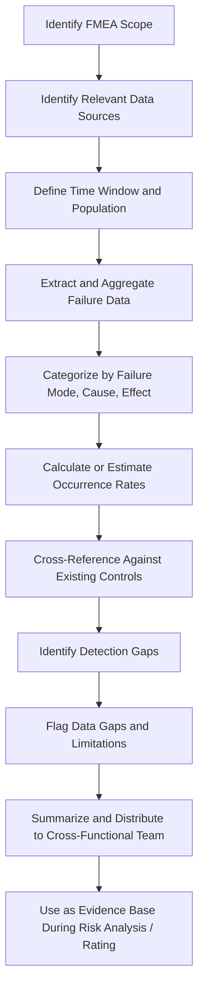

## Gathering Historical and Field Failure Data

### Overview

Gathering historical and field failure data is a preparatory activity conducted alongside or immediately following scoping and boundary diagram development, providing the evidentiary foundation for accurate Occurrence and Detection ratings during the risk analysis phase of FMEA. Rather than relying solely on team judgment and intuition, this step systematically collects quantitative and qualitative failure data from prior generations of the product/process, similar systems, warranty claims, service records, and field returns to ground the FMEA in real-world failure experience.

### Purpose and Scope

**Key Points**

- Provides objective, evidence-based input for Occurrence ratings rather than relying purely on subjective team estimation
- Surfaces failure modes the team might not otherwise anticipate, particularly latent or low-frequency failures observed only in field conditions
- Informs Detection ratings by revealing which existing controls (inspection, testing, monitoring) actually caught past failures versus which failures escaped to the field
- Establishes a data-driven baseline against which the effectiveness of new design or process controls can be measured
- Critical for carryover designs/processes, where historical data from the prior generation is often the single most valuable input to the new FMEA

### Categories of Historical and Field Data

**Internal Quality and Test Data**

- Design verification/validation (DV/DVP) test failure results
- Process capability studies (Cpk/Ppk) and control chart data
- Internal audit findings and non-conformance reports
- Scrap, rework, and rejection rate data from production
- First-pass yield and defect-per-unit (DPU) metrics

**Field and Warranty Data**

- Warranty claims and repair records
- Field failure reports and return-merchandise authorization (RMA) data
- Customer complaint logs and call center/service ticket records
- Parts-per-million (PPM) field failure rates
- Time-to-failure or mileage/cycle-to-failure distributions

**Service and Maintenance Data**

- Service technician reports and diagnostic trouble code (DTC) frequency logs
- Preventive maintenance findings
- Repair shop/dealer technical assistance requests

**Incident and Safety Data**

- Sentinel event, near-miss, and safety incident reports (particularly relevant for HFMEA)
- Regulatory recall data and government safety databases (e.g., NHTSA, MAUDE for medical devices)
- Root Cause Analysis (RCA) findings from prior investigations

**Benchmark and External Data**

- Competitor failure data or industry failure databases where available
- Supplier-reported quality data (PPM, defect data) for purchased components
- Published reliability data for common component types (e.g., MIL-HDBK-217, industry reliability handbooks)

**Prior FMEA Documentation**

- Previous FMEAs on the same or similar design/process (carryover analysis)
- Lessons-learned databases and engineering change history
- "Special characteristics" or "critical characteristics" logs from prior programs

### Process Steps

**Step 1: Identify Relevant Data Sources**

Based on the FMEA scope, determine which internal systems (quality management system, warranty database, service ticketing system) and external sources (regulatory databases, supplier quality reports) are relevant to the item under analysis.

**Step 2: Determine the Applicable Time Window and Population**

Define the relevant data collection period and population — e.g., failure data from the prior three model years, or the most recent 12 months of production for a mature process — balancing data volume against relevance (older data may reflect since-corrected issues).

**Step 3: Extract and Aggregate Failure Data**

Pull failure records from identified sources, aggregating by failure mode, component, or process step where possible to identify patterns and frequency.

**Step 4: Categorize Failures by Mode, Cause, and Effect**

Organize raw failure data into a structure aligned with FMEA terminology — distinguishing the observed failure mode from its root cause and downstream effect, since raw complaint/warranty data often conflates these.

**Step 5: Calculate or Estimate Occurrence Rates**

Where sufficient data exists, calculate failure rates (e.g., PPM, failures per 1,000 units, incidents per patient-day) to directly inform Occurrence ratings; where data is sparse, use qualitative trend information to support team estimation.

**Step 6: Identify Detection Gaps**

Cross-reference failures that reached the field/customer against existing detection controls to identify which controls failed to catch the issue — directly informing realistic Detection ratings rather than assumed control effectiveness.

**Step 7: Distribute Findings to the Team Prior to Analysis Sessions**

Provide a summarized data package to the cross-functional team before failure mode identification begins, so historical evidence informs (without unduly constraining) brainstorming.

**Step 8: Flag Data Gaps and Limitations**

Explicitly document where historical data is unavailable, unreliable, or not applicable (e.g., genuinely novel design features with no prior generation), so the team relies appropriately on engineering judgment for those specific elements.

### Using Historical Data to Inform Ratings

**Occurrence Rating**

Historical field/warranty failure rates provide the most direct evidence for Occurrence ratings. Organizations following AIAG-VDA guidance typically map observed failure rates (e.g., in PPM or failures per thousand vehicles in operation) to standardized Occurrence rating tables (1–10 scale), rather than each team member estimating occurrence independently from memory or intuition.

**Detection Rating**

Field escape data — failures that were *not* caught by existing verification/validation or in-process controls before reaching the customer — is direct evidence that a control's Detection effectiveness was lower than assumed. Conversely, failure modes caught reliably in-process or during test support higher (better) Detection ratings for those specific controls.

**Severity Rating**

[Inference] While Severity is primarily an engineering/safety judgment based on the *potential* consequence rather than historical frequency, field incident and safety data (injury reports, recall data, sentinel events) can validate or recalibrate the team's Severity assumptions where real-world consequences differed from initial engineering predictions.

### Common Pitfalls

**Key Points**

- **Over-reliance on limited or stale data:** Using data from a design/process that has since undergone significant changes, producing misleading Occurrence estimates
- **Conflating failure mode, cause, and effect in raw data:** Warranty/complaint text often describes symptoms (effects) rather than the underlying mode or cause, requiring careful re-categorization
- **Survivorship bias in field data:** Only capturing failures that generated a formal complaint or claim, undercounting failures customers worked around, self-repaired, or didn't report
- **Ignoring near-miss and non-failure data:** Focusing only on confirmed failures while ignoring near-miss reports that reveal emerging risk patterns before full failures occur
- **Data silos across departments:** Warranty, service, quality, and safety data residing in disconnected systems, preventing a unified view of failure patterns
- **Treating absence of data as absence of risk:** Assuming no historical failures means no risk, rather than recognizing data may simply be unavailable, new, or under-reported

### Example

**Scenario:** Gathering historical data to support a carryover DFMEA/PFMEA on an automotive fuel injector, prior generation in production for three years.

| Data Source | Finding | FMEA Application |
| --- | --- | --- |
| Warranty database (36-month field data) | 42 PPM field failure rate for injector spray pattern degradation | Directly informs Occurrence rating for "spray pattern deviation" failure mode using AIAG-VDA PPM-to-Occurrence mapping table |
| Supplier quality data | Injector nozzle supplier reported 0.3% internal reject rate for orifice diameter out-of-spec | Informs Occurrence rating for orifice manufacturing-related causes |
| Service technician DTC logs | 15% of injector-related service visits linked to a diagnostic trouble code that took an average of 3 visits to correctly diagnose | Reveals Detection gap — current diagnostic logic insufficiently discriminates root cause, informing lower (worse) Detection rating and driving a recommended action to improve DTC specificity |
| Prior DFMEA lessons-learned log | Previous FMEA identified fuel contamination sensitivity as a risk; design change (improved filtration) was implemented | Confirms whether the corrective action was effective by cross-checking whether contamination-related field failures decreased post-implementation |
| NHTSA field complaint database | No safety recalls associated with this component family | Supports (but does not solely determine) Severity assessment for catastrophic failure modes |

**Recommended Action Informed by Data:** Revise diagnostic trouble code logic to reduce average diagnosis attempts from 3 visits to 1, directly targeting the Detection gap identified in service records.

### Data Gathering Flow Diagram

### Data Source to Rating Application Map (svg_diagram)

<svg xmlns="http://www.w3.org/2000/svg" viewBox="0 0 780 300">
<text x="10" y="20" font-size="14" font-weight="bold" fill="#1a1a1a">Historical Data Sources to FMEA Ratings (svg_diagram)</text>
<rect x="10" y="50" width="200" height="45" rx="5" fill="#e0f0ff" stroke="#0066cc" />
<text x="110" y="77" font-size="10" text-anchor="middle">Warranty / Field Data</text>
<rect x="10" y="110" width="200" height="45" rx="5" fill="#e0f0ff" stroke="#0066cc" />
<text x="110" y="137" font-size="10" text-anchor="middle">Service / DTC Logs</text>
<rect x="10" y="170" width="200" height="45" rx="5" fill="#e0f0ff" stroke="#0066cc" />
<text x="110" y="197" font-size="10" text-anchor="middle">Internal Quality / Test Data</text>
<rect x="10" y="230" width="200" height="45" rx="5" fill="#e0f0ff" stroke="#0066cc" />
<text x="110" y="257" font-size="10" text-anchor="middle">Safety / Recall Databases</text>
<rect x="480" y="70" width="200" height="50" rx="5" fill="#fff3cd" stroke="#cc9900" stroke-width="1.5" />
<text x="580" y="100" font-size="11" text-anchor="middle">Occurrence Rating</text>
<rect x="480" y="150" width="200" height="50" rx="5" fill="#fff3cd" stroke="#cc9900" stroke-width="1.5" />
<text x="580" y="180" font-size="11" text-anchor="middle">Detection Rating</text>
<rect x="480" y="230" width="200" height="50" rx="5" fill="#fff3cd" stroke="#cc9900" stroke-width="1.5" />
<text x="580" y="260" font-size="11" text-anchor="middle">Severity Validation</text>
<line x1="210" y1="72" x2="480" y2="90" stroke="#333" marker-end="url(#arrow7)" />
<line x1="210" y1="132" x2="480" y2="170" stroke="#333" marker-end="url(#arrow7)" />
<line x1="210" y1="192" x2="480" y2="100" stroke="#333" marker-end="url(#arrow7)" />
<line x1="210" y1="252" x2="480" y2="255" stroke="#333" marker-end="url(#arrow7)" />
</svg>

### Conclusion

Gathering historical and field failure data grounds the FMEA in empirical evidence rather than relying solely on team intuition, most directly strengthening the objectivity of Occurrence and Detection ratings while also surfacing failure modes the team might not independently anticipate. Systematic collection across warranty, service, internal quality, and safety data sources — combined with honest documentation of data gaps for genuinely novel design elements — transforms the FMEA from a purely brainstorming-driven exercise into a data-informed risk assessment that reflects real-world failure experience.

**Next Steps**

- Occurrence and Detection rating scale calibration using field data
- Carryover FMEA methodology for design/process continuity
- Warranty and field data analysis techniques (Weibull analysis, PPM tracking)
- Root Cause Analysis (RCA) integration with FMEA lessons-learned
- Special/critical characteristic identification from historical trends
- Data governance across quality, warranty, and service systems