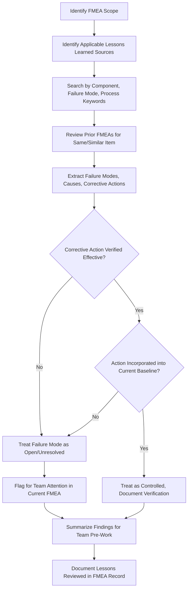

## Reviewing Lessons Learned Databases

### Overview

Reviewing lessons learned databases is a targeted preparatory activity that complements the broader gathering of historical and field failure data by specifically mining an organization's formalized institutional knowledge repository — a structured record of past design/process issues, root causes, corrective actions, and their effectiveness across prior programs. While field and warranty data reveal *what* failed, a lessons learned database typically captures the richer narrative of *why* it failed, *what was tried*, and *whether the fix actually worked*, making it one of the highest-value inputs for preventing the recurrence of known failure modes in new designs and processes.

### Purpose and Scope

**Key Points**

- Prevents "reinventing the wheel" by surfacing previously identified failure modes, causes, and effective countermeasures before the team begins brainstorming from scratch
- Captures tribal/institutional knowledge that would otherwise reside only in the memory of individual engineers who may not be present on the current team
- Provides evidence of corrective action *effectiveness* — distinguishing fixes that genuinely resolved an issue from those that were implemented but did not fully address the root cause
- Directly supports the AIAG-VDA principle of building each new FMEA on the foundation of prior FMEAs for similar designs/processes ("FMEA families" or "generic FMEAs")
- Particularly critical for preventing repeat failures across product generations, plants, or business units that may not otherwise share failure knowledge

### What a Lessons Learned Database Typically Contains

**Failure/Issue Record**

- Description of the failure mode, symptom, or non-conformance observed
- Product/process/program where it occurred, and date/timeframe

**Root Cause Analysis Findings**

- Documented root cause(s) identified through formal RCA (5-Whys, fishbone/Ishikawa, fault tree analysis)
- Distinction between the immediate/proximate cause and the systemic/organizational root cause

**Corrective and Preventive Actions (CAPA)**

- Specific design, process, or procedural changes implemented
- Containment actions taken before permanent corrective action was in place

**Effectiveness Verification**

- Data confirming whether the corrective action eliminated recurrence (or evidence that it did not, requiring further action)
- Timeframe over which effectiveness was monitored

**Applicability/Transferability Notes**

- Guidance on which other products, processes, or programs the lesson applies to
- Links to related design standards, engineering specifications, or updated design rules ("poka-yoke" or design-rule updates arising from the issue)

### Common Lessons Learned Database Formats

| Format | Description | Typical Use Case |
| --- | --- | --- |
| Enterprise CAPA/Quality Management System (QMS) | Structured database module within an enterprise QMS platform, often linked to non-conformance and audit records | Formal corrective action tracking across an organization |
| Engineering design standards/rules repository | Design rule updates or "lessons learned" annotations embedded directly in CAD standards or design guideline documents | Ensures lessons are encountered naturally during design work, not just during FMEA |
| Dedicated lessons learned knowledge base | Standalone searchable database, often organized by product family, failure mode category, or keyword | Cross-program knowledge sharing, particularly in large organizations |
| Prior FMEA documents themselves | Previous FMEAs for the same or similar design/process, treated as a primary lessons learned source | Carryover/generic FMEA development |
| Program post-mortem/retrospective reports | Narrative reports summarizing what went well/poorly on a completed program | Broader program-level lessons beyond individual failure modes |

### Process Steps

**Step 1: Identify Applicable Lessons Learned Sources**

Determine which databases or repositories are relevant to the FMEA scope — this may include multiple sources (enterprise QMS, design standards repository, prior FMEAs) depending on organizational structure.

**Step 2: Search Using Multiple Query Strategies**

Search by component/system name, failure mode keywords, material type, and process type, since lessons may be indexed inconsistently across different systems; a single search term is often insufficient to surface all relevant records.

**Step 3: Review Prior FMEAs for the Same or Similar Item**

Identify and review the most recent prior FMEA(s) covering the same or a closely related design/process as the primary starting point (particularly for carryover items), rather than beginning analysis with a blank worksheet.

**Step 4: Extract Applicable Failure Modes, Causes, and Actions**

For each relevant lessons learned record, extract the failure mode, root cause, and corrective action taken, and assess applicability to the current design/process scope.

**Step 5: Verify Corrective Action Effectiveness**

Confirm whether the documented corrective action was verified as effective, or whether it was implemented but recurrence was still observed — the latter requires the current FMEA to treat the failure mode as still open/unresolved rather than assuming it was fully addressed.

**Step 6: Confirm Design/Process Changes Are Reflected in Current Baseline**

Verify that corrective actions from lessons learned (e.g., a design rule change, a new process control) have actually been incorporated into the current design/process baseline being analyzed — a lesson learned that was never implemented provides no protection.

**Step 7: Integrate Findings into Team Pre-Work Materials**

Compile relevant lessons learned into a summary distributed to the team before failure mode brainstorming, ensuring known issues are explicitly considered rather than rediscovered independently (or missed entirely).

**Step 8: Document Lessons Reviewed (and Gaps) in the FMEA Record**

Note which lessons learned sources were reviewed and their key findings as part of the FMEA's own documentation, creating traceability and contributing to future lessons learned for subsequent programs.

### Relationship to Prior FMEAs and "Generic" FMEA Practice

[Inference] Many organizations following AIAG-VDA methodology maintain "family" or "generic" FMEAs — a baseline FMEA for a component or process family that is updated and reused across similar applications rather than rebuilt from scratch each time. Reviewing lessons learned in this context specifically means comparing the current application against the generic FMEA baseline to identify: (1) failure modes already documented in the generic FMEA that apply directly, (2) failure modes from the generic FMEA that do *not* apply due to a specific design/process difference (requiring documented justification for exclusion), and (3) genuinely new failure modes introduced by whatever is different about the current application.

### Common Pitfalls

**Key Points**

- **Siloed databases:** Lessons learned trapped in one plant, business unit, or program's local files, inaccessible to teams working on related products elsewhere in the organization
- **Search term mismatch:** Relevant lessons exist but are not found because search terminology differs from how the issue was originally indexed or described
- **Assuming closure without verification:** Treating a documented corrective action as having resolved an issue without confirming effectiveness data actually supports that conclusion
- **Stale or superseded lessons:** Referencing an outdated lesson learned that was itself later revised or corrected, without checking for more recent updates
- **Lessons learned but not institutionalized:** A corrective action exists in the database but was never actually incorporated into current design standards or process control plans, so the "lesson" provides no real protection unless independently verified
- **No time allocated for the review:** Treating this as optional pre-work that gets skipped under schedule pressure, causing the team to rediscover (or entirely miss) known issues

### Example

**Scenario:** Lessons learned review conducted prior to a DFMEA for a new automotive HVAC blower motor housing (plastic injection-molded component).

| Lessons Learned Source | Finding | Application to Current FMEA |
| --- | --- | --- |
| Prior generation DFMEA (same platform, 2 years prior) | Documented failure mode: housing crack propagation at mounting boss under thermal cycling; root cause: stress concentration from sharp internal corner radius | Directly applicable — verify current design incorporates the corrected fillet radius design rule; if not yet incorporated, flag as open risk requiring action |
| Enterprise QMS CAPA record | Corrective action from a different program (seat motor housing) addressed a similar boss-cracking issue via material change to a higher-impact-resistant resin grade; effectiveness verified over 18 months field data with zero recurrence | Applicable knowledge for material selection guidance, though must confirm applicability given different loading conditions for HVAC application |
| Design standards repository | Design rule update (post-dated the prior generation DFMEA) mandates minimum fillet radius of 1.5mm at all structural mounting bosses for injection-molded housings | Confirms the corrective action was institutionalized; team verifies current CAD model complies with the updated standard before treating this failure mode as adequately controlled |
| Program retrospective report | Noted recurring theme across three prior programs: mounting boss failures were the single most common warranty-driving failure mode in blower motor assemblies | Elevates priority/attention to mounting boss design review during Structure and Function Analysis, even absent a specific new data point |

**Team Action:** Because the design rule update postdates the prior DFMEA, the team explicitly verifies (via CAD review) that the current design incorporates the corrected fillet radius before downgrading the associated Occurrence rating — rather than assuming the lesson was automatically applied.

### Lessons Learned Review Flow Diagram

### Lessons Learned Integration Map (svg_diagram)

<svg xmlns="http://www.w3.org/2000/svg" viewBox="0 0 760 300">
<text x="10" y="20" font-size="14" font-weight="bold" fill="#1a1a1a">Lessons Learned Sources Feeding Current FMEA (svg_diagram)</text>
<rect x="20" y="50" width="180" height="50" rx="5" fill="#e0f0ff" stroke="#0066cc" />
<text x="110" y="80" font-size="10" text-anchor="middle">Prior FMEA (same item)</text>
<rect x="20" y="120" width="180" height="50" rx="5" fill="#e0f0ff" stroke="#0066cc" />
<text x="110" y="150" font-size="10" text-anchor="middle">Enterprise QMS / CAPA</text>
<rect x="20" y="190" width="180" height="50" rx="5" fill="#e0f0ff" stroke="#0066cc" />
<text x="110" y="220" font-size="10" text-anchor="middle">Design Standards Repository</text>
<rect x="20" y="260" width="180" height="30" rx="5" fill="#e0f0ff" stroke="#0066cc" />
<text x="110" y="280" font-size="10" text-anchor="middle">Program Retrospectives</text>
<rect x="480" y="130" width="240" height="70" rx="6" fill="#fff3cd" stroke="#cc9900" stroke-width="1.5" />
<text x="600" y="160" font-size="11" text-anchor="middle" font-weight="bold">Current FMEA</text>
<text x="600" y="178" font-size="9" text-anchor="middle">Failure Mode ID and</text>
<text x="600" y="192" font-size="9" text-anchor="middle">Risk Analysis</text>
<line x1="200" y1="75" x2="480" y2="150" stroke="#333" marker-end="url(#arrow8)" />
<line x1="200" y1="145" x2="480" y2="160" stroke="#333" marker-end="url(#arrow8)" />
<line x1="200" y1="215" x2="480" y2="175" stroke="#333" marker-end="url(#arrow8)" />
<line x1="200" y1="275" x2="480" y2="190" stroke="#333" marker-end="url(#arrow8)" />
</svg>

### Conclusion

Reviewing lessons learned databases ensures the FMEA team builds on institutional knowledge rather than rediscovering known failure modes through repeated field experience. Because lessons learned records capture not only *what* failed but *why*, *what was tried*, and *whether it actually worked*, this review provides a uniquely high-value input for both failure mode identification and realistic Occurrence/Detection rating — provided the team verifies that documented corrective actions were genuinely effective and have actually been incorporated into the current design or process baseline, rather than assuming a recorded "lesson" automatically translates into present-day protection.

**Next Steps**

- Root Cause Analysis (RCA) methodologies feeding lessons learned records
- Generic/family FMEA development and maintenance practices
- Corrective and Preventive Action (CAPA) effectiveness verification
- Design standards and design-rule update governance
- Knowledge management systems for cross-program quality data
- Carryover analysis techniques for design and process FMEAs