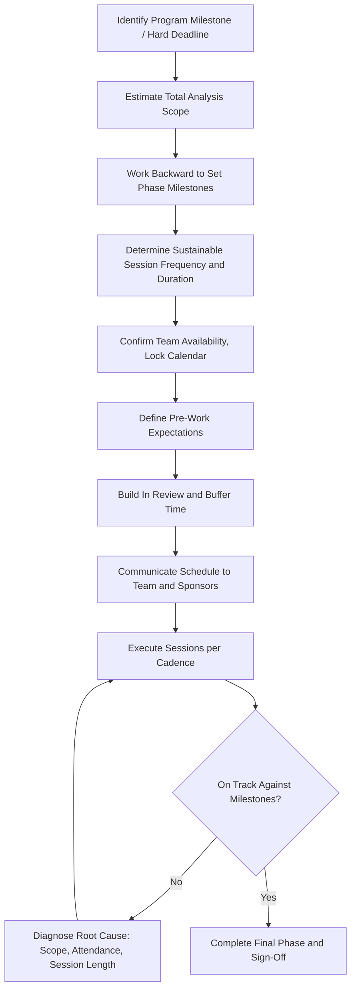

## Setting Timelines and Session Cadence

### Overview

Setting timelines and session cadence is the logistical planning activity that converts an assembled, role-defined FMEA team into a schedulable, executable project. It establishes the overall project timeline (start date, target completion, key milestones), the recurring meeting cadence (frequency, duration, format), and the alignment of that schedule with external constraints such as program gate reviews, design freeze dates, or regulatory submission deadlines. Poorly planned cadence is a common practical cause of FMEA quality failure — sessions spaced too far apart lose momentum and context, while sessions too frequent or too long induce fatigue and superficial analysis.

### Purpose and Scope

**Key Points**

- Ensures the FMEA completes in time to influence the design or process decisions it is meant to inform — an FMEA finished after design freeze has diminished practical value
- Balances thoroughness against team fatigue and diminishing returns from overly long or overly frequent sessions
- Aligns FMEA milestones with the broader product development or process validation timeline (e.g., APQP, PPAP, program gate reviews)
- Establishes realistic expectations with the team and management about the time commitment required, supporting sustained engagement
- Applies across FMEA types, though total duration and cadence vary significantly with system complexity and organizational maturity

### Key Timeline Elements

**Overall Project Timeline**

- **Start date:** Typically triggered by completion of scoping/boundary diagram and team assembly
- **Target completion date:** Working backward from the point in the program where the FMEA must influence design/process decisions (not simply "whenever convenient")
- **Milestone checkpoints:** Completion of Structure Analysis, Function Analysis, Failure Analysis, Risk Analysis, and Optimization (per the AIAG-VDA 7-step structure), each as a trackable milestone

**Session Cadence Parameters**

- **Frequency:** How often the team meets (e.g., weekly, twice-weekly, biweekly)
- **Session duration:** Length of each working session (commonly 1.5–3 hours; longer sessions risk diminishing engagement and rating quality)
- **Format:** In-person, virtual, or hybrid — affects both scheduling flexibility and facilitation dynamics
- **Pre-work expectations:** What team members must review or prepare before each session to maximize working-session efficiency

### Factors Influencing Timeline and Cadence Decisions

| Factor | Influence on Planning |
| --- | --- |
| System/process complexity | More components, functions, or process steps require more sessions or longer overall duration |
| Team availability | Cross-functional members often have competing priorities; cadence must be realistic given other commitments |
| Program schedule pressure | Upcoming design freeze, tooling commitment, or regulatory submission dates compress available time |
| FMEA maturity (new vs. carryover) | New/novel designs require more extensive failure mode brainstorming than carryover items building on prior FMEAs |
| Facilitator experience | Experienced facilitators typically move teams through the structured steps more efficiently |
| Tool/software used | Digital FMEA tools with pre-populated libraries or AI-assisted suggestions can accelerate certain steps relative to blank-worksheet approaches |

### Process Steps

**Step 1: Identify the Program Milestone the FMEA Must Support**

Determine the specific decision point (e.g., design freeze, process validation, production part approval) that the completed FMEA needs to inform, and treat this as the hard deadline anchor.

**Step 2: Estimate Total Analysis Scope and Effort**

Based on the boundary diagram and scoping outcome, estimate the number of functions, failure modes, and process steps likely to be analyzed, providing a basis for effort estimation.

**Step 3: Work Backward from the Deadline to Set Milestones**

Establish target completion dates for each major FMEA phase (Structure/Function Analysis, Failure Analysis, Risk Analysis, Optimization/Action Planning), working backward from the final deadline with appropriate buffer.

**Step 4: Determine Sustainable Session Frequency and Duration**

Set a cadence that balances momentum (frequent enough to maintain context between sessions) against fatigue and competing priorities (not so frequent that attendance or engagement suffers); commonly weekly or twice-weekly sessions of 1.5–2.5 hours.

**Step 5: Confirm Team Availability and Lock Calendar Commitments**

Secure calendar commitments from all core team members for the full session series in advance, rather than scheduling session-by-session, to minimize attendance gaps and rescheduling disruption.

**Step 6: Define Pre-Work and Between-Session Expectations**

Specify what materials (updated worksheets, data summaries, diagrams) team members should review before each session, and any between-session data-gathering assignments.

**Step 7: Build in Review and Buffer Time**

Reserve time near the end of the timeline for final team review, management sign-off, and incorporation of any last feedback before the FMEA is considered complete/baselined.

**Step 8: Communicate the Schedule and Rationale to the Team and Sponsors**

Share the finalized timeline, including milestone dates and the anchor deadline, with both the working team and the executive sponsor to align expectations and secure continued resource commitment.

**Step 9: Monitor Progress and Adjust as Needed**

Track actual progress against planned milestones during execution; if the team is falling behind, address root causes (scope creep, attendance issues, insufficient session time) rather than simply compressing remaining sessions, which degrades analysis quality.

### Typical Cadence Patterns by Context

**New Product Development (Complex System)**

- Weekly 2-hour sessions over 8–16 weeks, aligned to program gate reviews
- Extended timeline reflects genuinely novel failure mode identification without prior FMEA to build from

**Carryover Design/Process with Prior FMEA**

- Biweekly or twice-monthly sessions over 4–8 weeks
- Compressed timeline reflects the head start provided by lessons learned and prior FMEA review

**Annual Regulatory-Driven Review (e.g., HFMEA)**

- Concentrated series of sessions (e.g., 4–6 sessions over 4–6 weeks) timed to complete before an accreditation survey window or annual reporting deadline

**Rapid/Focused FMEA (Narrow Scope)**

- Single extended workshop (e.g., a half-day or full-day session) for a narrowly scoped, well-understood process or component, where full multi-week cadence is unnecessary

[Inference] These cadence patterns are general practice norms rather than fixed standards — actual timelines vary considerably based on organizational FMEA maturity, tool support, and the specific program's schedule constraints, and the responsible engineer/facilitator should adjust cadence based on team progress rather than treating any template as fixed.

### Common Pitfalls

**Key Points**

- **No anchor deadline defined:** Setting cadence without reference to when the FMEA must actually influence a decision, allowing the schedule to drift indefinitely
- **Sessions too infrequent:** Monthly or less-frequent sessions cause the team to lose context between meetings, requiring repeated re-orientation and slowing effective progress
- **Sessions too long:** Sessions exceeding 3 hours often show declining rating quality and engagement in the latter portion, as fatigue sets in
- **Compressing analysis under schedule pressure:** Rushing through Risk Analysis or Optimization steps late in the timeline to hit a deadline, undermining the FMEA's practical value
- **No buffer for rescheduling:** A tightly packed schedule with no slack collapses when even one or two sessions must be rescheduled due to team member unavailability
- **Cadence set without checking program milestones:** FMEA timeline planned in isolation from the broader program schedule, resulting in a completed FMEA that arrives too late to influence key decisions

### Example

**Scenario:** Timeline and cadence planning for a PFMEA supporting a new manufacturing line launch, with a hard Process Validation (PV) build date in 10 weeks.

| Milestone | Target Completion | Session Allocation |
| --- | --- | --- |
| Structure Analysis (process flow diagram finalized) | End of Week 1 | 1 session (2 hours) |
| Function Analysis (process step functions defined) | End of Week 2 | 1 session (2 hours) |
| Failure Analysis (failure modes, effects, causes identified) | End of Week 5 | 3 sessions (2 hours each, weekly) |
| Risk Analysis (S/O/D ratings, Action Priority determined) | End of Week 7 | 2 sessions (2 hours each, weekly) |
| Optimization (actions assigned, owners confirmed) | End of Week 8 | 1 session (2 hours) |
| Buffer / Management Review | Weeks 9–10 | Reserved for sign-off and any rework before PV build |

**Cadence:** Weekly 2-hour sessions, Tuesdays 9:00–11:00 AM, held consistently to reserve team calendar priority; pre-work distributed each Friday summarizing the prior session's open items and data to review before the next meeting.

**Buffer Rationale:** Two weeks reserved before the PV build date to accommodate schedule slippage without compromising the PV date itself — informed by the team's experience that at least one session on prior programs typically required rescheduling due to cross-functional member conflicts.

### Timeline Planning Flow Diagram

### FMEA Timeline Gantt-Style Overview (svg_diagram)

<svg xmlns="http://www.w3.org/2000/svg" viewBox="0 0 780 260">
<text x="10" y="20" font-size="14" font-weight="bold" fill="#1a1a1a">FMEA Phase Timeline Overview (svg_diagram)</text>

<text x="10" y="50" font-size="10">Structure Analysis</text>

<rect x="150" y="38" width="60" height="18" fill="`#e0f0ff`" stroke="`#0066cc`" />

<text x="10" y="80" font-size="10">Function Analysis</text>

<rect x="210" y="68" width="60" height="18" fill="`#e0f0ff`" stroke="`#0066cc`" />

<text x="10" y="110" font-size="10">Failure Analysis</text>

<rect x="270" y="98" width="180" height="18" fill="`#fff3cd`" stroke="`#cc9900`" />

<text x="10" y="140" font-size="10">Risk Analysis</text>

<rect x="450" y="128" width="120" height="18" fill="`#fff3cd`" stroke="`#cc9900`" />

<text x="10" y="170" font-size="10">Optimization</text>

<rect x="570" y="158" width="60" height="18" fill="`#e0ffe0`" stroke="`#009933`" />

<text x="10" y="200" font-size="10">Buffer / Sign-Off</text>

<rect x="630" y="188" width="120" height="18" fill="`#f8d7da`" stroke="`#cc0000`" />

<line x1="150" y1="220" x2="750" y2="220" stroke="#333" stroke-width="1" />
<text x="150" y="235" font-size="9">Wk1</text>
<text x="330" y="235" font-size="9">Wk5</text>
<text x="570" y="235" font-size="9">Wk8</text>
<text x="720" y="235" font-size="9">Wk10 (PV Build)</text>
</svg>

### Conclusion

Setting timelines and session cadence translates the FMEA's technical structure into an executable project plan, anchored to the specific program milestone the analysis must inform rather than scheduled arbitrarily. Effective cadence balances the need for sustained team momentum against realistic attendance constraints and fatigue, while deliberate backward-planning from a hard deadline — with reserved buffer time — protects analysis quality from the schedule compression that commonly degrades FMEA rigor under program pressure.

**Next Steps**

- Aligning FMEA milestones with APQP/program gate review structures
- Facilitation techniques for maintaining session momentum and engagement
- Digital FMEA tools and their impact on session efficiency
- Managing schedule slippage and team attendance disruptions
- Structure Analysis and Function Analysis session planning
- Action item tracking and post-FMEA follow-up cadence