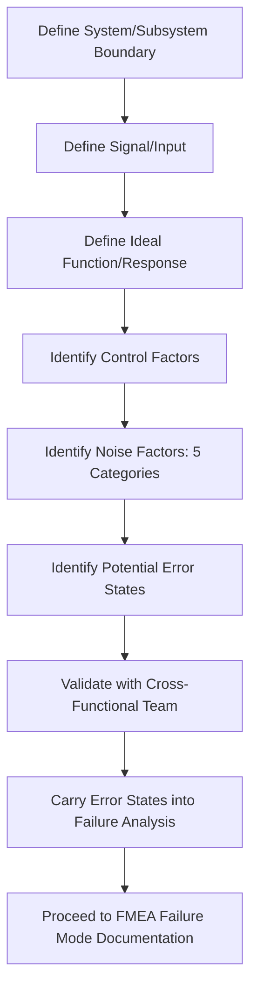

## Parameter Diagrams and P Diagrams

### Overview

A Parameter Diagram (P-Diagram) is a structured visual analysis tool used to systematically identify and organize the inputs, outputs, and — most distinctively — the noise factors and control factors affecting a system's ideal function. Originating from Robust Design/Taguchi methodology and widely adopted within DFMEA practice, the P-Diagram sits between the boundary diagram and the failure mode identification step, providing a disciplined framework for anticipating how uncontrolled variation (noise) can degrade a system's intended function, which directly feeds potential failure mode and cause identification.

### Purpose and Scope

**Key Points**

- Systematically captures sources of variation (noise factors) that are difficult or impossible to fully control but can degrade system performance — a category of failure cause often underrepresented in less structured brainstorming
- Distinguishes controllable design parameters (control factors) from uncontrollable environmental and use-condition variables (noise factors), clarifying which failure causes are addressable through design vs. which require robustness against
- Bridges Robust Design/Design of Experiments (DOE) thinking with FMEA failure cause identification, particularly valuable for DFMEA
- Provides a structured input directly feeding the Function Analysis and subsequent Failure Analysis steps of the AIAG-VDA 7-step FMEA process

### P-Diagram Core Elements

**Signal/Input (Ideal Function Input)**

- The intended input that initiates the system's function (e.g., driver's brake pedal force, a user's button press, a command signal)

**Ideal Function/Response (Intended Output)**

- The intended, desired output or response the system should produce given the signal input, under ideal conditions

**Control Factors**

- Design parameters the engineering team can specify and control (dimensions, material selection, tolerances, software logic parameters, process settings)
- These are the "knobs" available to the design team to optimize robustness

**Noise Factors**

- Sources of variation that affect the system's ability to achieve the ideal function but are difficult, costly, or impossible to fully control by design
- Categorized into standard noise factor types (see below)

**Error States (Outputs)**

- Undesired outputs or deviations from the ideal function response, resulting from noise factor influence
- Error states are the direct precursor to failure modes in subsequent FMEA analysis — an error state observed in the P-Diagram often becomes the "failure mode" documented in the FMEA worksheet

### Standard Noise Factor Categories

**Piece-to-Piece Variation**

- Manufacturing and material variation between nominally identical parts (dimensional tolerance stack-up, material property variation)

**Changes Over Time / Deterioration**

- Wear, fatigue, corrosion, material degradation, and other time-dependent performance changes

**Customer Usage / Duty Cycle Variation**

- Variation in how different customers actually use the product (aggressive vs. conservative operation, usage frequency, load conditions)

**Environmental Variation (External)**

- Temperature, humidity, vibration, dust, road spray, altitude, and other external operating condition variation

**System Interactions**

- Effects from adjacent or interfacing systems (electromagnetic interference, coupled vibration, shared power supply loading)

[Inference] These five noise factor categories are a widely used convention in Robust Design and P-Diagram practice, though some organizations group or label them somewhat differently (e.g., combining environmental and system-interaction noise); the underlying principle of systematically distinguishing controllable from uncontrollable variation sources remains consistent across variations.

### P-Diagram Structure (Conceptual Layout)

The P-Diagram is conventionally drawn as a box representing the system/subsystem under analysis, with:

- **Signal/Input** entering from the left
- **Ideal Function/Response** exiting to the right
- **Control Factors** entering from below (or top) the system box
- **Noise Factors** entering from above (or a separate side), explicitly outside the team's direct control
- **Error States** exiting alongside or below the ideal response, representing deviation from intended function

### Process Steps

**Step 1: Define the System/Subsystem Boundary for the P-Diagram**

Confirm the P-Diagram scope aligns with the boundary diagram already established during scoping — typically applied at the subsystem or component level where a specific ideal function can be clearly defined.

**Step 2: Define the Signal/Input**

Identify the specific input that initiates the intended function (what triggers the system to act).

**Step 3: Define the Ideal Function/Response**

Articulate precisely what the system should output or accomplish given the signal, under nominal/ideal conditions — stated as a measurable or observable response where possible.

**Step 4: Identify Control Factors**

List the design parameters the team can specify and adjust to achieve and optimize the ideal function (dimensions, materials, software parameters, process settings).

**Step 5: Identify Noise Factors Across All Five Categories**

Systematically work through piece-to-piece variation, deterioration over time, customer usage variation, environmental variation, and system interaction noise, brainstorming specific noise sources relevant to the system under analysis.

**Step 6: Identify Potential Error States**

For each significant noise factor (or combination), identify how it could cause the actual output to deviate from the ideal function response — these error states become candidate failure modes.

**Step 7: Cross-Reference Error States into Failure Analysis**

Carry forward identified error states as a primary input to the FMEA's Failure Analysis step, ensuring failure modes traced from the P-Diagram's noise factor analysis are captured alongside those from other brainstorming approaches.

**Step 8: Validate with the Cross-Functional Team**

Review the completed P-Diagram with the team to confirm noise factors are realistic and comprehensive, drawing particularly on manufacturing, field service, and reliability perspectives for noise factors the design team alone might not fully anticipate.

### P-Diagram vs. Boundary Diagram vs. Block Diagram

| Tool | Primary Focus | Typical Sequence |
| --- | --- | --- |
| Boundary Diagram | Defines overall scope and interfaces with adjacent systems/environment | First — establishes what is in/out of scope |
| Block Diagram | Shows internal structure and component relationships within scope | Second — details internal composition |
| P-Diagram | Analyzes a specific function's robustness against noise factors | Applied per critical function, informing Function and Failure Analysis |

[Inference] While boundary and block diagrams describe structural composition, the P-Diagram is function-specific and is typically applied to individual critical functions within the system rather than to the system as a single whole, meaning a complex system may have multiple P-Diagrams, one for each key function under analysis.

### Common Pitfalls

**Key Points**

- **Confusing control factors with noise factors:** Misclassifying a variable the team can actually control as an uncontrollable noise factor (or vice versa), which distorts subsequent robustness strategy
- **Incomplete noise factor brainstorming:** Focusing heavily on one noise category (e.g., environmental) while neglecting others (e.g., customer usage variation), missing significant failure causes
- **Vague ideal function definition:** Stating the ideal function too abstractly to meaningfully identify specific error states
- **Treating the P-Diagram as a one-time exercise:** Not revisiting the P-Diagram as design details mature, missing newly introduced noise factors from design changes
- **Disconnected from FMEA worksheet:** Completing the P-Diagram as a standalone exercise without explicitly carrying error states forward into the Failure Analysis step, losing its analytical value

### Example

**Scenario:** P-Diagram for the ideal function of an automotive seat heater control circuit.

**Signal/Input:** Driver activates seat heater switch (on/low/medium/high setting selection).

**Ideal Function/Response:** Seat heating element reaches and maintains the target temperature corresponding to the selected setting within a specified time window.

| Category | Control Factors | Noise Factors | Potential Error State |
| --- | --- | --- | --- |
| Design | Heating element resistance value, thermostat setpoint tolerance, wiring gauge | — | — |
| Piece-to-piece variation | — | Resistance variation in heating element manufacturing batch | Inconsistent heat output between vehicle units |
| Deterioration over time | — | Heating element wire fatigue from repeated flex cycling | Reduced heat output or open-circuit failure after extended use |
| Customer usage variation | — | Extended continuous use beyond typical duty cycle assumptions | Thermal buildup beyond design intent, potential overheat condition |
| Environmental variation | — | Extreme cold ambient start conditions; seat cushion compression affecting heat transfer | Slower time-to-target-temperature than specified; localized hot spots |
| System interaction | — | Voltage fluctuation from vehicle electrical system under high accessory load | Inconsistent heating element power delivery |

**Error States Carried to Failure Analysis:** "Inconsistent heat output," "delayed time-to-temperature," "localized overheat condition," and "open-circuit failure" are carried forward as candidate failure modes for the subsequent Failure Analysis step.

### P-Diagram Structure Flow

### P-Diagram Conceptual Layout (svg_diagram)

<svg xmlns="http://www.w3.org/2000/svg" viewBox="0 0 760 320">
<text x="10" y="20" font-size="14" font-weight="bold" fill="#1a1a1a">P-Diagram Conceptual Layout (svg_diagram)</text>
<rect x="280" y="130" width="200" height="80" rx="6" fill="#e0f0ff" stroke="#0066cc" stroke-width="2" />
<text x="380" y="175" font-size="12" text-anchor="middle">System / Subsystem</text>
<rect x="20" y="150" width="150" height="40" rx="5" fill="#d4edda" stroke="#009933" />
<text x="95" y="175" font-size="10" text-anchor="middle">Signal / Input</text>
<rect x="590" y="150" width="150" height="40" rx="5" fill="#d4edda" stroke="#009933" />
<text x="665" y="175" font-size="10" text-anchor="middle">Ideal Function / Response</text>
<rect x="280" y="20" width="200" height="45" rx="5" fill="#f8d7da" stroke="#cc0000" />
<text x="380" y="47" font-size="10" text-anchor="middle">Noise Factors (5 Categories)</text>
<rect x="280" y="255" width="200" height="45" rx="5" fill="#fff3cd" stroke="#cc9900" />
<text x="380" y="282" font-size="10" text-anchor="middle">Control Factors</text>
<rect x="590" y="230" width="150" height="45" rx="5" fill="#f8d7da" stroke="#cc0000" />
<text x="665" y="257" font-size="10" text-anchor="middle">Error States</text>
<line x1="170" y1="170" x2="280" y2="170" stroke="#333" stroke-width="1.5" marker-end="url(#arrow9)" />
<line x1="480" y1="170" x2="590" y2="170" stroke="#333" stroke-width="1.5" marker-end="url(#arrow9)" />
<line x1="380" y1="65" x2="380" y2="130" stroke="#cc0000" stroke-width="1.5" marker-end="url(#arrow9)" />
<line x1="380" y1="255" x2="380" y2="210" stroke="#cc9900" stroke-width="1.5" marker-end="url(#arrow9)" />
<line x1="500" y1="200" x2="620" y2="230" stroke="#cc0000" stroke-width="1.5" stroke-dasharray="4,3" marker-end="url(#arrow9)" />
</svg>

### Conclusion

The Parameter Diagram provides a disciplined bridge between Robust Design principles and FMEA failure cause identification by explicitly separating controllable design parameters from the noise factors that inevitably introduce real-world variation. By systematically working through piece-to-piece variation, time-based deterioration, customer usage variation, environmental conditions, and system interactions, the P-Diagram surfaces error states that translate directly into well-grounded failure modes for the subsequent Failure Analysis step, strengthening the FMEA's connection to genuine physical and use-condition variability rather than relying solely on unstructured brainstorming.

**Next Steps**

- Function Analysis and function tree/function net development
- Failure Analysis: linking error states to failure modes, effects, and causes
- Robust Design and Design of Experiments (DOE) fundamentals
- Noise factor management strategies (design for robustness vs. noise reduction)
- Boundary diagrams and block diagrams as complementary structure tools
- Special characteristic identification from noise-sensitive functions