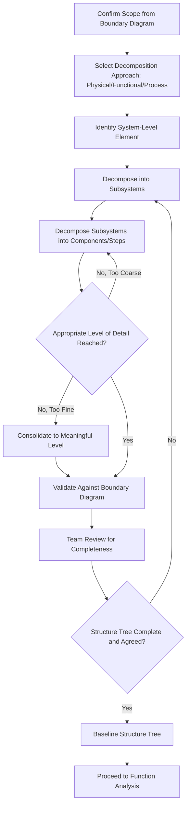

## Decomposing Systems into Subsystems and Components

### Overview

Decomposing systems into subsystems and components is the core technical activity of Structure Analysis, the second step in the AIAG-VDA 7-step FMEA methodology. Building on the boundary diagram established during scoping, this decomposition creates a hierarchical structure tree that breaks the system down into progressively finer levels — system, subsystem, component, and characteristic — providing the organizational backbone onto which functions, failure modes, effects, and causes are subsequently mapped in a traceable, consistent manner.

### Purpose and Scope

**Key Points**

- Provides the structural skeleton that ensures every element of the in-scope system is systematically addressed, preventing gaps where a component's failure modes are never analyzed
- Creates a consistent hierarchy that links each failure mode to a specific, identifiable structural location, supporting traceability from system-level effect down to component-level cause
- Enables the "three-column" or "three-level" thinking central to AIAG-VDA methodology: the structure at one level provides the effect context, the item itself provides the failure mode, and the level below provides the cause context
- Forms the direct foundation for Function Analysis (Step 3), since functions are assigned to structural elements identified during decomposition

### The Structure Tree Hierarchy

**System Level**

- The highest level under analysis, as defined by the FMEA scope (e.g., "braking system," "patient admission process")
- Represents the overall item whose function and failure modes have the broadest end effects

**Subsystem Level**

- Major functional or physical groupings within the system (e.g., "hydraulic brake actuation subsystem," "anti-lock brake control subsystem")
- Each subsystem performs a distinct, identifiable function contributing to overall system function

**Component/Part Level**

- Individual physical parts, software modules, or process steps within a subsystem (e.g., "brake caliper," "ABS control module," "wheel speed sensor")
- The level at which most detailed failure modes are typically identified in DFMEA/PFMEA

**Characteristic Level (Optional, Detailed Analysis)**

- Specific dimensional, material, or functional characteristics of a component (e.g., "caliper piston bore diameter," "software function timing parameter")
- Used in detailed analyses where characteristic-level variation is directly tied to specific failure causes, particularly relevant for identifying special/critical characteristics

### Structure Analysis in the Three-Level Model (AIAG-VDA)

[Inference] A key organizing principle in AIAG-VDA structure analysis is that each structural element simultaneously serves three roles depending on the level being examined: the element itself, its parent (one level up), and its children (one level down). This creates a consistent pattern where:

- The failure **effect** relates to the next-higher structural level
- The failure **mode** relates to the item itself at the current structural level
- The failure **cause** relates to the next-lower structural level

This three-level linkage is what allows failure chains to be traced consistently from a low-level component cause, through a mid-level failure mode, up to a system-level customer-facing effect.

### Decomposition Approaches

**Physical/Hardware Decomposition**

- Based on the bill of materials (BOM) or physical assembly structure
- Follows how the product is actually manufactured/assembled: system → assembly → sub-assembly → part
- Most common approach for DFMEA

**Functional Decomposition**

- Based on function groupings rather than physical assembly (useful when physical structure doesn't align cleanly with functional boundaries, e.g., distributed software functions across multiple physical modules)
- Common for System FMEA and Software FMEA where function crosses physical/module boundaries

**Process Step Decomposition**

- Based on the sequential steps of a manufacturing or service process
- Follows the process flow diagram: process → sub-process → process step → work element
- Standard approach for PFMEA and Service FMEA/HFMEA

### Process Steps

**Step 1: Confirm Scope from the Boundary Diagram**

Use the previously validated boundary diagram as the starting reference for what is included in the decomposition — the structure tree should not introduce elements outside the established scope.

**Step 2: Select the Appropriate Decomposition Approach**

Choose physical, functional, or process-step decomposition based on FMEA type and the nature of the system (or use a hybrid where appropriate).

**Step 3: Identify System-Level Element**

Confirm the top-level system/process name and description, consistent with the FMEA's defined scope.

**Step 4: Decompose into Subsystems**

Break the system into logical subsystems or major process groupings, ensuring each subsystem has a clear, distinct function and reasonably bounded scope.

**Step 5: Decompose Subsystems into Components/Steps**

For each subsystem, identify constituent components (for hardware/software) or individual process steps (for process-based FMEAs), drawing on the bill of materials, CAD structure, or process flow diagram as source references.

**Step 6: Determine Appropriate Level of Detail**

Decide how far down the hierarchy to decompose based on where meaningful, distinct failure modes can be identified — decomposing too finely creates excessive, low-value analysis; too coarsely misses distinct failure modes.

**Step 7: Validate Structure Tree Completeness Against the Boundary Diagram**

Cross-check that every element shown in the boundary diagram is represented somewhere in the structure tree, and that no structure tree element falls outside the validated boundary.

**Step 8: Review Structure Tree with the Cross-Functional Team**

Confirm the decomposition reflects the team's shared understanding of the actual system/process structure, incorporating input from manufacturing, service, and other disciplines whose structural view may differ from the design engineer's.

**Step 9: Baseline the Structure Tree**

Once validated, treat the structure tree as a controlled document that subsequent Function, Failure, and Risk Analysis steps will reference consistently.

### Determining the Right Level of Decomposition

| Signal to Decompose Further | Signal Current Level Is Sufficient |
| --- | --- |
| Component performs multiple distinct functions with different failure consequences | Component performs a single, well-defined function |
| Different sub-elements have meaningfully different failure rates or criticality | Historical data shows uniform failure behavior across the item |
| Team cannot agree on a single failure mode description at current level | Failure modes can be clearly and specifically described at current level |
| Regulatory or safety analysis requires characteristic-level traceability | Component-level analysis satisfies program/safety requirements |

### Common Pitfalls

**Key Points**

- **Decomposition misaligned with the boundary diagram:** Structure tree includes elements excluded during scoping, or omits elements the boundary diagram identified as in-scope
- **Inconsistent decomposition depth:** Some subsystems decomposed to component level while others stop at subsystem level without justification, creating uneven analysis rigor
- **Decomposition based on organizational structure rather than physical/functional logic:** Structuring the tree around "who owns what" organizationally rather than how the system actually functions or is assembled, obscuring real interfaces
- **Over-decomposition:** Breaking components down to a level of detail where failure modes become trivial or redundant, consuming team time without proportional analytical value
- **Structure tree never revisited:** Treating the decomposition as fixed even as design changes alter the actual system structure during development
- **Missing process-step granularity in PFMEA:** Decomposing only to "sub-process" level when individual work elements (e.g., specific operator actions within a station) are where distinct failure modes actually occur

### Example

**Scenario:** Structure decomposition for a DFMEA on an automotive disc brake system (physical/hardware decomposition approach).

| Level | Element | Notes |
| --- | --- | --- |
| System | Front Disc Brake System | Top-level scope per boundary diagram |
| Subsystem | Hydraulic Actuation Subsystem | Converts brake pedal hydraulic pressure into caliper clamping force |
| Subsystem | Friction Subsystem | Converts clamping force and rotational energy into stopping torque via friction |
| Subsystem | Wear/Monitoring Subsystem | Monitors and signals pad wear condition to the driver |
| Component (under Hydraulic Actuation) | Brake Caliper Assembly | Houses piston(s), converts hydraulic pressure to mechanical clamping force |
| Component (under Hydraulic Actuation) | Caliper Piston Seal | Maintains hydraulic seal, enables piston retraction |
| Component (under Friction Subsystem) | Brake Pad Assembly | Friction material generating stopping torque against rotor |
| Component (under Friction Subsystem) | Brake Rotor | Rotating friction surface, dissipates heat |
| Component (under Wear/Monitoring) | Pad Wear Sensor | Detects pad thickness threshold, signals warning |
| Characteristic (under Caliper Piston Seal) | Seal groove dimensional tolerance | Directly tied to hydraulic leak failure cause |

**Team Validation Note:** During structure review, the service engineering representative flagged that the "Wear/Monitoring Subsystem" as originally drafted omitted the dashboard warning light driver circuit — added as a component under this subsystem after review, since its failure mode (light fails to illuminate despite sensor trigger) was a known field issue from the lessons learned database review.

### Structure Decomposition Flow Diagram

### System Structure Tree Example (svg_diagram)

<svg xmlns="http://www.w3.org/2000/svg" viewBox="0 0 780 360">
<text x="10" y="20" font-size="14" font-weight="bold" fill="#1a1a1a">Structure Tree Hierarchy (svg_diagram)</text>
<rect x="300" y="40" width="200" height="45" rx="5" fill="#e0f0ff" stroke="#0066cc" stroke-width="2" />
<text x="400" y="67" font-size="11" text-anchor="middle">Front Disc Brake System</text>
<rect x="60" y="130" width="180" height="45" rx="5" fill="#fff3cd" stroke="#cc9900" />
<text x="150" y="150" font-size="10" text-anchor="middle">Hydraulic Actuation</text>
<text x="150" y="163" font-size="10" text-anchor="middle">Subsystem</text>
<rect x="310" y="130" width="180" height="45" rx="5" fill="#fff3cd" stroke="#cc9900" />
<text x="400" y="150" font-size="10" text-anchor="middle">Friction Subsystem</text>
<rect x="560" y="130" width="180" height="45" rx="5" fill="#fff3cd" stroke="#cc9900" />
<text x="650" y="150" font-size="10" text-anchor="middle">Wear/Monitoring</text>
<text x="650" y="163" font-size="10" text-anchor="middle">Subsystem</text>
<rect x="30" y="230" width="130" height="40" rx="5" fill="#e0ffe0" stroke="#009933" />
<text x="95" y="254" font-size="9" text-anchor="middle">Caliper Assembly</text>
<rect x="170" y="230" width="130" height="40" rx="5" fill="#e0ffe0" stroke="#009933" />
<text x="235" y="254" font-size="9" text-anchor="middle">Piston Seal</text>
<rect x="330" y="230" width="130" height="40" rx="5" fill="#e0ffe0" stroke="#009933" />
<text x="395" y="254" font-size="9" text-anchor="middle">Brake Pad Assembly</text>
<rect x="480" y="230" width="110" height="40" rx="5" fill="#e0ffe0" stroke="#009933" />
<text x="535" y="254" font-size="9" text-anchor="middle">Brake Rotor</text>
<rect x="610" y="230" width="130" height="40" rx="5" fill="#e0ffe0" stroke="#009933" />
<text x="675" y="254" font-size="9" text-anchor="middle">Pad Wear Sensor</text>
<rect x="170" y="300" width="130" height="35" rx="5" fill="#f8d7da" stroke="#cc0000" />
<text x="235" y="322" font-size="8" text-anchor="middle">Seal Groove Tolerance (characteristic)</text>
<line x1="400" y1="85" x2="150" y2="130" stroke="#333" />
<line x1="400" y1="85" x2="400" y2="130" stroke="#333" />
<line x1="400" y1="85" x2="650" y2="130" stroke="#333" />
<line x1="150" y1="175" x2="95" y2="230" stroke="#333" />
<line x1="150" y1="175" x2="235" y2="230" stroke="#333" />
<line x1="400" y1="175" x2="395" y2="230" stroke="#333" />
<line x1="400" y1="175" x2="535" y2="230" stroke="#333" />
<line x1="650" y1="175" x2="675" y2="230" stroke="#333" />
<line x1="235" y1="270" x2="235" y2="300" stroke="#333" />
</svg>

### Conclusion

Decomposing systems into subsystems and components establishes the structural hierarchy that organizes every subsequent step of the FMEA, enabling consistent, traceable linkage between component-level failure causes, subsystem-level failure modes, and system-level customer-facing effects. Whether following physical/hardware, functional, or process-step decomposition — matched to the appropriate FMEA type — the resulting structure tree must remain fully aligned with the previously validated boundary diagram and reach a level of detail sufficient to capture genuinely distinct failure modes without introducing unproductive analytical granularity.

**Next Steps**

- Function Analysis: assigning functions to structure tree elements
- Function trees and function nets for complex systems
- Failure Analysis: mapping failure modes, effects, and causes across structure levels
- Special/critical characteristic identification at the characteristic level
- Bill of materials (BOM) and CAD structure as decomposition source data
- Process flow diagrams for process-step decomposition in PFMEA/Service FMEA