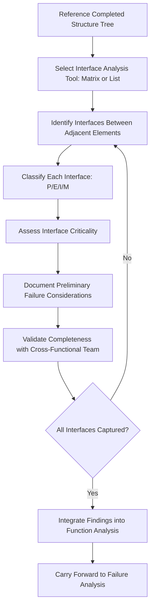

## Interface Analysis Between Elements

### Overview

Interface analysis is the systematic examination of connections and interactions between structural elements identified during decomposition — subsystems, components, process steps — to ensure that failure modes arising specifically from interfaces (rather than from elements in isolation) are captured. Interfaces are a well-recognized high-risk zone in FMEA practice: many field failures originate not from a single component's internal malfunction but from a mismatch, tolerance stack-up, or unexpected interaction at the boundary between two elements. Interface analysis extends the boundary diagram's system-level interface concept down to every level of the structure tree.

### Purpose and Scope

**Key Points**

- Systematically captures failure modes arising from the connections *between* elements, which are frequently missed when analysis focuses only on individual components in isolation
- Extends the boundary diagram's interface concept (external system interfaces) inward to internal interfaces between subsystems, components, and process steps
- Provides a structured method to avoid relying on the team "remembering" to consider interfaces during unstructured brainstorming
- Directly supports Function Analysis, since many functions are only fully realized through the correct interaction of interfacing elements (e.g., "transmit signal" requires both a sender and receiver interface to function correctly)

### Types of Interfaces

**Physical (P) Interfaces**

- Mechanical connections, fasteners, mating surfaces, physical contact or clearance relationships
- Failure modes: loosening, misalignment, excessive clearance/interference, wear at contact surfaces

**Energy (E) Interfaces**

- Power transmission, heat transfer, force/torque transmission, electrical current flow
- Failure modes: energy loss, overheating, insufficient force transmission, electrical short/open

**Information (I) Interfaces**

- Signal transmission, data communication, control commands, sensor feedback
- Failure modes: signal loss, data corruption, timing mismatch, protocol incompatibility

**Material (M) Interfaces**

- Fluid flow, gas flow, substance transfer between elements
- Failure modes: leakage, contamination, blockage, incorrect flow rate

[Inference] This P-E-I-M classification (consistent with the boundary diagram interface labeling convention) is commonly extended from the system-level boundary diagram down into internal interface analysis at the subsystem and component level, providing a consistent vocabulary across all levels of the structure tree.

### Interface Analysis Tools

**Interface Matrix (N² / N-Squared Diagram)**

- A grid-format tool listing all structural elements along both axes, with each cell representing the interface (if any) between the row and column element
- Systematically forces consideration of every possible pairwise interface, including ones that might be overlooked in free-form brainstorming
- Particularly valuable for systems with many interconnected elements where the number of potential interfaces grows rapidly

**Interface List/Table**

- A simpler tabular format listing each identified interface, its type (P/E/I/M), the two connected elements, and a brief description
- Suitable for systems with a more limited, well-understood set of interfaces

**Extended Block Diagram with Interface Annotations**

- The block diagram (showing internal structure) annotated with labeled interface connections between blocks, similar in concept to the boundary diagram but applied to internal structure

### Process Steps

**Step 1: Reference the Completed Structure Tree**

Use the validated structure tree (from Decomposing Systems into Subsystems and Components) as the basis for identifying which elements require interface analysis.

**Step 2: Select the Interface Analysis Tool**

Choose an interface matrix for complex, highly interconnected systems, or a simpler interface list for smaller-scope or less interconnected structures.

**Step 3: Systematically Identify Interfaces Between Adjacent Elements**

Work through the structure tree level by level, identifying every physical, energy, information, and material interface between elements at the same level and between parent/child levels.

**Step 4: Classify Each Interface by Type**

Label each identified interface using the P/E/I/M classification (or organization-specific equivalent) to ensure consistent treatment across the analysis.

**Step 5: Assess Interface Criticality**

For each interface, evaluate whether a failure at that interface (rather than within either connected element individually) could produce a significant system-level effect — interfaces enabling safety-critical or high-severity functions warrant particular attention.

**Step 6: Document Interface-Specific Failure Considerations**

For critical interfaces, note preliminary failure mode considerations (e.g., "connector interface — consider intermittent contact under vibration") to carry forward into Failure Analysis.

**Step 7: Validate Interface Completeness with the Cross-Functional Team**

Review the interface analysis with the team, particularly manufacturing and service representatives who may identify interfaces (e.g., an assembly-process-induced interface issue) that a design-only perspective would miss.

**Step 8: Integrate Interface Findings into Function and Failure Analysis**

Ensure functions dependent on specific interfaces are explicitly documented during Function Analysis, and that interface-originated failure modes are captured during Failure Analysis rather than only component-internal failure modes.

### Interface Matrix (N²) Concept

An N² diagram arranges all structural elements identically along both the rows and columns of a grid. Diagonal cells represent the elements themselves; off-diagonal cells represent the interface (if any) between the row element and column element. This format is exhaustive by construction — every possible pairwise combination is represented as a cell, forcing an explicit "yes, there is an interface" or "no interface exists" determination rather than relying on the team to remember every connection.

|  | Element A | Element B | Element C |
| --- | --- | --- | --- |
| **Element A** | — | Interface A-B | Interface A-C |
| **Element B** | Interface A-B | — | Interface B-C |
| **Element C** | Interface A-C | Interface B-C | — |

For a structure tree with $n$ elements, the number of potential pairwise interfaces is:

$$\binom{n}{2} = \frac{n(n-1)}{2}$$

which grows quickly with system complexity — a key reason the matrix format is valuable for larger systems, where unstructured brainstorming is unlikely to reliably surface every interface.

### Common Interface-Originated Failure Categories

**Mechanical Interfaces**

- Fastener loosening under vibration
- Tolerance stack-up causing interference or excessive clearance
- Wear at sliding/rotating contact surfaces

**Electrical/Electronic Interfaces**

- Connector contact resistance increase (corrosion, fretting)
- Electromagnetic interference (EMI) between adjacent circuits
- Ground loop or shared-return-path induced noise

**Software/Data Interfaces**

- API contract mismatch after independent module updates
- Timing/synchronization failure between producer and consumer processes
- Data format or unit mismatch between interfacing modules

**Process/Handoff Interfaces**

- Information loss during handoff between process steps or shifts
- Inconsistent work-in-process identification between stations
- Material contamination during transfer between process steps

### Common Pitfalls

**Key Points**

- **Interfaces analyzed only at system boundary, not internally:** Applying interface thinking only to the boundary diagram's external interfaces while neglecting internal interfaces between subsystems/components
- **Interface matrix skipped for "obviously simple" systems:** Assuming a system is simple enough that interfaces are self-evident, only to discover an overlooked interface mid-analysis
- **Interface failure modes conflated with component failure modes:** Attributing an interface-caused failure (e.g., connector corrosion) entirely to one connected component rather than recognizing it as an interface-specific failure with its own distinct cause
- **Static interface documentation:** Interface analysis completed once early in the program and never revisited as design changes alter connections between elements
- **Missing cross-domain interfaces:** Overlooking interfaces between different domains (e.g., a mechanical-to-software interface, such as a physical sensor feeding a software control algorithm), which are often the least well understood by any single team member

### Example

**Scenario:** Interface analysis for the front disc brake system structure tree (continuing from the decomposition example), focused on interfaces between the Hydraulic Actuation and Wear/Monitoring subsystems.

| Interface | Type | Connected Elements | Description | Preliminary Failure Consideration |
| --- | --- | --- | --- | --- |
| Caliper-to-brake-line connection | P/M | Caliper Assembly ↔ Brake Hydraulic Line | Threaded hydraulic fitting transmitting brake fluid pressure | Fitting loosening under vibration causing fluid leak |
| Pad wear sensor-to-pad contact | P/I | Pad Wear Sensor ↔ Brake Pad Assembly | Physical contact triggering electrical circuit when pad wear threshold reached | Sensor misalignment during assembly causing false or missed trigger |
| Wear sensor-to-dashboard signal | I | Pad Wear Sensor ↔ Vehicle Instrument Cluster (external, per boundary diagram) | Electrical signal indicating pad wear warning | Wiring harness connector corrosion causing intermittent signal loss |
| Caliper piston-to-pad backing plate | P/E | Caliper Piston ↔ Brake Pad Backing Plate | Mechanical force transmission from hydraulic piston to pad | Piston seizure preventing full force transmission or retraction |

**Team Finding:** Interface matrix review revealed that the pad wear sensor's physical contact interface with the brake pad (rather than the sensor itself) was the more likely source of field-reported false-negative wear warnings — redirecting the team's Failure Analysis focus from the sensor component itself to the sensor-to-pad physical interface and its assembly tolerance.

### Interface Analysis Flow Diagram

### Interface Matrix (N²) Example (svg_diagram)

<svg xmlns="http://www.w3.org/2000/svg" viewBox="0 0 700 400">
<text x="10" y="20" font-size="14" font-weight="bold" fill="#1a1a1a">Interface Matrix / N-Squared Diagram (svg_diagram)</text>
<rect x="180" y="60" width="120" height="40" fill="#e0f0ff" stroke="#0066cc" />
<text x="240" y="85" font-size="9" text-anchor="middle">Caliper Assembly</text>
<rect x="180" y="100" width="120" height="40" fill="#e0f0ff" stroke="#0066cc" />
<text x="240" y="125" font-size="9" text-anchor="middle">Piston Seal</text>
<rect x="180" y="140" width="120" height="40" fill="#e0f0ff" stroke="#0066cc" />
<text x="240" y="165" font-size="9" text-anchor="middle">Brake Pad Assembly</text>
<rect x="180" y="180" width="120" height="40" fill="#e0f0ff" stroke="#0066cc" />
<text x="240" y="205" font-size="9" text-anchor="middle">Pad Wear Sensor</text>
<rect x="300" y="20" width="120" height="40" fill="#e0f0ff" stroke="#0066cc" transform="rotate(0)" />
<text x="360" y="45" font-size="9" text-anchor="middle">Caliper Assembly</text>
<rect x="420" y="20" width="120" height="40" fill="#e0f0ff" stroke="#0066cc" />
<text x="480" y="45" font-size="9" text-anchor="middle">Piston Seal</text>
<rect x="540" y="20" width="80" height="40" fill="#e0f0ff" stroke="#0066cc" />
<text x="580" y="40" font-size="8" text-anchor="middle">Pad Assy</text>
<text x="580" y="52" font-size="8" text-anchor="middle">/ Sensor</text>
<rect x="300" y="60" width="120" height="40" fill="#ccc" stroke="#333" />
<rect x="420" y="60" width="120" height="40" fill="#fff3cd" stroke="#cc9900" />
<text x="480" y="85" font-size="8" text-anchor="middle">P/M Interface</text>
<rect x="540" y="60" width="80" height="40" fill="#f0f0f0" stroke="#999" />
<text x="580" y="85" font-size="8" text-anchor="middle">None</text>
<rect x="300" y="100" width="120" height="40" fill="#fff3cd" stroke="#cc9900" />
<text x="360" y="125" font-size="8" text-anchor="middle">P/M Interface</text>
<rect x="420" y="100" width="120" height="40" fill="#ccc" stroke="#333" />
<rect x="540" y="100" width="80" height="40" fill="#f0f0f0" stroke="#999" />
<text x="580" y="125" font-size="8" text-anchor="middle">None</text>
<rect x="300" y="140" width="120" height="40" fill="#f0f0f0" stroke="#999" />
<text x="360" y="165" font-size="8" text-anchor="middle">None</text>
<rect x="420" y="140" width="120" height="40" fill="#f0f0f0" stroke="#999" />
<text x="480" y="165" font-size="8" text-anchor="middle">None</text>
<rect x="540" y="140" width="80" height="40" fill="#ffe0e0" stroke="#cc0000" />
<text x="580" y="165" font-size="8" text-anchor="middle">P/I</text>
<rect x="300" y="180" width="120" height="40" fill="#f0f0f0" stroke="#999" />
<text x="360" y="205" font-size="8" text-anchor="middle">None</text>
<rect x="420" y="180" width="120" height="40" fill="#f0f0f0" stroke="#999" />
<text x="480" y="205" font-size="8" text-anchor="middle">None</text>
<rect x="540" y="180" width="80" height="40" fill="#ffe0e0" stroke="#cc0000" />
<text x="580" y="205" font-size="8" text-anchor="middle">P/I</text>
</svg>

### Conclusion

Interface analysis systematically closes a well-documented gap in FMEA practice — the tendency to analyze components in isolation while overlooking the connections between them, where a substantial share of real-world field failures actually originate. By extending the P/E/I/M interface classification from the system-level boundary diagram down through every level of the structure tree, and using tools such as the interface matrix to exhaustively capture pairwise connections, the team ensures interface-specific failure considerations are carried forward into Function and Failure Analysis rather than being implicitly absorbed (and lost) within individual component failure mode descriptions.

**Next Steps**

- Function Analysis: assigning functions across interfacing elements
- Failure Analysis: distinguishing interface-caused failure modes from component-internal modes
- Boundary diagrams and their relationship to internal interface analysis
- Tolerance stack-up analysis for physical interfaces
- Software interface contracts and API failure mode considerations
- Special characteristic identification at critical interfaces