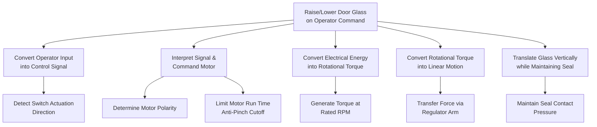

## Function Trees and Functional Decomposition

### Overview

A function tree is a hierarchical diagram that decomposes a system's overall (top-level) function into progressively more detailed sub-functions, mirroring the structure established in the block diagram/Structure Tree. Functional decomposition is the analytical process of breaking down "what the system does" into discrete, verb-noun statements at each level of the structure. Within Structure and Function Analysis, this is the second of the three analysis steps (Structure → Function → Failure), and it directly determines the completeness of the subsequent Failure Analysis step, since every failure mode in FMEA is defined as the loss, degradation, or unintended presence of a function.

### Purpose Within FMEA

- Ensures every structural element (from the Structure Tree) has an explicitly defined function before failure modes are derived
- Creates traceability: Structure → Function → Failure, satisfying AIAG-VDA's structure-function-failure linkage requirement
- Surfaces interactions and dependencies between functions across subsystem boundaries
- Provides the basis for identifying failure modes as "function not performed," "function performed with degraded performance," "function performed intermittently," or "unintended function"
- Supports requirements traceability by linking functions back to customer needs, specifications, and regulatory requirements

### Relationship to the Structure Tree

The function tree is built in parallel with, and directly mapped to, the Structure Tree:

| Structure Level | Structure Tree Element | Function Tree Element |
| --- | --- | --- |
| Level 1 | System | Top-level system function |
| Level 2 | Subsystem | Subsystem function |
| Level 3 | Component | Component function |
| Level 4 | Part/Characteristic | Part function |

Each structural element must have at least one corresponding function; elements with no assignable function are either mis-scoped or unnecessary to the analysis.

### Function Statement Convention

Functions are written as **active verb + measurable noun**, optionally with a quantifiable performance criterion:

**Format:** [Verb] + [Noun] + [Optional: under what condition / to what standard]

**Examples:**

- "Transmit torque from engine to wheels"
- "Regulate coolant temperature between 90–105°C"
- "Seal chamber against fluid ingress"
- "Display vehicle speed within ±2% accuracy"

**Poor function statements to avoid:**

- Vague verbs: "handle," "deal with," "manage" (not measurable)
- Noun-only statements: "Coolant temperature" (not a function, just a parameter)
- Solution-embedded statements: "Use a thermostat to control flow" (describes a component, not a function)

### Step-by-Step Process for Building a Function Tree

**Step 1: Start from the Top-Level System Function**

Derive from the system's primary purpose, typically drawn from the Voice of the Customer (VOC), requirements documents, or system specification.

**Step 2: Decompose Using the Structure Tree as a Guide**

For each subsystem in the structure, ask: "What must this subsystem do to enable the top-level function?" Write one or more function statements per structural node.

**Step 3: Continue Decomposition to the Required Depth**

Decompose down to the level at which meaningful, distinct failure modes can be identified — typically component or part level for Design FMEA, or process-step level for Process FMEA.

**Step 4: Validate Completeness (Function Coverage Check)**

Confirm every block in the structure diagram has an assigned function, and every function traces to a structural element (no "orphan" functions).

**Step 5: Identify Function Interactions and Dependencies**

Note where one function depends on or enables another (e.g., "cooling function" depends on "coolant circulation function"), since these dependencies propagate failure effects across the function tree.

**Step 6: Cross-Reference with Interface Analysis**

Map functions to the E/I/M/P interfaces identified in the block diagram — interface functions (e.g., "transmit signal from sensor to controller") are a common source of overlooked failure modes.

**Step 7: Review with Cross-Functional Team**

Validate function statements against actual customer requirements, engineering specifications, and regulatory/safety standards (e.g., ISO 26262 safety goals for automotive E/E systems).

### Functional Decomposition Methods

**Top-Down Decomposition**

Starts from the overall system function and breaks it down level by level. Most common approach; aligns naturally with the Structure Tree hierarchy.

**Bottom-Up Aggregation**

Starts from known component functions (often from legacy designs or supplier data) and aggregates upward to validate that they collectively satisfy the system function. Useful for carryover designs or when reusing FMEAs.

**Functional Flow Block Diagram (FFBD) Method**

Sequences functions in time/process order rather than pure hierarchy, useful when function order and timing matter (e.g., startup sequences, safety interlocks).

**IDEF0 (Function Modeling)**

A formal modeling notation representing functions as boxes with Inputs, Controls, Outputs, and Mechanisms (ICOM). More rigorous than a simple tree; used in aerospace and defense systems engineering.

### Example: Function Tree for a Power Window System

**Top-level function:** Raise and lower vehicle door glass on operator command

**Subsystem-level functions:**

- Window Switch: "Convert operator input into electrical control signal"
- BCM: "Interpret control signal and command motor direction/duration"
- Window Motor: "Convert electrical energy into rotational mechanical torque"
- Regulator Mechanism: "Convert rotational torque into linear glass motion"
- Glass Pane: "Translate vertically within door channel while maintaining seal"

**Interface-level functions:**

- Wiring Harness: "Transmit electrical power and control signal without loss"
- Door Seal: "Maintain water/air seal against glass edge throughout travel range"

### Mermaid Diagram: Function Tree Hierarchy

### Function-to-Failure Mapping Logic

Functional decomposition directly generates the vocabulary for failure mode identification. Each function statement produces a standard set of candidate failure modes:

| Function Statement | Failure Mode Category | Example Failure Mode |
| --- | --- | --- |
| Transmit torque | Loss of function | No torque transmitted |
| Regulate temperature 90–105°C | Degraded function | Temperature regulated outside range |
| Seal against fluid ingress | Loss of function | Fluid ingress occurs |
| Display speed ±2% accuracy | Degraded function | Display accuracy exceeds ±2% |
| Limit motor run time | Unintended function | Motor runs continuously (no cutoff) |

This mapping is why AIAG-VDA emphasizes writing functions as precise, measurable statements — imprecise functions produce vague, unusable failure modes.

### Best Practices

- **One function, one statement:** Avoid combining multiple functions into a single compound statement (e.g., split "regulate and monitor temperature" into two functions)
- **Include performance criteria where known:** Quantified functions produce more precise failure modes and severity ratings later in the FMEA
- **Maintain traceability IDs:** Number functions (e.g., F-1.1, F-1.2) matching the structure tree node IDs for worksheet linkage
- **Distinguish primary vs. secondary functions:** Primary functions relate to the main purpose; secondary functions (e.g., aesthetics, ergonomics, serviceability) still require failure analysis but may warrant different severity treatment
- **Reuse function libraries:** Mature organizations maintain standardized function statement libraries for common components (fasteners, seals, connectors) to improve consistency across FMEAs

### Common Pitfalls

- **Confusing function with structure:** Writing "Motor" instead of "Convert electrical energy into rotational torque" — the block diagram already captures structure; the function tree must describe behavior
- **Insufficient decomposition depth:** Stopping at subsystem level when component-level functions are needed to identify meaningful failure modes
- **Missing interface functions:** Overlooking functions of connectors, seals, fasteners, and signal paths, which are common failure sources
- **Non-measurable functions:** Statements lacking a verifiable criterion make severity/detection rating in later FMEA steps subjective
- [Inference] Organizations that reuse standardized function libraries across product lines generally achieve more consistent severity ratings across FMEAs, though the degree of improvement depends on library maturity and reviewer discipline, and is not independently quantified here.

### Tools Commonly Used

- APIS IQ-FMEA, Plato e1ns, PTC Windchill FMEA — auto-generate function tree structure from imported Structure Trees
- SysML/IDEF0 modeling tools (Cameo Systems Modeler, Enterprise Architect) — for MBSE-integrated function modeling
- Simple spreadsheet or Visio-based function trees — common in less formalized FMEA environments

**Related Topics**

- Structure trees and system decomposition
- Interface analysis (E/I/M/P classification)
- Failure mode identification from function loss
- P-Diagrams and function-to-noise-factor mapping
- Requirements traceability in FMEA
- IDEF0 and Functional Flow Block Diagrams (FFBD)
- Severity rating and function criticality