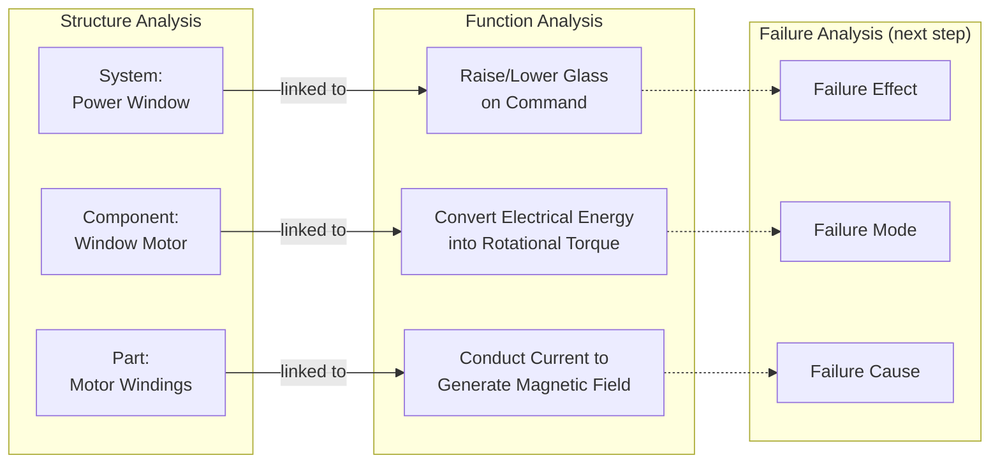

## Linking Structure to Function

### Overview

Linking structure to function is the integration step that formally connects each element of the Structure Tree (or block diagram) to its corresponding function(s) in the Function Tree. This linkage is not a separate diagram but a relational mapping — often represented as a matrix, tree overlay, or database relationship — that ensures every structural element has a defined purpose and every function is traceable to a physical or logical owner. In AIAG-VDA FMEA methodology, this linkage is what allows the analysis to flow systematically from Structure Analysis through Function Analysis into Failure Analysis without gaps.

### Purpose Within FMEA

- Guarantees 1:1 or 1:many traceability between structural elements and functions, preventing "orphan" functions (no structural owner) or "silent" structure elements (no defined function)
- Forms the direct input to Failure Analysis, since failure modes are defined relative to a function, and functions are defined relative to a structural element
- Supports change impact analysis: when a structural element changes (e.g., material substitution), the linked functions immediately show what behaviors are affected
- Enables consistent decomposition depth across structure and function, avoiding mismatched levels of detail
- Required output in the AIAG-VDA 7-step FMEA process (Step 2: Structure Analysis and Step 3: Function Analysis are explicitly linked before Step 4: Failure Analysis begins)

### The Three-Column Linkage Model (AIAG-VDA)

AIAG-VDA formalizes this linkage using a three-level relational structure applied consistently across Structure, Function, and Failure Analysis:

| Level | Structure Analysis | Function Analysis | Failure Analysis |
| --- | --- | --- | --- |
| Higher Level | Next higher structural element (system) | Function of next higher element | Failure Effect (FE) |
| Focus Element | Element being analyzed (subsystem/component) | Function of focus element | Failure Mode (FM) |
| Lower Level | Next lower structural element (part) | Function of next lower element | Failure Cause (FC) |

This "5-Step" or "3x3 matrix" logic ensures that for every focus element, its function is defined in relation to both what it receives from below and what it delivers to the level above — and this same logic later extends into the failure chain (cause → mode → effect).

### Step-by-Step Process for Linking Structure to Function

**Step 1: Align Hierarchy Levels**

Confirm the Structure Tree and Function Tree use matching hierarchy levels (System / Subsystem / Component / Part). Mismatched levels are the most common source of linkage errors.

**Step 2: Assign Function(s) to Each Structural Element**

For every node in the Structure Tree, write at least one function statement describing what that element does. A single structural element may have multiple functions (primary and secondary).

**Step 3: Verify Bidirectional Traceability**

- Structure → Function: Does every block have an assigned function?
- Function → Structure: Does every function trace back to a specific structural owner?

**Step 4: Map Interface Functions to Interface Connections**

Interfaces identified in the block diagram (E/I/M/P) should map to interface-specific functions (e.g., "transmit signal from Sensor to ECU" links the Sensor-ECU interface line to a function statement).

**Step 5: Build or Populate the Linkage Matrix**

In FMEA software or spreadsheet form, create a structure-function matrix where rows are structural elements and columns are functions, with marks indicating ownership.

**Step 6: Validate Against Requirements**

Cross-check that functions linked to each structural element correspond to actual customer requirements, specifications, or regulatory obligations — unlinked requirements indicate missing structure or function elements.

**Step 7: Carry Linkage Forward into Failure Analysis**

Each structure-function pair becomes the anchor for failure mode identification: Focus Element + Focus Function → candidate Failure Modes.

### Example: Structure-Function Linkage Matrix (Power Window System)

| Structural Element | Function 1 | Function 2 |
| --- | --- | --- |
| Window Switch | Convert operator input into control signal | — |
| BCM | Interpret control signal and command motor | Enforce anti-pinch cutoff timing |
| Window Motor | Convert electrical energy into rotational torque | — |
| Regulator Mechanism | Convert rotational torque into linear motion | — |
| Glass Pane | Translate vertically within channel | Maintain seal contact with weatherstrip |
| Wiring Harness | Transmit electrical power/signal without loss | — |

Each row confirms the structural element is fully "covered" by at least one function; each function is traceable to exactly one owning element (or explicitly shared, if applicable).

### Mermaid Diagram: Structure-Function Linkage Flow

### Common Linkage Patterns

**One-to-One**

A single structural element performs exactly one function. Simplest case; common for single-purpose parts (e.g., a fuse: "interrupt circuit at overcurrent threshold").

**One-to-Many**

A single structural element performs multiple functions (e.g., a vehicle door performs "provide occupant ingress/egress," "seal cabin from environment," and "mount window regulator assembly").

**Many-to-One**

Multiple structural elements jointly deliver a single function (e.g., "seal chamber against fluid ingress" may require both a gasket and a housing flange working together).

**Cascading/Hierarchical**

A function at one level is decomposed into multiple sub-functions at the level below, each linked to a different child structural element — this is the standard pattern for multi-level Structure/Function Trees.

### Validation Checks for Correct Linkage

- **No orphan functions:** every function has a structural owner
- **No silent structure:** every structural element has ≥1 function
- **No level mismatch:** function decomposition depth matches structure decomposition depth
- **No duplicate/conflicting ownership:** shared functions across elements are explicitly documented, not accidentally omitted
- **Interface consistency:** every interface line in the block diagram has a corresponding interface function statement
- **Requirements coverage:** every customer/regulatory requirement maps to at least one function, which maps to at least one structural element

### Common Pitfalls

- **Skipping explicit linkage and relying on memory:** In manual/spreadsheet-based FMEAs, teams often skip formally documenting the linkage, which causes failure modes to be identified inconsistently or incompletely later
- **Level mismatch:** Defining structure down to fastener level but function only down to subsystem level, leaving lower-level structure elements functionally undefined
- **Treating secondary functions as optional:** Secondary functions (serviceability, manufacturability, aesthetics) are often left unlinked, causing related failure modes to be missed entirely
- **Not updating linkage after design changes:** When structure changes (e.g., a component is split into two parts), the function linkage must be re-verified, not assumed to carry over automatically
- [Inference] Teams using FMEA software with built-in structure-function-failure relational databases tend to catch orphan functions and silent structure elements more reliably than spreadsheet-based teams, though this depends heavily on tool configuration and reviewer diligence rather than the software alone.

### Tools Commonly Used

- APIS IQ-FMEA, PTC Windchill FMEA, Plato e1ns — maintain structure-function-failure linkage as a relational database, auto-flagging orphan elements
- Spreadsheet-based linkage matrices (Excel) — common in smaller organizations, requires manual validation
- SysML allocation relationships (Block ↔ Activity/Function allocation) — for MBSE-integrated FMEA workflows

**Related Topics**

- Structure trees and system decomposition
- Function trees and functional decomposition
- Building system block diagrams
- AIAG-VDA 7-step FMEA process overview
- Failure mode identification from function loss
- Requirements traceability matrices
- Interface analysis (E/I/M/P classification)