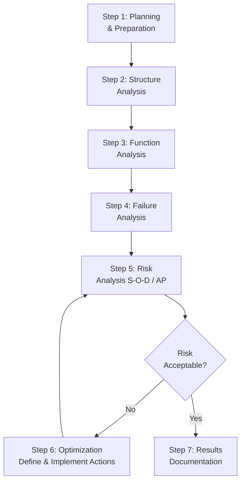

## DFMEA Process Overview

### Overview

Design Failure Mode and Effects Analysis (DFMEA) is a systematic, team-based methodology used to identify and evaluate potential failure modes in a product's design, assess their effects on system performance and safety, and prioritize actions to reduce risk before the design is released to production. DFMEA is performed during the design phase — prior to tooling and production — so identified risks can be mitigated through design changes rather than costly downstream fixes. It is one of the two primary FMEA types alongside Process FMEA (PFMEA), and is widely standardized under AIAG-VDA (Automotive Industry Action Group / Verband der Automobilindustrie) and, in earlier form, AIAG's own FMEA-4 handbook.

### Purpose and Objectives

- Identify potential failure modes of a design and their causes before physical prototypes or production tooling exist
- Assess the severity of failure effects on the end user, downstream processes, and regulatory compliance
- Evaluate the likelihood of occurrence and the design's ability to detect failures before they reach the customer
- Prioritize design risks using a structured risk assessment (Action Priority in AIAG-VDA, or RPN in legacy methodology)
- Drive design improvements, validation testing, and design controls that reduce risk to acceptable levels
- Create a living document that captures design intent, lessons learned, and traceable rationale for design decisions

### When DFMEA Is Performed

DFMEA is a living document initiated early in the design phase (concept/feasibility) and updated iteratively through:

- Concept design
- Detailed design
- Design verification/validation
- Design changes, field issues, or carryover part reuse in new applications

It should be substantially complete before design release/production tooling approval — starting DFMEA after design freeze defeats its preventive purpose.

### AIAG-VDA 7-Step FMEA Process

DFMEA follows the same seven-step structure as PFMEA under the harmonized AIAG-VDA methodology:

| Step | Name | Description |
| --- | --- | --- |
| 1 | Planning and Preparation | Define scope, intent, team, timing, and tools (the "5T": Intent, Timing, Team, Tasks, Tools) |
| 2 | Structure Analysis | Decompose the system into structure tree/block diagram (system, subsystem, component) |
| 3 | Function Analysis | Define functions and requirements for each structural element |
| 4 | Failure Analysis | Identify failure effects, failure modes, and failure causes (the FE-FM-FC chain) |
| 5 | Risk Analysis | Assign Severity (S), Occurrence (O), Detection (D) ratings and determine Action Priority (AP) |
| 6 | Optimization | Define and implement actions to reduce risk; recalculate ratings after actions |
| 7 | Results Documentation | Summarize analysis, communicate results, and archive as a living record |

### The Failure Chain: Effect → Mode → Cause

DFMEA analyzes failure at three linked levels for each function, consistent with the structure-function linkage established earlier in the analysis:

- **Failure Effect (FE):** The consequence of the failure mode as experienced by the end customer, next-higher assembly, or regulatory body (e.g., "loss of steering control")
- **Failure Mode (FM):** The specific manner in which the function fails to meet intent (e.g., "steering gear fractures")
- **Failure Cause (FC):** The design-related root cause that leads to the failure mode (e.g., "insufficient material fatigue strength for load spectrum")

### Risk Assessment: Severity, Occurrence, Detection

**Severity (S)** — rates the seriousness of the failure effect, typically on a 1–10 scale, with 9–10 reserved for effects involving safety or regulatory non-compliance without warning.

**Occurrence (O)** — rates the likelihood the failure cause will occur, based on design experience, similar part history, or engineering judgment (since production data doesn't yet exist at design stage).

**Detection (D)** — rates the effectiveness of current design controls (design reviews, simulation, DVP&R testing, prototype testing) at detecting the failure cause or mode before design release.

**Action Priority (AP)** — AIAG-VDA's replacement for the legacy RPN (Risk Priority Number = S×O×D) calculation. AP uses a lookup table combining S, O, and D to categorize risk as High, Medium, or Low, driving more consistent prioritization than a raw multiplied score. [Unverified] Organizations transitioning from RPN to AP methodology may see materially different prioritization outcomes for the same underlying risk data, since AP explicitly weights severity more heavily than the multiplicative RPN approach; the degree of difference is analysis-specific.

### DFMEA Worksheet Structure (Key Columns)

| Column Category | Contents |
| --- | --- |
| Structure | Item/function hierarchy (system, subsystem, component) |
| Function & Requirements | Function statement and associated requirement/specification |
| Failure Effects | FE, Severity rating, classification (safety/regulatory flag) |
| Failure Mode | Description of how function fails |
| Failure Cause | Design-related root cause, Occurrence rating |
| Current Prevention Controls | Design controls preventing the cause |
| Current Detection Controls | Design controls detecting the cause/mode, Detection rating |
| Action Priority | S/O/D-derived risk category |
| Recommended Actions | Actions to reduce S, O, or D; responsible party; target date |
| Action Results | Post-action S/O/D ratings and status |

### Example: DFMEA Entry (Power Window Motor)

| Element | Value |
| --- | --- |
| Function | Convert electrical energy into rotational torque |
| Failure Mode | Motor fails to rotate |
| Failure Effect | Window does not raise/lower; customer complaint; potential entrapment if mid-cycle |
| Severity | 7 (loss of function, no safety hazard if window already closed) |
| Failure Cause | Brush wear exceeds tolerance under high-cycle usage |
| Occurrence | 4 (moderate, based on similar motor family field history) |
| Current Detection Controls | Accelerated life cycle testing per DVP&R |
| Detection | 5 |
| Action Priority | Medium |
| Recommended Action | Increase brush material hardness spec; validate via extended cycle test |

### Mermaid Diagram: DFMEA Process Flow

### DFMEA Team Composition

Cross-functional participation is essential and typically includes:

- Design/Product Engineer (owns the analysis)
- Reliability/Quality Engineer
- Manufacturing/Process Engineer (design-for-manufacturability input)
- Service/Field Engineer (historical failure data)
- Test/Validation Engineer
- Supplier representative (for critical purchased components)
- Facilitator (for larger, formal FMEA sessions)

### Inputs to DFMEA

- Customer requirements, specifications, and regulatory standards
- System boundary/block diagrams and structure trees
- Function trees and requirement linkage
- Lessons learned, warranty data, and field failure history from similar/predecessor designs
- Design Verification Plan and Report (DVP&R)
- Applicable standards (e.g., ISO 26262 for automotive functional safety, IATF 16949 quality management)

### Outputs of DFMEA

- Prioritized list of design risks with assigned actions
- Input to Design Verification Plan (test coverage should address high-risk failure modes)
- Input to Process FMEA (design-related special characteristics flow into PFMEA control planning)
- Input to Control Plans and manufacturing process controls
- Documented rationale supporting design decisions for audits and future design reuse

### Relationship to Other Design Deliverables

DFMEA does not operate in isolation — it exchanges information bidirectionally with:

- **DVP&R (Design Verification Plan and Report):** test plans should specifically target high-Action-Priority failure modes
- **Design Reviews:** DFMEA findings inform formal design review checklists
- **PFMEA:** special characteristics identified in DFMEA (critical dimensions, safety-related features) become inputs to Process FMEA control strategy
- **Control Plans:** downstream manufacturing controls trace back to DFMEA-identified risks

### Common Pitfalls

- **Starting DFMEA too late:** Performing DFMEA after design freeze removes the ability to act on findings without costly rework
- **Treating DFMEA as a one-time compliance exercise:** Failing to update the living document as design changes, field data, or lessons learned accumulate
- **Confusing DFMEA with PFMEA scope:** Including manufacturing-process-specific failure causes (e.g., "operator error") rather than design-related causes (e.g., "inadequate tolerance stack-up")
- **Overly generic failure causes:** Writing "poor design" instead of specific, actionable root causes tied to design parameters
- **Skipping structure/function linkage:** Jumping directly to failure modes without first establishing structure and function analysis, leading to incomplete failure identification
- [Inference] Teams that maintain DFMEA as a genuinely living document (updated at each design gate/milestone) tend to catch design-related field issues earlier than teams treating it as a static, one-time deliverable, though the specific improvement is organization-dependent and not independently benchmarked here.

### Standards and References

- **AIAG-VDA FMEA Handbook (2019)** — current harmonized standard for automotive DFMEA/PFMEA, introducing the 7-step process and Action Priority methodology
- **AIAG FMEA-4 (legacy)** — prior standard using RPN-based prioritization, still referenced in some non-automotive industries
- **SAE J1739** — surface vehicle recommended practice for potential failure mode and effects analysis
- **IATF 16949** — automotive quality management system standard requiring DFMEA as part of Advanced Product Quality Planning (APQP)

**Related Topics**

- Structure and function analysis (prerequisite steps)
- Severity, Occurrence, and Detection rating scales
- Action Priority vs. RPN methodology
- Design Verification Plan and Report (DVP&R)
- Special characteristics and their flow into PFMEA
- AIAG-VDA 7-step FMEA process
- PFMEA process overview