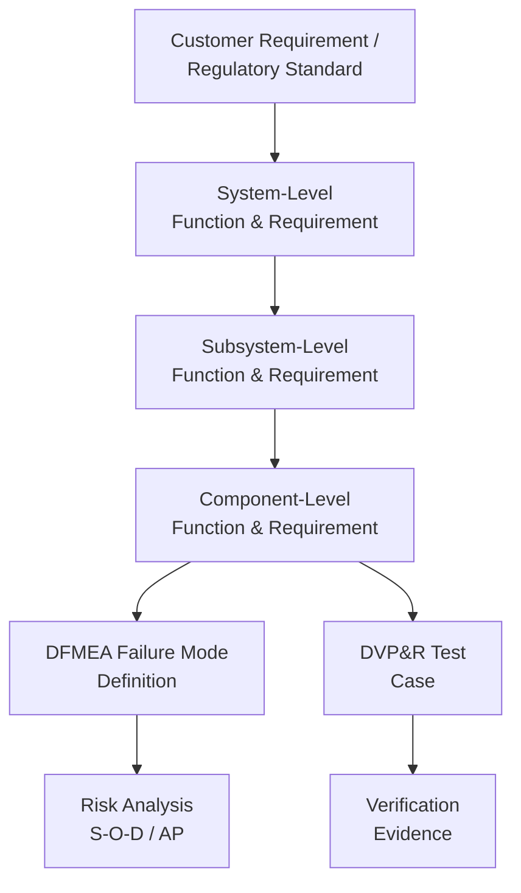

## Identifying Design Functions and Requirements

### Overview

Identifying design functions and requirements is the DFMEA-specific application of Function Analysis (Step 3 of the AIAG-VDA 7-step process), focused on capturing what a design element must do (its function) and the measurable standard it must meet (its requirement). While functional decomposition establishes the hierarchical function tree, this step goes further by explicitly pairing each function with quantified requirements drawn from customer specifications, engineering standards, and regulatory obligations — because DFMEA severity, occurrence, and detection ratings are only meaningful when a function has a defined, verifiable performance target.

### Purpose Within DFMEA

- Establishes the pass/fail criteria against which failure modes are later defined (a failure mode is any deviation from the stated requirement)
- Creates direct traceability from customer/regulatory requirements through to design verification testing (DVP&R)
- Prevents ambiguous or unverifiable functions from propagating into vague, low-value failure mode statements
- Supports severity assignment by distinguishing safety-critical, regulatory, and performance requirements from cosmetic or preference-based ones
- Forms the basis for identifying special characteristics that must be controlled in downstream manufacturing (PFMEA, Control Plan)

### Sources of Design Functions and Requirements

**Customer Requirements (Voice of Customer)**

Explicit and implicit expectations from the end user, translated into engineering language (e.g., "window closes quickly" → "window closes full travel in ≤4 seconds").

**Engineering Specifications**

Internal design standards, material specifications, tolerances, and performance targets set by the design organization.

**Regulatory and Safety Standards**

Legally mandated requirements (e.g., FMVSS for automotive safety, IEC 60601 for medical devices) that override or supplement customer preferences.

**System-Level Requirements Flow-Down**

Requirements allocated from the next-higher system level down to the component being analyzed, ensuring local requirements support system-level performance.

**Interface Requirements**

Requirements governing how the element interacts with neighboring systems, derived from the boundary/block diagram interface analysis (E/I/M/P).

**Manufacturing and Assembly Constraints**

Design-for-manufacturability and design-for-assembly requirements that, while process-related, originate as design requirements (e.g., "accommodate ±0.5mm assembly misalignment").

**Service and Durability Requirements**

Requirements related to expected product lifespan, maintainability, and field serviceability (e.g., "withstand 100,000 actuation cycles").

### Function vs. Requirement: The Distinction

| Element | Definition | Example |
| --- | --- | --- |
| Function | What the element must do (active verb + noun) | "Regulate coolant temperature" |
| Requirement | The measurable standard the function must meet | "Maintain temperature between 90–105°C ±3°C under all operating loads" |

A function without a stated requirement cannot be reliably evaluated for failure — "regulate temperature" alone doesn't indicate whether 89°C or 110°C constitutes failure. AIAG-VDA explicitly pairs function statements with requirements in the Function Analysis worksheet column for this reason.

### Step-by-Step Process for Identifying Functions and Requirements

**Step 1: Gather Requirement Source Documents**

Collect customer specifications, engineering standards, regulatory references, and system-level requirement allocations relevant to the structural element under analysis.

**Step 2: Draft Function Statements per Structural Element**

Using the linked Structure Tree, write one or more function statements for each element (see Function Trees and Functional Decomposition for statement conventions).

**Step 3: Attach Quantified Requirements to Each Function**

For every function, identify the specific numeric, categorical, or binary requirement that defines acceptable performance. Where quantification isn't feasible (e.g., aesthetic requirements), define acceptance criteria as precisely as possible.

**Step 4: Classify Requirement Type**

Tag each requirement as Safety-Critical, Regulatory, Performance, or Preference/Cosmetic — this classification directly informs later Severity rating in Risk Analysis.

**Step 5: Validate Requirement Testability**

Confirm each requirement can be objectively verified through inspection, test, analysis, or demonstration. Untestable requirements should be reworded or flagged for specification clarification.

**Step 6: Cross-Check Against System-Level Flow-Down**

Ensure component-level requirements, when satisfied, collectively enable the parent subsystem/system function and requirement — gaps here indicate missing or incomplete decomposition.

**Step 7: Document Requirement Source/Traceability**

Record the origin of each requirement (specification number, standard clause, customer document) to support audit traceability and future design reuse.

### Example: Function-Requirement Pairs (Power Window System)

| Structural Element | Function | Requirement |
| --- | --- | --- |
| Window Motor | Convert electrical energy into rotational torque | Deliver ≥3.5 Nm stall torque at 12V ±10% |
| Regulator Mechanism | Convert rotational torque into linear glass motion | Move glass 380mm ±5mm in ≤4.5 seconds |
| BCM (anti-pinch logic) | Detect obstruction and reverse motor direction | Detect obstruction force ≥100N and reverse within 0.5 seconds |
| Door Seal | Maintain seal contact against glass edge | Prevent water ingress at ≥80 km/h wind-driven rain per test SAE J1455 |
| Window Switch | Convert operator input into control signal | Register actuation within 50ms of physical press |

Note the anti-pinch requirement above is safety-related (entrapment prevention) and would be flagged as Safety-Critical, driving higher Severity treatment in Risk Analysis regardless of Occurrence likelihood.

### Requirement Classification and Its Downstream Impact

| Classification | Description | Severity Impact |
| --- | --- | --- |
| Safety-Critical | Failure could cause injury or safety hazard without warning | Typically Severity 9–10 |
| Regulatory | Required for legal/certification compliance | Typically Severity 8–9 |
| Performance | Affects core function delivery but not safety | Severity scaled to customer impact (4–8) |
| Preference/Cosmetic | Affects perceived quality but not function | Typically Severity 1–3 |

### Mermaid Diagram: Requirement Traceability Flow

### Handling Ambiguous or Missing Requirements

When a clear requirement doesn't exist for a function:

- Escalate to systems engineering or the customer for clarification before finalizing the DFMEA entry
- Use industry benchmarks, physical/engineering limits, or best-available-standard as an interim requirement, clearly flagged as [Inference] or assumption-based within the worksheet
- Avoid proceeding with an unquantified function into Failure Analysis, since Severity/Occurrence ratings become unreliable without a defined pass/fail threshold
- Document the gap as an action item — missing requirements are themselves a form of design risk

### Best Practices

- **Use SMART-style requirements:** Specific, Measurable, Achievable, Relevant, Time-bound (or condition-bound) wherever possible
- **Separate primary and secondary functions/requirements:** A component's primary function (e.g., structural support) and secondary functions (e.g., corrosion resistance, weight target) should each have distinct requirement statements
- **Reference source documents explicitly:** Cite specification numbers or standard clauses rather than paraphrasing from memory, to preserve traceability and avoid transcription drift
- **Include environmental/operating condition boundaries:** Requirements should specify the conditions under which they apply (temperature range, load conditions, duty cycle) since many failure modes are condition-dependent
- **Involve requirement owners early:** Systems engineers, regulatory affairs, and customer program managers should validate requirement statements before DFMEA proceeds to Failure Analysis

### Common Pitfalls

- **Vague or unquantified functions:** "Provide adequate strength" instead of "withstand 500N static load without permanent deformation"
- **Confusing design intent with requirement:** Describing how the design achieves the function rather than what standard it must meet
- **Omitting secondary/interface requirements:** Focusing only on primary performance requirements while neglecting interface, environmental, or durability requirements that are common failure sources
- **Failing to classify safety/regulatory requirements distinctly:** Treating all requirements uniformly during severity rating, which can under-prioritize safety-critical risks
- **Not updating requirements when specifications change:** Requirement drift between DFMEA and current engineering specifications undermines the analysis's validity
- [Inference] Organizations that maintain a centralized, version-controlled requirements database (rather than requirements embedded only within individual FMEA documents) tend to detect requirement drift and stale DFMEA entries more readily, though this depends on organizational discipline in keeping the database synchronized with active design changes.

### Tools Commonly Used

- Requirements management tools (IBM DOORS, Jama Connect, Polarion) — for formal requirement traceability, often integrated with FMEA software
- APIS IQ-FMEA, PTC Windchill FMEA, Plato e1ns — link function/requirement pairs directly within the structure-function-failure database
- Spreadsheet-based requirement/function matrices — common in smaller organizations without dedicated requirements management tooling

**Related Topics**

- Function trees and functional decomposition
- Linking structure to function
- Special characteristics identification
- Severity, Occurrence, and Detection rating scales
- Design Verification Plan and Report (DVP&R)
- Requirements traceability matrices
- Failure mode identification from function loss