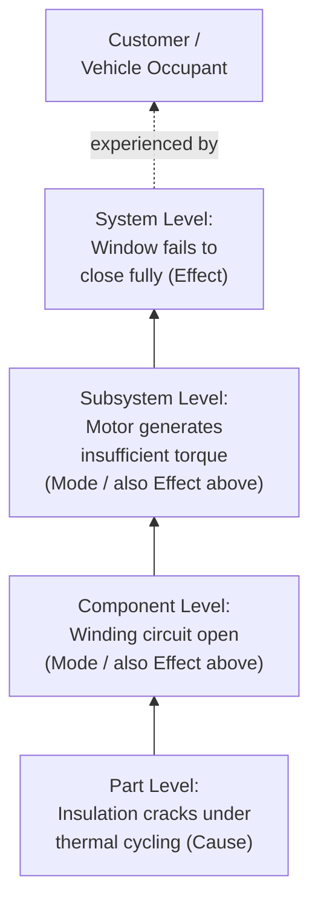

## Potential Failure Modes at Each Design Level

### Overview

Identifying potential failure modes at each design level is the core activity of Failure Analysis (Step 4 of the AIAG-VDA 7-step process) as applied to DFMEA. It involves systematically determining, for every function-requirement pair established in the previous step, the ways in which that function could fail to meet its requirement — at the system, subsystem, component, and part levels. Because failure effects at one level become failure modes at the next-lower level (and failure modes at one level become failure causes at the level below that), this activity must be performed consistently across the full structural hierarchy to produce a coherent, traceable failure chain.

### Purpose Within DFMEA

- Generates the complete set of ways each design function can fail, forming the basis for Severity, Occurrence, and Detection rating
- Establishes the Failure Effect–Failure Mode–Failure Cause (FE-FM-FC) chain required by AIAG-VDA at each hierarchy level
- Ensures failure modes are identified consistently regardless of design maturity, using structured failure mode categories rather than relying solely on engineering intuition
- Supports level-appropriate analysis: system-level effects on the customer, component-level physical failure modes, and part-level root causes
- Prevents the common error of jumping directly from system-level symptoms to root causes without analyzing the intermediate levels

### The Multi-Level Failure Chain

AIAG-VDA structures failure analysis using the same three-level relational logic as Structure and Function Analysis:

| Level | Role in Failure Chain | Example (Power Window) |
| --- | --- | --- |
| Higher Level (System/Subsystem) | Failure Effect (FE) — consequence experienced at this level | "Window fails to close; water ingress into cabin" |
| Focus Level (Component) | Failure Mode (FM) — how the focus element's function fails | "Motor fails to generate torque" |
| Lower Level (Part) | Failure Cause (FC) — root cause originating at this level | "Motor winding insulation breakdown due to thermal cycling" |

Critically, a Failure Mode at the component level is simultaneously the Failure Effect experienced at the system level and is itself caused by a Failure Cause at the part level — the chain links vertically through the entire structure.

### Four Standard Failure Mode Categories

Every function can fail in one of four generic ways, which serve as a checklist for comprehensive failure mode identification at any design level:

**Loss of Function**

The function does not occur at all (e.g., "motor does not rotate," "seal provides no barrier against fluid ingress")

**Degraded Function**

The function occurs but does not meet its full requirement (e.g., "motor rotates below rated torque," "seal permits fluid ingress above allowable rate")

**Intermittent Function**

The function occurs inconsistently or unpredictably (e.g., "motor intermittently loses power under vibration," "signal intermittently drops during transmission")

**Unintended Function**

A function occurs that was not intended, or occurs at the wrong time/condition (e.g., "window continues moving after switch release," "motor reverses direction unexpectedly")

### Step-by-Step Process for Identifying Failure Modes at Each Level

**Step 1: Start at the System/Top Level**

For the top-level function and requirement, identify potential system-level failure effects as experienced by the end customer or next-higher system (these become the highest-level Failure Effects).

**Step 2: Decompose to Subsystem Level**

For each subsystem function/requirement, apply the four failure mode categories to generate candidate failure modes. Each subsystem failure mode should logically produce (or contribute to) one of the system-level failure effects identified in Step 1.

**Step 3: Continue to Component Level**

Repeat at component level. Component failure modes become the Failure Effects for the subsystem level above, maintaining chain continuity.

**Step 4: Continue to Part/Characteristic Level**

At the lowest analyzed level (often part characteristics, material properties, or dimensional tolerances), identify failure causes — the physical, chemical, or design-related root cause mechanisms.

**Step 5: Validate Vertical Consistency**

For every failure mode at a given level, confirm it correctly appears as a failure effect at the level above, and that its associated failure causes correctly appear as failure modes at the level below. Breaks in this chain indicate missing analysis.

**Step 6: Cross-Reference Against Known Failure Mechanisms**

Use historical field data, warranty claims, test failures, and engineering failure mode libraries (e.g., fatigue, corrosion, wear, fracture, electrical short/open) to ensure comprehensive coverage beyond intuition alone.

**Step 7: Flag Safety and Regulatory-Relevant Failure Modes**

Identify failure modes that could result in hazardous outcomes without warning — these require particular rigor in Severity assignment during Risk Analysis.

### Example: Multi-Level Failure Chain (Power Window System)

| Level | Element | Function | Failure Mode | Failure Category |
| --- | --- | --- | --- | --- |
| System | Power Window System | Raise/lower glass on command | Window fails to close fully | Degraded Function |
| Subsystem | Window Motor Assembly | Convert electrical energy into torque | Motor generates insufficient torque | Degraded Function |
| Component | Motor Windings | Conduct current to generate magnetic field | Winding circuit open (no continuity) | Loss of Function |
| Part | Winding Insulation | Maintain dielectric isolation between coil turns | Insulation cracks under thermal cycling | Loss of Function (root cause) |

Reading this chain: insulation cracking (part-level cause) → causes winding short/open (component-level mode, also motor assembly's effect) → causes insufficient torque (subsystem-level mode, also system's effect) → causes window fails to close (system-level effect, experienced by customer).

### Common Design-Level Failure Mode Sources (by Category)

**Mechanical**

Fracture, fatigue crack initiation/propagation, excessive wear, deformation/yielding, buckling, loosening of fasteners, misalignment, binding/seizing

**Electrical/Electronic**

Open circuit, short circuit, intermittent connection, signal noise/interference, component drift out of tolerance, overheating, dielectric breakdown

**Material**

Corrosion, degradation under UV/thermal exposure, creep, embrittlement, incompatible material interaction (galvanic corrosion, chemical attack)

**Software/Firmware (for mechatronic systems)**

Logic error, timing/race condition, sensor input misinterpretation, memory overflow, incorrect state transition

**Interface-Related**

Seal failure, connector fretting/corrosion, tolerance stack-up causing interference or excessive clearance, thermal expansion mismatch at joints

### Mermaid Diagram: Vertical Failure Chain Across Design Levels

### Techniques for Comprehensive Failure Mode Identification

**Failure Mode Checklists/Libraries**

Standardized lists of generic failure modes by component type (e.g., bearing failure modes, connector failure modes, fastener failure modes), often maintained as organizational knowledge bases.

**Historical Data Review**

Warranty claims, field returns, test failures, and 8D/root-cause reports from similar or predecessor designs.

**Brainstorming with Cross-Functional Teams**

Structured brainstorming sessions leveraging diverse expertise (design, manufacturing, service, quality) to surface failure modes not evident from a single discipline's perspective.

**Physics-of-Failure Analysis**

Engineering analysis of stress, thermal, electrical, and environmental loading to predict failure mechanisms analytically, particularly for novel designs lacking field history.

**Fault Tree Analysis (FTA) Cross-Reference**

Using top-down fault tree logic as a complementary technique to validate that DFMEA has captured all credible failure paths to a given top-level event.

### Best Practices

- **Analyze every level, don't skip to root cause:** Jumping directly from system symptom to part-level cause without documenting intermediate levels breaks traceability and can miss valid failure modes
- **Use the four-category checklist systematically:** For each function, explicitly consider loss, degradation, intermittency, and unintended occurrence rather than relying only on the most obvious failure mode
- **Distinguish failure mode from failure cause:** "Motor fails" is too vague; "winding circuit open due to insulation breakdown" separates the mode (open circuit) from the cause (insulation breakdown)
- **Leverage carryover/similar-part data:** For components with field history, prioritize failure modes with documented occurrence over purely hypothetical ones, while still considering new-use-condition risks
- **Maintain consistent terminology across levels:** The same failure mode wording should appear as both a "mode" at its own level and an "effect" at the level above, without paraphrasing that obscures the linkage

### Common Pitfalls

- **Single-level analysis:** Only analyzing failure modes at the component level while ignoring how they cascade to system-level effects, resulting in inaccurate or unsubstantiated Severity ratings
- **Overly narrow failure mode sets:** Considering only "loss of function" while ignoring degraded, intermittent, and unintended function categories, which often represent higher-occurrence and harder-to-detect risks
- **Vague failure mode statements:** "Component fails" provides no actionable basis for occurrence estimation or design action
- **Ignoring interface and environmental failure modes:** Focusing only on the component's internal failure mechanisms while neglecting interface-induced failures (connector corrosion, seal degradation, thermal mismatch)
- **Failure chain discontinuity:** Failure modes and causes that don't logically connect across adjacent levels, indicating gaps in the underlying structure/function analysis
- [Inference] Teams that systematically apply the four-category failure mode checklist at every structural level tend to identify a more complete failure mode set than teams relying primarily on past-experience brainstorming, though the completeness gain is analysis- and team-dependent and not independently quantified here.

### Tools Commonly Used

- APIS IQ-FMEA, PTC Windchill FMEA, Plato e1ns — maintain the FE-FM-FC chain as a linked relational structure across hierarchy levels
- Failure mode libraries/databases (organization-specific or industry-standard, e.g., FMD-91, NPRD) — reference failure rate and mode data for common component types
- Fault Tree Analysis software (e.g., ReliaSoft) — complementary top-down validation of failure mode completeness

**Related Topics**

- Identifying design functions and requirements
- Failure effects and severity assignment
- Failure causes and occurrence assignment
- Special characteristics identification
- Fault Tree Analysis (FTA) as a complementary method
- Severity, Occurrence, and Detection rating scales
- Design Verification Plan and Report (DVP&R)