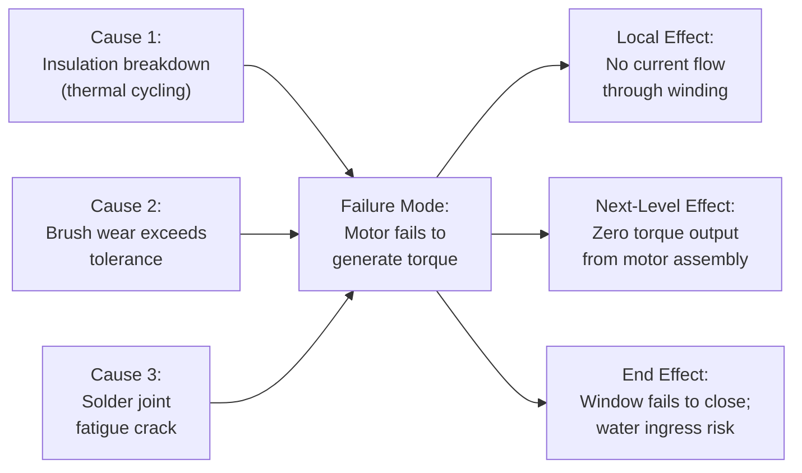

## Linking Failure Modes to Effects and Causes

### Overview

Linking failure modes to effects and causes is the relational step that formally assembles the Failure Effect–Failure Mode–Failure Cause (FE-FM-FC) chain into a coherent, traceable structure for each analyzed element. While identifying potential failure modes generates the candidate set of "what could go wrong," this step establishes the explicit causal relationships: which effects result from which modes, and which causes produce which modes. This linkage is what transforms a flat list of failure possibilities into a structured causal network that supports accurate Severity, Occurrence, and Detection rating in the subsequent Risk Analysis step.

### Purpose Within DFMEA

- Establishes clear, traceable causality between what the customer/next-higher-level experiences (effect), what fails (mode), and why it fails (cause)
- Prevents mismatched or illogical S-O-D ratings that occur when severity is assigned without a clearly linked effect, or occurrence is assigned without a clearly linked cause
- Supports many-to-many relationships: a single failure mode may produce multiple effects, and a single failure cause may produce multiple failure modes
- Enables the failure chain to connect vertically across structural levels, consistent with the Structure-Function-Failure linkage established earlier in the analysis
- Forms the direct basis for Recommended Actions — actions target either the cause (prevent occurrence), the mode (a design change eliminating the failure mechanism), or the detection method (improve ability to catch it before release)

### The FE-FM-FC Relationship Model

| Element | Definition | Governs Which Rating |
| --- | --- | --- |
| Failure Effect (FE) | Consequence of the failure mode as experienced at the next-higher level, end customer, or regulatory body | Severity (S) |
| Failure Mode (FM) | The specific manner in which the function fails to meet its requirement | (Connects S, O, D) |
| Failure Cause (FC) | The design-related mechanism or root cause that produces the failure mode | Occurrence (O) |
| Current Controls | Prevention and Detection controls associated with the cause/mode | Detection (D) |

A single DFMEA worksheet row typically documents one Failure Mode linked to one or more Effects and one or more Causes, with each Cause potentially having its own distinct Prevention and Detection controls and Occurrence/Detection ratings.

### Step-by-Step Process for Linking Failure Modes to Effects and Causes

**Step 1: Start from the Identified Failure Mode**

Take each failure mode identified in the previous step (Failure Analysis) as the anchor point for the linkage exercise.

**Step 2: Identify All Associated Failure Effects**

Ask: "If this failure mode occurs, what happens at the next-higher level, and ultimately to the end customer or regulatory compliance?" A single failure mode may produce multiple effects (local effect, next-level effect, end effect).

**Step 3: Identify All Associated Failure Causes**

Ask: "What design-related mechanisms could produce this failure mode?" Consider material, geometric, tolerance, environmental, and interface-related root causes. A single failure mode may have multiple independent causes.

**Step 4: Verify Vertical Consistency with Adjacent Levels**

Confirm that identified effects match failure modes already documented at the next-higher structural level, and identified causes match failure modes already documented at the next-lower structural level (maintaining the multi-level failure chain).

**Step 5: Link Existing Prevention and Detection Controls to Each Cause**

For each failure cause, identify current design controls that either prevent the cause from occurring (Prevention Controls) or detect it before design release (Detection Controls).

**Step 6: Validate Logical Completeness**

Confirm no effect is listed without a credible causal path from a mode, and no cause is listed without a credible resulting mode — orphaned effects or causes indicate incomplete analysis.

**Step 7: Carry Forward into Risk Analysis**

Each validated FE-FM-FC linkage, together with its associated controls, becomes the input for assigning Severity (per effect), Occurrence (per cause), and Detection (per cause/control pair) ratings.

### Example: FE-FM-FC Linkage (Power Window Motor)

| Failure Effect (multiple, by level) | Failure Mode | Failure Cause (multiple, independent) |
| --- | --- | --- |
| End effect: Window fails to close; potential water ingress into cabin | Motor fails to generate torque | Cause 1: Winding insulation breakdown from thermal cycling |
| Next-level effect: Motor assembly delivers zero torque output |  | Cause 2: Brush wear exceeds tolerance under high-cycle usage |
| Local effect: No current flow through winding circuit |  | Cause 3: Solder joint fatigue crack at winding terminal |

Each cause in this example would typically receive its own row (or sub-row) in the DFMEA worksheet, since each has distinct Prevention Controls, Detection Controls, and Occurrence ratings — even though they share the same failure mode and effects.

### One-to-Many and Many-to-One Linkage Patterns

**One Mode → Multiple Effects**

A single failure mode can cascade to multiple consequences at different levels (local, next-level, end effect) — all must be captured, with Severity typically assigned based on the most severe end effect.

**One Mode → Multiple Causes**

Independent failure mechanisms can each independently produce the same observable failure mode — each cause requires separate Occurrence/Detection assessment since they may have very different likelihoods and current controls.

**Multiple Modes → One Effect**

Different failure modes across different components can converge on the same end-level effect (e.g., both "motor fails" and "wiring harness open circuit" produce "window fails to close") — this pattern is common and expected; it does not imply redundant analysis but reflects genuine multiple failure paths to the same customer-experienced outcome.

**One Cause → Multiple Modes**

A single root cause mechanism (e.g., "connector corrosion") might produce different failure modes depending on which pin or circuit is affected — this should be documented as separate mode entries if the resulting effects differ.

### Mermaid Diagram: FE-FM-FC Linkage Network

### Linking to Prevention and Detection Controls

Once causes are linked to modes, each cause should be paired with its corresponding controls:

| Cause | Prevention Control | Detection Control |
| --- | --- | --- |
| Insulation breakdown from thermal cycling | Design spec requires Class H insulation rated to 180°C | Thermal cycling test per DVP&R Section 4.2 |
| Brush wear exceeds tolerance | Brush material hardness spec (Rockwell ≥85) | Accelerated life cycle test (150,000 cycles) |
| Solder joint fatigue crack | IPC-A-610 Class 2 solder process standard applied | X-ray inspection of solder joints during design validation build |

This pairing is what enables the Detection rating in Risk Analysis — a cause with no linked detection control should receive a poor (high-risk) Detection rating, correctly flagging the gap.

### Best Practices

- **Link at the mechanism level, not the symptom level:** Causes should describe the physical/chemical/design mechanism (e.g., "fatigue crack propagation"), not restate the mode (e.g., "part breaks")
- **Capture the full effect chain, not just the end effect:** Documenting local → next-level → end effect preserves traceability and supports accurate severity classification
- **Treat each independent cause as a separate risk:** Don't average or combine Occurrence/Detection ratings across multiple causes of the same mode — each cause-control pair carries its own risk profile
- **Cross-check against the vertical structure hierarchy:** Effects at one level should match documented modes at the level above; causes at one level should match documented modes at the level below
- **Update linkages when controls change:** If a Prevention or Detection control is added or removed, re-verify the corresponding Occurrence/Detection ratings rather than leaving them stale

### Common Pitfalls

- **Combining multiple causes into one vague statement:** "Various manufacturing and material issues" instead of documenting each mechanism separately with its own controls and ratings
- **Severity assigned without reference to the linked effect:** Rating severity generically rather than basing it explicitly on the worst documented end effect for that failure mode
- **Occurrence assigned without reference to the linked cause:** Estimating occurrence for the failure mode as a whole rather than for each specific cause mechanism, which can mask high-risk individual causes
- **Missing vertical linkage validation:** Failing to confirm that a component-level effect actually appears as a failure mode at the subsystem level, breaking the multi-level failure chain's integrity
- **Detection controls listed without genuine linkage to the specific cause:** Listing a general test as "detection" without confirming it actually targets the specific failure mechanism identified
- [Inference] Analyses that explicitly separate multiple causes into distinct rows with independent Occurrence/Detection ratings tend to produce more actionable, differentiated recommended actions than analyses that group causes together, though the practical benefit depends on team rigor during worksheet completion rather than the linkage method alone.

### Tools Commonly Used

- APIS IQ-FMEA, PTC Windchill FMEA, Plato e1ns — maintain FE-FM-FC as a relational database with automatic vertical consistency checks across structure levels
- Fault Tree Analysis (FTA) software — complementary technique for validating cause-to-effect logical paths, particularly for safety-critical systems
- Spreadsheet-based FMEA templates — require manual discipline to maintain multi-level linkage consistency

**Related Topics**

- Potential failure modes at each design level
- Severity, Occurrence, and Detection rating scales
- Action Priority vs. RPN methodology
- Prevention and detection controls in DFMEA
- Special characteristics identification
- Fault Tree Analysis (FTA) as a complementary method
- Recommended actions and risk reduction strategies