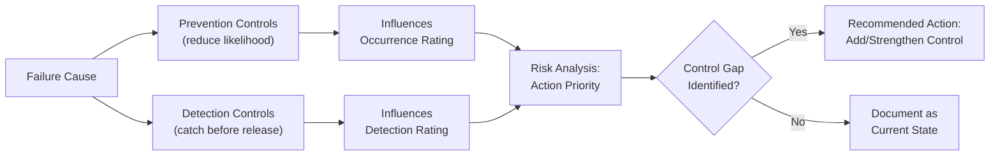

## Design Controls: Prevention and Detection

### Overview

Design controls are the engineering activities, methods, and safeguards already built into (or planned for) the design process to either prevent a failure cause from occurring or detect a failure cause/mode before the design is released to production. Prevention and Detection controls are the two control types documented in every DFMEA worksheet row, and they directly determine the Occurrence (O) and Detection (D) ratings assigned during Risk Analysis. Distinguishing between these two control types — and accurately assessing their real effectiveness — is essential for producing meaningful, actionable risk ratings rather than inflated confidence in an unproven design.

### Purpose Within DFMEA

- Documents what is actually being done (not merely planned) to reduce the likelihood of a failure cause occurring (Prevention)
- Documents what is actually being done to catch a failure cause or mode before it escapes to production or the customer (Detection)
- Provides the evidentiary basis for assigning Occurrence and Detection ratings — ratings should never be assigned without reference to specific, named controls
- Distinguishes robust, systemic controls (e.g., design standards, simulation) from weaker, judgment-based controls (e.g., "engineering review"), which should receive correspondingly different ratings
- Identifies control gaps that become the basis for Recommended Actions in the Optimization step

### Prevention Controls vs. Detection Controls

| Aspect | Prevention Controls | Detection Controls |
| --- | --- | --- |
| Function | Reduce the likelihood the failure cause occurs | Increase the likelihood the failure cause/mode is caught before release |
| Timing | Applied proactively, embedded in design decisions | Applied reactively, during design verification/validation |
| Rating Influenced | Occurrence (O) | Detection (D) |
| Example | Material specification, design standard, safety factor, robust design (DOE) | DVP&R test, simulation/analysis, design review, prototype testing |
| Nature | Eliminates or reduces the root cause mechanism | Identifies the failure before it escapes the design phase |

A well-controlled failure cause ideally has both a strong Prevention control (low Occurrence) and a strong Detection control (low Detection rating) as a defense-in-depth approach — relying on detection alone without prevention leaves the design vulnerable if the detection method itself has gaps.

### Categories of Prevention Controls

**Design Standards and Best Practices**

Established internal or industry design rules (e.g., minimum fillet radii to prevent stress concentration, standard fastener torque specifications, preferred material selection tables)

**Design Margins and Safety Factors**

Intentional over-design relative to expected loads/conditions (e.g., designing to 2x expected fatigue life, derating electrical components below maximum rated values)

**Robust Design Methods**

Design of Experiments (DOE), Taguchi methods, and tolerance design intended to make the design insensitive to variation in manufacturing or use conditions (noise factors)

**Material and Process Selection**

Choosing materials or manufacturing processes inherently less prone to the failure mechanism (e.g., corrosion-resistant alloys, processes with lower residual stress)

**Design Rules Checking (Automated)**

Software-enforced design rule checks (DRC) in CAD/EDA tools that prevent certain classes of design errors from being created in the first place

**Redundancy and Fail-Safe Design**

Architectural approaches that prevent a single failure cause from producing the full failure effect (e.g., redundant sensors, fail-safe defaults)

### Categories of Detection Controls

**Design Reviews**

Formal, structured review of design documentation, drawings, and calculations by qualified reviewers, often using checklists

**Design Verification Testing (DVP&R)**

Physical or simulated testing against defined requirements (e.g., thermal cycling, vibration, life cycle testing, environmental testing)

**Engineering Analysis and Simulation**

Computer-aided analysis such as Finite Element Analysis (FEA), Computational Fluid Dynamics (CFD), tolerance stack-up analysis, or thermal simulation used to predict failure before physical prototypes exist

**Prototype and Pilot Build Testing**

Physical evaluation of early builds under representative conditions to surface failure modes not caught by analysis alone

**Design Failure Mode Verification (DFMV)**

Testing specifically targeted at confirming whether identified failure modes actually occur under the stated conditions, directly closing the loop with DFMEA findings

**Peer Review and Checklist-Based Inspection**

Less formal than structured design review but still a documented detection activity (generally rated as weaker/less effective than test-based detection)

### Step-by-Step Process for Documenting Design Controls

**Step 1: For Each Failure Cause, Identify Existing Prevention Controls**

Review current design standards, specifications, and design practices already applied that reduce the likelihood of the specific cause.

**Step 2: For Each Failure Cause/Mode, Identify Existing Detection Controls**

Review the current Design Verification Plan (DVP&R), simulation plan, and design review process to determine what specifically would catch this cause or mode before release.

**Step 3: Verify Control Specificity**

Confirm each listed control genuinely targets the specific cause/mode in question — a generic "design review" listed for every row without describing what it actually checks provides weak evidentiary basis for a low Detection rating.

**Step 4: Assess Control Timing**

Confirm the detection control occurs early enough in the design process to allow corrective action before production tooling or release — a test performed after design freeze provides little practical risk reduction even if it "detects" the issue.

**Step 5: Rate Detection Effectiveness**

Assign a Detection rating based on the established rating scale, considering both the method's inherent capability (e.g., 100% inspection vs. sample testing) and its proven track record at catching this failure mode type.

**Step 6: Identify Control Gaps**

Flag failure causes with no identified Prevention control, no identified Detection control, or only weak/indirect controls — these become priority candidates for Recommended Actions.

**Step 7: Link Controls to Occurrence and Detection Ratings in Risk Analysis**

Carry the documented controls forward as the explicit justification for the numeric ratings assigned, maintaining traceability for audit and review purposes.

### Example: Prevention and Detection Controls (Power Window Motor)

| Failure Cause | Prevention Control | Detection Control | Detection Rating |
| --- | --- | --- | --- |
| Insulation breakdown from thermal cycling | Class H insulation material spec (180°C rated) per design standard DS-4471 | Thermal cycling test, -40°C to 125°C, 500 cycles, per DVP&R Section 4.2 | 4 (test method well-correlated to field conditions) |
| Brush wear exceeds tolerance | Brush hardness spec (Rockwell ≥85) selected from approved material list | Accelerated life cycle test, 150,000 actuation cycles | 5 (test simulates but may not fully replicate field duty cycle) |
| Solder joint fatigue crack | IPC-A-610 Class 2 process standard specified for assembly | Visual inspection only (no X-ray or dye-penetrant) | 7 (visual inspection has limited ability to detect subsurface cracks) |

Note how the third row's weaker detection method (visual-only) correctly earns a higher (worse) Detection rating, which would elevate its Action Priority and flag it for a Recommended Action (e.g., adding X-ray inspection to the DVP&R).

### Mermaid Diagram: Prevention vs. Detection Control Relationship

### Detection Control Strength Hierarchy (General Guidance)

Detection controls are generally considered progressively stronger (lower/better Detection rating) in roughly this order, though actual rating depends on the specific method's proven correlation to real-world failure conditions:

1. **Weakest:** Visual inspection, informal peer review
2. **Weak-Moderate:** Structured design review with checklist, basic calculation review
3. **Moderate:** Engineering analysis/simulation (FEA, tolerance stack-up) without physical correlation
4. **Moderate-Strong:** Simulation validated against physical test correlation
5. **Strong:** Physical prototype/DVP&R testing under representative conditions
6. **Strongest:** Testing that directly replicates the specific failure mechanism at accelerated/worst-case conditions with proven field correlation

[Unverified] The relative strength ordering above reflects general FMEA practice guidance; actual Detection ratings must be assigned per the organization's specific rating scale and should account for method-specific factors (sample size, test coverage, correlation to field failure modes) rather than category alone.

### Best Practices

- **Document controls with specificity:** Name the actual standard, test procedure, or analysis method (with document/section reference) rather than generic descriptions
- **Distinguish planned vs. implemented controls:** A control that is planned but not yet executed should not receive the same Detection rating credit as one already completed with documented results
- **Prioritize prevention over detection where feasible:** A strong Prevention control (eliminating the cause) is generally more valuable than relying solely on Detection, since detection failures still allow the cause to occur
- **Avoid double-counting weak controls:** Listing multiple weak, overlapping controls (e.g., two informal reviews) does not equal one strong control (e.g., a validated test) for rating purposes
- **Re-evaluate controls after design changes:** A control effective for one design configuration may not remain valid after a material, geometry, or process change

### Common Pitfalls

- **Assigning low Occurrence/Detection ratings without genuine control evidence:** Rating optimistically based on general confidence in the design team rather than documented, specific controls
- **Listing controls that don't yet exist:** Including "planned" tests or reviews as if already completed, inflating apparent risk reduction before verification has actually occurred
- **Generic, non-specific control descriptions:** "Design review" or "testing" without naming what is actually checked, by whom, and against what criteria
- **Relying solely on detection with no prevention:** Designs with only detection controls (and no design margin, standard, or robust design practice) remain fundamentally more prone to the failure cause even if it's usually caught
- **Failing to update controls in the Optimization step:** Recommended Actions that add new controls should result in an updated Detection/Occurrence rating in the "Action Results" section, not just a checkbox that the action was completed
- [Inference] DFMEAs where Detection ratings are cross-checked against actual DVP&R test reports (rather than assigned from the analyst's general impression of the test plan) tend to produce more defensible risk prioritization, though the magnitude of improvement depends on how rigorously the cross-check is performed and is not independently benchmarked here.

### Tools Commonly Used

- APIS IQ-FMEA, PTC Windchill FMEA, Plato e1ns — link controls directly to DVP&R test records and design standard documents within the FMEA database
- DVP&R management systems and test data repositories — provide the evidentiary basis for Detection control documentation
- FEA/CFD simulation software (ANSYS, Abaqus, etc.) — common source of engineering analysis-based detection controls
- Design rule checking tools within CAD/EDA platforms — automated prevention controls for certain failure mode classes

**Related Topics**

- Linking failure modes to effects and causes
- Severity, Occurrence, and Detection rating scales
- Design Verification Plan and Report (DVP&R)
- Action Priority vs. RPN methodology
- Recommended actions and risk reduction strategies
- Special characteristics identification