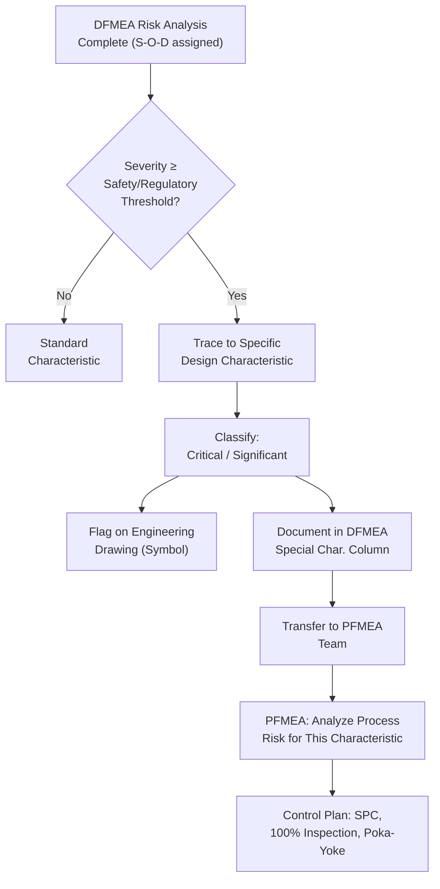

## Identifying Special Characteristics

### Overview

Special characteristics are product features, dimensions, or requirements identified during DFMEA as having a significant impact on safety, regulatory compliance, fit, function, or downstream manufacturability — such that variation in these characteristics warrants additional control beyond standard process capability. Identifying special characteristics is a key output of the Risk Analysis and Optimization steps of DFMEA, and it forms the critical handoff point between Design FMEA and Process FMEA: special characteristics flagged in DFMEA become mandatory inputs to the Control Plan and PFMEA, ensuring that design-critical features receive focused manufacturing process controls.

### Purpose Within DFMEA

- Flags design characteristics whose variation has an outsized effect on safety, function, or regulatory compliance, ensuring they receive elevated attention in manufacturing
- Creates the formal linkage between DFMEA (design risk) and PFMEA/Control Plan (manufacturing risk control), satisfying IATF 16949 and customer-specific requirements for special characteristic management
- Prevents high-severity failure modes traced to design characteristics from being manufactured with only standard (non-differentiated) process controls
- Supports Statistical Process Control (SPC) planning by identifying which characteristics require capability studies, control charts, or 100% inspection
- Provides customers and regulatory bodies visibility into which design features are considered critical, supporting supply chain risk management (particularly for safety-critical automotive, aerospace, and medical device components)

### What Qualifies as a Special Characteristic

A characteristic is typically designated "special" when its variation from nominal could:

- Directly affect compliance with government safety or environmental regulations
- Affect safe vehicle/product function or occupant/user safety without adequate warning
- Significantly affect customer satisfaction with fit, function, or performance
- Require additional process controls to ensure it reliably meets specification (i.e., standard process capability is insufficient)
- Affect the ability to assemble or integrate the part correctly into the next-higher assembly

### Categories of Special Characteristics

Terminology and category definitions vary by industry standard and OEM-specific requirements, but common categories include:

**Critical Characteristic (CC) / Safety Characteristic**

Directly affects compliance with safety regulations or could result in a hazardous condition without warning (e.g., brake caliper mounting bolt torque, airbag deployment timing tolerance)

**Significant Characteristic (SC) / Key Characteristic**

Affects fit, function, durability, or customer satisfaction but does not carry direct safety/regulatory implications (e.g., a dimensional tolerance affecting smooth door closure feel)

**High Impact Characteristic (HIC)**

Terminology used by some OEMs (e.g., General Motors) for characteristics requiring focused manufacturing controls due to significant customer or downstream impact

**Customer-Specific Symbols**

Many automotive OEMs use proprietary symbols/flags in engineering drawings to designate special characteristics (e.g., inverted triangle, diamond with "CC," shield symbol) — DFMEA teams must be familiar with applicable customer-specific requirements (CSRs)

### Step-by-Step Process for Identifying Special Characteristics

**Step 1: Complete Risk Analysis for All Failure Causes**

Special characteristic identification draws directly from the Severity, Occurrence, and Detection ratings already established — it cannot be performed independently of completed Risk Analysis.

**Step 2: Screen for High-Severity Failure Effects**

Identify failure causes linked to failure modes with Severity ratings in the safety-critical or regulatory range (typically Severity 9–10, per organizational rating scale definitions).

**Step 3: Trace High-Severity Effects Back to Specific Design Characteristics**

For each flagged failure cause, identify the specific measurable design characteristic (dimension, material property, tolerance, torque spec, etc.) whose variation drives the failure risk.

**Step 4: Apply Organizational/Customer-Specific Criteria**

Cross-reference against the specific OEM or organizational special characteristic designation criteria, since thresholds and category definitions vary (e.g., some organizations flag any Severity ≥9 cause regardless of Occurrence; others use combined S×O thresholds).

**Step 5: Assign the Appropriate Special Characteristic Classification**

Designate each qualifying characteristic as Critical/Safety, Significant/Key, or per the applicable customer-specific terminology and symbol.

**Step 6: Document on Engineering Drawings and DFMEA**

Special characteristics must be flagged both in the DFMEA worksheet (typically a dedicated column) and on the corresponding engineering drawing/specification using the required symbol or notation.

**Step 7: Transfer to PFMEA and Control Plan**

Communicate all identified special characteristics to the Process FMEA team, ensuring each receives explicit process risk analysis and appropriate manufacturing controls (SPC, 100% inspection, poka-yoke, etc.) in the Control Plan.

### Example: Special Characteristic Identification (Power Window System)

| Design Characteristic | Related Failure Mode | Severity | Special Characteristic Classification | Rationale |
| --- | --- | --- | --- | --- |
| Anti-pinch force threshold calibration (≥100N trigger) | Anti-pinch fails to detect obstruction | 9 | Critical/Safety | Direct entrapment/injury risk without warning if threshold miscalibrated |
| Motor winding insulation thickness | Insulation breakdown causing motor failure | 6 | Significant/Key | Affects function and durability but not immediate safety |
| Regulator arm pivot pin diameter tolerance | Glass binds/misaligns in channel | 4 | Standard (not special) | Affects customer satisfaction (smoothness) but below significant threshold per criteria |
| Door seal compression force spec | Water ingress at high wind-driven rain exposure | 7 | Significant/Key | Affects customer satisfaction and potential secondary damage (electrical short from water ingress) |

### Mermaid Diagram: Special Characteristic Identification and Flow to PFMEA

### Special Characteristics and the Control Plan Linkage

| DFMEA Output | Control Plan Requirement |
| --- | --- |
| Critical/Safety characteristic | Mandatory 100% inspection, error-proofing (poka-yoke), or SPC with tight control limits; often requires customer approval of control method |
| Significant/Key characteristic | SPC monitoring, capability studies (Cpk requirements), periodic audit |
| Standard characteristic | Standard process control per normal capability requirements |

Special characteristic designation directly drives PFMEA Occurrence and Detection rating expectations for the corresponding manufacturing process step — a critical characteristic's process controls must be demonstrably more robust than standard characteristics.

### Best Practices

- **Base classification on documented Risk Analysis, not intuition:** Special characteristic status should trace explicitly to a Severity rating and failure chain already documented in the DFMEA, not be assigned separately based on general impression
- **Apply customer-specific requirements (CSRs) rigorously:** Different OEMs and industries have distinct symbols, terminology, and threshold criteria — using generic criteria risks non-compliance with contractual requirements
- **Limit special characteristic designation to genuinely critical items:** Over-designating characteristics dilutes the focus and resources intended for truly critical features, undermining the purpose of the designation
- **Ensure bidirectional traceability with engineering drawings:** Every special characteristic in DFMEA must appear on the corresponding drawing, and every flagged drawing characteristic must trace back to a DFMEA risk rationale
- **Communicate formally to PFMEA/Control Plan teams:** Special characteristic identification is not complete until explicitly transferred and acknowledged by the process engineering team, closing the DFMEA-to-PFMEA loop

### Common Pitfalls

- **Failing to trace severity back to a specific measurable characteristic:** Flagging a component as "critical" without identifying which specific dimension, tolerance, or property actually drives the risk
- **Inconsistent application of customer-specific criteria:** Using internal thresholds when a specific customer contract requires their own designation criteria and symbols
- **Special characteristics identified in DFMEA but never transferred to PFMEA/Control Plan:** A broken handoff between design and process FMEA teams leaves critical characteristics without corresponding manufacturing controls
- **Over-flagging characteristics:** Designating too many characteristics as "special" dilutes attention and increases inspection/control burden without proportional risk benefit
- **Under-flagging due to optimistic Severity ratings:** If Severity was rated too low during Risk Analysis (e.g., safety implications not fully considered), genuinely critical characteristics may be missed entirely
- [Inference] Organizations with formal, documented special characteristic transfer processes (e.g., a signed handoff checklist between DFMEA and PFMEA teams) likely experience fewer instances of critical characteristics reaching production without adequate process controls, though this depends on organizational process discipline and is not independently benchmarked here.

### Standards and References

- **IATF 16949** — requires formal special characteristic identification, documentation, and control as part of APQP
- **AIAG-VDA FMEA Handbook** — defines special characteristic identification as an output of the Risk Analysis/Optimization steps
- **Customer-Specific Requirements (CSRs)** — OEM-specific documents (e.g., Ford, GM, Stellantis, VW Group) defining proprietary special characteristic symbols and criteria
- **AIAG APQP (Advanced Product Quality Planning) Reference Manual** — governs the special characteristics matrix and its flow into Control Plans

**Related Topics**

- Linking failure modes to effects and causes
- Severity, Occurrence, and Detection rating scales
- Design controls: prevention and detection
- PFMEA process overview
- Control Plan development
- Statistical Process Control (SPC) fundamentals
- Customer-specific requirements (CSR) management