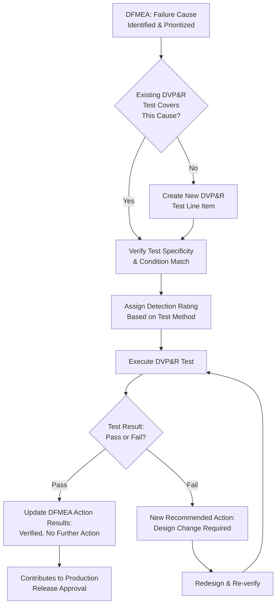

## Linking DFMEA to Design Verification Plans

### Overview

Linking DFMEA to design verification plans establishes the formal, bidirectional traceability between identified design risks and the testing/analysis activities intended to verify that those risks have been adequately mitigated before production release. A Design Verification Plan and Report (DVP&R) documents the specific tests, analyses, and acceptance criteria used to validate that a design meets its requirements; when properly linked to DFMEA, every high-risk failure mode has a corresponding verification activity, and every DVP&R test has a documented rationale tracing back to a specific failure mode it is intended to catch or rule out.

### Purpose Within DFMEA

- Ensures test coverage is risk-based: verification effort is concentrated on failure modes with the highest Action Priority rather than distributed arbitrarily
- Closes the loop between "detection control claimed in DFMEA" and "detection control actually executed and passed" — a DFMEA Detection rating is only as credible as the DVP&R activity it references
- Provides the evidentiary basis for updating Detection ratings and Action Priority after verification testing is completed (the Optimization and Results Documentation steps)
- Supports design release/production approval gates, where DVP&R completion against DFMEA-identified risks is often a formal exit criterion
- Enables efficient test planning by identifying where a single test can serve as detection evidence for multiple related failure causes, avoiding redundant testing

### The DFMEA-DVP&R Relationship

| DFMEA Element | Corresponding DVP&R Element |
| --- | --- |
| Failure Cause | Test/analysis designed to detect or rule out this specific cause |
| Detection Control (listed in DFMEA) | Actual DVP&R test procedure and acceptance criteria |
| Detection Rating | Reflects the proven effectiveness of the linked DVP&R activity |
| Requirement (from Function Analysis) | Test pass/fail criteria in DVP&R |
| Action Priority (High) | Priority/sequencing of the corresponding DVP&R test |
| Recommended Action (add new test) | New DVP&R line item created and tracked to completion |

The relationship is bidirectional: DFMEA informs what DVP&R should test, and DVP&R results feed back into DFMEA to update ratings and close (or reopen) risk items.

### Step-by-Step Process for Linking DFMEA to DVP&R

**Step 1: Extract High-Priority Failure Causes from DFMEA**

Identify failure causes with High or Medium Action Priority (or a Severity/Occurrence combination exceeding the organization's threshold for mandatory verification).

**Step 2: Map Each Failure Cause to an Existing or Planned DVP&R Test**

For each prioritized cause, identify the specific DVP&R line item intended to detect it. If no test exists, this is a gap requiring a new DVP&R entry.

**Step 3: Verify Test Specificity and Coverage**

Confirm the DVP&R test procedure and acceptance criteria genuinely target the specific failure mechanism (not merely a general category of testing that might incidentally catch it).

**Step 4: Cross-Reference Test Conditions Against Failure Cause Conditions**

Ensure test conditions (temperature, load, cycle count, environmental exposure) match or exceed the conditions under which the failure cause is expected to manifest in the field.

**Step 5: Assign or Update Detection Ratings Based on Test Characteristics**

Rate Detection based on the actual test method's proven capability — sample size, pass/fail margin, correlation to field failure mechanisms — not on the mere existence of a test.

**Step 6: Execute DVP&R Testing and Record Results**

Testing proceeds per the DVP&R schedule; results (pass/fail, measured values, failure descriptions if applicable) are documented in the DVP&R report.

**Step 7: Feed Results Back into DFMEA**

Update the DFMEA's Action Results section with the verification outcome. A passed test with strong correlation may justify no further action; a failed test or a test revealing marginal performance becomes a new Recommended Action requiring design change and re-verification.

**Step 8: Close the Loop for Production Release**

Confirm all High Action Priority failure causes have corresponding DVP&R evidence of passing verification before the design is approved for production release/tooling.

### Example: DFMEA-to-DVP&R Linkage (Power Window Anti-Pinch System)

| DFMEA Failure Cause | Action Priority | Linked DVP&R Test | Acceptance Criteria | Detection Rating |
| --- | --- | --- | --- | --- |
| Force threshold miscalibration in anti-pinch algorithm | High | DVP&R-014: Obstruction Force Detection Test | Reverse motor within 0.5s at obstruction force ≥100N, across -40°C to 85°C | 3 (dedicated test, direct correlation to failure mechanism) |
| Motor winding insulation breakdown | Medium | DVP&R-007: Thermal Cycling Endurance Test | No insulation resistance degradation after 500 cycles, -40°C to 125°C | 4 |
| Door seal compression loss over time | Medium | DVP&R-021: Compression Set Test (ASTM D395) | ≤25% compression set after 22hr at 70°C | 5 (indirect correlation; accelerated aging may not fully replicate field UV/ozone exposure) |

### Mermaid Diagram: DFMEA-DVP&R Feedback Loop

### Gap Analysis: Common DFMEA-DVP&R Mismatches

**High-Risk Cause, No Corresponding Test**

A failure cause rated High Action Priority with no identifiable DVP&R line item — represents an unverified risk proceeding toward production without evidence of mitigation.

**Test Exists, But Doesn't Match Failure Conditions**

A DVP&R test exists but its conditions (temperature range, load, cycle count) don't match or exceed the conditions under which the DFMEA failure cause is expected to occur — provides false confidence in the Detection rating.

**Test Exists, But DFMEA Detection Rating Doesn't Reflect It**

A strong, well-correlated test exists, but the DFMEA Detection rating was assigned generically without referencing the actual test capability, potentially over- or under-stating real risk.

**Redundant Testing Without Risk Justification**

Multiple overlapping tests covering the same failure cause without added detection value, consuming verification resources that could address genuine coverage gaps elsewhere.

### Best Practices

- **Maintain a formal traceability matrix:** A structured cross-reference (spreadsheet or FMEA software module) mapping each DFMEA failure cause to its DVP&R test ID(s) prevents gaps from going unnoticed
- **Prioritize verification resources by Action Priority:** High Action Priority causes should have verification scheduled earliest and with the most rigorous test conditions
- **Match test conditions to worst-case field conditions:** Verification tests should reflect the most severe credible use/environmental conditions, not merely nominal conditions
- **Treat DVP&R results as living inputs to DFMEA, not a one-way handoff:** Test failures must trigger DFMEA updates (new recommended actions, revised ratings), not just DVP&R report revisions in isolation
- **Review linkage at each design gate:** As the design matures (concept → detailed design → validation), re-verify that DFMEA-DVP&R linkage remains current, since new failure modes or design changes can outpace an established test plan

### Common Pitfalls

- **Assigning strong Detection ratings without verifying the linked test actually exists and is scheduled:** Optimistic Detection ratings based on planned but unconfirmed testing
- **Treating DVP&R as an independent document with no active linkage back to DFMEA:** Common in less mature organizations where design and test teams operate without formal cross-referencing
- **Failing to update DFMEA after a DVP&R test failure:** Leaving the DFMEA in its pre-test state despite new evidence that a failure cause is more likely or less controlled than originally rated
- **Testing to generic industry standards without confirming applicability to the specific failure mechanism:** A standard test (e.g., generic vibration profile) may not adequately replicate the specific failure cause identified in DFMEA
- **Closing DFMEA action items based on test scheduling rather than test completion and passing results:** Marking an action "closed" when the test is merely planned, not executed and verified
- [Inference] Organizations using integrated DFMEA-DVP&R software modules (rather than maintaining the two as separate documents) likely experience fewer undetected coverage gaps, since automated cross-referencing surfaces unlinked high-risk causes more reliably than manual review; the magnitude of this benefit is organization-specific and not independently quantified here.

### Tools Commonly Used

- APIS IQ-FMEA, PTC Windchill FMEA, Plato e1ns — often include integrated DVP&R modules with direct linkage to DFMEA failure causes
- Requirements/test management tools (Jama Connect, IBM DOORS, Polarion) — support formal traceability matrices linking requirements, DFMEA risks, and verification test cases
- Test data management systems — store DVP&R execution results and link back to originating risk items for closed-loop tracking

**Related Topics**

- Identifying design functions and requirements
- Design controls: prevention and detection
- Severity, Occurrence, and Detection rating scales
- Action Priority vs. RPN methodology
- Special characteristics identification
- Recommended actions and risk reduction strategies
- DFMEA process overview