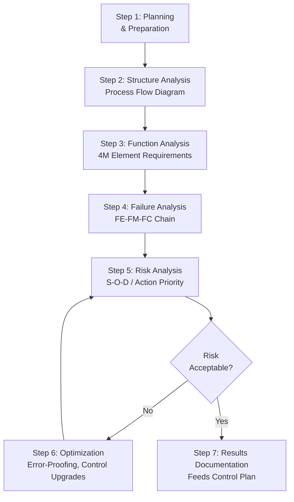

## PFMEA Process Overview

### Overview

Process Failure Mode and Effects Analysis (PFMEA) is a systematic, team-based methodology used to identify and evaluate potential failure modes in a manufacturing or assembly process, assess their effects on product quality and safety, and prioritize actions to reduce risk before the process is released to full production. PFMEA is performed during process design and planning — using the Design FMEA, special characteristics, and Design Verification results as key inputs — so that process risks are mitigated through process controls, error-proofing, and Control Plan development before parts are manufactured at volume. PFMEA is the process-focused counterpart to DFMEA and, under the harmonized AIAG-VDA methodology, follows the same 7-step structure.

### Purpose and Objectives

- Identify potential failure modes at each manufacturing/assembly process step and their process-related causes
- Assess the severity of failure effects on the end customer, next operation, and regulatory compliance
- Evaluate the likelihood of occurrence based on process capability, historical data, and process design
- Evaluate the effectiveness of current process controls at preventing or detecting the failure before it escapes the process step or reaches the customer
- Prioritize process risks using Action Priority (or legacy RPN) and drive corrective actions, error-proofing, and control plan development
- Ensure special characteristics identified in DFMEA receive appropriately robust process controls

### When PFMEA Is Performed

PFMEA is initiated during process design/planning, typically after DFMEA outputs (especially special characteristics) are available, and before process validation and production part approval. It is updated iteratively through:

- Process concept and layout design
- Detailed process/tooling design
- Process validation (run-at-rate, capability studies)
- Production launch and subsequent process changes, quality issues, or continuous improvement activities

Like DFMEA, PFMEA is a living document — it should be substantially complete before Process Validation/PPAP (Production Part Approval Process) submission, and it must be revisited whenever the process, equipment, or materials change.

### AIAG-VDA 7-Step FMEA Process (Applied to PFMEA)

| Step | Name | PFMEA-Specific Focus |
| --- | --- | --- |
| 1 | Planning and Preparation | Define process scope, intent, team, timing, tools (5T) |
| 2 | Structure Analysis | Build the Process Flow Diagram; decompose into process steps and 4M/5M elements (Man, Machine, Material, Method, Environment) |
| 3 | Function Analysis | Define the function/requirement of each process step and each 4M element |
| 4 | Failure Analysis | Identify failure effects, failure modes, and failure causes (process-related) |
| 5 | Risk Analysis | Assign Severity (S), Occurrence (O), Detection (D); determine Action Priority (AP) |
| 6 | Optimization | Define and implement process actions (error-proofing, control upgrades); recalculate ratings |
| 7 | Results Documentation | Summarize analysis; feed directly into the Control Plan |

### The Process Flow Diagram as Structure Analysis

Unlike DFMEA's block diagram, PFMEA's Structure Analysis step uses a **Process Flow Diagram**, representing sequential operations from receipt of raw material/incoming parts through final shipment. Each process step becomes a "block" in the structure, decomposed further into its 4M/5M elements.

### The 4M/5M Framework for Process Elements

Each process step is analyzed across contributing input categories, commonly called 4M (or extended to 5M/6M):

| Element | Description | Example Failure Sources |
| --- | --- | --- |
| Man | Operator actions, skill, training | Incorrect assembly sequence, missed step |
| Machine | Equipment, tooling, fixtures | Tool wear, fixture misalignment, equipment malfunction |
| Material | Incoming parts, raw materials | Out-of-spec material, wrong part used |
| Method | Process procedure, work instructions | Incorrect torque sequence, missing inspection step |
| Environment (5th M) | Ambient conditions affecting the process | Temperature/humidity affecting curing, contamination |
| Measurement (6th M, sometimes added) | Gauging and inspection accuracy | Miscalibrated gauge, incorrect sampling plan |

### The Failure Chain in PFMEA: Effect → Mode → Cause

| Level | Role | Example (Motor Winding Assembly Process) |
| --- | --- | --- |
| Next Higher Level | Failure Effect (FE) | "Motor fails functional test at end-of-line" |
| Focus Process Step | Failure Mode (FM) | "Winding wire insulation damaged during winding operation" |
| Process Input (4M) | Failure Cause (FC) | "Winding machine tension setting out of spec (Machine)" |

### Example: PFMEA Entry (Winding Operation)

| Element | Value |
| --- | --- |
| Process Step | Automated wire winding |
| Function/Requirement | Wind copper wire onto stator core at specified tension (2.5–3.0 N) without insulation damage |
| Failure Mode | Wire insulation damaged (nicked/abraded) during winding |
| Failure Effect | Motor short circuit at end-of-line test; scrap or field failure if undetected |
| Severity | 7 |
| Failure Cause | Winding machine tension setting drifted above 3.5N (Machine) |
| Occurrence | 3 |
| Current Prevention Control | Preventive maintenance schedule for tensioner calibration |
| Current Detection Control | In-line tension monitoring with automatic stop on out-of-range reading |
| Detection | 2 |
| Action Priority | Low (following control implementation) |

### Mermaid Diagram: PFMEA Process Flow

### PFMEA Team Composition

- Manufacturing/Process Engineer (typically owns the analysis)
- Quality Engineer
- Design Engineer (provides DFMEA special characteristics and design intent)
- Production/Operations personnel (floor-level process knowledge)
- Tooling/Equipment Engineer
- Maintenance representative
- Supplier representative (for outsourced process steps)

### Inputs to PFMEA

- DFMEA outputs, especially special characteristics requiring focused process control
- Process Flow Diagram
- Design requirements and drawings/specifications
- Historical process data: capability studies (Cpk), scrap/rework data, warranty/field data from similar processes
- Applicable regulatory and customer-specific requirements (CSRs)
- Lessons learned from similar processes or prior launches

### Outputs of PFMEA

- Prioritized list of process risks with assigned corrective/preventive actions
- Direct input to the Control Plan, which documents the ongoing process controls, inspection frequency, and reaction plans
- Input to work instructions and operator training requirements
- Justification for error-proofing (poka-yoke) investment decisions
- Documented rationale supporting process design for audits, PPAP submission, and future process reuse

### Relationship to Other Process Deliverables

- **Control Plan:** The primary downstream deliverable; every PFMEA failure cause with an assigned control should appear in the Control Plan with matching control method, sample size, and reaction plan
- **Work Instructions:** Operator-level procedures should reflect PFMEA-identified prevention controls (e.g., specific torque values, inspection checkpoints)
- **DFMEA:** Special characteristics flow from DFMEA into PFMEA as mandatory analysis items requiring elevated process control rigor
- **PPAP (Production Part Approval Process):** PFMEA and Control Plan are standard required elements of a PPAP submission package in automotive supply chains

### Common Pitfalls

- **Confusing PFMEA scope with DFMEA scope:** Including design-related causes (e.g., "insufficient wall thickness") rather than process-related causes (e.g., "injection molding pressure out of spec") — PFMEA assumes the design is correct and analyzes only how the process could fail to produce it correctly
- **Starting PFMEA without a completed Process Flow Diagram:** Skipping structure analysis leads to incomplete or misaligned failure mode identification
- **Ignoring special characteristics from DFMEA:** Failing to apply elevated scrutiny and control rigor to characteristics flagged as critical/significant in the design phase
- **Generic 4M cause statements:** "Operator error" without specifying which action, under what condition, is insufficiently actionable for control plan development
- **Treating PFMEA as a one-time PPAP requirement:** Not updating PFMEA when process changes, equipment changes, or quality escapes occur post-launch
- [Inference] Manufacturing sites that maintain PFMEA as an actively updated document tied to their change management process (rather than a static PPAP artifact) tend to catch process drift and new failure modes earlier, though the degree of improvement depends on organizational discipline and is not independently benchmarked here.

### Standards and References

- **AIAG-VDA FMEA Handbook (2019)** — current harmonized standard defining the 7-step PFMEA process
- **AIAG FMEA-4 (legacy)** — prior RPN-based standard, still referenced in some non-automotive industries
- **IATF 16949** — requires PFMEA as part of Advanced Product Quality Planning (APQP) and links it to Control Plan and PPAP requirements
- **AIAG APQP Reference Manual** — governs the overall product/process development flow within which PFMEA sits

**Related Topics**

- Process flow diagrams and structure analysis
- 4M/5M analysis for process failure causes
- Severity, Occurrence, and Detection rating scales (process context)
- Special characteristics identification
- Control Plan development
- Error-proofing and poka-yoke methods
- DFMEA process overview