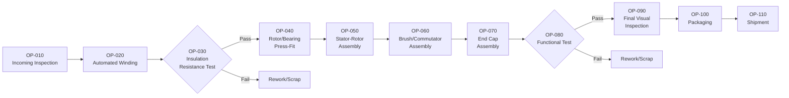

## Process Flow Diagrams as Inputs

### Overview

The Process Flow Diagram (PFD) is the foundational input artifact for PFMEA, serving the same structural role that the block diagram serves for DFMEA. It sequentially maps every operation a product undergoes from incoming material/parts through final shipment, and it forms the Structure Analysis (Step 2 of the AIAG-VDA 7-step process) upon which all subsequent Function, Failure, and Risk Analysis in PFMEA is built. Without a complete, validated Process Flow Diagram, PFMEA cannot systematically ensure every process step and every 4M/5M contributing element has been analyzed.

### Purpose Within PFMEA

- Establishes the complete scope of the manufacturing/assembly process to be analyzed, preventing omitted process steps
- Provides the sequential structure that PFMEA decomposes into function, failure mode, and risk analysis at each step
- Identifies material flow, information flow, and process interdependencies that are common sources of process-related failure causes
- Serves as the shared visual reference for cross-functional PFMEA teams (process engineering, quality, manufacturing, maintenance)
- Forms the backbone that the Control Plan later mirrors — Control Plan rows typically correspond 1:1 to Process Flow Diagram steps

### Process Flow Diagram vs. Block Diagram

| Aspect | DFMEA Block Diagram | PFMEA Process Flow Diagram |
| --- | --- | --- |
| Represents | Physical/functional system structure | Sequential process operations |
| Organizing principle | Spatial/hierarchical (system → subsystem → component) | Temporal/sequential (step 1 → step 2 → step N) |
| Primary elements | Components, subsystems, interfaces | Process steps, material flow, 4M inputs |
| Typical shape | Network/hierarchy diagram | Linear or branching flowchart |

### Core Elements of a Process Flow Diagram

| Element | Description | Visual Convention |
| --- | --- | --- |
| Process step (operation) | A discrete manufacturing or assembly action | Rectangle |
| Inspection/verification step | A dedicated quality check point | Diamond or distinct shape |
| Decision point | A branch based on inspection result (pass/fail, sort) | Diamond |
| Material flow arrow | Direction of part/material movement between steps | Solid arrow |
| Storage/buffer/WIP | Work-in-process holding point between operations | Triangle or distinct symbol |
| Transport/movement | Physical movement of material between locations | Dashed arrow or truck/movement symbol |
| Rework/scrap loop | Path for non-conforming material | Dashed loop back to rework, or exit to scrap |

### Step-by-Step Process for Building a Process Flow Diagram

**Step 1: Define Process Scope Boundaries**

Determine the starting point (e.g., receipt of raw material or incoming component) and ending point (e.g., shipment to customer or next internal process) of the analysis.

**Step 2: List All Process Steps in Sequence**

Walk the actual physical process (via gemba walk/floor observation, not assumption) and document every operation in the order it occurs, including non-value-added steps like transport and storage.

**Step 3: Include All Operation Types**

Capture value-added operations (machining, forming, assembly, welding), inspection/verification steps, material handling/transport, and storage/buffer points — omitting non-value-added steps causes their associated risks (damage during transport, contamination during storage) to be missed later.

**Step 4: Identify Decision Points and Branches**

Document inspection-driven branches (pass continues to next operation; fail routes to rework or scrap) and any process variants (e.g., different routing for different product variants on a shared line).

**Step 5: Number Each Process Step**

Assign sequential operation numbers (e.g., OP-010, OP-020) consistent with the numbering convention used in the Control Plan and shop floor documentation, supporting traceability.

**Step 6: Validate on the Shop Floor**

Confirm the diagram matches actual current practice (not merely the documented/idealized process) by walking the line with operators and process engineers — a common source of PFMEA gaps is a flow diagram that reflects intended rather than actual practice.

**Step 7: Identify 4M Inputs for Each Step**

For each process step, note the relevant Man, Machine, Material, Method, and Environment inputs that will be analyzed for failure causes in subsequent PFMEA steps.

**Step 8: Review and Approve with Cross-Functional Team**

Validate completeness with manufacturing engineering, quality, and production personnel before proceeding to Function Analysis.

### Example: Process Flow Diagram (Motor Assembly Line)

**Scope:** Receipt of stator core through packaged motor assembly, ready for shipment.

**Sequential steps:**

1. OP-010: Incoming inspection (stator core, rotor, housing)
2. OP-020: Automated wire winding (stator)
3. OP-030: Winding insulation resistance test (inspection)
4. OP-040: Rotor/bearing press-fit assembly
5. OP-050: Stator-rotor assembly into housing
6. OP-060: Brush/commutator assembly (if applicable)
7. OP-070: End cap assembly and fastening
8. OP-080: Functional test (torque, current draw, rotation)
9. OP-090: Final visual inspection
10. OP-100: Packaging
11. OP-110: Shipment

### Mermaid Diagram: Process Flow Diagram Example

### Linking Process Flow Diagram to PFMEA Structure Analysis

Each process step in the flow diagram becomes a node in the PFMEA Structure Tree, decomposed into its 4M elements:

| Process Flow Element | PFMEA Structure Tree Level | 4M Sub-elements Analyzed |
| --- | --- | --- |
| Process (overall line) | Level 1 (Process) | — |
| OP-020: Automated Winding | Level 2 (Process Step/Operation) | Man, Machine, Material, Method, Environment |
| Winding Machine Tension Setting | Level 3 (4M Element) | — (this is itself an analyzed input) |

This structural decomposition mirrors DFMEA's system → subsystem → component hierarchy, but organized by process sequence and 4M category rather than physical assembly.

### Including Non-Value-Added Steps: Why It Matters

Transport, storage, and handling steps are frequently omitted from simplified process flow diagrams, but they are common sources of real-world failure causes:

| Non-Value-Added Step | Example Failure Cause |
| --- | --- |
| Transport between operations | Part damage from handling; contamination during transit |
| WIP storage/buffer | Corrosion during extended dwell time; FIFO violation causing use of aged material |
| Manual material handling | Mix-up between similar-looking parts/variants |
| Packaging/unpackaging between operations | ESD damage to electronic components during handling |

Excluding these steps from the Process Flow Diagram means PFMEA systematically cannot identify their associated risks, since Failure Analysis only examines what appears in the Structure Analysis.

### Best Practices

- **Base the diagram on actual observed practice, not the documented ideal:** Gemba walks and direct operator interviews frequently reveal deviations from written work instructions that must be captured
- **Include all process variants:** If the line produces multiple product variants with different routing, ensure the flow diagram captures each variant's path or clearly notes where paths diverge
- **Maintain consistent operation numbering with the Control Plan:** Using matching OP numbers across Process Flow Diagram, PFMEA, and Control Plan prevents traceability confusion
- **Capture inspection points explicitly:** Don't fold quality checks silently into adjacent operations — explicit inspection steps are analyzed distinctly in PFMEA for their own Detection-related risks
- **Update the diagram when the process changes:** Equipment changes, layout changes, or new inspection points must be reflected before the corresponding PFMEA update

### Common Pitfalls

- **Diagramming the intended process rather than the actual process:** Leads to PFMEA analysis of a process that doesn't match shop floor reality, missing genuine failure causes
- **Omitting transport, storage, and material handling steps:** Causes systematic under-identification of handling and dwell-time-related failure causes
- **Insufficient decomposition granularity:** Combining multiple distinct operations into a single overly broad "block" prevents meaningful failure mode identification at the operation level
- **Missing decision points/rework loops:** Failing to show inspection-driven branching hides where non-conforming material could bypass required checks
- **Diagram not updated after process changes:** A stale Process Flow Diagram undermines the validity of the entire downstream PFMEA and Control Plan
- [Inference] Teams that validate their Process Flow Diagram through direct floor observation (rather than relying solely on engineering documentation) likely identify a more complete and accurate set of process steps, though the degree of improvement is organization-specific and not independently benchmarked here.

### Tools Commonly Used

- Microsoft Visio, Lucidchart, draw.io — general-purpose flowcharting
- Dedicated FMEA software (APIS IQ-FMEA, Plato e1ns, PTC Windchill FMEA) — often auto-link Process Flow Diagram steps directly to PFMEA Structure Analysis and Control Plan rows
- Value Stream Mapping (VSM) tools — sometimes used as a complementary or source input for the Process Flow Diagram, particularly in Lean manufacturing environments

**Related Topics**

- PFMEA process overview
- 4M/5M analysis for process failure causes
- Building system block diagrams (DFMEA comparison)
- Control Plan development
- Special characteristics identification
- Error-proofing and poka-yoke methods