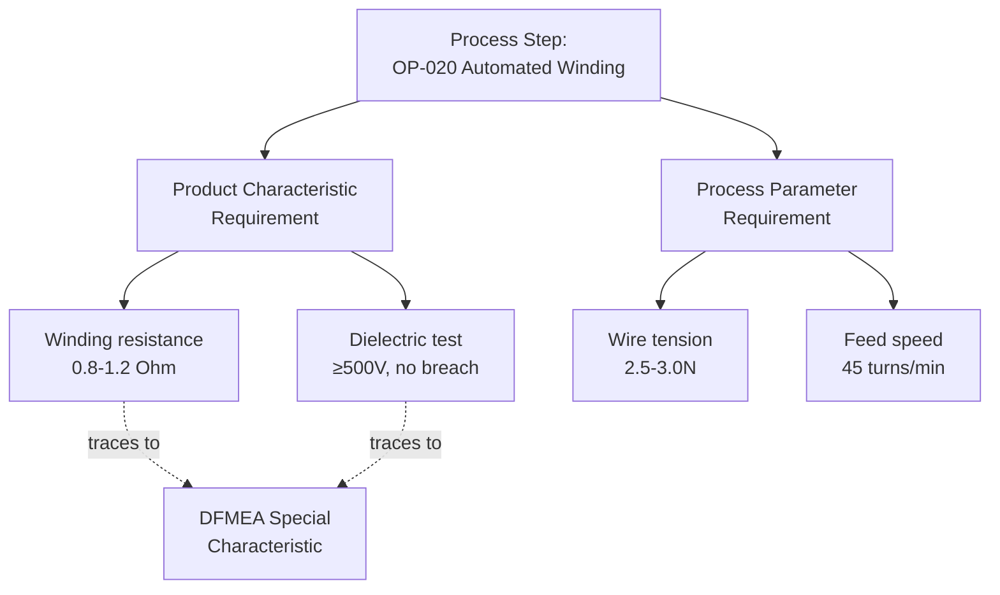

## Process Function and Requirement Identification

### Overview

Process function and requirement identification is the Function Analysis step (Step 3 of the AIAG-VDA 7-step process) applied to PFMEA. For every process step and its contributing 4M/5M elements identified in the Process Flow Diagram, this step defines what the process step must accomplish (its function) and the measurable standard it must meet (its requirement). Because PFMEA assumes the design is correct, process functions describe how the process must execute to faithfully produce the design intent — process requirements are the manufacturing-side translation of design requirements, combined with process-specific targets like cycle time, yield, and process capability.

### Purpose Within PFMEA

- Establishes the pass/fail criteria against which process failure modes are later defined — a failure mode is any deviation of the process step from its stated requirement
- Creates traceability from design requirements (via DFMEA) through to process execution, ensuring manufacturing faithfully delivers design intent
- Distinguishes product characteristic requirements (what the part must be) from process parameter requirements (how the process must run) — both are needed for complete failure analysis
- Supports accurate Severity assignment by clarifying whether a given process function failure affects product characteristics, throughput, safety, or regulatory compliance
- Forms the basis for Control Plan specification limits, inspection criteria, and process parameter targets

### Two Categories of Process Requirements

**Product Characteristic Requirements**

The measurable properties the part/assembly must exhibit as a result of the process step (e.g., "weld penetration depth ≥2.0mm," "torque applied 8–10 N·m," "surface finish Ra ≤1.6μm")

**Process Parameter Requirements**

The operating conditions/settings the process itself must maintain to reliably produce the product characteristic (e.g., "welding current 180–200A," "torque wrench calibrated to ±2% accuracy," "cutting speed 1200 RPM ±50")

Both types must be identified: a process can have well-controlled parameters yet still fail to meet the product characteristic if the parameter-to-characteristic relationship isn't fully understood or validated (e.g., unaccounted-for material variation).

### Function Statement Convention for Process Steps

Similar to DFMEA function statements, but framed around process action and outcome:

**Format:** [Process Verb] + [Product/Material] + [Method/Condition] + [Requirement/Target]

**Examples:**

- "Apply torque to fastener at 8–10 N·m using calibrated pneumatic driver"
- "Weld seam continuously with penetration depth ≥2.0mm at travel speed 15 cm/min"
- "Wind copper wire onto stator core at tension 2.5–3.0N for 450 turns"
- "Cure adhesive bond at 80°C ±5°C for 30 minutes ±2 minutes"

### Sources of Process Functions and Requirements

**DFMEA Outputs and Special Characteristics**

Product characteristics flagged as special (critical/significant) in DFMEA directly translate into process requirements demanding elevated process control rigor.

**Engineering Drawings and Specifications**

Dimensional tolerances, material specifications, and assembly requirements defined by design engineering.

**Process Capability Studies and Historical Data**

Known process capability (Cpk) for similar operations informs realistic, achievable process parameter targets.

**Equipment/Tooling Specifications**

Manufacturer-specified operating ranges for machines, tools, and fixtures used in the process step.

**Regulatory and Industry Standards**

Process-specific standards governing welding, soldering, adhesive bonding, heat treatment, etc. (e.g., AWS D1.1 for welding, IPC-A-610 for electronics assembly).

**Customer-Specific Requirements (CSRs)**

OEM-specific process requirements, particularly for safety-critical or regulated processes.

### Step-by-Step Process for Identifying Process Functions and Requirements

**Step 1: Reference the Process Flow Diagram**

Take each process step in sequence as the unit of analysis.

**Step 2: Identify the Product Characteristic(s) Produced by This Step**

Determine what measurable property of the part/assembly results from this operation, tracing back to design requirements and special characteristics where applicable.

**Step 3: Identify the Process Parameter(s) That Control That Characteristic**

Determine the specific machine settings, method steps, or environmental conditions that must be maintained to reliably achieve the product characteristic.

**Step 4: Quantify Both Characteristic and Parameter Requirements**

Attach specific numeric ranges, tolerances, or pass/fail criteria to each — avoiding vague statements that cannot be objectively verified.

**Step 5: Cross-Reference Special Characteristics from DFMEA**

Confirm which product characteristics produced by this step are flagged as Critical/Significant, since these require the most rigorous requirement definition and, later, the most robust process controls.

**Step 6: Validate Requirement Achievability Against Process Capability**

Check whether current or planned process capability data supports reliably meeting the stated requirement — an unachievable requirement indicates either a process capability gap (requiring investment) or an overly tight specification (requiring engineering review).

**Step 7: Document Requirement Source and Traceability**

Record the origin of each requirement (drawing number, specification, DFMEA reference, standard clause) to support audit traceability.

### Example: Process Function-Requirement Pairs (Motor Winding Operation)

| Process Step | Function | Product Characteristic Requirement | Process Parameter Requirement |
| --- | --- | --- | --- |
| OP-020: Automated Winding | Wind copper wire onto stator core without insulation damage | Winding resistance 0.8–1.2Ω; no insulation breach (dielectric test ≥500V) | Wire tension 2.5–3.0N; wire feed speed 45 turns/min |
| OP-040: Rotor/Bearing Press-Fit | Press bearing onto rotor shaft to specified interference fit | Bearing seated flush ±0.05mm; no visible bearing race damage | Press force 800–1000N; press speed ≤5mm/sec |
| OP-070: End Cap Fastening | Secure end cap to housing at specified clamp load | Fastener torque 8–10 N·m; no cross-threading | Torque wrench calibration ±2%; fastener rundown angle 45–60° |

Note how each row pairs a product characteristic (what the part must be) with the corresponding process parameter (how the process must run to achieve it) — both are needed to fully define the function/requirement for failure analysis.

### Mermaid Diagram: Process Function-Requirement Structure

### Linking Process Requirements to DFMEA Special Characteristics

| DFMEA Special Characteristic | Process Step Affected | Process Requirement Derived |
| --- | --- | --- |
| Anti-pinch force threshold calibration (Critical/Safety) | Software calibration/flash operation | Calibration value written and verified within ±2% of target; 100% verification required |
| Winding insulation integrity (Significant/Key) | Automated winding | Dielectric test ≥500V, 100% inspection (not sampled) |
| Door seal compression force (Significant/Key) | Seal installation/compression set | Compression force 15–20N verified via load cell, sample per control plan |

Special characteristics from DFMEA directly drive whether a process requirement demands 100% inspection versus standard sampling — this connection must be explicit in the PFMEA function/requirement documentation.

### Best Practices

- **Always pair product characteristics with process parameters:** Defining only the desired outcome without the controlling process settings leaves failure analysis unable to identify actionable process-related causes
- **Quantify wherever physically possible:** Numeric ranges support objective Occurrence/Detection assessment far better than qualitative descriptions
- **Explicitly flag special-characteristic-derived requirements:** These should be visually or structurally distinguished in the PFMEA worksheet to ensure appropriate control rigor downstream
- **Validate against real process capability data:** Requirements should reflect achievable process performance (or explicitly flag a capability gap requiring investment) rather than aspirational targets divorced from current process reality
- **Maintain requirement traceability to the DFMEA and drawing:** Every process requirement should be traceable to its design origin, supporting change impact analysis when design or process changes occur

### Common Pitfalls

- **Defining process function without a measurable requirement:** "Assemble the end cap" instead of specifying torque, angle, and acceptance criteria
- **Omitting process parameter requirements:** Stating only the product characteristic target without identifying the process settings that control it, leaving no basis for identifying process-related failure causes
- **Failing to reference DFMEA special characteristics:** Treating all product characteristics with equal requirement rigor, missing the elevated control needs of critical/significant characteristics
- **Requirements disconnected from process capability:** Setting tolerances the current process cannot reliably achieve, leading to chronic non-conformance rather than genuine process control
- **Inconsistent units/terminology between DFMEA and PFMEA:** Requirement statements that don't match the corresponding DFMEA language, breaking traceability
- [Inference] PFMEAs that explicitly document both product characteristic and process parameter requirements for each step tend to produce more actionable, process-specific failure causes than those documenting only the product outcome, though the degree of improvement depends on team rigor during the Function Analysis step and is not independently benchmarked here.

### Tools Commonly Used

- APIS IQ-FMEA, PTC Windchill FMEA, Plato e1ns — link process function/requirement pairs directly to DFMEA special characteristics and Control Plan specification fields
- Statistical Process Control (SPC) software — provides process capability data used to validate requirement achievability
- Requirements management tools (Jama Connect, IBM DOORS) — for formal traceability between design requirements and process requirements in regulated industries

**Related Topics**

- Process flow diagrams as inputs
- 4M/5M analysis for process failure causes
- Special characteristics identification
- Control Plan development
- Severity, Occurrence, and Detection rating scales (process context)
- Process capability and statistical process control fundamentals