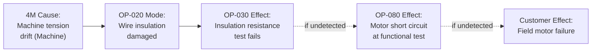

## Potential Process Failure Modes

### Overview

Identifying potential process failure modes is the core activity of Failure Analysis (Step 4 of the AIAG-VDA 7-step process) as applied to PFMEA. For every process function and requirement established in the previous step, this activity determines the specific ways the manufacturing/assembly process could fail to meet that requirement — analyzed at the process step level and traced to root causes within the 4M/5M elements (Man, Machine, Material, Method, Environment). Because PFMEA assumes the design is correct, process failure modes describe deviations in execution, not design deficiencies — the process either fails to produce the intended product characteristic, or produces it inconsistently, or introduces an unintended condition.

### Purpose Within PFMEA

- Generates the complete set of ways each process step can fail to meet its function/requirement, forming the basis for Severity, Occurrence, and Detection rating
- Establishes the Failure Effect–Failure Mode–Failure Cause (FE-FM-FC) chain specific to manufacturing/assembly operations
- Ensures failure modes are identified systematically across all 4M/5M contributing elements rather than relying solely on operator or engineer intuition
- Distinguishes process failure modes (how the operation goes wrong) from process failure causes (why it goes wrong, tied to a specific 4M input)
- Supports the multi-level failure chain linking process step-level effects to the next-higher assembly/customer level, and down to specific 4M root causes

### The Process Failure Chain: Effect → Mode → Cause

| Level | Role in Failure Chain | Example (Winding Operation) |
| --- | --- | --- |
| Next Higher Level (Next Operation/Customer) | Failure Effect (FE) — consequence experienced downstream | "Motor short circuits during end-of-line functional test" |
| Focus Process Step | Failure Mode (FM) — how the process step's function fails | "Wire insulation damaged during winding" |
| 4M Element | Failure Cause (FC) — root cause originating in a specific input | "Winding machine tension setting drifted above 3.5N (Machine)" |

A failure mode at one process step is simultaneously the failure effect experienced at the next process step downstream (or ultimately by the customer), maintaining vertical consistency across the process sequence — analogous to DFMEA's structural hierarchy, but organized sequentially rather than spatially.

### Four Standard Failure Mode Categories (Applied to Process)

**No Function / Operation Not Performed**

The process step does not occur at all or is skipped entirely (e.g., "fastener not installed," "weld not performed," "inspection step bypassed")

**Partial/Degraded Function**

The process step occurs but does not fully meet its requirement (e.g., "torque applied below specification," "weld penetration insufficient," "adhesive cure time shortened")

**Intermittent Function**

The process step meets requirements inconsistently across parts/cycles (e.g., "torque intermittently out of spec due to tool wear progression," "winding tension drifts within a production shift")

**Unintended Function / Excess Function**

The process step produces an unintended condition or exceeds intended parameters (e.g., "excess adhesive applied causing overflow," "over-torque causing fastener damage," "wrong part installed")

### Common Process Failure Mode Categories by 4M Source

**Man (Operator-Related)**

Wrong sequence performed, step omitted, wrong part/material selected, incorrect tool used, fatigue-related inconsistency, misread work instruction, incorrect setup verification

**Machine (Equipment/Tooling-Related)**

Tool wear beyond limits, fixture misalignment, equipment malfunction/breakdown, incorrect machine parameter setting, calibration drift, tooling damage

**Material (Incoming Material-Related)**

Out-of-specification incoming material, wrong material/part used, material contamination, material handling damage prior to process step, expired shelf-life material

**Method (Process Procedure-Related)**

Incorrect or ambiguous work instruction, missing process step in documented procedure, inadequate process parameter specification, insufficient setup/changeover procedure

**Environment (Condition-Related)**

Temperature/humidity outside process window, contamination (dust, particulates), electrostatic discharge (ESD) exposure, vibration affecting precision operations

### Step-by-Step Process for Identifying Process Failure Modes

**Step 1: Start from the Process Function and Requirement**

For each process step's documented function and requirement (product characteristic and process parameter), begin failure mode identification.

**Step 2: Apply the Four Failure Mode Categories Systematically**

For each function, explicitly consider whether the operation could fail to occur, occur in a degraded state, occur intermittently, or produce an unintended result.

**Step 3: Trace Each Failure Mode to Specific 4M Causes**

For each identified failure mode, determine which 4M/5M element(s) could produce it — a single failure mode often has multiple independent causes across different 4M categories.

**Step 4: Verify Vertical Consistency with Adjacent Process Steps**

Confirm failure modes at this step logically produce failure effects consistent with what's documented as failure modes at the next downstream process step (or final customer effect if this is the last step).

**Step 5: Cross-Reference Historical Process Data**

Use scrap/rework records, quality escapes, SPC out-of-control events, and warranty data from similar processes to validate and supplement the failure mode list beyond theoretical brainstorming.

**Step 6: Consider Special Characteristic Implications**

For process steps producing DFMEA-flagged special characteristics, ensure failure modes affecting those characteristics receive particular rigor in identification and subsequent rating.

**Step 7: Validate with Cross-Functional Team Including Floor-Level Personnel**

Operators and floor-level maintenance staff often identify realistic failure modes (equipment quirks, workaround practices) not visible from an engineering-only perspective.

### Example: Process Failure Mode Identification (Winding Operation)

| Process Step | Function | Failure Mode | Failure Category | Linked 4M Cause |
| --- | --- | --- | --- | --- |
| OP-020: Automated Winding | Wind copper wire onto stator core without insulation damage | Wire insulation damaged (nicked) | Unintended condition | Machine: tension setting drift above spec |
| OP-020: Automated Winding | Wind copper wire onto stator core without insulation damage | Insufficient turn count (under-wound) | Degraded function | Method: incorrect program parameter loaded |
| OP-020: Automated Winding | Wind copper wire onto stator core without insulation damage | Winding not performed (machine fault, part passed through unprocessed) | No function | Machine: sensor fault fails to detect missed cycle |
| OP-020: Automated Winding | Wind copper wire onto stator core without insulation damage | Wrong wire gauge used | Unintended condition | Material: incorrect wire spool loaded at changeover |

### Mermaid Diagram: Process Failure Chain Across Sequential Steps

### Techniques for Comprehensive Process Failure Mode Identification

**4M/5M Systematic Checklist**

Working through each process step against all five (or six) input categories ensures failure modes aren't limited to the most obvious or historically common source.

**Historical Process Data Review**

Scrap reports, rework logs, SPC violation records, and customer complaint/warranty data from the same or similar processes provide empirically grounded failure mode candidates.

**Operator and Floor-Level Brainstorming**

Structured sessions with operators, setup technicians, and maintenance personnel surface practical failure modes (workarounds, equipment quirks, known nuisance issues) not evident from process documentation alone.

**Process Capability and SPC Data Analysis**

Statistical analysis of process parameter variation can reveal failure modes not yet manifested as visible defects but present as trending process drift.

**Error-Proofing (Poka-Yoke) Gap Analysis**

Reviewing existing error-proofing devices against the failure mode list identifies where mistake-proofing exists versus where it's absent, informing both failure mode completeness and later Optimization actions.

### Best Practices

- **Analyze failure modes at the process step level, not just the final product level:** Jumping directly to "part is defective" without identifying which specific step and 4M element caused it prevents actionable process control
- **Use the four-category checklist systematically for every process step:** Explicitly considering no-function, degraded, intermittent, and unintended categories surfaces failure modes beyond the most obvious
- **Distinguish failure mode from failure cause:** "Winding damaged" (mode) is caused by "tension drift" (cause) — conflating the two prevents proper Occurrence rating at the cause level
- **Include non-value-added steps (transport, storage) in failure mode analysis:** These steps have genuine failure modes (damage, contamination, mix-up) that are commonly overlooked
- **Leverage historical data for occurrence-grounded failure modes:** Prioritize failure modes with documented process history over purely hypothetical ones, while still considering new-process or new-equipment risks

### Common Pitfalls

- **Vague failure mode statements:** "Process fails" or "part is bad" provides no basis for meaningful Occurrence estimation or targeted corrective action
- **Confusing failure mode with failure cause:** Listing "operator error" as the failure mode rather than identifying the specific deviation (e.g., "wrong torque applied") with operator error as one possible cause
- **Single-4M-category focus:** Analyzing only Machine-related causes while neglecting Man, Material, Method, and Environment contributions to the same failure mode
- **Ignoring non-value-added process steps:** Ignoring transport, storage, and handling steps causes systematic under-identification of handling-related failure modes
- **Failure chain discontinuity between process steps:** Failure modes at one step not logically connecting to failure effects at the next step, indicating incomplete sequential analysis
- [Inference] Teams that systematically apply the 4M/5M checklist combined with historical process data review tend to identify a more complete failure mode set than teams relying primarily on operator recall or the most recent quality issue, though the degree of improvement is process- and team-dependent and not independently quantified here.

### Tools Commonly Used

- APIS IQ-FMEA, PTC Windchill FMEA, Plato e1ns — maintain the FE-FM-FC chain across sequential process steps with 4M categorization
- SPC/quality management systems (Minitab, InfinityQS) — provide historical process capability and out-of-control data supporting failure mode identification
- Ishikawa (fishbone) diagram tools — complementary technique for structured 4M/5M brainstorming of failure causes

**Related Topics**

- Process function and requirement identification
- 4M/5M analysis for process failure causes
- Linking process failure modes to effects and causes
- Severity, Occurrence, and Detection rating scales (process context)
- Error-proofing and poka-yoke methods
- Special characteristics identification