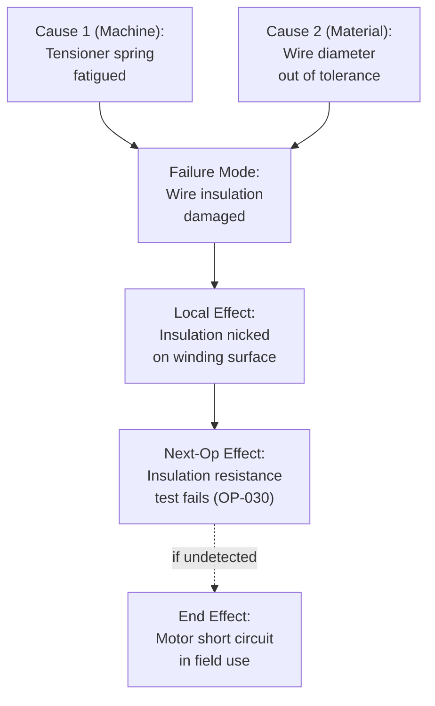

## Process Effects and Process Causes

### Overview

Process effects and process causes are the two ends of the failure chain that surround the process failure mode in PFMEA's Failure Analysis. A process effect describes the consequence experienced at the next operation, next-higher assembly, or end customer when a process failure mode occurs; a process cause describes the specific 4M/5M-rooted mechanism that produces the failure mode. Together, effects drive the Severity rating and causes drive the Occurrence rating — making accurate, specific identification of both essential to a defensible Risk Analysis.

### Purpose Within PFMEA

- Establishes what happens downstream (effect) when a process failure mode occurs, providing the basis for Severity assessment
- Establishes why the failure mode occurs (cause), rooted in a specific 4M/5M input, providing the basis for Occurrence assessment
- Distinguishes local, next-operation, and end-customer effects, since severity is generally assessed at the worst credible end effect
- Ensures each cause is specific and actionable enough to support targeted process control design (SPC, error-proofing, work instruction revision)
- Maintains the multi-level failure chain consistency across sequential process steps, mirroring the DFMEA structural hierarchy but organized by process sequence

### Process Effects: Levels of Consequence

Similar to DFMEA, PFMEA effects are typically documented at multiple levels of consequence:

| Effect Level | Description | Example |
| --- | --- | --- |
| Local Effect | Immediate consequence at the current process step | "Winding tension out of specification" |
| Next-Operation Effect | Consequence experienced at the immediately following process step | "Insulation resistance test fails at OP-030" |
| End Effect (Plant) | Consequence within the manufacturing facility if undetected further | "Scrap or rework at end-of-line test; line stoppage if trend detected" |
| End Effect (Customer) | Consequence experienced by the end customer if the defect escapes the plant | "Motor overheats or short-circuits in field use; potential safety hazard" |

Severity in PFMEA is typically rated based on the worst credible end effect (customer-level, where applicable), consistent with DFMEA practice — but the intermediate effect levels remain documented to preserve chain traceability and support in-plant containment planning.

### Process Causes: The 4M/5M Root Cause Framework

Process causes are rooted in one of the contributing input categories to the process step:

| 4M/5M Category | Example Cause Statement |
| --- | --- |
| Man | Operator installed fastener using incorrect torque wrench setting |
| Machine | Winding machine tensioner spring fatigued, reducing applied tension below spec |
| Material | Incoming wire spool out of diameter tolerance, causing inconsistent winding |
| Method | Work instruction omits required pre-heat step before adhesive application |
| Environment | Ambient humidity exceeded 60% RH, affecting adhesive cure rate |

A well-written process cause identifies the specific mechanism (not just the category) — "Machine" alone is not a cause; "winding machine tensioner spring fatigued, reducing applied tension below spec" is a specific, actionable cause statement.

### Step-by-Step Process for Identifying Process Effects and Causes

**Step 1: Start from the Identified Process Failure Mode**

Take each failure mode documented in the previous Failure Analysis activity as the anchor for effects and causes identification.

**Step 2: Identify Local, Next-Operation, and End Effects**

Trace what happens immediately at this step, what happens at the next downstream operation if undetected, and ultimately what the customer or plant experiences if the defect escapes all downstream controls.

**Step 3: Identify All Credible 4M/5M Causes**

For each failure mode, systematically consider potential causes across Man, Machine, Material, Method, and Environment categories — a single failure mode often has multiple independent causes.

**Step 4: Write Specific, Mechanism-Level Cause Statements**

Avoid generic category labels; describe the actual physical, procedural, or human-factor mechanism producing the failure mode.

**Step 5: Verify Vertical Consistency with Adjacent Process Steps**

Confirm the "next-operation effect" matches a documented failure mode at the downstream process step, and that causes correctly originate within this step's own 4M inputs (not another step's).

**Step 6: Cross-Reference Historical Data for Cause Validation**

Use scrap/rework tags, root cause analysis (8D, 5-Why) reports, and SPC data from similar processes to confirm causes are grounded in actual process behavior rather than purely theoretical possibilities.

**Step 7: Link Causes to Existing Prevention and Detection Controls**

Each documented cause should be paired with the current process controls addressing it, forming the basis for Occurrence and Detection ratings in Risk Analysis.

### Example: Process Effects and Causes (Winding Operation)

| Failure Mode | Local Effect | Next-Operation Effect | End Effect (Customer) | Process Cause (4M) |
| --- | --- | --- | --- | --- |
| Wire insulation damaged during winding | Insulation nicked/abraded on winding surface | Insulation resistance test (OP-030) reads below 500V threshold | Motor short circuit in field use; potential overheating hazard | Machine: winding tensioner spring fatigued, applying tension 3.5–4.0N vs. 2.5–3.0N spec |
| Under-wound stator (insufficient turn count) | Turn count below program target | Winding resistance test (OP-030) reads below 0.8Ω minimum | Motor delivers reduced torque; customer complaint of weak performance | Method: incorrect winding program parameter loaded after changeover |

### Mermaid Diagram: Process Effect and Cause Relationship

### Effect Consistency Across the Process Sequence

Because PFMEA analyzes a sequential process, the "next-operation effect" of one process step's failure mode should match a corresponding "failure mode" documented at the subsequent process step's analysis — maintaining the same vertical linkage principle used in DFMEA's structural hierarchy, but applied along the process timeline rather than the physical assembly hierarchy.

| Process Step | Failure Mode (this step) | Becomes Effect At |
| --- | --- | --- |
| OP-020: Winding | Wire insulation damaged | Failure Mode at OP-030 (if not detected): "Part with damaged insulation passes inspection undetected" |
| OP-030: Insulation Test | Damaged part passes inspection (test escape) | Failure Mode at OP-080: "Motor exhibits electrical short at functional test" |

### Common Cause Category Patterns

**Single Cause, Single Mode**

Most straightforward case — one specific mechanism produces one failure mode (e.g., tensioner spring fatigue → insulation damage).

**Multiple Independent Causes, Single Mode**

Different 4M mechanisms independently produce the same observable failure mode (e.g., both tensioner fatigue and out-of-tolerance wire diameter can cause insulation damage) — each cause requires separate Occurrence/Detection assessment.

**Single Cause, Multiple Modes**

One root mechanism can manifest as different failure modes depending on conditions (e.g., "incorrect program parameter loaded" could cause either under-winding or over-winding depending on which parameter is wrong) — document as separate failure mode entries if effects differ meaningfully.

### Best Practices

- **Write causes at the mechanism level, not the symptom level:** "Tensioner spring fatigued" is actionable; "machine malfunction" is not
- **Document the full effect chain, not just the end effect:** Local and next-operation effects support in-plant containment and detection planning, while end effects drive Severity
- **Treat each independent cause as a separate risk line:** Don't combine multiple 4M mechanisms into one generic cause statement, since each may have distinct Occurrence likelihood and require distinct controls
- **Ground causes in actual process history where available:** Prioritize causes with documented occurrence (scrap tags, SPC violations, 8D reports) over purely theoretical possibilities, while still considering credible new risks
- **Verify effect chain consistency across sequential steps:** A next-operation effect should always trace to a real failure mode documented at that downstream step

### Common Pitfalls

- **Generic 4M category cited as the cause without mechanism detail:** "Machine" or "Operator error" alone provides no basis for targeted corrective action or accurate Occurrence rating
- **Severity assigned without reference to the actual end effect:** Rating severity generically rather than basing it on the worst credible customer-level consequence documented in the effect chain
- **Combining multiple distinct causes into one vague statement:** Obscures which specific mechanism drives the highest risk and needs prioritized action
- **Effect chain discontinuity between process steps:** A next-operation effect that doesn't correspond to any documented failure mode at the downstream step, breaking sequential traceability
- **Overlooking Environment and Method causes in favor of Machine/Man:** Some teams default to blaming equipment or operators while under-examining procedural or environmental contributing factors
- [Inference] PFMEAs where causes are validated against actual scrap, rework, or SPC data (rather than assigned purely from engineering judgment) likely produce more defensible Occurrence ratings, though the degree of improvement depends on the availability and quality of historical process data and is not independently benchmarked here.

### Tools Commonly Used

- APIS IQ-FMEA, PTC Windchill FMEA, Plato e1ns — maintain FE-FM-FC chains with 4M cause categorization across sequential process steps
- Ishikawa (fishbone) diagrams — complementary structured technique for 4M/5M cause brainstorming
- 8D/5-Why root cause analysis reports — historical data source for validating and refining cause statements
- SPC software (Minitab, InfinityQS) — provides quantitative process variation data supporting cause identification and Occurrence estimation

**Related Topics**

- Potential process failure modes
- Process function and requirement identification
- Severity, Occurrence, and Detection rating scales (process context)
- Process controls: prevention and detection
- Special characteristics identification
- Control Plan development