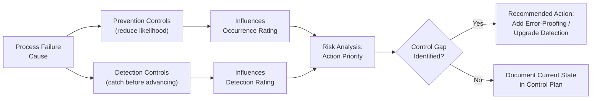

## Process Controls: Prevention and Detection

### Overview

Process controls are the manufacturing engineering activities, methods, and safeguards already built into (or planned for) the production process to either prevent a process failure cause from occurring or detect a failure cause/mode before the affected part escapes the process step or reaches the customer. As with DFMEA, PFMEA documents two control types — Prevention and Detection — for each identified failure cause, and these controls directly determine the Occurrence (O) and Detection (D) ratings assigned during Risk Analysis. Because PFMEA controls translate directly into Control Plan entries, the rigor and specificity applied here has a direct downstream impact on shop-floor quality management.

### Purpose Within PFMEA

- Documents what is actually implemented (not merely planned) to reduce the likelihood of a specific process failure cause occurring (Prevention)
- Documents what is actually implemented to catch a failure cause or mode before the affected part moves to the next operation or ships to the customer (Detection)
- Provides the evidentiary basis for Occurrence and Detection ratings — ratings should never be assigned without reference to specific, named controls
- Distinguishes robust, error-proofed controls from weaker, judgment- or inspection-based controls, which should receive correspondingly different ratings
- Directly informs the Control Plan, which formalizes ongoing process monitoring, inspection frequency, and reaction plans based on the controls documented here

### Prevention Controls vs. Detection Controls (Process Context)

| Aspect | Prevention Controls | Detection Controls |
| --- | --- | --- |
| Function | Reduce the likelihood the process failure cause occurs | Increase the likelihood the failure cause/mode is caught before the part advances |
| Timing | Built into process/tooling design, applied before or during the operation | Applied during or immediately after the operation, before advancing to next step |
| Rating Influenced | Occurrence (O) | Detection (D) |
| Example | Poka-yoke fixture that physically prevents incorrect part orientation | In-line vision inspection, SPC control chart with automatic stop |
| Nature | Eliminates or reduces the root cause mechanism from occurring | Identifies the failure before it escapes the process step |

As with DFMEA, a well-controlled process failure cause ideally has both strong Prevention (low Occurrence) and strong Detection (low Detection rating), since detection-only strategies still allow defects to be produced, relying entirely on downstream catch rates.

### Categories of Process Prevention Controls

**Error-Proofing (Poka-Yoke)**

Physical or logical devices that make an incorrect action impossible or immediately obvious (e.g., asymmetric fixtures preventing wrong-orientation assembly, sensors that prevent cycle start unless a part is correctly present)

**Process Parameter Control/Automation**

Automated process control systems that maintain parameters within specification without relying on operator judgment (e.g., closed-loop tension control, automated torque-to-yield fastening)

**Preventive Maintenance (PM) Programs**

Scheduled maintenance and calibration intervals that prevent equipment degradation from reaching a point where it produces out-of-spec output

**Standardized Work Instructions**

Clear, visual work instructions reducing variability from operator interpretation or memory-based execution

**Material/Component Verification at Receipt**

Incoming material controls (certificates of conformance, incoming inspection) that prevent out-of-spec material from entering the process

**Training and Certification**

Operator qualification/certification programs ensuring only trained personnel perform critical operations

### Categories of Process Detection Controls

**In-Line Automated Inspection**

Vision systems, sensors, or gauges integrated into the process line that check every part (100% inspection) in real time (e.g., laser measurement, machine vision defect detection)

**Statistical Process Control (SPC)**

Control charts monitoring process parameters (Xbar-R, individual/moving range) that flag out-of-control conditions, often with automatic line stop on violation

**End-of-Line Functional Testing**

Testing the completed assembly against functional requirements before shipment (e.g., motor functional test, leak test, electrical continuity test)

**Manual/Visual Inspection**

Operator or dedicated inspector visual checks, generally rated as weaker/less effective than automated inspection due to inherent human detection variability

**Sampling Inspection**

Periodic inspection of a sample rather than 100% of parts, appropriate for lower-risk characteristics but generally rated weaker than 100% inspection for high-Severity failure modes

**Gauge/Fixture Checks**

Go/no-go gauges or dedicated check fixtures verifying specific dimensional or functional characteristics at designated checkpoints

### Step-by-Step Process for Documenting Process Controls

**Step 1: For Each Failure Cause, Identify Existing Prevention Controls**

Review current process design, tooling, error-proofing devices, and preventive maintenance practices already applied to reduce the likelihood of this specific cause.

**Step 2: For Each Failure Cause/Mode, Identify Existing Detection Controls**

Review the current inspection plan, SPC monitoring, and end-of-line test coverage to determine what specifically catches this cause or mode before it advances.

**Step 3: Verify Control Specificity**

Confirm each listed control genuinely targets the specific cause/mode — generic "operator training" listed for every row without describing what specifically is trained provides weak evidentiary basis for a low Occurrence rating.

**Step 4: Assess Detection Timing and Coverage**

Confirm whether detection occurs at the failure point (best), the immediately following operation (good), or only at final/end-of-line inspection (weaker — allows more value-added work to occur on a defective part before catching it).

**Step 5: Rate Prevention and Detection Effectiveness**

Assign Occurrence and Detection ratings per the established rating scale, considering the control's inherent capability (100% automated vs. sampled vs. manual) and demonstrated track record.

**Step 6: Identify Control Gaps**

Flag failure causes with no Prevention control, no Detection control, or only weak/indirect controls — these become priority candidates for Recommended Actions (often error-proofing investment).

**Step 7: Link Controls Directly to Control Plan Entries**

Carry documented controls forward into the Control Plan with matching method, frequency, sample size, and reaction plan, maintaining traceability between PFMEA and shop-floor quality documentation.

### Example: Process Prevention and Detection Controls (Winding Operation)

| Failure Cause | Prevention Control | Detection Control | Detection Rating |
| --- | --- | --- | --- |
| Winding tensioner spring fatigue | Preventive maintenance: tensioner spring replaced every 6 months per PM schedule | In-line tension monitoring sensor with automatic machine stop if reading exceeds 3.2N | 2 (100% automated, real-time detection at the point of occurrence) |
| Incorrect wire gauge loaded at changeover | Color-coded spool holders matching wire gauge to fixture (poka-yoke) | Visual verification by operator against work order at setup | 6 (manual verification, relies on operator attentiveness) |
| Insufficient turn count (program error) | Program parameters locked via password-protected HMI, change log required | Winding resistance test 100% inspection at OP-030, automatic reject if out of range | 2 (100% automated inspection, direct measurement of the affected characteristic) |

Note how the second row's weaker, manual-verification detection control correctly earns a higher (worse) Detection rating than the automated controls in rows one and three — this differentiation is essential for accurate Action Priority calculation.

### Mermaid Diagram: Process Prevention and Detection Relationship

### Detection Control Strength Hierarchy (General Guidance)

Detection controls are generally considered progressively stronger (lower/better Detection rating) in roughly this order, consistent with general PFMEA guidance, though actual ratings depend on the organization's specific scale and the demonstrated reliability of each method:

1. **Weakest:** Sampling-based visual/manual inspection, downstream/end-of-line-only detection
2. **Weak-Moderate:** 100% manual/visual inspection at the point of occurrence
3. **Moderate:** Gauge/fixture checks at designated checkpoints (go/no-go)
4. **Moderate-Strong:** SPC monitoring with defined reaction limits
5. **Strong:** 100% automated inspection (vision, sensor-based) at the point of occurrence
6. **Strongest:** Error-proofing that makes the failure mode physically impossible to produce (technically a Prevention control, but effectively eliminates the need for Detection)

[Unverified] This strength ordering reflects general PFMEA practice guidance; actual Detection ratings must be assigned per the organization's specific rating scale definitions and should account for method-specific factors such as measurement system capability and correlation to the actual failure mechanism, rather than category alone.

### Error-Proofing (Poka-Yoke) as the Preferred Control Strategy

Where technically and economically feasible, error-proofing that prevents the failure cause entirely is generally preferred over relying on detection, since:

- It eliminates the possibility of defective parts advancing downstream, rather than merely catching them after occurrence
- It removes dependency on consistent human vigilance or inspection sampling adequacy
- It typically reduces both Occurrence and the need for costly downstream detection infrastructure

Common poka-yoke types include contact methods (physical fit/no-fit devices), fixed-value methods (counting devices ensuring correct quantity), and motion-step methods (sequence-verification sensors).

### Best Practices

- **Document controls with specificity:** Name the actual device, sensor, SPC chart, or inspection procedure rather than generic descriptions
- **Distinguish planned vs. implemented controls:** A control that is planned but not yet installed should not receive Detection/Occurrence rating credit as if already operational
- **Favor prevention/error-proofing over detection-only strategies where feasible:** Evaluate error-proofing investment for high-Severity or high-Occurrence failure causes rather than defaulting to inspection-based detection
- **Match detection location to the point of occurrence where possible:** Detection at the failing operation itself is stronger than detection several operations or an entire shift later
- **Re-evaluate ratings after control changes:** Adding, removing, or modifying a control should trigger a re-assessment of the corresponding Occurrence/Detection rating, not remain frozen from initial analysis

### Common Pitfalls

- **Assigning strong ratings without genuine control evidence:** Rating optimistically based on general process confidence rather than documented, specific, currently-implemented controls
- **Listing controls that don't yet exist or aren't yet validated:** Including planned poka-yoke devices or inspection upgrades as if already operational
- **Generic control descriptions:** "Operator training" or "inspection performed" without specifying what is trained/inspected, how often, and against what criteria
- **Over-reliance on end-of-line detection:** Relying solely on final functional test to catch upstream process failures, allowing significant value-added work (and cost) to accumulate on defective parts before detection
- **Failing to update Control Plan when PFMEA controls change:** A disconnect between PFMEA-documented controls and the actual Control Plan undermines both documents' validity and shop-floor execution
- [Inference] Processes where Detection ratings are cross-checked against actual measurement system analysis (MSA) and inspection method capability data (rather than assigned from general impression) likely produce more defensible risk prioritization, though the magnitude of improvement depends on organizational rigor in performing and referencing such studies and is not independently benchmarked here.

### Tools Commonly Used

- APIS IQ-FMEA, PTC Windchill FMEA, Plato e1ns — link process controls directly to Control Plan entries within an integrated database
- SPC software (Minitab, InfinityQS, Synergy) — implements and documents statistical process control detection methods
- Vision inspection and sensor integration platforms (Cognex, Keyence) — common automated detection control implementations
- Poka-yoke design references and case study libraries — support error-proofing prevention control development

**Related Topics**

- Process effects and process causes
- Severity, Occurrence, and Detection rating scales (process context)
- Control Plan development
- Error-proofing and poka-yoke methods
- Statistical Process Control (SPC) fundamentals
- Special characteristics identification