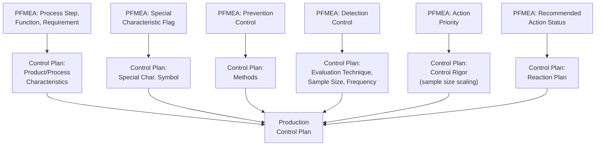

## Linking PFMEA to Control Plans

### Overview

Linking PFMEA to Control Plans establishes the formal handoff between risk analysis and ongoing production quality management. The Control Plan is a living document that translates PFMEA-identified failure causes, prevention controls, and detection controls into a structured, shop-floor-executable specification of what gets controlled, how, how often, by whom, and what happens when a control signals a problem. This linkage is the primary output of PFMEA's Results Documentation step (Step 7) and represents the point at which risk analysis becomes actionable, sustained production practice — Control Plan entries should trace directly back to specific PFMEA rows, and every high-priority PFMEA risk should have a corresponding Control Plan entry.

### Purpose Within PFMEA

- Translates PFMEA's identified risks and documented controls into an operational document used daily on the production floor
- Ensures control rigor (inspection method, sample size, frequency) is proportional to the risk level and special characteristic classification established in PFMEA
- Provides the reaction plan — what to do when a control indicates an out-of-specification condition — closing the loop between detection and corrective response
- Forms a required deliverable for Production Part Approval Process (PPAP) submission in automotive and similar regulated supply chains
- Supports change management: process or product changes trigger both PFMEA and Control Plan review, maintaining synchronized risk documentation

### The PFMEA-to-Control Plan Relationship

| PFMEA Element | Corresponding Control Plan Element |
| --- | --- |
| Process Step (from Process Flow Diagram) | Control Plan operation number and description |
| Product Characteristic Requirement | Control Plan "Product Characteristic" column with specification |
| Process Parameter Requirement | Control Plan "Process Characteristic" column with specification |
| Special Characteristic Classification | Control Plan special characteristic symbol/flag |
| Prevention Control | Control Plan "Methods" — process/tooling description |
| Detection Control | Control Plan "Evaluation/Measurement Technique," "Sample Size/Frequency" |
| Action Priority / Risk Level | Drives control rigor: sample size, frequency, and method robustness |
| Recommended Action (Optimization) | New or revised Control Plan entry once action is implemented |

### Control Plan Types and Their PFMEA Linkage

**Prototype Control Plan**

Used during early builds; describes dimensional measurements and material/performance tests during prototype build, typically less mature than later PFMEA iterations.

**Pre-Launch Control Plan**

Used after prototype and before full production; incorporates additional controls (increased inspection frequency, additional in-process checks) pending process validation, directly reflecting PFMEA risk items not yet fully mitigated.

**Production Control Plan**

The mature, steady-state document used in full-volume production; reflects the final PFMEA risk analysis with all Optimization actions implemented and re-rated.

Each Control Plan stage should trace to the PFMEA state at that point in the program timeline — as PFMEA risk ratings improve through Optimization actions, the Control Plan should correspondingly evolve (e.g., relaxing inspection frequency once a robust prevention control, like error-proofing, is validated).

### Step-by-Step Process for Linking PFMEA to Control Plan

**Step 1: Complete PFMEA Risk Analysis and Optimization**

Ensure Severity, Occurrence, Detection, and Action Priority are finalized (including post-action ratings) before building or updating the Control Plan.

**Step 2: Map Each PFMEA Process Step to a Control Plan Row**

Maintain identical operation numbering and sequence between the Process Flow Diagram, PFMEA, and Control Plan for direct traceability.

**Step 3: Transfer Product and Process Characteristics**

For each Control Plan row, populate the product characteristic (what is measured on the part) and process characteristic (what process parameter is monitored) directly from the corresponding PFMEA function/requirement documentation.

**Step 4: Transfer Special Characteristic Designations**

Apply the appropriate special characteristic symbol from DFMEA/PFMEA to flag characteristics requiring elevated control rigor.

**Step 5: Specify Control Method Based on PFMEA Documented Controls**

Populate the Control Plan's "Methods" and "Evaluation/Measurement Technique" columns directly from the Prevention and Detection controls documented in PFMEA — do not introduce new, undocumented controls at this stage without updating PFMEA first.

**Step 6: Set Sample Size and Frequency Proportional to Risk**

High Action Priority items should receive more rigorous sampling (up to 100% inspection) and higher frequency; lower-risk items may use standard sampling plans — this proportionality should reflect the PFMEA risk rating, not be set independently.

**Step 7: Define the Reaction Plan**

For each control, specify what actions are taken when the control indicates an out-of-specification result (e.g., stop production, quarantine parts, notify quality engineering, initiate containment).

**Step 8: Validate Bidirectional Traceability**

Confirm every significant PFMEA risk item has a corresponding Control Plan entry, and every Control Plan entry traces back to a documented PFMEA rationale — orphaned entries on either side indicate a linkage gap.

**Step 9: Maintain Synchronized Updates**

When either document changes (new failure mode discovered, process change, control upgrade), update both PFMEA and Control Plan together to prevent drift between risk analysis and operational practice.

### Example: PFMEA-to-Control Plan Linkage (Winding Operation)

| PFMEA Element | Control Plan Entry |
| --- | --- |
| Process Step: OP-020 Automated Winding | Control Plan Row: OP-020, "Stator Winding" |
| Product Characteristic: Winding resistance 0.8–1.2Ω (Significant/Key) | Product Char: "Winding Resistance," Spec: 0.8–1.2Ω, Symbol: ◆ (Key) |
| Process Characteristic: Wire tension 2.5–3.0N | Process Char: "Winding Tension," Spec: 2.5–3.0N |
| Detection Control: In-line tension monitoring, automatic stop | Method: "Automated tension sensor," Sample: 100%, Frequency: "Continuous" |
| Reaction Plan (new, from Optimization) | "If tension exceeds 3.2N, machine auto-stops; notify line lead; quarantine parts since last verified good reading" |

### Mermaid Diagram: PFMEA-to-Control Plan Data Flow

### Control Rigor Scaling by Risk Level

| PFMEA Action Priority / Special Characteristic | Typical Control Plan Rigor |
| --- | --- |
| High / Critical-Safety | 100% inspection or error-proofing (poka-yoke) mandatory; often requires customer approval of control method; immediate line-stop reaction plan |
| Medium / Significant-Key | SPC monitoring with defined control limits; periodic capability studies (Cpk); documented reaction plan with escalation path |
| Low / Standard | Standard sampling inspection per organizational sampling plan; routine reaction plan (rework/scrap per standard procedure) |

### Best Practices

- **Maintain identical operation numbering across all three documents:** Process Flow Diagram, PFMEA, and Control Plan should use matching OP numbers to prevent traceability confusion during audits or updates
- **Populate Control Plan directly from PFMEA-documented controls:** Avoid introducing new or different control methods in the Control Plan without first updating the corresponding PFMEA entry
- **Scale sample size and frequency explicitly to risk level:** Document the rationale connecting PFMEA Action Priority to the chosen Control Plan rigor, supporting audit defensibility
- **Define specific, actionable reaction plans:** Vague reaction plans ("investigate as needed") provide little operational guidance; specify exact steps, responsible roles, and escalation triggers
- **Review and update both documents together at each program milestone:** Prototype, pre-launch, and production Control Plan stages should each reflect the current state of PFMEA risk analysis at that point

### Common Pitfalls

- **Control Plan developed independently of PFMEA:** Common when different teams or timelines separate the two activities, resulting in mismatched control methods or missed high-risk items
- **PFMEA updated after a quality escape, but Control Plan not correspondingly revised:** Breaks the intended closed-loop relationship between risk analysis and operational practice
- **Generic reaction plans that don't specify concrete actions:** Reduces the practical value of the Control Plan during an actual out-of-specification event
- **Sample size/frequency not scaled to risk:** Applying uniform inspection rigor regardless of PFMEA-documented Action Priority, under-controlling high-risk items or over-controlling low-risk ones
- **Special characteristic symbols inconsistent between drawing, PFMEA, and Control Plan:** Creates confusion and potential compliance gaps, particularly problematic during customer or regulatory audits
- [Inference] Organizations using integrated PFMEA-Control Plan software modules (rather than maintaining them as separately authored documents) likely experience fewer instances of drift between documented risk analysis and actual shop-floor practice, since automated field population reduces transcription and update-lag errors; the magnitude of this benefit is organization-specific and not independently quantified here.

### Standards and References

- **AIAG-VDA FMEA Handbook** — defines Control Plan as a required output of the Results Documentation step (Step 7)
- **AIAG APQP Reference Manual** — governs Control Plan format, content requirements, and its role across Prototype, Pre-Launch, and Production stages
- **IATF 16949** — requires Control Plan as part of the quality management system and PPAP submission package
- **Customer-Specific Requirements (CSRs)** — many OEMs specify particular Control Plan formats or additional content requirements

**Related Topics**

- Process controls: prevention and detection
- Special characteristics identification
- Statistical Process Control (SPC) fundamentals
- Error-proofing and poka-yoke methods
- PFMEA process overview
- Action Priority vs. RPN methodology