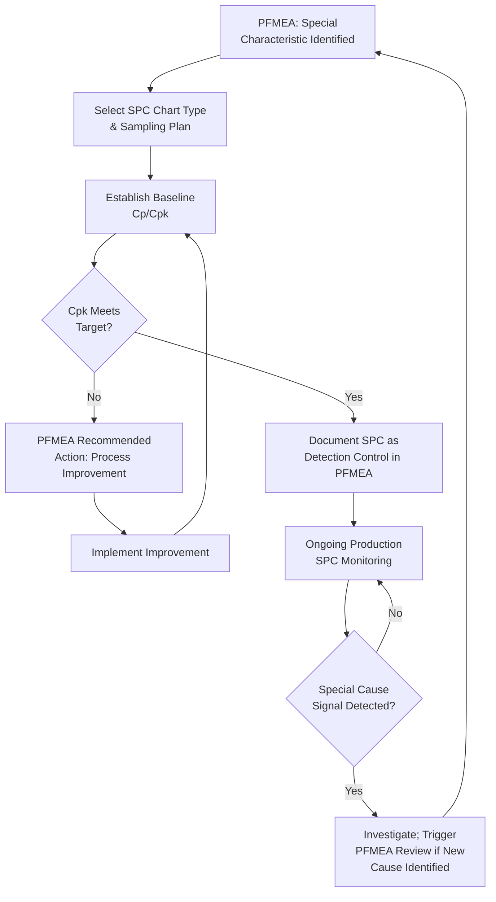

## PFMEA and Statistical Process Control

### Overview

Statistical Process Control (SPC) is a quantitative methodology for monitoring and controlling a manufacturing process through statistical analysis of process output over time, using control charts to distinguish normal process variation (common cause) from abnormal variation (special cause) requiring investigation. Within PFMEA, SPC serves a dual role: it is one of the primary Detection controls documented against process failure causes, and it is also a critical data source feeding back into PFMEA's Occurrence rating and Risk Analysis, since SPC data provides empirical, quantified evidence of actual process capability and stability rather than engineering estimation alone.

### Purpose of the PFMEA-SPC Relationship

- SPC serves as a Detection control: control charts flag out-of-control conditions, enabling intervention before defective parts accumulate or escape the process
- SPC data informs Occurrence ratings: process capability indices (Cp, Cpk) derived from SPC data provide quantitative, defensible evidence for Occurrence assessment rather than relying solely on engineering judgment
- SPC implementation decisions (which characteristics to chart, control limits, sampling frequency) should be driven by PFMEA-identified special characteristics and high-risk failure causes
- Out-of-control SPC signals can trigger PFMEA re-evaluation if they reveal a previously undocumented or underestimated failure cause
- SPC supports the closed-loop Optimization step: control chart trends over time provide evidence of whether implemented Recommended Actions have actually improved process capability

### Core SPC Concepts Relevant to PFMEA

**Common Cause Variation**

Natural, inherent variation present in a stable process due to normal fluctuations in materials, equipment, and conditions — expected and generally not requiring individual investigation of each occurrence.

**Special Cause Variation**

Variation arising from an identifiable, assignable source outside the normal process (e.g., tool breakage, material lot change, operator error) — represents a signal requiring investigation and corrective action.

**Control Limits (UCL/LCL)**

Statistically calculated boundaries (typically ±3 standard deviations from the process mean) within which common cause variation is expected to remain; points outside these limits signal special cause variation.

**Process Capability (Cp, Cpk)**

Indices comparing the natural process variation to the specification tolerance width (Cp) and additionally accounting for process centering relative to specification limits (Cpk). Cpk is the more commonly cited index since it reflects both spread and centering.

$$C_{pk} = \min\left(\frac{USL - \bar{X}}{3\sigma}, \frac{\bar{X} - LSL}{3\sigma}\right)$$

Where $USL$ and $LSL$ are the upper and lower specification limits, $\bar{X}$ is the process mean, and $\sigma$ is the process standard deviation.

### Common SPC Chart Types Used in Process Control

| Chart Type | Application | Data Type |
| --- | --- | --- |
| Xbar-R Chart | Monitors process mean and range for continuous data, subgrouped | Variable (continuous) |
| Xbar-S Chart | Similar to Xbar-R but uses standard deviation; preferred for larger subgroup sizes | Variable (continuous) |
| Individual-Moving Range (I-MR) Chart | Monitors individual measurements when subgrouping isn't practical (e.g., low-volume/slow-cycle processes) | Variable (continuous) |
| p-Chart | Monitors proportion of nonconforming units in variable-size samples | Attribute (pass/fail) |
| np-Chart | Monitors count of nonconforming units in fixed-size samples | Attribute (pass/fail) |
| c-Chart / u-Chart | Monitors count of defects (not units) per item or per unit area/time | Attribute (defect count) |

### Step-by-Step Process for Integrating SPC into PFMEA

**Step 1: Identify Candidate Characteristics for SPC from PFMEA**

Review PFMEA failure causes, particularly those linked to Significant/Key or Critical/Safety special characteristics, as primary candidates for SPC monitoring.

**Step 2: Select Appropriate Chart Type**

Choose the control chart type based on the data type (variable vs. attribute) and characteristic behavior (continuous process parameter vs. pass/fail inspection result) of the process parameter or product characteristic identified in PFMEA.

**Step 3: Establish Baseline Process Capability**

Collect initial process data to calculate baseline Cp/Cpk, establishing whether the current process can reliably meet the requirement documented in PFMEA's Function Analysis.

**Step 4: Set Control Limits and Reaction Rules**

Define statistically calculated control limits and out-of-control signal rules (e.g., Western Electric rules, Nelson rules) that trigger investigation.

**Step 5: Document SPC as the Detection Control in PFMEA**

Reference the specific SPC chart, sampling frequency, and control limits explicitly in the PFMEA Detection Control column, supporting a defensible Detection rating.

**Step 6: Feed Capability Data Back into Occurrence Rating**

Use the calculated Cpk (and associated defect rate estimate) as quantitative support for the PFMEA Occurrence rating, replacing purely qualitative engineering judgment where data is available.

**Step 7: Monitor for Special Cause Signals and Trigger PFMEA Review**

When SPC detects a special cause event revealing a new or underestimated failure mechanism, initiate a PFMEA review to determine if the failure mode/cause documentation requires updating.

**Step 8: Reassess Ratings After Process Improvement**

When Optimization actions improve process capability (demonstrated via updated Cpk), update the corresponding PFMEA Occurrence rating and Action Priority to reflect the verified improvement.

### Example: SPC-PFMEA Integration (Winding Tension Control)

| PFMEA Element | SPC Implementation |
| --- | --- |
| Process Parameter Requirement: Wire tension 2.5–3.0N | Xbar-R chart monitoring tension, subgroup size n=5, sampled every 30 minutes |
| Special Characteristic: Winding resistance (Significant/Key) | Cpk target ≥1.33 required per customer-specific requirement for Key characteristics |
| Baseline Capability Study | Initial Cpk = 1.12 (marginal); triggers Recommended Action for tensioner upgrade |
| Detection Control (documented in PFMEA) | "Xbar-R SPC chart, tension monitored every 30 min, automatic alert on out-of-control signal per Nelson Rule 1" |
| Post-Action Capability | Cpk = 1.58 after tensioner spring redesign; Occurrence rating reduced from 4 to 2 in PFMEA Action Results |

### Mermaid Diagram: SPC-PFMEA Feedback Loop

### Cpk Thresholds and PFMEA Occurrence Rating (Illustrative Relationship)

| Cpk Value | General Interpretation | Typical Occurrence Rating Implication |
| --- | --- | --- |
| < 1.00 | Process not capable; significant out-of-spec output expected | High Occurrence rating warranted; likely triggers mandatory Recommended Action |
| 1.00 – 1.33 | Marginally capable; requires tight control and monitoring | Moderate Occurrence rating; close monitoring, possible improvement action |
| 1.33 – 1.67 | Capable process; commonly required minimum for Key/Significant characteristics | Lower Occurrence rating supportable with SPC evidence |
| > 1.67 | Highly capable process | Low Occurrence rating; may support reduced inspection frequency in Control Plan |

[Inference] Specific Cpk thresholds and their corresponding Occurrence rating implications vary by organization, customer-specific requirements, and applicable rating scale definitions; the values above represent commonly referenced general industry guidance rather than a universal standard, and organizations should apply their own documented rating criteria.

### Best Practices

- **Prioritize SPC implementation based on PFMEA risk ranking:** Focus SPC resources on characteristics tied to high Action Priority failure causes and special characteristics rather than applying it uniformly
- **Use quantitative capability data to replace estimated Occurrence ratings wherever possible:** Actual Cpk data is more defensible than purely qualitative engineering judgment
- **Treat SPC out-of-control signals as PFMEA inputs, not just production events:** A recurring special cause may reveal a failure cause not yet documented in PFMEA, warranting formal review
- **Match chart type to actual data characteristics:** Using an inappropriate chart type (e.g., attribute chart for continuous data) reduces sensitivity to genuine process shifts
- **Reassess PFMEA ratings after demonstrated capability improvement:** Don't leave Occurrence ratings static once a Recommended Action has been verified effective via updated SPC data

### Common Pitfalls

- **Implementing SPC without reference to PFMEA risk prioritization:** Charting characteristics based on convenience or habit rather than documented risk significance
- **Treating SPC as detection only, ignoring its Occurrence-rating value:** Missing the opportunity to ground Occurrence ratings in actual quantitative process performance data
- **Failing to close the loop when special cause events reveal new failure mechanisms:** Production teams investigate and resolve the immediate issue without updating the corresponding PFMEA documentation
- **Using outdated capability data:** Citing an initial capability study in PFMEA without updating it as the process, tooling, or materials change over time
- **Inconsistent control limits between SPC charts and Control Plan specification:** Charts using outdated or mismatched limits relative to the current PFMEA/Control Plan requirement
- [Inference] Organizations that formally route SPC special-cause investigation findings back into PFMEA review (rather than resolving them solely within production quality records) likely maintain more current and accurate Occurrence ratings over the product lifecycle, though the degree of benefit depends on organizational process discipline and is not independently benchmarked here.

### Tools Commonly Used

- SPC software (Minitab, InfinityQS, JMP, Synergy) — control chart generation, capability analysis, and out-of-control signal detection
- APIS IQ-FMEA, PTC Windchill FMEA, Plato e1ns — some platforms support direct integration or reference linking between PFMEA Occurrence ratings and SPC capability data
- Automated data collection systems (gauges, sensors with direct SPC software feed) — reduce manual data entry error and support real-time control charting

**Related Topics**

- Process controls: prevention and detection
- Special characteristics identification
- Linking PFMEA to control plans
- Severity, Occurrence, and Detection rating scales (process context)
- Process capability studies
- Error-proofing and poka-yoke methods