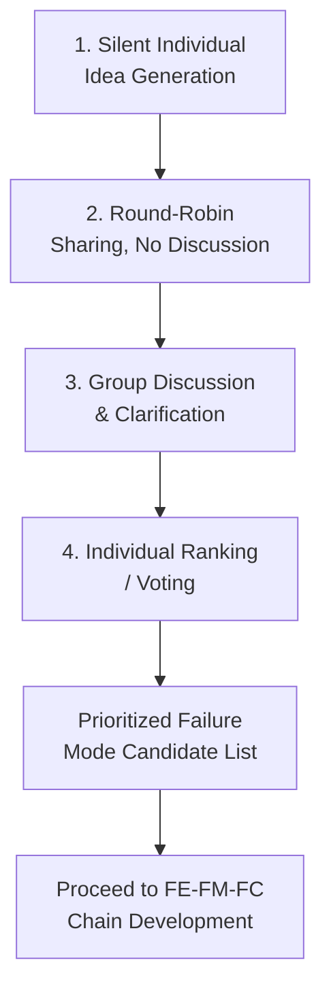

## Structured Brainstorming Methods

### Overview

Structured brainstorming methods are facilitated, systematic techniques used by cross-functional FMEA teams to generate comprehensive, high-quality failure mode candidates, going beyond what any single team member's intuition or experience would surface independently. Unlike unstructured "free-for-all" brainstorming, structured methods impose a framework — a set of prompts, categories, or sequencing rules — that guides participants toward comprehensive coverage while managing common group dynamics failures (dominant voices, premature judgment, anchoring on the first idea raised). Within FMEA, structured brainstorming is applied primarily during Failure Analysis (identifying failure modes, effects, and causes) but is equally useful during Structure and Function Analysis.

### Purpose Within FMEA

- Generates a more complete and diverse set of failure mode candidates than individual analysis or unstructured discussion
- Reduces the risk of groupthink, where the team converges prematurely on the most obvious or most recently discussed failure modes
- Leverages the full breadth of cross-functional expertise (design, manufacturing, quality, service, reliability) systematically rather than relying on whoever speaks first or loudest
- Provides a repeatable, documentable process that supports audit traceability of how the failure mode list was derived
- Balances creative idea generation with the discipline needed to keep the FMEA session within scope and time budget

### Common Structured Brainstorming Techniques

**Brainwriting (Silent Brainstorming)**

Participants individually write down failure mode ideas on paper or cards before any verbal discussion begins, then ideas are collected and discussed as a group. Prevents dominant personalities from anchoring the group's thinking and ensures quieter or more junior participants contribute independently generated ideas.

**Round-Robin Brainstorming**

Each participant takes a turn contributing one idea per round, cycling through the group multiple times, ensuring equal participation and surfacing ideas from every discipline represented.

**Nominal Group Technique (NGT)**

A structured sequence: (1) silent individual idea generation, (2) round-robin sharing without discussion, (3) group discussion and clarification, (4) individual ranking/voting to prioritize the most significant failure modes for further analysis.

**Affinity Diagramming**

After idea generation, failure mode candidates are written on individual cards/sticky notes and grouped by the team into natural clusters or themes, revealing patterns and ensuring related failure modes across different components or process steps are considered together.

**Checklist-Prompted Brainstorming**

Structured brainstorming guided by a standardized checklist (e.g., the 4M/5M framework for PFMEA, the four failure mode categories — loss/degradation/intermittent/unintended — for DFMEA, or a component-type-specific failure mode library) ensuring systematic coverage rather than relying purely on open recall.

**SCAMPER-Adapted Prompts**

Adapting the SCAMPER technique (Substitute, Combine, Adapt, Modify, Put to another use, Eliminate, Reverse) as failure-mode-generation prompts — e.g., "What if this material were substituted?" or "What if this step were eliminated?" — to systematically probe alternative failure scenarios.

### Step-by-Step Process for Conducting Structured Brainstorming in FMEA

**Step 1: Define Scope and Objective Clearly**

State precisely which structural element, function, or process step is under discussion before brainstorming begins, preventing scope drift during the session.

**Step 2: Select the Appropriate Technique for the Session Context**

Choose brainwriting or NGT for sessions with dominant personalities or hierarchy concerns; choose checklist-prompted brainstorming when systematic coverage against a known framework (4M/5M, failure mode categories) is the priority.

**Step 3: Set Ground Rules**

Establish that no idea is criticized or evaluated during the generation phase (deferred judgment), and that quantity of ideas is initially valued over immediate quality filtering.

**Step 4: Facilitate Silent or Individual Idea Generation First**

For techniques including a silent phase, allow adequate individual thinking time before any verbal sharing, capturing the widest possible range of independently generated ideas.

**Step 5: Systematically Cycle Through Prompts or Categories**

For checklist-prompted methods, work through each category (e.g., each of the 4M/5M elements, or each of the four failure mode types) explicitly rather than allowing discussion to drift to only the most familiar category.

**Step 6: Capture All Ideas Without Immediate Filtering**

Record every generated failure mode candidate, even those that seem unlikely, deferring occurrence/severity judgment to the subsequent Risk Analysis step.

**Step 7: Group, Cluster, and Deduplicate**

After generation, use affinity diagramming or similar clustering to organize related ideas, merge duplicates, and identify gaps or themes requiring further probing.

**Step 8: Transition to Structured Evaluation**

Once idea generation is exhausted, transition the team into evaluating each candidate failure mode against the FE-FM-FC chain structure and preparing for Risk Analysis.

### Example: Checklist-Prompted Brainstorming Session (PFMEA Context)

**Process Step:** OP-020 Automated Winding

**Technique:** 4M/5M checklist-prompted round-robin

| 4M Category | Prompted Question | Failure Modes Generated |
| --- | --- | --- |
| Man | What operator actions could cause this step to fail? | Wrong wire spool loaded; setup verification skipped |
| Machine | What equipment conditions could cause this step to fail? | Tensioner spring fatigue; sensor calibration drift |
| Material | What incoming material issues could cause this step to fail? | Wire diameter out of tolerance; insulation coating defect |
| Method | What procedural gaps could cause this step to fail? | Incorrect program parameter loaded at changeover |
| Environment | What environmental conditions could cause this step to fail? | Static discharge damaging wire insulation in low-humidity conditions |

Systematically cycling through all five categories, rather than stopping after Machine and Material (the most commonly discussed), surfaced the Environment-related failure mode that might otherwise have been overlooked.

### Mermaid Diagram: Nominal Group Technique (NGT) Flow

### Managing Group Dynamics During FMEA Brainstorming

**Dominant Personality Effect**

Senior engineers or vocal team members can inadvertently suppress contributions from junior or quieter participants — mitigated by silent/written idea generation phases before open discussion.

**Groupthink and Premature Convergence**

Teams may converge too quickly on the first plausible failure mode discussed, missing less obvious but still credible alternatives — mitigated by mandatory cycling through all checklist categories before moving to evaluation.

**Production Blocking**

In verbal-only brainstorming, participants may forget or discard ideas while waiting for their turn to speak — mitigated by brainwriting, where ideas are captured immediately and independently.

**Evaluation Apprehension**

Team members may withhold ideas they fear will be judged as unlikely or unimportant — mitigated by strict deferred-judgment ground rules during the generation phase, with evaluation explicitly reserved for the later Risk Analysis step.

### Facilitator Role and Responsibilities

- Maintains scope discipline, preventing the session from drifting into design/process problem-solving rather than failure mode identification
- Enforces the deferred-judgment rule during idea generation phases
- Ensures systematic coverage of all relevant categories/prompts (4M/5M, failure mode types, or component-specific checklists)
- Manages time allocation across structural elements/process steps to prevent over-focus on a few familiar items at the expense of complete coverage
- Documents all generated ideas transparently, supporting later traceability and audit review

### Best Practices

- **Combine techniques for different session phases:** Use brainwriting or silent generation for initial idea capture, then round-robin or group discussion for clarification and clustering
- **Always work from a systematic checklist or framework:** Even in open brainstorming, anchoring discussion to the 4M/5M elements or standard failure mode categories improves comprehensiveness over unstructured discussion
- **Include diverse cross-functional perspectives:** Service, field, and manufacturing personnel often surface failure modes design engineers alone would not anticipate
- **Separate idea generation from idea evaluation:** Conducting Risk Analysis (Severity/Occurrence/Detection) simultaneously with brainstorming discourages full idea generation, since participants self-censor ideas they judge unlikely
- **Leverage historical data as a brainstorming input, not a replacement:** Reviewing warranty, scrap, and field failure data before or during brainstorming grounds the session without limiting it purely to previously observed failure modes

### Common Pitfalls

- **Skipping structure entirely in favor of open discussion:** Produces inconsistent coverage heavily dependent on which team members happen to be most vocal or most recently exposed to a relevant issue
- **Evaluating ideas during generation:** Immediately debating likelihood or dismissing ideas as unlikely discourages further contribution and can suppress valid but less obvious failure modes
- **Incomplete category coverage:** Stopping brainstorming once "enough" ideas have been generated without systematically confirming all 4M/5M categories or failure mode types have been considered
- **Homogeneous team composition:** Brainstorming with only design engineers (for DFMEA) or only process engineers (for PFMEA) without service, quality, or floor-level input misses failure modes visible only from other perspectives
- **No facilitator or unclear session objective:** Sessions without clear scope definition and facilitation tend to drift into problem-solving or unrelated tangents rather than systematic failure mode generation
- [Inference] Teams using silent-generation techniques (brainwriting, NGT) alongside cross-functional participation likely surface a broader and more balanced set of failure modes than teams relying on open verbal discussion alone, though the magnitude of this effect depends on team composition and facilitation quality and is not independently benchmarked here.

### Tools Commonly Used

- Physical or digital sticky notes (Miro, Mural) — support brainwriting and affinity diagramming, particularly for remote/hybrid FMEA sessions
- FMEA software with built-in failure mode libraries (APIS IQ-FMEA, Plato e1ns) — provide checklist-based prompts drawn from historical organizational data
- Voting/polling tools — support the ranking phase of Nominal Group Technique in larger sessions

**Related Topics**

- Potential failure modes at each design level
- Potential process failure modes
- Historical data and lessons-learned review
- Failure mode libraries and checklists
- Fault Tree Analysis (FTA) as a complementary method
- Cross-functional FMEA team facilitation