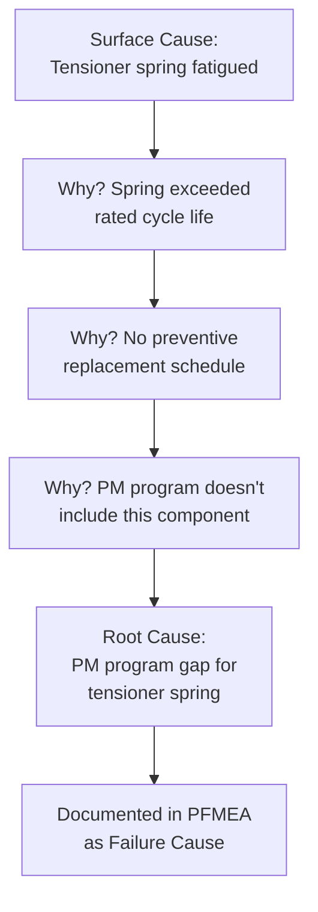

## Fishbone and Ishikawa Diagrams

### Overview

The fishbone diagram, also known as the Ishikawa diagram or cause-and-effect diagram, is a visual root cause analysis tool developed by Kaoru Ishikawa that organizes potential causes of a specific effect (typically a failure mode or quality problem) into major categories, resembling the skeletal structure of a fish. Within FMEA, fishbone diagrams serve as a structured brainstorming aid for systematically identifying failure causes, particularly in PFMEA where the standard 4M/5M category structure maps directly onto the diagram's branch categories. The tool's visual, categorized format helps teams avoid narrow, single-category thinking when generating candidate failure causes.

### Purpose Within FMEA

- Provides a visual framework for systematically brainstorming failure causes across multiple contributing categories rather than a single dominant hypothesis
- Directly supports the 4M/5M cause identification activity in PFMEA (Man, Machine, Material, Method, Environment)
- Helps distinguish between the failure mode/effect (the "head" of the fish, what is being analyzed) and the many potential contributing causes (the "bones")
- Facilitates group discussion by giving each cross-functional team member a clear category to contribute to, similar to structured brainstorming methods
- Serves as an input and cross-check for the FE-FM-FC chain construction, particularly for validating whether all credible cause categories have been considered

### Structure of a Fishbone Diagram

| Component | Description |
| --- | --- |
| Head (Effect) | The specific failure mode or problem being analyzed, placed at the right (or top) of the diagram |
| Spine | The central horizontal line connecting all cause categories to the effect |
| Main Bones (Categories) | Major cause categories branching off the spine (e.g., the 4M/5M categories) |
| Sub-bones (Specific Causes) | Individual, specific cause hypotheses branching off each major category |
| Sub-sub-bones (Root Causes) | Further decomposition of a specific cause into its underlying root mechanism, often developed using the "5 Whys" technique |

### Standard Category Frameworks Used as Main Bones

**Manufacturing/Process Context (4M/5M/6M)**

Man, Machine, Material, Method, Environment (Mother Nature), and sometimes Measurement — directly aligned with PFMEA's process cause categorization framework.

**Service/Transactional Context (4P or 8P)**

Policies, Procedures, People, Plant (or Place, Product, Price, Promotion for broader business contexts) — used less commonly in FMEA but occasionally applied to service-related process analysis.

**Design/Engineering Context**

Categories may be customized to the design domain, such as Materials, Design, Geometry/Tolerance, Interface, and Environment, rather than the standard manufacturing 4M/5M.

### Step-by-Step Process for Building a Fishbone Diagram in FMEA

**Step 1: Clearly Define the Effect (Head)**

State the specific failure mode or effect precisely — a vague or overly broad effect statement (e.g., "quality problem") produces unfocused cause identification; a specific statement (e.g., "wire insulation damaged during winding operation") focuses the analysis productively.

**Step 2: Draw the Spine and Select Category Framework**

Draw the central spine leading to the head, and add the major category branches (typically 4M/5M for process failure analysis).

**Step 3: Brainstorm Causes Within Each Category Systematically**

Working through each category in turn (consistent with checklist-prompted structured brainstorming), generate specific candidate causes and attach them as sub-bones to the relevant main category.

**Step 4: Drill Down to Root Causes Using "5 Whys"**

For significant sub-bone causes, ask "why" repeatedly to decompose a surface-level cause into its underlying root mechanism, adding these as further sub-branches.

**Step 5: Review for Completeness Across All Categories**

Confirm the team has generated candidate causes in every major category rather than concentrating disproportionately on the most familiar or obvious one (commonly Machine or Man).

**Step 6: Identify the Most Likely/Significant Causes for Further Analysis**

Use team discussion, voting, or available historical/quantitative data to prioritize which fishbone-identified causes warrant detailed FE-FM-FC documentation and Risk Analysis in the FMEA worksheet.

**Step 7: Transfer Validated Causes into the FMEA Worksheet**

Formally document the confirmed causes as Failure Causes in the FMEA, linked to their corresponding Failure Mode, maintaining the same specificity achieved in the fishbone's sub-bone/root-cause level.

### Example: Fishbone Diagram Content (Winding Insulation Damage)

**Effect (Head):** Wire insulation damaged during winding operation

| Category (Main Bone) | Sub-bones (Specific Causes) |
| --- | --- |
| Man | Operator skipped tension verification at shift start; inadequate training on tensioner adjustment |
| Machine | Tensioner spring fatigued beyond calibration limit; guide roller bearing worn, creating friction point |
| Material | Wire diameter out of tolerance (thicker than spec, catching on guides); insulation coating below minimum thickness |
| Method | Work instruction doesn't specify tensioner calibration check frequency; no verification step after tool changeover |
| Environment | Low ambient humidity increasing static discharge risk to insulation; excessive ambient dust contaminating guide surfaces |

Applying "5 Whys" to the Machine sub-bone "Tensioner spring fatigued": Why fatigued? → Exceeded rated cycle life. Why exceeded? → No preventive replacement schedule. Why no schedule? → PM program doesn't include this component. This drills down to an actionable root cause: PM program gap, rather than stopping at the surface-level "spring fatigued" observation.

### SVG Diagram: Fishbone/Ishikawa Diagram Structure

<svg xmlns="http://www.w3.org/2000/svg" viewBox="0 0 800 420" font-family="Arial, sans-serif">
<title>Fishbone (Ishikawa) Diagram: Winding Insulation Damage (svg_diagram)</title>
<rect x="0" y="0" width="800" height="420" fill="#ffffff" />
<text x="400" y="26" font-size="15" font-weight="bold" text-anchor="middle" fill="#1a1a1a">Fishbone (Ishikawa) Diagram: Winding Insulation Damage (svg_diagram)</text>
<line x1="80" y1="210" x2="650" y2="210" stroke="#1a1a1a" stroke-width="3" />
<polygon points="650,195 685,210 650,225" fill="#dc2626" />
<rect x="685" y="185" width="105" height="50" rx="4" fill="#fee2e2" stroke="#dc2626" stroke-width="1.5" />
<text x="737" y="205" font-size="10" text-anchor="middle">Wire Insulation</text>
<text x="737" y="218" font-size="10" text-anchor="middle">Damaged</text>
<line x1="180" y1="210" x2="130" y2="110" stroke="#1a1a1a" stroke-width="1.5" />
<text x="120" y="100" font-size="11" font-weight="bold" text-anchor="middle">Man</text>
<line x1="165" y1="170" x2="205" y2="185" stroke="#555555" stroke-width="1" />
<text x="205" y="160" font-size="9">Skipped tension check</text>
<line x1="300" y1="210" x2="250" y2="110" stroke="#1a1a1a" stroke-width="1.5" />
<text x="240" y="100" font-size="11" font-weight="bold" text-anchor="middle">Machine</text>
<text x="325" y="160" font-size="9">Tensioner spring fatigued</text>
<line x1="420" y1="210" x2="370" y2="110" stroke="#1a1a1a" stroke-width="1.5" />
<text x="360" y="100" font-size="11" font-weight="bold" text-anchor="middle">Material</text>
<text x="445" y="160" font-size="9">Wire diameter out of spec</text>
<line x1="220" y1="210" x2="170" y2="310" stroke="#1a1a1a" stroke-width="1.5" />
<text x="160" y="325" font-size="11" font-weight="bold" text-anchor="middle">Method</text>
<text x="245" y="270" font-size="9">No changeover verification</text>
<line x1="340" y1="210" x2="290" y2="310" stroke="#1a1a1a" stroke-width="1.5" />
<text x="280" y="325" font-size="11" font-weight="bold" text-anchor="middle">Environment</text>
<text x="365" y="270" font-size="9">Low humidity / static risk</text>
</svg>

### Mermaid Diagram: 5 Whys Drill-Down from Fishbone Sub-bone

### Fishbone Diagrams vs. Other Root Cause Techniques

| Technique | Strength | Best Used When |
| --- | --- | --- |
| Fishbone/Ishikawa | Visual, category-organized, supports group brainstorming | Generating a broad set of candidate causes across multiple categories |
| 5 Whys | Simple, drills to a single root cause quickly | Investigating one specific cause chain in depth (often used within a fishbone sub-bone) |
| Fault Tree Analysis (FTA) | Formal logic-based (AND/OR gates), quantifiable | Safety-critical systems requiring probabilistic root cause modeling |
| Pareto Analysis | Prioritizes causes by frequency/impact using historical data | Determining which of several fishbone-identified causes to address first, once data exists |

Fishbone diagrams are often used in combination with these other techniques — fishbone for broad cause generation, 5 Whys for depth on specific branches, and Pareto analysis for data-driven prioritization once historical occurrence data becomes available.

### Best Practices

- **State the effect (head) with precision:** A specific, well-defined failure mode statement focuses cause brainstorming productively; vague effects produce vague, unusable causes
- **Work through all major categories systematically:** Avoid stopping after the most obvious 1-2 categories (often Machine or Man); Method and Environment are commonly under-explored
- **Push sub-bones toward root-cause specificity:** A cause statement like "material issue" is not actionable; drilling down via 5 Whys to a specific, addressable mechanism is necessary before transferring into the FMEA worksheet
- **Use fishbone as a brainstorming aid, not the final documentation:** The visual diagram supports idea generation; the FMEA worksheet remains the authoritative record of validated failure causes with their associated ratings and controls
- **Validate fishbone-generated causes against historical data where available:** Cross-check brainstormed hypotheses against scrap records, warranty data, or SPC history to prioritize which causes are most credible

### Common Pitfalls

- **Overly broad or vague effect statement:** "Motor fails" as the head produces unfocused, low-value cause branches compared to a specific failure mode statement
- **Stopping at surface-level causes:** Recording "tensioner spring fatigued" without drilling further to the PM program gap that allowed it, missing the truly actionable root cause
- **Uneven category exploration:** Generating many Machine-related causes while barely touching Method or Environment, reflecting team bias toward familiar failure sources
- **Confusing fishbone brainstorming output with validated FMEA causes:** Transferring every brainstormed hypothesis directly into the FMEA worksheet without prioritization or validation, cluttering the analysis with low-credibility entries
- **Using fishbone as a standalone tool disconnected from the FMEA worksheet:** Conducting the exercise without formally transferring validated causes into the FE-FM-FC chain, losing the traceability benefit
- [Inference] Teams that explicitly combine fishbone brainstorming with 5-Whys drill-down on high-priority branches likely produce more actionable, root-cause-level failure cause statements than fishbone alone, though the degree of improvement depends on team diligence in performing the drill-down consistently and is not independently benchmarked here.

### Tools Commonly Used

- Physical whiteboard or flip-chart with fishbone template — traditional in-person facilitation approach
- Miro, Mural, Lucidchart — digital fishbone templates supporting remote/hybrid team sessions
- Quality management software with built-in fishbone/Ishikawa modules — some FMEA platforms include integrated cause-and-effect diagramming linked to the FMEA worksheet

**Related Topics**

- Structured brainstorming methods
- 4M/5M analysis for process failure causes
- Fault Tree Analysis (FTA) as a complementary method
- Linking failure modes to effects and causes
- Historical data and lessons-learned review
- 5 Whys root cause analysis technique