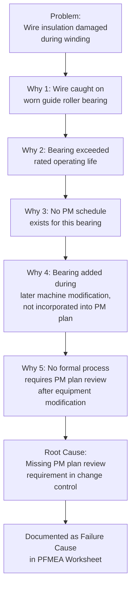

## Five Whys Root Cause Technique

### Overview

The Five Whys is a simple, iterative root cause analysis technique that involves asking "why" repeatedly — traditionally five times, though the actual number varies by problem — to move progressively from a surface-level symptom to its underlying root cause. Developed within the Toyota Production System, the technique is valued in FMEA for its simplicity and effectiveness at preventing teams from stopping their causal analysis at the first plausible-sounding explanation. Within FMEA, Five Whys is most commonly used to drill down individual failure cause candidates (often generated via fishbone diagramming or structured brainstorming) into specific, actionable root-cause-level statements suitable for the FMEA worksheet.

### Purpose Within FMEA

- Prevents "root cause" statements that are actually just restated symptoms or intermediate causes, which are not truly actionable
- Provides a lightweight, easily facilitated technique requiring no special software or statistical training, usable directly within a brainstorming session
- Complements fishbone/Ishikawa diagrams by adding causal depth to individual branches identified during broad cause brainstorming
- Supports writing Failure Cause statements at the mechanism level (as required by DFMEA/PFMEA best practice) rather than at the vague category or symptom level
- Helps distinguish between correctable root causes (process, training, design) and causes that are themselves further symptoms requiring additional drilling

### The Five Whys Process

**Step 1: State the Problem Precisely**

Begin with a specific, well-defined failure mode or observed defect — not a vague generalization. This is typically the failure mode already identified in the FMEA Failure Analysis step.

**Step 2: Ask "Why did this happen?"**

Identify the most immediate, direct cause of the stated problem, based on evidence or credible engineering reasoning rather than assumption.

**Step 3: Ask "Why" Again for Each Successive Answer**

Take the answer from the previous step and ask "why" again, treating that answer as the new "problem" to be explained.

**Step 4: Continue Until Reaching an Actionable Root Cause**

Continue the "why" iteration until arriving at a cause that is: (a) within the organization's control to address, (b) specific and mechanism-level rather than vague, and (c) would plausibly prevent recurrence if corrected. This may take fewer or more than five iterations depending on the problem's complexity.

**Step 5: Validate the Causal Chain**

Review the full chain of "why" answers to confirm each step logically and factually follows from the previous one — the analysis should be evidence-based where possible, not purely speculative.

**Step 6: Document the Root Cause in the FMEA Worksheet**

Transfer the final, actionable root cause into the FMEA's Failure Cause field, ensuring it meets the mechanism-level specificity standard required for defensible Occurrence rating and targeted corrective action.

**Step 7: Verify the Root Cause Addresses the Original Problem**

Confirm that correcting the identified root cause would plausibly have prevented the original failure mode from occurring — if not, the drill-down may have taken a tangential path requiring reconsideration.

### Example: Five Whys Applied to a PFMEA Failure Cause (Winding Insulation Damage)

| Iteration | Question | Answer |
| --- | --- | --- |
| Problem | — | Wire insulation damaged during winding operation |
| Why 1 | Why was the insulation damaged? | The wire caught on a worn guide roller bearing |
| Why 2 | Why was the guide roller bearing worn? | The bearing exceeded its rated operating life |
| Why 3 | Why did the bearing exceed its rated life without replacement? | No preventive maintenance schedule exists for this specific bearing |
| Why 4 | Why does no PM schedule exist for this bearing? | The bearing was added during a later machine modification and wasn't incorporated into the original PM plan |
| Why 5 | Why wasn't the PM plan updated after the machine modification? | No formal process requires PM plan review as part of equipment modification change control |

**Root Cause (actionable):** Absence of a formal requirement to review and update PM plans following equipment modifications — addressing this prevents recurrence not just for this bearing, but for any future machine modification.

Note that stopping at Why 1 or Why 2 ("worn bearing") would have led to a corrective action of merely replacing the bearing — which would not prevent the same gap from recurring for other equipment modifications, since it doesn't address the systemic process gap.

### Mermaid Diagram: Five Whys Drill-Down Structure

### When to Stop: Recognizing a True Root Cause

A cause is generally considered sufficiently root-level when it meets these criteria:

- **Actionable:** The organization has direct control to implement a corrective action addressing it
- **Systemic rather than symptomatic:** Addressing it would prevent not just this specific occurrence but the broader class of similar failures
- **Specific and mechanism-level:** Described precisely enough to design a targeted corrective action, not a vague category label
- **Logically terminal for practical purposes:** Further "why" questions would lead into factors outside the organization's reasonable control (e.g., "why does gravity exist") or into diminishing practical value

[Inference] The number of "why" iterations needed varies considerably by problem complexity — simple mechanical causes may reach an actionable root cause in two or three iterations, while systemic process or organizational causes may require six or more; the traditional "five" is a guideline rather than a strict requirement, and teams should continue until the criteria above are met rather than stopping at a fixed count.

### Common Applications Within FMEA

**Drilling Down Fishbone Sub-bones**

Once broad cause categories are identified via fishbone diagramming, Five Whys adds depth to promising branches, converting surface-level hypotheses into mechanism-level, worksheet-ready cause statements.

**Investigating Warranty/Field Failure Data**

When historical field failure data identifies a recurring failure mode, Five Whys helps determine the underlying systemic cause before it's incorporated into DFMEA/PFMEA as a documented, prioritized risk.

**Post-Incident Corrective Action Development**

When an FMEA-identified risk materializes into an actual quality escape or field issue, Five Whys supports the containment/corrective action process (often within an 8D or similar structured problem-solving framework) and feeds back into updating the FMEA's cause documentation.

**Validating Recommended Action Effectiveness**

Before finalizing a Recommended Action in FMEA's Optimization step, applying Five Whys helps confirm the proposed action targets the true root cause rather than merely the most visible symptom.

### Five Whys vs. Other Root Cause Techniques

| Technique | Approach | Best Used When |
| --- | --- | --- |
| Five Whys | Simple, linear, iterative questioning | Investigating a single, well-defined cause chain quickly, especially within a facilitated FMEA session |
| Fishbone/Ishikawa | Visual, categorized, breadth-first brainstorming | Generating multiple candidate cause categories before depth analysis |
| Fault Tree Analysis (FTA) | Formal logic-based (AND/OR gates), probabilistic | Safety-critical systems requiring quantified, multi-path causal modeling |
| 8D Problem Solving | Structured 8-step team process incorporating Five Whys as one tool | Formal corrective action response to an actual quality escape, beyond preventive FMEA analysis |

Five Whys is frequently used as a component within these other techniques (e.g., applied to individual fishbone branches, or as Discipline 4 within an 8D report) rather than as a wholly separate, standalone methodology.

### Best Practices

- **Base each "why" answer on evidence where possible:** Speculation-based chains can lead to plausible-sounding but incorrect root causes; verify each step against actual process data, inspection records, or direct observation where feasible
- **Avoid stopping at a person or blame-based answer:** "Operator error" is rarely a true root cause — continuing to ask why reveals the systemic factor (inadequate training, unclear instructions, poor ergonomic design) that allowed the error to occur
- **Involve people with direct knowledge of the process/design:** Effective Five Whys analysis depends on accurate answers at each step, which requires input from those with hands-on process or design knowledge, not assumption alone
- **Don't force exactly five iterations:** Continue past five if the root cause hasn't yet been reached, or stop earlier if a genuinely actionable, systemic cause is identified sooner
- **Cross-check the final root cause against the original problem statement:** Confirm that addressing the identified root cause would plausibly prevent recurrence of the original failure mode

### Common Pitfalls

- **Stopping too early at a symptom rather than a true root cause:** Recording "bearing worn" as the root cause when the actual systemic gap (missing PM plan update process) remains unaddressed
- **Single-path linear thinking when multiple causes contribute:** Five Whys inherently follows one causal chain; complex failures with multiple independent contributing causes may require multiple Five Whys chains or a fishbone diagram to capture fully
- **Blame-oriented answers that stop at "human error":** Failing to continue past an individual mistake to the systemic factor that enabled it
- **Speculative answers without verification:** Constructing a plausible-sounding but unverified causal chain, particularly risky when team members answer from assumption rather than direct process knowledge
- **Treating Five Whys as sufficient for complex, multi-causal failures:** Applying only a single linear chain to a failure mode that genuinely has several independent contributing causes, missing some entirely
- [Inference] Five Whys analyses conducted with direct process/design experts present, and cross-checked against available data at each step, likely produce more reliable root causes than analyses conducted by facilitators alone working from assumption; the degree of reliability improvement depends on data availability and participant expertise and is not independently benchmarked here.

### Tools Commonly Used

- Simple whiteboard, flip chart, or spreadsheet template — Five Whys requires no specialized software
- Structured problem-solving templates (8D report forms) — commonly incorporate a formal Five Whys section
- FMEA software with root cause documentation fields (APIS IQ-FMEA, Plato e1ns) — support recording the Five Whys chain as supporting evidence for the documented Failure Cause

**Related Topics**

- Fishbone and Ishikawa diagrams
- Structured brainstorming methods
- Linking failure modes to effects and causes
- Fault Tree Analysis (FTA) as a complementary method
- Historical data and lessons-learned review
- Design controls: prevention and detection