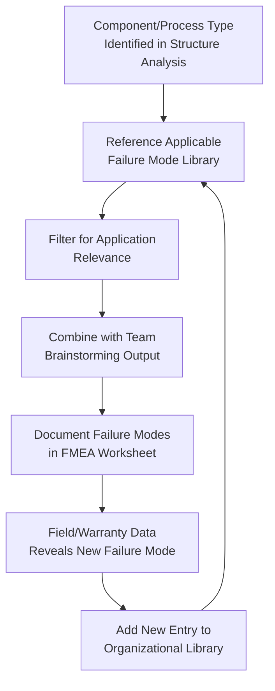

## Failure Mode Checklists and Libraries

### Overview

Failure mode checklists and libraries are standardized, reusable reference documents that catalog previously identified or generically known failure modes for specific component types, process types, or material categories. Rather than relying solely on ad-hoc brainstorming for each new FMEA, teams reference these libraries to ensure systematic coverage of well-established failure mechanisms, supplement (not replace) team brainstorming with a comprehensive baseline, and accelerate FMEA development by starting from proven, organizationally validated content rather than a blank page.

### Purpose Within FMEA

- Ensures baseline coverage of well-known, industry-standard failure modes for common component and process types, reducing the risk of overlooking established failure mechanisms
- Accelerates FMEA development time by providing a structured starting point rather than requiring the team to generate every failure mode from first principles
- Captures and institutionalizes organizational lessons learned, preventing repeated "rediscovery" of the same failure modes across different projects or product lines
- Supports consistency across multiple FMEAs within an organization, particularly for common component types (fasteners, bearings, seals, connectors, solder joints) used across many designs
- Provides a defensible basis for demonstrating due diligence in failure mode identification during audits or regulatory review

### Types of Failure Mode Libraries

**Component-Type Libraries**

Catalogs of generic failure modes organized by component category (e.g., bearings, fasteners, seals, gears, connectors, printed circuit assemblies), often including typical failure mechanisms, common causes, and detection methods for each.

**Process-Type Libraries**

Catalogs of generic process failure modes organized by manufacturing process category (e.g., injection molding, welding, machining, soldering, adhesive bonding), aligned with the 4M/5M framework.

**Industry Standard Failure Rate Databases**

Formal reliability databases providing quantified failure rate data by component type and application conditions (e.g., MIL-HDBK-217 for electronic component failure rates, FMD-91/NPRD for non-electronic parts), used to support Occurrence rating with empirical data.

**Organization-Specific Lessons-Learned Libraries**

Internal databases capturing failure modes discovered through warranty claims, field returns, and prior FMEA projects specific to the organization's own product history — typically the most directly relevant and high-value library type.

**Material-Specific Failure Mechanism Libraries**

Catalogs of common degradation and failure mechanisms by material class (e.g., polymer degradation modes, metal fatigue/corrosion mechanisms, elastomer compression set) used to support both DFMEA material selection risk analysis and PFMEA process-induced material degradation analysis.

### Common Generic Failure Modes by Component Category (Illustrative Examples)

| Component Type | Common Failure Modes |
| --- | --- |
| Fasteners (bolts, screws) | Loosening/backing out, thread stripping, fatigue fracture, over-torque yielding, cross-threading |
| Bearings | Wear/spalling, seizure, excessive play/looseness, contamination ingress, lubricant breakdown |
| Seals/Gaskets | Compression set, extrusion, chemical degradation, tear/puncture, improper installation gap |
| Electrical Connectors | Fretting corrosion, contact resistance increase, pin misalignment, intermittent connection, housing crack |
| Solder Joints | Cold solder joint, tombstoning, voiding, fatigue cracking from thermal cycling, insufficient wetting |
| Springs | Fatigue fracture, permanent set/relaxation, stress corrosion cracking |
| Welded Joints | Incomplete penetration, porosity, undercut, cracking (hot/cold), distortion |

### Step-by-Step Process for Using and Building Failure Mode Libraries

**Step 1: Identify Applicable Library Categories for the Item Under Analysis**

Match the structural element (DFMEA) or process step/4M category (PFMEA) to the relevant component-type, process-type, or material library.

**Step 2: Review Library Content as a Brainstorming Supplement**

Present the library's standard failure modes to the FMEA team during Failure Analysis as prompts, cross-checking against team-generated ideas from structured brainstorming to identify gaps.

**Step 3: Evaluate Relevance to the Specific Application**

Not every generic failure mode in a library applies to every specific use case — filter library content against the actual application conditions, loading, and environment before including entries as documented failure modes.

**Step 4: Supplement with Application-Specific Failure Modes**

Libraries provide a baseline, not a ceiling — teams should still brainstorm application-specific failure modes not captured in generic libraries, particularly for novel designs or unusual operating conditions.

**Step 5: Document Library-Sourced Failure Modes with Appropriate Detail**

When incorporating a library entry, adapt the generic description to the specific application's requirement and context rather than copying generic language verbatim into the FMEA worksheet.

**Step 6: Capture New Failure Modes Back into the Library**

When an FMEA (or subsequent field experience) identifies a failure mode not previously in the organizational library, formally add it to the library for future reuse — this continuous capture is what makes lessons-learned libraries increasingly valuable over time.

**Step 7: Periodically Review and Update Libraries**

Libraries should be reviewed periodically to remove outdated entries (e.g., failure modes tied to discontinued materials or processes) and incorporate newly validated additions from recent projects.

### Example: Applying a Component Library (Electrical Connector, DFMEA Context)

| Library Entry (Generic) | Application-Specific Adaptation (Power Window Wiring Connector) |
| --- | --- |
| Fretting corrosion at contact interface | Fretting corrosion at BCM-to-harness connector pins due to vibration-induced micro-movement, causing intermittent motor control signal loss |
| Housing crack from thermal cycling | Connector housing crack at door-mounted harness connector due to extreme temperature cycling (-40°C to 85°C) combined with UV exposure |
| Pin misalignment during mating | Not applicable — this connector uses a keyed, single-orientation housing; excluded from this DFMEA after review |

This example illustrates the filtering step: two generic library entries were adapted and retained as application-specific failure modes, while a third was reviewed and excluded as genuinely inapplicable to this specific connector design.

### Mermaid Diagram: Failure Mode Library Usage and Feedback Loop

### Library Sources: Internal vs. External

| Source Type | Examples | Strength | Limitation |
| --- | --- | --- | --- |
| Internal/Organizational | Company-specific lessons-learned database, prior FMEA archive | Highly relevant to actual products/processes; reflects real field history | Limited to the organization's own experience; may miss failure modes not yet encountered internally |
| Industry/Standards-Based | FMD-91, NPRD, MIL-HDBK-217, SAE failure mode references | Broad industry coverage, quantified failure rate data available | May not reflect specific application conditions; generic rather than product-specific |
| Supplier-Provided | Component supplier FMEA/reliability data for purchased parts | Direct manufacturer knowledge of component-specific failure modes | Quality and completeness vary by supplier; potential conflict of interest in self-reported data |
| Commercial FMEA Software Libraries | Built-in libraries within tools like APIS IQ-FMEA, Plato e1ns | Pre-structured, integrated directly into the FMEA workflow | May require customization/validation against the organization's specific applications |

### Best Practices

- **Treat libraries as a starting point, not a substitute for team brainstorming:** Generic library content should prompt and supplement team analysis, not replace the structured brainstorming process entirely
- **Maintain an actively updated organizational library:** The greatest long-term value comes from systematically capturing new failure modes discovered through actual field experience and FMEA projects, not from static, one-time-created libraries
- **Filter library content for genuine application relevance:** Blindly including every generic library entry regardless of applicability clutters the FMEA with irrelevant items and dilutes focus on genuinely credible risks
- **Cross-reference libraries against multiple sources:** Combining internal lessons-learned data with industry-standard references provides broader coverage than relying on a single source
- **Adapt generic descriptions to specific application context:** Copying generic library language verbatim without adaptation produces vague, less actionable FMEA entries

### Common Pitfalls

- **Over-reliance on libraries at the expense of team brainstorming:** Using only library content without structured brainstorming misses application-specific or novel failure modes not yet captured in any library
- **Including irrelevant generic entries without filtering:** Padding the FMEA with library failure modes that don't genuinely apply to the specific application, reducing analytical focus
- **Static, unmaintained libraries:** Libraries that are created once and never updated become increasingly outdated and miss failure modes from newer materials, processes, or field experience
- **No formal process to capture new failure modes back into the library:** Failing to close the loop between field/FMEA discoveries and library updates means the same failure modes may be "rediscovered" repeatedly across different projects
- **Treating library entries as pre-validated for the current application without review:** Assuming a generic failure mode's associated Severity/Occurrence assumptions transfer directly without re-evaluation for the specific application's conditions
- [Inference] Organizations with formally maintained, actively updated lessons-learned libraries likely achieve more comprehensive failure mode coverage in new FMEAs with less effort than organizations starting each FMEA from a blank page, though the magnitude of this benefit depends on library maintenance discipline and is not independently benchmarked here.

### Tools Commonly Used

- APIS IQ-FMEA, Plato e1ns, PTC Windchill FMEA — include built-in failure mode libraries and support organization-specific library customization
- Reliability databases (FMD-91, NPRD-2016, MIL-HDBK-217F) — industry-standard failure rate and mode references
- Internal knowledge management systems/wikis — common repository for organization-specific lessons-learned libraries
- Supplier PPAP/FMEA documentation — source of component-specific failure mode data for purchased parts

**Related Topics**

- Structured brainstorming methods
- Fishbone and Ishikawa diagrams
- Historical data and lessons-learned review
- Potential failure modes at each design level
- Potential process failure modes
- Special characteristics identification