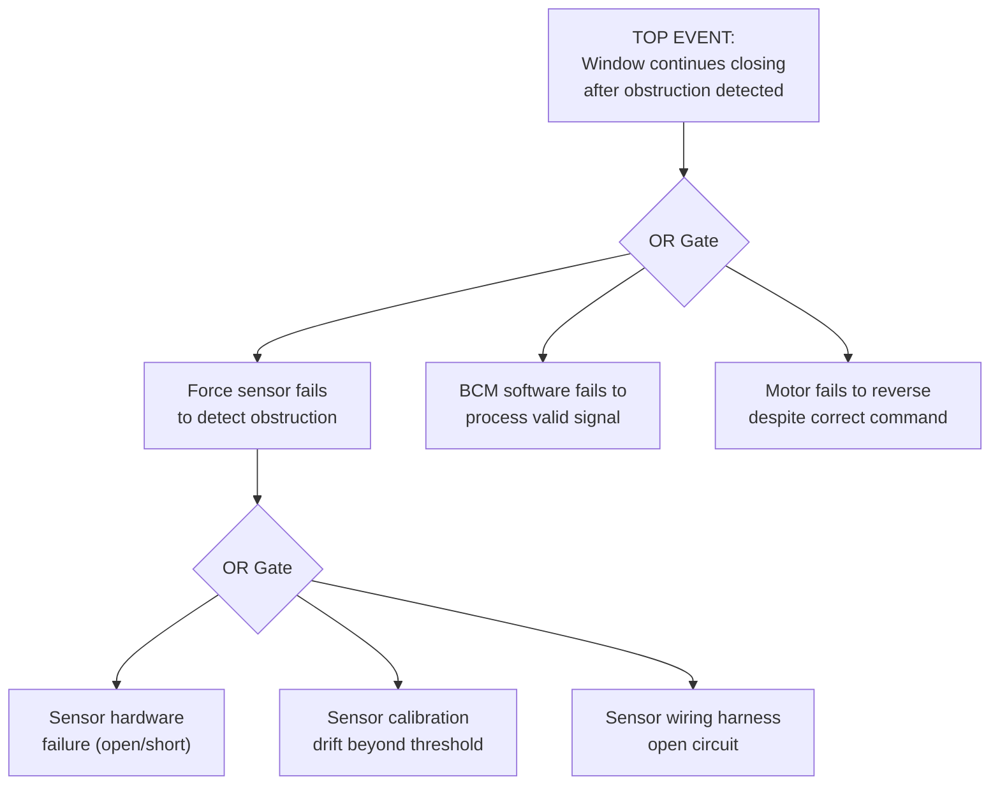

## Using Fault Tree Analysis as a Complement

### Overview

Fault Tree Analysis (FTA) is a formal, top-down, deductive logic modeling technique that starts from a specific undesired top-level event (typically a system failure or hazard) and systematically maps the combinations of lower-level failures that could cause it, using standardized logic gates (AND, OR) to represent how contributing failures combine. Where FMEA is inductive and bottom-up — starting from individual component/process failure modes and reasoning forward to their effects — FTA is deductive and top-down, starting from a specific unwanted outcome and reasoning backward to its causes. Used as a complement to FMEA, FTA provides a formal, quantifiable cross-check on whether the failure modes and causes identified in DFMEA/PFMEA collectively and logically account for the credible paths to a specific top-level safety or system-level event.

### Purpose of FTA as an FMEA Complement

- Validates FMEA completeness for a specific, well-defined top-level event by working backward through formal logic, potentially revealing failure paths not surfaced through FMEA's bottom-up brainstorming
- Explicitly models how multiple independent failures must combine (AND logic) versus how any single failure could trigger the event (OR logic) — a distinction not natively captured in the FMEA worksheet's format
- Supports quantitative probability calculation for the top-level event when component failure rate data is available, complementing FMEA's more qualitative Occurrence rating scale
- Particularly valuable for safety-critical systems (per ISO 26262 for automotive functional safety, DO-178C/DO-254 for aerospace, IEC 61508 for industrial safety) where regulatory or industry practice often expects both inductive (FMEA) and deductive (FTA) analysis
- Identifies single points of failure and redundancy gaps by visually exposing where only one failure path (rather than a combination) leads to the top event

### FMEA vs. FTA: Complementary Directions of Analysis

| Aspect | FMEA | FTA |
| --- | --- | --- |
| Direction | Bottom-up (inductive): from component/cause to system effect | Top-down (deductive): from system event to component/cause |
| Starting Point | Individual failure modes across the full structure | One specific, defined top-level undesired event |
| Scope | Comprehensive — covers all credible failure modes across the system | Focused — covers only paths leading to the specific top event analyzed |
| Logic Representation | Implicit; failure modes listed independently in worksheet rows | Explicit AND/OR gate logic showing how failures combine |
| Quantification | Qualitative rating scales (S-O-D, Action Priority) | Can be quantitative if failure rate data is available (probability calculation) |
| Best For | Systematic, comprehensive risk identification across an entire system/process | Deep analysis of a specific critical event, especially multi-failure combinations |

### Core FTA Elements and Logic Gates

**Top Event**

The specific undesired event under analysis, placed at the top of the tree (e.g., "unintended vehicle acceleration," "loss of braking function")

**OR Gate**

Indicates the output event occurs if any one of the input events occurs — represents failure paths where a single failure is sufficient to cause the event

**AND Gate**

Indicates the output event occurs only if all input events occur simultaneously — represents failure paths requiring multiple independent failures to combine, often reflecting redundancy or safety interlocks

**Basic Event**

A terminal, non-decomposed failure event at the bottom of a branch — analogous to a Failure Cause in FMEA terminology

**Intermediate Event**

An event resulting from the combination of lower-level events via a gate, itself feeding into a higher-level gate

### Step-by-Step Process for Using FTA to Complement FMEA

**Step 1: Select the Top-Level Event for FTA Analysis**

Identify specific, high-Severity failure effects from DFMEA/PFMEA (typically Severity 9–10, safety-critical or regulatory events) that warrant deeper, formal deductive analysis beyond the standard FMEA worksheet.

**Step 2: Construct the Fault Tree Top-Down**

Starting from the top event, identify the immediate necessary and/or sufficient conditions that would cause it, connecting them via appropriate AND/OR gates.

**Step 3: Continue Decomposition to Basic Events**

Recursively decompose each intermediate event until reaching basic events — failures at the component or elementary cause level, ideally matching the granularity of FMEA's documented Failure Causes.

**Step 4: Cross-Reference Basic Events Against FMEA Documentation**

For each basic event in the fault tree, confirm it corresponds to a documented Failure Cause in the DFMEA/PFMEA. Basic events with no FMEA counterpart indicate a gap in the FMEA's failure cause identification requiring follow-up.

**Step 5: Identify Single-Point Failures**

Review the tree for basic events that, alone (via an OR gate directly to a high-level intermediate event or the top event), are sufficient to cause the top event — these represent single points of failure warranting particular design or process attention.

**Step 6: Apply Quantitative Analysis Where Data Permits**

If component/cause failure rate (probability) data is available, calculate the probability of the top event using the gate logic (multiplication for AND gates, complementary probability summation for OR gates), providing a quantitative cross-check against FMEA's qualitative Occurrence ratings.

**Step 7: Feed Findings Back into FMEA**

Any new basic events, failure paths, or single-point-of-failure findings discovered through FTA that aren't yet documented in FMEA should be added, closing the loop between the two complementary analyses.

### Example: Simplified Fault Tree (Power Window Anti-Pinch Failure)

**Top Event:** Window continues closing after obstruction detected (anti-pinch failure)

**Immediate contributing events (OR gate — any one sufficient):**

- Force sensor fails to detect obstruction force
- BCM software fails to process valid sensor signal correctly
- Motor fails to reverse despite correct BCM command

**Further decomposition of "Force sensor fails to detect" (OR gate):**

- Sensor hardware failure (open/short circuit)
- Sensor calibration drift beyond threshold
- Sensor wiring harness open circuit

### Mermaid Diagram: Simplified Fault Tree Structure

### Cross-Referencing FTA Basic Events with FMEA Failure Causes

| FTA Basic Event | Corresponding FMEA Failure Cause | Status |
| --- | --- | --- |
| Sensor hardware failure (open/short circuit) | "Force sensor circuit open due to solder joint fatigue crack" | Documented in DFMEA |
| Sensor calibration drift beyond threshold | "Force threshold miscalibration in anti-pinch algorithm" | Documented in DFMEA |
| Sensor wiring harness open circuit | (not currently documented) | **Gap identified** — new Failure Cause added to DFMEA following FTA review |

This cross-reference exercise is where FTA delivers its primary complementary value: the wiring harness open-circuit path was revealed as a credible contributor to the top event through formal fault tree construction, but had not been independently surfaced during the original FMEA brainstorming — prompting its addition as a new documented failure cause.

### When to Apply FTA as a Complement (Not a Replacement)

FTA is generally applied selectively to a small number of high-consequence top events rather than comprehensively across an entire system, because constructing full fault trees for every FMEA failure mode would be impractically time-consuming. Common triggers for applying FTA include:

- Failure effects with Severity 9–10 (safety-critical or regulatory non-compliance)
- Systems with designed-in redundancy, where understanding AND-gate combinations is essential to verifying the redundancy actually provides the intended protection
- Regulatory or industry standard requirements explicitly calling for both inductive and deductive analysis (e.g., certain ISO 26262 ASIL levels, aerospace DO-178C/DO-254 contexts)
- Post-incident investigation where a quality escape or field failure needs formal causal path analysis beyond what the existing FMEA captured

### Best Practices

- **Reserve FTA for the highest-consequence, most safety-critical top events:** Applying it selectively, rather than universally, keeps the technique's depth and rigor practical within program timelines
- **Use FTA basic events as a completeness check against FMEA, not a replacement for it:** FTA's narrow, event-specific scope complements but does not substitute for FMEA's comprehensive, system-wide coverage
- **Pay particular attention to OR-gate paths as single points of failure:** Any basic event that alone (through OR logic) can cause the top event deserves focused design or process attention
- **Validate AND-gate redundancy assumptions carefully:** Confirm that events combined via AND gates are genuinely independent (not sharing a common-cause vulnerability that could defeat the intended redundancy)
- **Formally document and close the feedback loop to FMEA:** Any gaps or new failure paths discovered through FTA construction should be explicitly added to the corresponding DFMEA/PFMEA, maintaining synchronized documentation

### Common Pitfalls

- **Treating FTA and FMEA as entirely separate, disconnected exercises:** Failing to cross-reference basic events against FMEA failure causes loses the primary complementary value of using both techniques together
- **Applying FTA to every failure mode rather than selectively to critical events:** Attempting comprehensive FTA coverage across an entire system is typically impractical and dilutes focus from the highest-consequence events that most warrant the technique's rigor
- **Assuming AND-gate events are independent without verification:** Common-cause failures (e.g., a single power supply feeding both "redundant" sensors) can defeat intended redundancy if not explicitly checked
- **Using outdated or unvalidated failure rate data for quantitative FTA:** Probability calculations are only as reliable as the underlying component failure rate data, which should be sourced from validated field or test data rather than assumed values
- **Not updating the fault tree when the design or process changes:** A static FTA constructed early in the program can become inconsistent with a design that has since evolved
- [Inference] Programs that formally cross-reference FTA basic events against FMEA failure causes as a structured completeness check likely identify FMEA coverage gaps more reliably than programs treating the two analyses independently, though the magnitude of this benefit depends on how rigorously the cross-referencing step is performed and is not independently benchmarked here.

### Tools Commonly Used

- ReliaSoft (BlockSim, XFMEA) — dedicated fault tree and reliability analysis software, often paired with integrated FMEA modules
- Isograph FaultTree+ — dedicated FTA modeling and quantitative analysis tool
- APIS IQ-FMEA, Plato e1ns — some FMEA platforms offer FTA modules or export/cross-reference capability with dedicated FTA tools
- General diagramming tools (Visio, Lucidchart) — sufficient for qualitative (non-quantified) fault tree construction without probability calculation

**Related Topics**

- Fishbone and Ishikawa diagrams
- Five whys root cause technique
- Linking failure modes to effects and causes
- Special characteristics identification
- Severity, Occurrence, and Detection rating scales
- Functional safety standards (ISO 26262 overview)