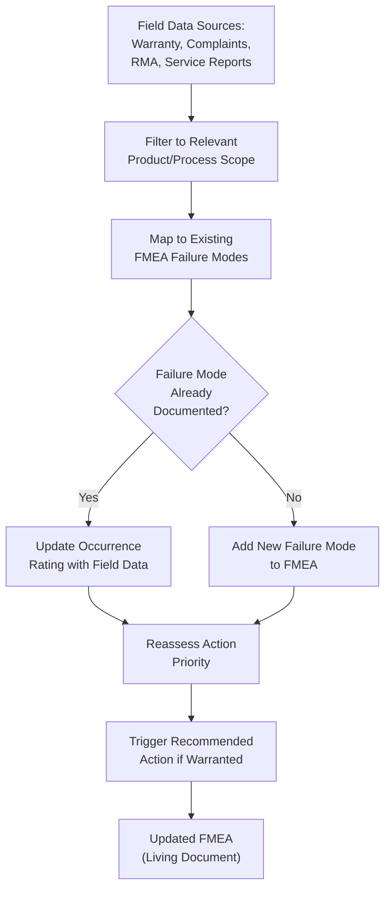

## Learning from Warranty and Complaint Data

### Overview

Learning from warranty and complaint data is the practice of systematically mining historical field failure records — warranty claims, customer complaints, service reports, and return material authorizations (RMAs) — to ground FMEA failure mode identification and risk rating in actual, empirically observed product performance rather than engineering judgment or theoretical analysis alone. Because DFMEA and PFMEA both require Occurrence ratings that ideally reflect real-world likelihood, and because failure mode identification is only as complete as the sources feeding it, warranty and complaint data represents one of the highest-value inputs available — it reflects what has actually gone wrong in the field, not merely what could theoretically go wrong.

### Purpose Within FMEA

- Grounds Occurrence ratings in actual field failure rate data rather than purely qualitative engineering estimation, particularly valuable for carryover or similar designs with established field history
- Surfaces failure modes that may not have been anticipated during design or process FMEA development, revealing gaps in the original analysis
- Validates or challenges existing Severity assumptions by revealing the actual customer-experienced consequences of failures, which sometimes differ from engineering predictions
- Identifies emerging trends (increasing complaint rate for a specific failure mode) that may indicate a systemic issue requiring FMEA update and corrective action before it escalates
- Supports the "living document" nature of FMEA by providing an ongoing feedback mechanism connecting field reality back to the risk analysis that should reflect it

### Types of Field Data Sources

**Warranty Claims**

Formal claims submitted by dealers/service centers for repair or replacement under manufacturer warranty, typically including failure description, part replaced, mileage/usage at failure, and repair cost — often the most structured and systematically coded data source.

**Customer Complaints**

Direct customer feedback, whether through call centers, surveys, or online channels, capturing dissatisfaction that may not always result in a formal warranty claim (e.g., noise, feel, cosmetic issues below repair threshold).

**Field Service Reports**

Technician-documented findings during service visits, often containing more detailed diagnostic information than the warranty claim summary alone.

**Return Material Authorizations (RMAs)**

Records of returned parts/products, particularly valuable when returned parts undergo failure analysis, providing physical evidence of the actual failure mechanism rather than only a symptom description.

**Regulatory/Safety Incident Reports**

Formal reports required for safety-related incidents (e.g., NHTSA complaints for automotive, MDR/MAUDE reports for medical devices), representing the highest-severity subset of field data requiring particular attention.

**Social Media and Online Review Monitoring**

Increasingly used as a supplementary signal for emerging issues, though generally less structured and requiring more interpretation than formal warranty/complaint channels.

### Step-by-Step Process for Incorporating Field Data into FMEA

**Step 1: Establish Data Access and Coding Consistency**

Confirm access to relevant warranty/complaint databases and understand the failure coding taxonomy used (e.g., standardized failure mode codes), since inconsistent coding across data sources complicates analysis.

**Step 2: Filter Data to the Relevant Product/Process Scope**

Narrow the dataset to the specific component, subsystem, or process matching the FMEA under development — using data from an unrelated product or an entirely different application can mislead rather than inform.

**Step 3: Categorize Field Failures Against Existing FMEA Failure Modes**

Map each field failure record to a corresponding documented failure mode in the FMEA, identifying which failure modes have actual field occurrence evidence versus which remain purely theoretical.

**Step 4: Identify Failure Modes Not Yet Documented in FMEA**

Flag field failure patterns that don't map to any existing FMEA entry — these represent gaps requiring immediate FMEA update, since they demonstrate the failure mode is not merely theoretical but has actually occurred.

**Step 5: Calculate or Estimate Occurrence Rates from Field Data**

Where volume and failure count data support it, calculate actual field failure rates (e.g., failures per thousand vehicles, parts per million) to ground Occurrence ratings quantitatively rather than relying solely on qualitative judgment.

**Step 6: Analyze Trends Over Time**

Review whether a given failure mode's field occurrence rate is stable, increasing, or decreasing, since trend direction carries different implications than a single snapshot rate (an increasing trend may indicate an emerging systemic issue).

**Step 7: Validate Failure Cause Attribution Against Returned Part Analysis**

Where RMA/returned part failure analysis is available, use the confirmed root cause (not merely the customer-reported symptom) to validate or refine the FMEA's documented Failure Cause statements.

**Step 8: Feed Findings Back into FMEA Ratings and Documentation**

Update Occurrence ratings, add newly discovered failure modes, and reassess Action Priority based on validated field evidence — this is the core closed-loop value of the practice.

### Example: Field Data Integration (Power Window Motor)

| FMEA Failure Mode | Field Data Finding | FMEA Update |
| --- | --- | --- |
| Motor fails to generate torque (documented) | Warranty data: 12 claims per 10,000 vehicles over 3 years; trend stable | Occurrence rating confirmed at existing level (4); no update needed |
| Insulation breakdown from thermal cycling (documented) | RMA failure analysis: 60% of returned motors show insulation breakdown at connector interface, not winding as originally assumed | Failure Cause statement revised from "winding insulation breakdown" to "connector-interface insulation breakdown due to thermal cycling at solder joint," redirecting corrective action focus |
| (not previously documented) | Customer complaints: recurring reports of window motor "clicking" noise without full failure, not captured in warranty claims (below repair threshold) | New failure mode added: "Motor produces audible clicking during operation (degraded function, customer dissatisfaction)," Severity assessed as lower but still requiring documentation |

### Mermaid Diagram: Field Data Feedback Loop into FMEA

### Using Field Data for Occurrence Rating Calibration

| Data Availability | Occurrence Rating Approach |
| --- | --- |
| No field history (new design/process) | Qualitative engineering estimation based on similar component/process experience, material properties, and design margin |
| Limited field history (recent launch, low volume) | Blend qualitative estimation with early field signal, weighted toward caution given limited sample size |
| Substantial field history (mature product, high volume) | Quantitative failure rate calculation directly from warranty/complaint data, providing the most defensible Occurrence rating basis |
| Trending/emerging issue | Occurrence rating should reflect the trend trajectory, not just the current snapshot rate — a rapidly increasing rate warrants a more conservative (higher) rating even if the current absolute rate remains moderate |

### Common Analytical Techniques Applied to Field Data

**Pareto Analysis**

Ranking failure modes by frequency or cost to identify the "vital few" contributing the majority of warranty expense or complaint volume, focusing FMEA update and corrective action prioritization.

**Time-to-Failure Analysis**

Examining the distribution of failure timing (mileage, usage cycles, calendar time) to distinguish early-life/infant-mortality failures from wear-out failures, informing both root cause hypotheses and Occurrence rating context.

**Geographic/Environmental Correlation**

Analyzing whether failure rates correlate with specific climates, usage patterns, or regions, potentially revealing environmental failure causes not initially considered in the FMEA.

**Statistical Trend Analysis**

Monitoring failure rate trends over production date/build code to detect whether a specific manufacturing period or design/process change correlates with a shift in failure occurrence.

### Best Practices

- **Establish a formal, recurring review cadence:** Periodic (e.g., quarterly) structured review of warranty/complaint data against the FMEA, rather than only reactive review after a significant issue emerges
- **Prioritize root-cause-validated data (RMA analysis) over symptom-only data (initial complaint description):** Customer-reported symptoms often differ from the actual underlying failure mechanism confirmed through physical failure analysis
- **Distinguish snapshot rate from trend direction:** A stable, low failure rate and a rapidly increasing rate from a similarly low starting point warrant different levels of concern and Action Priority
- **Cross-reference across multiple data sources:** Warranty claims, complaints, and RMA analysis each capture different aspects of field experience; relying on only one source risks an incomplete picture
- **Formally close the loop by updating FMEA documentation:** Field data review that doesn't result in documented FMEA updates (new failure modes, revised Occurrence ratings, new Recommended Actions) provides limited practical value

### Common Pitfalls

- **Treating field data review as a one-time activity rather than ongoing practice:** FMEA remains most valuable as a living document only if field data review is genuinely recurring, not performed once at initial FMEA development and never revisited
- **Using unfiltered or misapplied data:** Applying field data from an unrelated product variant, different application, or different market/usage conditions without appropriate filtering can produce misleading Occurrence rating conclusions
- **Relying solely on customer-reported symptoms without physical failure analysis:** Customer complaint descriptions often reflect the observed effect, not the actual root cause, risking mischaracterization of the true Failure Cause in FMEA
- **Ignoring low-severity but high-frequency complaints:** Focusing FMEA attention only on warranty claims (which typically capture higher-severity failures) while overlooking high-volume customer dissatisfaction complaints that don't rise to formal warranty claims
- **Failing to distinguish trend direction from absolute rate:** Treating a low but rapidly increasing failure rate the same as a low and stable rate, missing an emerging systemic issue
- [Inference] Organizations with formal, recurring field-data-to-FMEA review processes likely identify emerging systemic issues earlier and maintain more accurate Occurrence ratings than organizations conducting field data review only reactively after a significant quality escape, though the degree of improvement depends on review cadence and organizational discipline and is not independently benchmarked here.

### Tools Commonly Used

- Warranty management systems (often integrated with dealer/service networks) — primary source of structured warranty claim data
- Quality management software with complaint tracking modules — captures customer complaint data, sometimes integrated with warranty systems
- Failure analysis laboratories/RMA tracking systems — provide root-cause-validated data from returned parts
- Statistical analysis software (Minitab, JMP) — supports Pareto analysis, trend analysis, and time-to-failure analysis of field data
- APIS IQ-FMEA, Plato e1ns — some platforms support direct linkage between field data records and FMEA Occurrence rating justification

**Related Topics**

- Failure mode checklists and libraries
- Structured brainstorming methods
- Five whys root cause technique
- Severity, Occurrence, and Detection rating scales
- Special characteristics identification
- Design Verification Plan and Report (DVP&R)