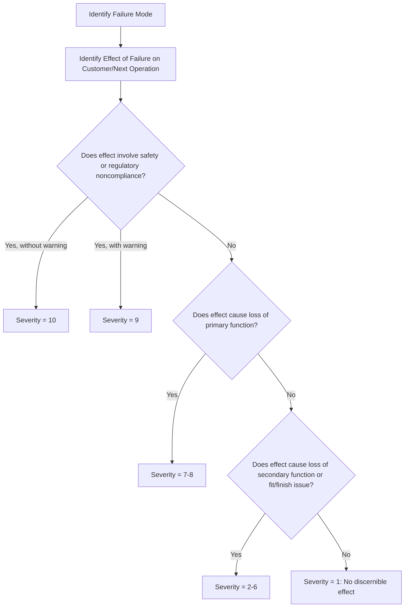

## Severity Rating Scales and Criteria

### Definition and Purpose

Severity (S) is one of three risk-scoring dimensions in Failure Mode and Effects Analysis, alongside Occurrence (O) and Detection (D). Severity quantifies the seriousness of the consequences of a failure mode's effect, evaluated independently of how likely the failure is to occur or how likely it is to be detected. A severity rating is assigned to the **effect** of a failure, not the failure mode or cause itself — if a single failure mode produces multiple effects, the highest-severity effect governs the rating for that failure mode line.

### Core Principles

- **Severity is fixed per effect, not per control**: Unlike Occurrence and Detection, Severity generally cannot be reduced by adding detection controls. It can only be reduced through design changes that change the consequence itself (e.g., adding a safety guard that changes "amputation" to "no injury").
- **Independent evaluation**: Severity is rated without regard to the probability of occurrence. A catastrophic effect that is extremely rare still receives a high severity score.
- **Worst credible effect**: Teams rate the reasonably foreseeable worst-case effect of the failure mode reaching the end user or next process step, not a hypothetical extreme outlier.
- **Team consensus**: Ratings should be assigned by a cross-functional team (design, quality, manufacturing, safety, service) to avoid single-perspective bias.

### Common Scale Formats

#### 1–10 Scale (AIAG-VDA and AIAG 4th Edition Standard)

This is the most widely used scale in automotive and many manufacturing FMEAs.

| Rating | Effect | Criteria (Design FMEA example) |
| --- | --- | --- |
| 10 | Hazardous — without warning | Affects safe vehicle/system operation or involves noncompliance with government regulation, without warning |
| 9 | Hazardous — with warning | Same as above, but with warning |
| 8 | Very High | Loss of primary function; vehicle/product inoperable, does not affect safe operation |
| 7 | High | Degradation of primary function; product operable but at reduced performance level |
| 6 | Moderate | Loss of secondary function; product operable but comfort/convenience functions lost |
| 5 | Low | Degradation of secondary function |
| 4 | Very Low | Fit and finish/noise issue; most customers notice |
| 3 | Minor | Fit and finish/noise issue; average customer notices |
| 2 | Very Minor | Fit and finish/noise issue; discriminating customer notices |
| 1 | None | No discernible effect |

#### 1–5 Scale (Simplified/Healthcare and Process FMEAs)

Used in industries wanting faster consensus-building or in Process FMEAs where finer granularity isn't practical.

| Rating | Effect | Description |
| --- | --- | --- |
| 5 | Catastrophic | Failure could result in death or major system loss |
| 4 | Critical | Failure could cause severe injury, major property/equipment damage |
| 3 | Major | Failure causes significant degradation of performance |
| 2 | Minor | Failure causes slight inconvenience or minor degradation |
| 1 | Negligible | No noticeable effect |

### AIAG-VDA (2019) Harmonized Approach

The AIAG-VDA handbook standardized severity criteria across Design FMEA (DFMEA) and Process FMEA (PFMEA) with separate criteria columns for each, since the "customer" differs — DFMEA considers the end user, while PFMEA may consider the next internal operation, plant, or end user depending on where the effect surfaces.

**Key distinctions:**

- **DFMEA severity**: Evaluated at the level of the end user experiencing the effect of the product failure.
- **PFMEA severity**: The same severity ranking table is typically inherited from the related DFMEA effect, since the ultimate consequence to the end customer doesn't change based on which process step causes it. However, PFMEA may also assess severity to the **next operation** (e.g., a defect causing downstream tooling damage) using a separate, lower-stakes criteria table.

### Domain-Specific Severity Considerations

#### Automotive (AIAG-VDA)

Ratings 9–10 are reserved for effects involving safety or regulatory noncompliance. Special symbols may be appended:

- **S** (Safety) — indicates a special characteristic requiring additional controls
- Severity 9–10 automatically triggers mandatory design reviews and elevated action priority (AP) regardless of Occurrence/Detection scores under AIAG-VDA's Action Priority methodology.

#### Healthcare (Failure Mode and Effects Analysis in Clinical Settings)

Severity criteria are often reframed around patient harm categories (e.g., no harm, temporary harm requiring intervention, permanent harm, death), aligning with frameworks like the National Coordinating Council for Medication Error Reporting and Prevention (NCC MERP) index.

#### Aerospace (SAE ARP5580 / MIL-STD-1629A)

Severity often maps directly to established hazard categories:

- Catastrophic (loss of life/aircraft)
- Critical (severe injury/major damage)
- Marginal (minor injury/damage)
- Negligible (no injury/damage)

This mapping allows FMEA severity to feed directly into System Safety hazard analyses.

### Constructing a Custom Severity Scale

When an organization builds a scale tailored to its product/process, the following steps are standard practice:

**Key Points**

- Define the number of levels (commonly 5 or 10; more granularity allows finer prioritization but increases rater disagreement)
- Anchor the top and bottom of the scale first (catastrophic/safety effect at the top, "no effect" at the bottom)
- Write criteria in terms of **observable, verifiable effects** — avoid vague terms like "bad" or "significant" without a measurable definition
- Ensure criteria are **mutually exclusive** between adjacent ratings to reduce team disagreement
- Validate the scale with historical failure data or cross-functional review before deployment
- Keep the scale consistent across all FMEAs in the organization or product line to allow risk comparison across projects

### Example

**Failure Mode:** Weld joint fracture on structural bracket

**Effect:** Bracket separates during vehicle operation, potential loss of steering control

**Severity Rating (1–10 scale): 9**

**Justification:** The effect is hazardous to vehicle occupants and provides a warning (unusual noise/vibration) before complete failure, placing it at 9 rather than 10 on the AIAG-VDA scale.

### Relationship to Risk Prioritization

Severity is combined with Occurrence (O) and Detection (D) to calculate either:

$$RPN = S \times O \times D$$

or, under AIAG-VDA's newer methodology, fed into an **Action Priority (AP)** table that uses Severity as the primary sorting axis (high severity items are prioritized for action regardless of low RPN, addressing a known weakness of pure RPN multiplication where a high-severity/low-occurrence item can be masked by a low overall score).

### Common Pitfalls

- Conflating severity of the failure mode with severity of the effect — always rate the effect
- Allowing detection controls to lower the severity score (severity should only decrease via design/process changes that change the consequence)
- Using inconsistent scales across FMEAs, making risk comparison across products invalid
- Rating severity based on likelihood of occurrence ("it probably won't happen that bad") — severity and occurrence must remain independent

### Diagram: Severity Rating Decision Flow (svg_diagram)

**Related Topics**

- Occurrence rating scales and criteria
- Detection rating scales and criteria
- Risk Priority Number (RPN) calculation and limitations
- AIAG-VDA Action Priority (AP) tables
- Special characteristics identification (Critical/Significant/Safety)
- Severity classification in Design FMEA vs Process FMEA
- Linking FMEA severity to System Safety hazard analysis
- Cross-functional team consensus techniques for rating assignment