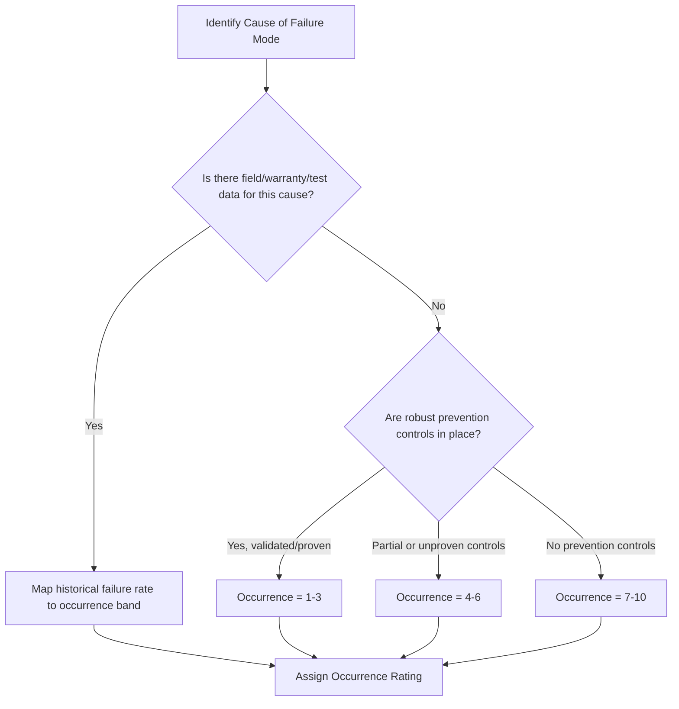

## Occurrence Rating Scales and Criteria

### Definition and Purpose

Occurrence (O) is the risk-scoring dimension in FMEA that estimates the likelihood that a specific cause of a failure mode will occur during the design life or process run. Unlike Severity, which is tied to the effect, Occurrence is rated against the **cause** of the failure mode, meaning a single failure mode with multiple potential causes may carry different occurrence ratings for each cause-effect pathway.

### Core Principles

- **Rated per cause, not per failure mode**: Occurrence reflects the frequency of a specific root cause, since different causes of the same failure mode can have very different likelihoods.
- **Based on prediction or historical data**: Ratings should be grounded in field data, test data, warranty data, or reliability predictions wherever possible, rather than intuition alone.
- **Independent of Severity and Detection**: A cause is rated on likelihood alone, without regard to how bad the resulting effect is or how likely it is to be caught before reaching the customer.
- **Reducible through prevention controls**: Unlike Severity, Occurrence can be lowered by improving the design or process to prevent the cause from happening (e.g., error-proofing, tolerance design, material selection) — not by adding inspection.

### Common Scale Formats

#### 1–10 Scale (AIAG-VDA and AIAG 4th Edition Standard)

The most common format in automotive and manufacturing FMEAs, often anchored to failure rates per number of items or per number of vehicles/units.

| Rating | Likelihood | Criteria (typical Design FMEA anchor) |
| --- | --- | --- |
| 10 | Extremely High | ≥ 100 per 1,000 (1 in 10) |
| 9 | Very High | 50 per 1,000 (1 in 20) |
| 8 | High | 20 per 1,000 (1 in 50) |
| 7 | High | 10 per 1,000 (1 in 100) |
| 6 | Moderate | 2 per 1,000 (1 in 500) |
| 5 | Moderate | 0.5 per 1,000 (1 in 2,000) |
| 4 | Moderate-Low | 0.1 per 1,000 (1 in 10,000) |
| 3 | Low | 0.01 per 1,000 (1 in 100,000) |
| 2 | Very Low | ≤ 0.001 per 1,000 (1 in 1,000,000) |
| 1 | Remote | Failure eliminated through preventive control |

Numeric anchors vary by organization/industry standard (AIAG 4th edition vs AIAG-VDA 1st edition use slightly different failure-rate bands), so the specific per-rating cutoffs should always be confirmed against the governing reference manual in use.

#### 1–5 Scale (Simplified/Process and Healthcare FMEAs)

| Rating | Likelihood | Description |
| --- | --- | --- |
| 5 | Very High | Failure is almost inevitable; occurs frequently |
| 4 | High | Repeated failures observed |
| 3 | Moderate | Occasional failures |
| 2 | Low | Relatively few failures |
| 1 | Remote | Failure is unlikely; no known occurrences |

### AIAG-VDA (2019) Harmonized Approach

The AIAG-VDA handbook shifted occurrence rating away from pure statistical failure-rate tables toward a framework centered on **prevention control effectiveness**:

- **Design FMEA**: Occurrence is rated based on the effectiveness of prevention controls already built into the design (e.g., design standards, simulation, use of proven materials) combined with historical occurrence of the cause in similar designs.
- **Process FMEA**: Occurrence is rated based on the effectiveness of current prevention controls in the process (e.g., poka-yoke, statistical process control, fixture design) in stopping the cause from happening, not on detection of the resulting defect.

This shift emphasizes that occurrence should reflect the **robustness of prevention**, not just historical frequency, since a new design/process may have no field history yet.

### Domain-Specific Occurrence Considerations

#### Automotive (AIAG-VDA)

Occurrence ratings 1–2 typically require documented, validated prevention controls (e.g., proven design standard, mistake-proofed process) rather than simple optimism. High occurrence (8–10) combined with high severity (9–10) automatically escalates Action Priority regardless of detection score.

#### Healthcare

Occurrence is often rated using incident frequency bands (e.g., "occurs multiple times per year" through "has never occurred but is conceivable") rather than statistical failure rates, since clinical failure data is harder to quantify at part-per-thousand granularity.

#### Aerospace/Defense (MIL-STD-1629A)

Occurrence is frequently expressed as a qualitative probability level (Frequent, Probable, Occasional, Remote, Improbable) mapped to quantitative failure rate ranges per operating hour, aligning occurrence scoring directly with reliability engineering practice (e.g., MTBF-derived data).

### Constructing a Custom Occurrence Scale

**Key Points**

- Anchor extremes first: "essentially impossible / eliminated by design" at the low end, "near-certain / recurring" at the high end
- Base numeric bands on real historical data (warranty returns, defect rates, incident logs) whenever available, rather than arbitrary round numbers
- Keep the scale's granularity consistent with the organization's actual data resolution — a 1–10 scale implies more precision than most teams can substantiate without solid data
- Align occurrence bands with the same units used elsewhere in the organization's reliability/quality reporting (e.g., defects per million opportunities, DPMO) to enable cross-referencing
- Re-validate scale anchors periodically against updated field/warranty data

### Example

**Failure Mode:** Weld joint fracture on structural bracket

**Cause:** Insufficient weld penetration due to inconsistent fixture clamping pressure

**Occurrence Rating (1–10 scale): 4**

**Justification:** Historical process data shows this cause occurs in approximately 1 in 10,000 units; no automated prevention control currently exists, but the fixture design has moderate repeatability.

### Relationship to Risk Prioritization

Occurrence multiplies with Severity and Detection under the traditional RPN formula:

$$RPN = S \times O \times D$$

Under AIAG-VDA's Action Priority (AP) approach, Occurrence is the second-tier sorting factor after Severity — a high-severity effect paired with even moderate occurrence and weak detection will typically be flagged High priority, since occurrence directly reflects how often the hazardous condition can be generated in the first place.

### Common Pitfalls

- Rating occurrence based on optimism ("we don't think it will happen") rather than data or engineering rationale
- Conflating occurrence of the cause with occurrence of the failure mode's overall effect
- Allowing improved detection controls to influence the occurrence score (detection controls belong in the Detection rating, not Occurrence)
- Using stale historical data from a materially different design/process without validating applicability
- Assigning the same occurrence rating to all causes of a failure mode instead of evaluating each cause independently

### Diagram: Occurrence Rating Decision Flow (svg_diagram)

**Related Topics**

- Severity rating scales and criteria
- Detection rating scales and criteria
- Prevention controls vs detection controls in FMEA
- Poka-yoke and mistake-proofing techniques
- Statistical process control (SPC) as an occurrence-reduction method
- Reliability engineering and MTBF-based probability estimation
- AIAG-VDA Action Priority (AP) tables
- Warranty and field-data feedback loops into FMEA updates