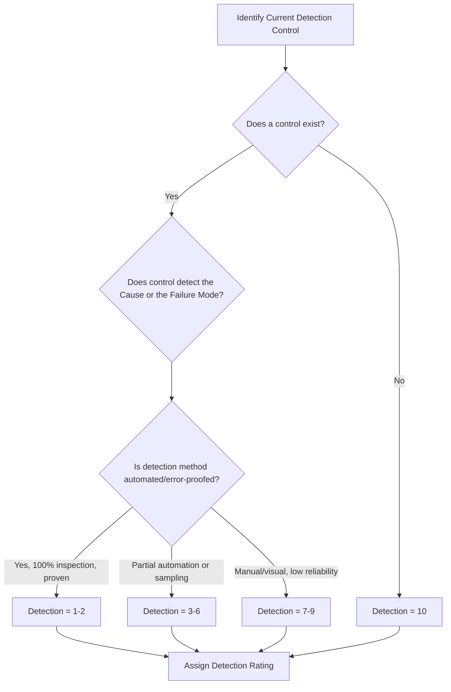

## Detection Rating Scales and Criteria

### Definition and Purpose

Detection (D) is the risk-scoring dimension in FMEA that estimates the ability of current design or process controls to detect a cause or failure mode before it reaches the customer or the next operation. Unlike Severity and Occurrence, higher Detection ratings indicate *worse* performance — a high score means the control is unlikely to catch the problem, while a low score means the problem will almost certainly be caught before escape.

### Core Principles

- **Rated per detection control, not per cause**: Detection reflects the effectiveness of the specific control(s) currently in place to catch either the cause or the resulting failure mode/effect before it escapes.
- **Inverted scale logic**: A rating of 1 means near-certain detection; a rating of 10 means the control cannot detect the issue at all or no control exists. This is the opposite polarity of Severity and Occurrence, and is a frequent source of team confusion.
- **Tied to actual current controls**: Detection must reflect controls that genuinely exist today (inspection, testing, monitoring, automated checks) — not planned or aspirational controls.
- **Detection point matters**: The later in the process a failure is caught (e.g., at the customer vs. at the source operation), the higher the detection rating, since later-stage controls are inherently less effective at preventing downstream consequences.

### Common Scale Formats

#### 1–10 Scale (AIAG-VDA and AIAG 4th Edition Standard)

| Rating | Detection | Criteria (typical Process FMEA anchor) |
| --- | --- | --- |
| 10 | Absolute Uncertainty | No known control exists to detect failure mode or cause |
| 9 | Very Remote | Control unlikely to detect failure mode |
| 8 | Remote | Control has poor chance of detection |
| 7 | Very Low | Control has low chance of detection |
| 6 | Low | Control may detect failure mode |
| 5 | Moderate | Control has moderate chance of detection |
| 4 | Moderately High | Control has good chance of detection |
| 3 | High | Control has high chance of detection |
| 2 | Very High | Control has very high chance of detection |
| 1 | Almost Certain | Control will almost certainly detect the failure mode/cause; error-proofed |

#### 1–5 Scale (Simplified/Healthcare and Process FMEAs)

| Rating | Detection | Description |
| --- | --- | --- |
| 5 | Very Low | No current control; failure will reach customer/end user undetected |
| 4 | Low | Control unlikely to catch failure before it advances |
| 3 | Moderate | Control has a reasonable chance of catching the failure |
| 2 | High | Control reliably catches most instances |
| 1 | Very High | Failure is virtually impossible to miss; automated/error-proofed detection |

### AIAG-VDA (2019) Harmonized Approach

The AIAG-VDA handbook restructures Detection rating around **two distinct control types**, particularly for Process FMEA:

- **Detection of the Cause**: Controls that catch the cause before the failure mode is even generated (e.g., in-process monitoring of a process parameter).
- **Detection of the Failure Mode**: Controls that catch the failure mode/defect after it has occurred but before the part advances (e.g., end-of-line inspection, gauging, functional test).

Detection of the cause is generally considered more effective than detection of the failure mode alone, since it prevents downstream propagation, and this distinction is reflected in how the AIAG-VDA criteria tables are structured (separate columns/considerations for cause-detection vs. failure-mode-detection controls).

### Domain-Specific Detection Considerations

#### Automotive (AIAG-VDA)

Detection ratings interact directly with the Action Priority (AP) table: even a low-severity, low-occurrence item can be escalated to a higher AP if detection is rated 8–10, since undetectable failures pose disproportionate downstream risk (e.g., reaching multiple customers before discovery).

#### Healthcare

Detection is often tied to point-of-care verification steps (e.g., barcode scanning, double-check protocols, alarms) rather than statistical sampling, since a single undetected clinical error can have immediate patient impact — detection scales in this domain frequently compress the top end (any single point of failure with no verification defaults to the worst rating).

#### Aerospace/Defense (MIL-STD-1629A)

Detection is often evaluated in terms of Built-In Test (BIT) coverage, maintenance inspection intervals, and crew/operator annunciation systems, with ratings reflecting the probability that a fault will be flagged before it propagates to a hazardous system state.

### Constructing a Custom Detection Scale

**Key Points**

- Anchor the top ("no control exists") and bottom ("100% automated/error-proofed detection") first
- Differentiate between detection methods explicitly: manual visual inspection scores worse than automated gauging/sensors, which scores worse than mistake-proofing that physically prevents the defect
- Account for sampling vs. 100% inspection — sampling-based controls should never receive top-tier (near-1) ratings, since some defective units can pass through undetected
- Tie criteria to verifiable control capability (Cpk/Ppk data for measurement systems, gauge R&R, alarm response times) rather than subjective confidence
- Keep detection-point context explicit in the criteria wording (detection at source vs. detection at next operation vs. detection at end customer)

### Example

**Failure Mode:** Weld joint fracture on structural bracket

**Cause:** Insufficient weld penetration due to inconsistent fixture clamping pressure

**Current Control:** Manual visual inspection of weld bead at end of line (sampling-based, no automated gauge)

**Detection Rating (1–10 scale): 7**

**Justification:** Visual inspection has a low probability of catching internal/subsurface penetration defects; the control does not directly measure penetration depth, and sampling means not all units are inspected.

### Relationship to Risk Prioritization

Detection is the third multiplier in the traditional RPN formula:

$$RPN = S \times O \times D$$

Because RPN treats all three factors as equally weighted multipliers, a high-severity/high-occurrence/low-detection combination can produce a numerically similar RPN to a low-severity/low-occurrence/high-detection combination — a well-documented weakness of pure RPN math. AIAG-VDA's Action Priority (AP) table addresses this by evaluating Severity first, then Occurrence, then Detection in a prioritized decision-tree rather than a flat multiplication, so that undetectable high-severity risks are not masked by an arithmetically moderate RPN score.

### Common Pitfalls

- Rating detection based on planned/future controls instead of controls that exist today
- Confusing the scale polarity — assigning a low number to a weak control (the scale is inverted relative to Severity/Occurrence)
- Rating detection of the failure mode when the team actually implemented a cause-detection control (or vice versa) without distinguishing which is being scored
- Giving sampling-based inspection the same rating as 100% automated inspection
- Ignoring detection point — treating "caught at final customer" the same as "caught at the operation where the defect was created"

### Diagram: Detection Rating Decision Flow (svg_diagram)

**Related Topics**

- Severity rating scales and criteria
- Occurrence rating scales and criteria
- Cause detection vs. failure mode detection controls
- Risk Priority Number (RPN) limitations and alternatives
- AIAG-VDA Action Priority (AP) tables
- Gauge R&R and measurement system analysis
- Poka-yoke as a detection vs. prevention control
- Control plan linkage to FMEA detection ratings