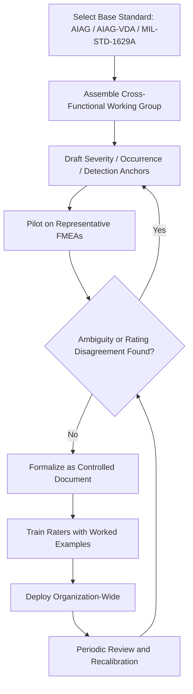

## Customizing Rating Tables for an Organization

### Definition and Purpose

Customizing rating tables refers to the process of adapting generic Severity, Occurrence, and Detection (S/O/D) scales from reference standards (AIAG, AIAG-VDA, MIL-STD-1629A) into organization-specific criteria that reflect an organization's actual products, processes, customer base, regulatory environment, and historical data. Generic scales provided in standards are intentionally illustrative templates rather than universal criteria, and most organizations are expected to tailor them before deployment.

### Why Customization Is Necessary

- **Generic scales are often too abstract**: Terms like "high severity" or "moderate occurrence" in reference tables need concrete, product-specific translation (e.g., what "loss of primary function" means for a medical infusion pump vs. a plastic trim clip).
- **Industry and regulatory context differs**: Safety-critical industries (automotive, aerospace, medical devices) require severity anchors tied to injury/regulatory noncompliance; consumer goods or software may anchor severity to customer satisfaction, brand impact, or financial loss instead.
- **Data availability differs**: Occurrence bands based on failure-rate-per-1,000 units assume access to reliable field/warranty data; organizations without mature data systems may need qualitative anchors instead.
- **Detection infrastructure differs**: Detection criteria should reflect the organization's actual inspection/testing/monitoring capability, not an idealized control environment.
- **Comparability across projects**: A consistent, organization-wide scale allows risk levels to be compared meaningfully across different product lines, programs, or business units — something that's impossible if each team invents its own criteria ad hoc.

### Core Customization Principles

- **Preserve the polarity conventions**: Severity and Occurrence should remain "higher number = worse," and Detection should remain "higher number = worse detection capability" (inverted), consistent with industry norms, to avoid confusing engineers moving between projects or referencing external benchmarks.
- **Anchor extremes concretely first**: Define the top (catastrophic/near-certain/no detection) and bottom (no effect/eliminated/near-certain detection) of each scale using specific, unambiguous language before filling in intermediate levels.
- **Use observable, measurable language**: Avoid subjective terms ("bad," "significant," "minor") without an operational definition (e.g., specific downtime hours, defect cost thresholds, injury classification).
- **Maintain mutual exclusivity between adjacent levels**: Each rating band should have a clear, non-overlapping boundary so two reviewers evaluating the same failure mode converge on the same score.
- **Match granularity to available data maturity**: A 10-point scale implies more resolution than most organizations can defensibly support without solid historical data; a 5-point scale is often more honest and produces better team consensus when data is sparse.
- **Align with existing quality/reliability metrics**: Reuse metrics the organization already tracks (DPMO, Cpk, warranty return rate, complaint categories) as scale anchors rather than inventing new units specific to FMEA.

### Customization Workflow

**Key Points**

1. **Select a base standard** (AIAG 4th edition, AIAG-VDA 1st edition, MIL-STD-1629A, or an internal legacy scale) as the starting template
2. **Assemble a cross-functional working group** — design engineering, manufacturing/process engineering, quality, reliability, field service, and safety/regulatory representatives
3. **Define severity anchors** specific to the product/process domain (safety, regulatory, functional, cosmetic tiers)
4. **Define occurrence anchors** using available historical failure-rate data, or qualitative frequency bands where data is immature
5. **Define detection anchors** based on the organization's actual inspection/test/monitoring capability tiers (manual visual, sampling, automated gauge, 100% functional test, error-proofing)
6. **Pilot the draft scale** on 2–3 representative existing FMEAs to check for ambiguity, rating clustering, or inconsistent team interpretation
7. **Revise based on pilot feedback**, tightening ambiguous language and resolving overlapping bands
8. **Formalize and publish** the scale as a controlled document (often part of the FMEA procedure or Advanced Product Quality Planning/APQP work instructions)
9. **Train raters** on the finalized criteria with worked examples
10. **Periodically review and update** as product technology, regulatory requirements, or data maturity evolve

### Example: Customizing a Severity Scale for a Software/SaaS Product

A hardware-oriented AIAG severity table doesn't map well to software failure modes. A customized table might look like:

| Rating | Effect | Criteria |
| --- | --- | --- |
| 10 | Catastrophic | Data loss or security breach affecting customer data; regulatory/compliance violation |
| 8–9 | Critical | Core feature completely unavailable for all users (outage) |
| 6–7 | Major | Core feature degraded or unavailable for a subset of users |
| 4–5 | Moderate | Non-core feature unavailable or degraded; workaround exists |
| 2–3 | Minor | Cosmetic/UI defect noticeable to attentive users |
| 1 | Negligible | No user-facing impact |

This preserves the 1–10 polarity convention from AIAG while replacing physical/safety language with software-domain-relevant criteria.

### Example: Customizing an Occurrence Scale for Low-Volume/New Product

When historical failure-rate data doesn't exist yet (e.g., first-of-a-kind product), organizations often shift the occurrence table from quantitative failure-rate bands to **qualitative prevention-control maturity bands**, consistent with the AIAG-VDA approach:

| Rating | Basis |
| --- | --- |
| 1–2 | Cause eliminated by design (physically impossible) or fully validated proven design/process reused from prior program |
| 3–4 | Robust prevention control in place, validated by simulation/testing, no known failure history |
| 5–6 | Prevention control exists but is not yet fully validated; some uncertainty remains |
| 7–8 | Limited or unproven prevention control; new/unfamiliar design or process element |
| 9–10 | No prevention control; known history of this cause in similar designs/processes |

### Governance and Maintenance

- **Document ownership**: Rating tables should be owned by a quality/reliability function and version-controlled, with changes requiring cross-functional sign-off
- **Linkage to procedures**: The customized tables should be referenced explicitly in the organization's FMEA procedure/work instruction, not left as tribal knowledge
- **Consistency audits**: Periodic review of completed FMEAs across teams to check that raters are applying the customized criteria consistently (calibration exercises, inter-rater reliability checks)
- **Update triggers**: Revisit scales when entering a new product category, after a significant field failure reveals a scale gap, when regulatory requirements change, or when data maturity improves enough to tighten qualitative bands into quantitative ones

### Common Pitfalls

- Copying a generic scale verbatim without translating criteria into product/process-specific language, leading to teams interpreting the same rating differently
- Making the scale too granular relative to available data, producing false precision and rater disagreement
- Changing scale polarity or numbering conventions inconsistently across projects, causing confusion when comparing FMEAs
- Failing to pilot-test the customized scale before organization-wide rollout
- Treating the rating table as a one-time deliverable rather than a living document requiring periodic recalibration
- Allowing detection-control quality to bleed into the occurrence scale (or vice versa) when defining custom criteria — the three dimensions must remain conceptually independent

### Diagram: Rating Table Customization Process (svg_diagram)

**Related Topics**

- Severity rating scales and criteria
- Occurrence rating scales and criteria
- Detection rating scales and criteria
- AIAG-VDA Action Priority (AP) tables vs. traditional RPN
- Cross-functional team calibration and inter-rater reliability
- Linking FMEA rating tables to APQP and control plans
- Data maturity and its impact on occurrence scale design
- Version control and governance of quality procedure documents