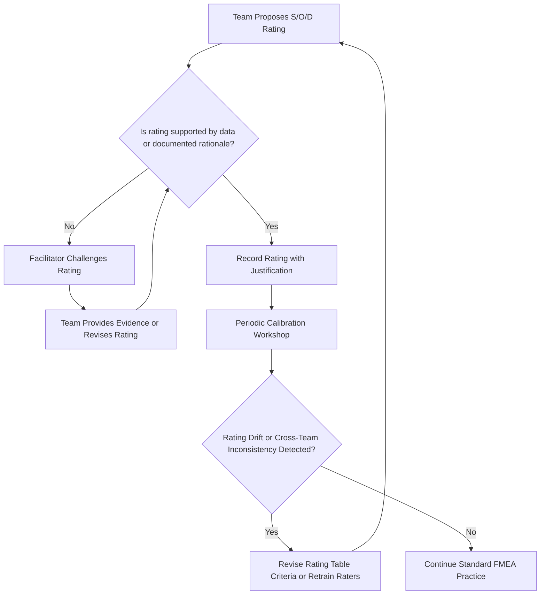

## Common Rating Biases and Inconsistencies

### Definition and Purpose

Rating biases and inconsistencies in FMEA refer to systematic or random errors introduced during Severity, Occurrence, and Detection scoring that distort the resulting risk assessment. Because S/O/D ratings depend heavily on human judgment — even when anchored to defined criteria tables — FMEA teams are susceptible to well-documented cognitive and organizational biases that undermine the validity of the resulting Risk Priority Number (RPN) or Action Priority (AP) outcome.

### Why This Matters

- **RPN/AP validity depends on rating accuracy**: If S/O/D scores are systematically skewed, the resulting prioritization misallocates engineering and quality resources toward the wrong failure modes.
- **Cross-team comparability breaks down**: Inconsistent rating practices between teams or programs make it impossible to compare risk levels across a product portfolio.
- **Biased ratings erode trust in the FMEA process**: When teams perceive ratings as arbitrary or manipulated, they disengage from the exercise, reducing its value as a living risk-management tool.

### Common Cognitive Biases in Rating

#### 1. Optimism Bias (Occurrence Underrating)

Teams tend to underestimate the likelihood of failure for designs or processes they are personally responsible for, especially when no field data yet exists. This manifests as consistently low Occurrence ratings justified by "we don't expect this to happen" rather than data or validated prevention controls.

#### 2. Severity Anchoring/Understatement

Engineers may unconsciously downplay severity to avoid triggering mandatory design reviews, escalations, or safety classifications associated with high-severity ratings (e.g., avoiding a 9–10 rating that would require additional sign-off under AIAG-VDA safety characteristic rules).

#### 3. Detection Overconfidence

Teams often overrate the effectiveness of existing detection controls, particularly manual inspection, without accounting for inspector fatigue, sampling gaps, or the control's actual demonstrated capability (e.g., no gauge R&R or Cpk data to substantiate the assumed detection rate).

#### 4. Groupthink and Authority Bias

In cross-functional sessions, ratings can converge toward the opinion of the most senior or most vocal participant rather than reflecting genuine team consensus, particularly when a facilitator doesn't actively solicit dissenting views before a number is recorded.

#### 5. Anchoring to Previous Ratings

When updating an existing FMEA or reusing content from a similar prior program ("carryover" FMEA), teams often anchor to the previous rating without re-evaluating whether it still applies to the current design/process context, propagating outdated or inapplicable scores.

#### 6. RPN Gaming/Reverse Engineering

Teams sometimes work backward from a desired RPN threshold (to avoid triggering a mandatory corrective action) by adjusting individual S, O, or D scores to land just under the action threshold, rather than rating each dimension independently and accepting the resulting RPN.

#### 7. Rating Compression (Central Tendency Bias)

Raters unfamiliar with the full range of the scale tend to cluster ratings in the middle (e.g., consistently choosing 4–6 on a 1–10 scale) to avoid the perceived risk of extreme judgments, flattening the discriminating power of the scale.

#### 8. Cross-Dimensional Contamination

Raters allow one dimension to improperly influence another — for example, lowering an Occurrence score because a strong Detection control exists ("it probably won't happen because we'll catch it"), when Occurrence should reflect only the likelihood of the cause independent of detection capability.

### Organizational and Process-Level Inconsistencies

**Key Points**

- **Inconsistent scale interpretation across teams**: Without a customized, well-documented rating table (see rating table customization), different teams may apply different implicit criteria to the same numeric scale
- **Facilitator inexperience**: A facilitator who doesn't actively probe for evidence behind a proposed rating, or who accepts the first number offered, allows biases to go unchecked
- **Time pressure**: FMEA sessions run under deadline pressure often default to quick, ungrounded ratings rather than pausing to consult data
- **Lack of historical data infrastructure**: Organizations without a mature warranty/complaint/field-failure database force raters to guess, increasing variance between raters
- **Absence of calibration exercises**: Without periodic cross-team calibration (rating the same sample failure modes and comparing results), inconsistencies compound silently over time
- **Turnover and inexperience**: New FMEA participants unfamiliar with the organization's specific criteria table tend to import assumptions from other industries or previous employers

### Mitigation Strategies

**Key Points**

- **Require evidence-based justification**: Mandate that every S/O/D rating be accompanied by a documented rationale (test data, field data, design standard reference) rather than an unsupported number
- **Use structured facilitation techniques**: Silent/independent rating followed by group discussion (similar to Delphi-method or planning-poker techniques) surfaces disagreement before groupthink can suppress it
- **Separate rating from action-threshold discussion**: Rate each dimension first, then discuss RPN/AP implications afterward, to reduce the temptation to reverse-engineer scores
- **Conduct periodic calibration workshops**: Have multiple teams independently rate the same reference failure modes and reconcile differences to realign interpretation of the criteria table
- **Audit historical FMEAs for rating drift**: Periodically sample completed FMEAs and check whether ratings are substantiated and consistent with the documented criteria
- **Rotate or bring in independent facilitators**: A neutral facilitator without a stake in the outcome is less susceptible to authority bias influencing the discussion
- **Track rating distributions over time**: If an organization's occurrence ratings are overwhelmingly clustered at 1–2 across all FMEAs, this is a signal of systemic optimism bias worth auditing
- **Explicitly train on cross-dimensional independence**: Reinforce in training that Severity, Occurrence, and Detection must be rated without regard to each other

### Example

**Scenario:** A process FMEA team rates a new stamping process's Occurrence as 2 ("very low") based on the engineer's confidence that the new die design "should work fine," despite no prior production run data and no validated process capability study.

**Bias identified:** Optimism bias / unsubstantiated occurrence rating.

**Corrective action:** Facilitator requires the team to either cite a validated Cpk/Ppk study or a proven-design carryover justification; absent that evidence, occurrence is revised upward to 6–7 pending process validation data, consistent with AIAG-VDA's guidance that unproven processes should not receive low occurrence ratings.

### Common Pitfalls

- Treating RPN thresholds as more objective than the subjective ratings that produce them
- Allowing a single dominant voice to set the "team" rating without structured input from all disciplines
- Failing to distinguish between an optimistic rating and an evidence-based rating during review
- Reusing carryover ratings without re-validating applicability to the current design/process
- Not tracking rating patterns over time, which would otherwise reveal systemic bias trends

### Diagram: Bias Detection and Mitigation Loop (svg_diagram)

**Related Topics**

- Severity rating scales and criteria
- Occurrence rating scales and criteria
- Detection rating scales and criteria
- Customizing rating tables for an organization
- FMEA facilitation techniques and team dynamics
- Calibration and inter-rater reliability methods
- RPN vs. Action Priority (AP) prioritization approaches
- Data-driven decision-making in reliability engineering