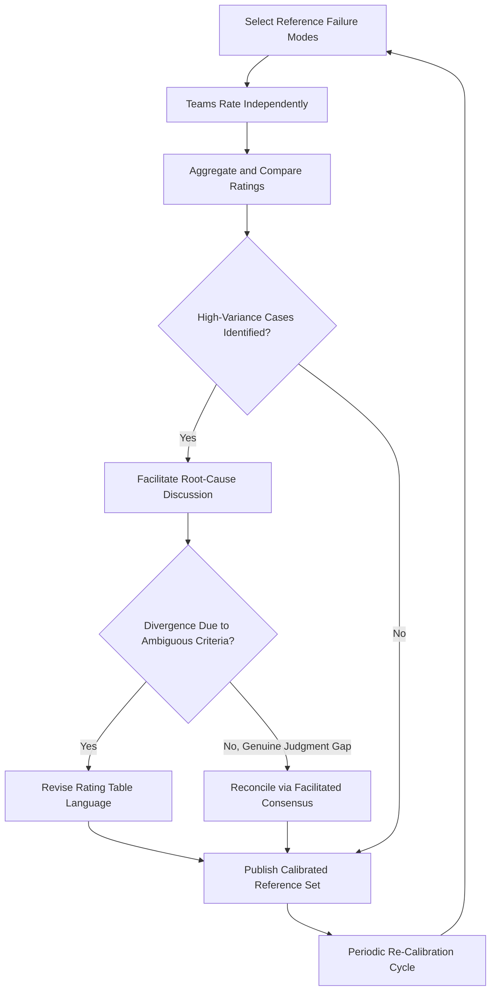

## Calibrating Ratings Across Teams

### Definition and Purpose

Calibration is the structured process of aligning how different FMEA teams — across programs, plants, business units, or functional disciplines — interpret and apply Severity, Occurrence, and Detection rating criteria, so that a given rating (e.g., Severity = 7) means the same thing regardless of which team assigned it. Calibration addresses the reality that even a well-documented, customized rating table (see rating table customization) leaves room for interpretation, and that interpretation tends to drift apart across teams without deliberate reconciliation.

### Why Calibration Is Necessary

- **RPN/AP comparability across a portfolio**: Organizations that manage risk across multiple product lines or plants need ratings to mean the same thing everywhere; otherwise, portfolio-level risk prioritization (e.g., "which of our 12 active programs has the highest-risk open items") is meaningless.
- **New team/rater onboarding**: New engineers or newly formed cross-functional teams import assumptions from prior employers, other industries, or informal habits, causing rating drift from day one.
- **Audit and regulatory defensibility**: In regulated industries (automotive per IATF 16949, medical devices per ISO 14971/13485), auditors expect evidence that risk ratings are applied consistently and that the organization has a mechanism to detect and correct drift.
- **Carryover/legacy FMEA reuse**: When FMEAs are reused or referenced across programs, inconsistent underlying calibration undermines the validity of reusing prior ratings.
- **Cross-functional trust**: When manufacturing, design, and quality functions rate the same failure mode differently due to differing unstated assumptions, it erodes confidence in the FMEA as a shared decision-making tool.

### Core Calibration Principles

- **Calibration is periodic, not one-time**: Rating interpretation drifts continuously as teams change, so calibration must be a recurring cadence (e.g., quarterly or per major program milestone), not a single training event.
- **Calibration targets the criteria table, not just the raters**: Disagreement during calibration often reveals ambiguity in the rating table itself (see common rating biases and inconsistencies), which should trigger a table revision, not just individual retraining.
- **Calibration works best with real, shared reference cases**: Abstract discussion of what a "7" means is far less effective than having multiple teams independently rate the same concrete, real failure mode and then reconcile differences.
- **Calibration should be blind/independent first**: Teams should rate reference cases independently before seeing each other's scores, to avoid anchoring bias from an early, vocal opinion.
- **Facilitation neutrality matters**: A calibration session facilitator should not have a stake in any one team's outcome, to prevent authority bias from resolving disagreements instead of genuine convergence.

### Calibration Workflow

**Key Points**

1. **Select reference failure modes**: Choose 5–10 real, well-documented failure modes spanning a range of severity/occurrence/detection levels, ideally including at least one edge case near a decision threshold (e.g., near the Severity 9 safety boundary)
2. **Distribute independently to participating teams**: Each team (or representative rater) scores the reference cases using only the organization's documented rating criteria, without consulting other teams
3. **Collect and compare ratings**: Aggregate results into a shared view (e.g., a simple table or scatter plot) showing the spread of ratings per reference case
4. **Identify high-variance cases**: Flag failure modes where ratings diverge significantly (e.g., a 3-point or greater spread on a 10-point scale) for facilitated discussion
5. **Facilitate root-cause discussion of divergence**: For each high-variance case, ask raters to explain their reasoning; determine whether the divergence stems from ambiguous criteria wording, missing information, or a genuine judgment difference
6. **Revise criteria table language where ambiguity is found**: Update the rating table definitions to close the interpretation gap identified
7. **Document the calibrated reference set**: Publish the reconciled ratings and rationale for the reference failure modes as a training/reference resource for future raters
8. **Re-test calibration periodically**: Repeat the exercise on a cadence, using a mix of previously-calibrated and new reference cases to confirm alignment holds and catch new drift

### Techniques for Structured Calibration Sessions

#### Independent-Then-Discuss (Delphi-style)

Each participant privately submits a rating before any discussion occurs; results are revealed simultaneously (not sequentially) to prevent the first-spoken opinion from anchoring the group, then discussion proceeds only on cases with disagreement.

#### Planning-Poker-Style Simultaneous Reveal

Borrowed from agile estimation practice — participants hold up or submit a number simultaneously (physical cards or digital polling tool) so no one's rating is influenced by seeing others' scores first.

#### Paired Cross-Team Rating

Two teams that don't normally interact rate a shared reference case together, surfacing assumptions that go unstated within a single team's internal culture.

#### Statistical Drift Monitoring

Track rating distributions over time across teams (e.g., average Occurrence rating per team per quarter); a team whose average diverges significantly from the organizational baseline is flagged for a targeted calibration session rather than waiting for the next scheduled cycle.

### Example

**Scenario:** Two plants manufacturing similar components rate the same cause ("inconsistent torque on fastener due to worn tooling") with Occurrence = 3 at Plant A and Occurrence = 7 at Plant B.

**Calibration finding:** Plant A's rater assumed a recently-installed torque-monitoring sensor (a detection control) reduced the likelihood of the cause occurring, improperly folding a detection control's effect into the Occurrence score — a cross-dimensional contamination bias. Plant B's rater correctly rated Occurrence based on tooling wear rate alone, independent of any detection capability.

**Resolution:** Rating table guidance is clarified to explicitly state that Occurrence must be assessed independent of detection controls; Plant A's FMEA is revised to Occurrence = 7, with the torque-monitoring sensor's benefit instead reflected in the Detection rating.

### Governance and Sustaining Calibration

- **Assign ownership**: A quality/reliability function (or an FMEA Center of Excellence in larger organizations) should own the calibration cadence and reference case library
- **Integrate into new-hire/new-team onboarding**: New raters should review the calibrated reference set as part of FMEA training before rating live failure modes independently
- **Link to audit evidence**: Calibration records (session notes, reconciled ratings, criteria revisions) serve as objective evidence of rating consistency for quality system audits
- **Feed back into rating table updates**: Persistent divergence on the same criteria across multiple calibration cycles signals that the underlying table — not the raters — needs revision

### Common Pitfalls

- Treating calibration as a one-time training event rather than an ongoing cadence
- Letting teams see each other's ratings before independent scoring, reintroducing anchoring bias into the calibration exercise itself
- Resolving divergence by averaging ratings rather than investigating the root cause of disagreement
- Failing to update the rating table when calibration reveals genuine ambiguity in the criteria language
- Running calibration only within a single team, missing cross-team/cross-plant drift entirely
- Not maintaining a documented reference case library, forcing each calibration cycle to start from scratch

### Diagram: Cross-Team Calibration Cycle (svg_diagram)

**Related Topics**

- Severity rating scales and criteria
- Occurrence rating scales and criteria
- Detection rating scales and criteria
- Customizing rating tables for an organization
- Common rating biases and inconsistencies
- FMEA facilitation techniques and team dynamics
- Quality system audit evidence for risk assessment processes
- Cross-plant/cross-program FMEA governance structures