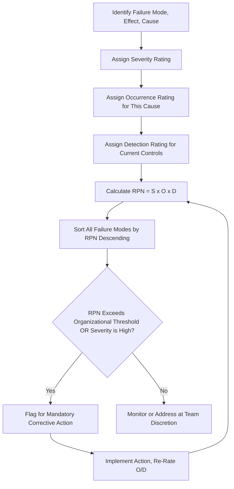

## Calculating the Risk Priority Number

### Definition and Purpose

The Risk Priority Number (RPN) is a composite numerical score used in traditional FMEA methodology to rank and prioritize failure modes for corrective action, calculated by multiplying the three independently-assessed risk dimensions: Severity (S), Occurrence (O), and Detection (D). RPN provides a single, sortable metric that allows a team to rank a long list of potential failure modes and causes by relative risk, directing limited engineering and quality resources toward the items considered highest priority.

### The RPN Formula

$$RPN = S \times O \times D$$

Where each factor is typically rated on a 1–10 scale (though 1–5 scales are also used in simplified implementations), producing a possible RPN range of 1 (lowest risk) to 1,000 (highest risk) on a 10-point scale, or 1 to 125 on a 5-point scale.

### Calculation Process

**Key Points**

1. **Identify the failure mode** and its associated effect(s) and cause(s) for a given process/design function
2. **Assign Severity** based on the worst credible effect of the failure mode (see severity rating scales and criteria)
3. **Assign Occurrence** based on the likelihood of the specific cause being evaluated (see occurrence rating scales and criteria)
4. **Assign Detection** based on the effectiveness of current controls to catch the cause or failure mode before it escapes (see detection rating scales and criteria)
5. **Multiply the three ratings** to compute RPN for that specific cause-effect-control combination
6. **Repeat for each cause** of a failure mode, since a single failure mode may have multiple causes, each with its own Occurrence and Detection rating (though Severity typically remains constant for a given effect)
7. **Sort the resulting RPN values** in descending order across the full FMEA worksheet to identify the highest-priority items for action

### Worked Example

**Failure Mode:** Weld joint fracture on structural bracket

**Effect:** Bracket separates during vehicle operation, potential loss of steering control

**Severity:** 9 (hazardous, with warning)

**Cause 1:** Insufficient weld penetration due to inconsistent fixture clamping pressure

- Occurrence: 4
- Detection: 7 (manual visual inspection, sampling-based)
- $RPN = 9 \times 4 \times 7 = 252$

**Cause 2:** Incorrect welding parameters programmed into robotic welder

- Occurrence: 2
- Detection: 3 (automated weld parameter monitoring with alarm)
- $RPN = 9 \times 2 \times 3 = 54$

Even though both causes produce the same severity effect, Cause 1 receives a substantially higher RPN due to weaker prevention (higher occurrence) and weaker detection, making it the higher-priority item for corrective action despite sharing the same failure mode and effect.

### RPN Threshold Practices

Organizations commonly establish an RPN threshold above which corrective action is mandatory, though the AIAG-VDA handbook explicitly discourages relying on a single numeric RPN threshold in favor of the Action Priority (AP) method. Common legacy practices include:

| RPN Range | Typical Action Guidance |
| --- | --- |
| > 200 (or organization-defined) | Mandatory corrective action required |
| 100–200 | Recommended for review/action based on team judgment |
| < 100 | Monitor; action optional at team discretion |

These thresholds are illustrative only — organizations using pure RPN thresholds should validate cutoffs against their own risk tolerance and historical data, since a fixed numeric threshold applied uniformly ignores which specific S/O/D combination produced the number.

### Known Limitations of RPN

- **Non-unique scores mask different risk profiles**: Different S/O/D combinations can produce identical RPN values despite representing very different risk situations (e.g., $9 \times 2 \times 3 = 54$ vs. $3 \times 6 \times 3 = 54$) — the first involves a hazardous effect with a validated control, the second involves a minor effect with a mediocre control, yet both rank equally.
- **High severity can be masked by low RPN**: A catastrophic-severity, low-occurrence, well-detected failure mode can produce a deceptively low RPN, potentially causing a safety-relevant item to be deprioritized purely on arithmetic grounds.
- **Non-linear scale multiplication**: Because RPN multiplies three ordinal (rank-order) scales rather than true ratio-scale measurements, the resulting product doesn't have a strict quantitative meaning — an RPN of 200 is not necessarily "twice as risky" as an RPN of 100 in any measurable physical sense.
- **Threshold gaming**: Fixed RPN thresholds create an incentive to adjust individual S/O/D scores downward just enough to avoid crossing the mandatory-action line (see common rating biases and inconsistencies).
- **Equal weighting assumption**: Multiplying all three factors equally assumes they contribute equally to risk significance, which doesn't reflect how most safety and quality frameworks actually prioritize severity above the other two factors.

### RPN vs. Action Priority (AP)

Because of RPN's known limitations, AIAG-VDA's 1st edition (2019) handbook introduced the **Action Priority (AP)** method as the preferred prioritization approach, replacing pure multiplication with a structured decision-tree that evaluates Severity first, then Occurrence, then Detection, assigning each failure mode/cause combination a High/Medium/Low priority category rather than (or in addition to) a numeric RPN. Many organizations still calculate RPN alongside AP for legacy reporting, trending, or contractual requirements, even where AP governs actual prioritization decisions.

### Common Pitfalls

- Using RPN as the sole prioritization criterion without also reviewing individual S/O/D values, missing high-severity/low-RPN items
- Applying a single fixed RPN threshold across dissimilar product lines with different risk profiles
- Comparing RPN values calculated on different scale sizes (e.g., comparing a 1–10-scale RPN against a 1–5-scale RPN) without normalizing
- Treating RPN as a precise, continuous risk measurement rather than an ordinal ranking aid
- Recalculating RPN after adding only a detection control while leaving Severity and Occurrence artificially unchanged, without validating that Occurrence itself wasn't also improved by a prevention change
- Failing to recalculate RPN after corrective actions are implemented, leaving the FMEA showing stale (pre-action) risk levels

### Diagram: RPN Calculation and Review Flow (svg_diagram)

**Related Topics**

- Severity rating scales and criteria
- Occurrence rating scales and criteria
- Detection rating scales and criteria
- Action Priority (AP) tables and methodology
- Common rating biases and inconsistencies
- Setting organizational RPN thresholds
- Recalculating risk scores after corrective action
- Limitations of multiplicative risk scoring models